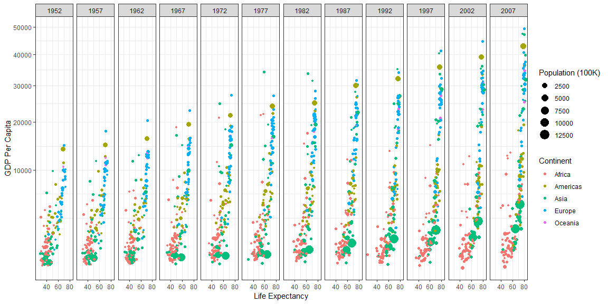
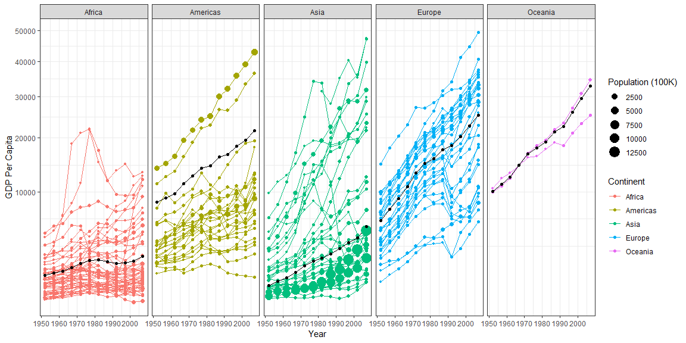

## Background

I created two graphs that show GPD per Capita by year and by life expectancy.

## Data Wrangling


```r
# Use this R-Chunk to clean & wrangle your data!
```

## Data Visualization


```r
ggplot(filter(gapminder, gdpPercap < 50000), mapping = aes(x = lifeExp, y = gdpPercap)) +
  geom_point(aes(size = pop/100000, color = continent)) +
  facet_wrap(~year,nrow = 1) +
  scale_y_continuous(trans = "sqrt") +
  labs(x = "Life Expectancy",y = "GDP Per Capita",size = "Population (100K)",color = "Continent") +
  theme_bw()
```

<!-- -->

```r
ggsave("LifeExpectancyPlot.png", width = 15)

continent <- gapminder %>%
  group_by(continent, year) %>% 
  summarise(gdpPercap = weighted.mean(gdpPercap, pop))

(plot2 <- group_by(filter(gapminder, gdpPercap < 50000), continent) %>% 
    ggplot(plot2, mapping = aes(x = year,y = gdpPercap)) +
    geom_path(aes(color = continent, group = country)) +
    geom_path(continent, mapping = aes(x = year, y = gdpPercap)) +
    geom_point(aes(size = pop/100000, color = continent)) +
    geom_point(continent, mapping = aes(x = year, y = gdpPercap)) +
    scale_y_continuous(trans = "sqrt") +
    facet_wrap(~continent,nrow = 1)) +
  labs(x = "Year",y = "GDP Per Capita",size = "Population (100K)",color = "Continent") +
  theme_bw()
```

<!-- -->

```r
ggsave("continentplot.png", width = 15)
```

## Conclusions

I am not sure that I got the weight right for the second graph, but I am pround of what I have done. I would like any feedback that I can get for my first R project.
