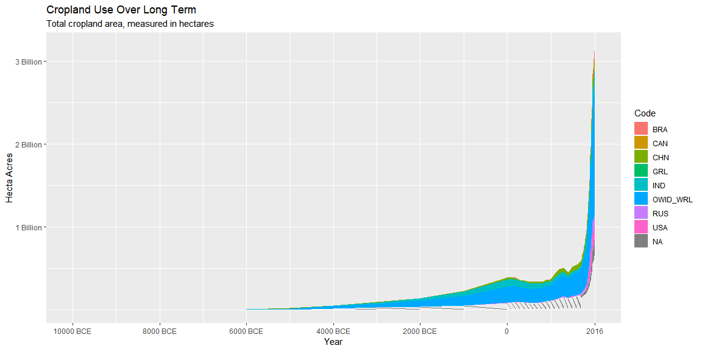
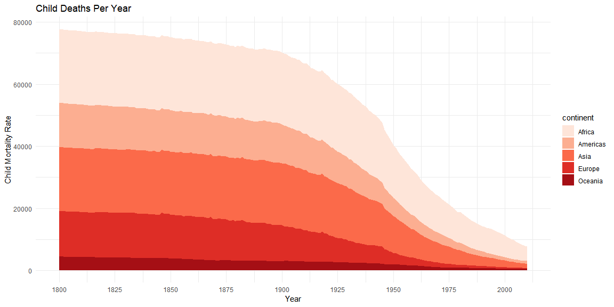

```r
library(tidyverse)
library(ggplot2)
cropland <- read_csv(here::here("/Data/cropland-use-over-the-long-term.csv"))

devtools::install_github("drsimonj/ourworldindata")
world_data <- ourworldindata::child_mortality%>%
  filter(!is.na(continent))
```

## Background

For my first graph I took some data on crop land use for the last 12000 years and tried to recreate the graph on the site. My graph is not interactive like theirs, but it communicates the same information. For the second graph I made a graph that shows number on child deaths per year grouped by country. 

## Data Wrangling


```r
mort_plot <- group_by(world_data, continent, year) %>% 
  summarise(child_mort = sum(child_mort, na.rm = TRUE))
```

## Data Visualization


```r
group_by(cropland, Code) %>% 
ggplot(cropland, mapping = aes(x = Year, y = `(km2)`)) +
  geom_area(aes(fill = Code)) +
  scale_x_continuous(labels = c('10000 BCE','8000 BCE','6000 BCE','4000 BCE','2000 BCE','0','2016'),
                     breaks = c(-10000,-8000,-6000,-4000,-2000,0,2016)) +
  scale_y_continuous(labels = c('1 Billion','2 Billion','3 Billion','4 Billion'),
                     breaks = c(1000000000,2000000000,3000000000,4000000000)) +
  labs(title = "Cropland Use Over Long Term", subtitle = "Total cropland area, measured in hectares",
       x = "Year", y = "Hecta Acres", color = "Region")
```

<!-- -->

```r
  ggplot(mort_plot, mapping = aes(x = year, y = child_mort)) +
  geom_area(aes(fill = continent)) +
    scale_fill_brewer(palette = 'Reds') +
    theme_minimal() +
  scale_x_continuous(breaks = c(1800,1825,1850,1875,1900,1925,1950,1975,2000),
                     limits = c(1800,2010)) +
    labs(title = "Child Deaths Per Year", x = 'Year', y = 'Child Mortality Rate', color = 'Continent')
```

<!-- -->
## Conclusions

I am not sure how I did on these graphs, but I feel like they both communicate the basic information that I was trying to show. Let me know how I could have done better. 
