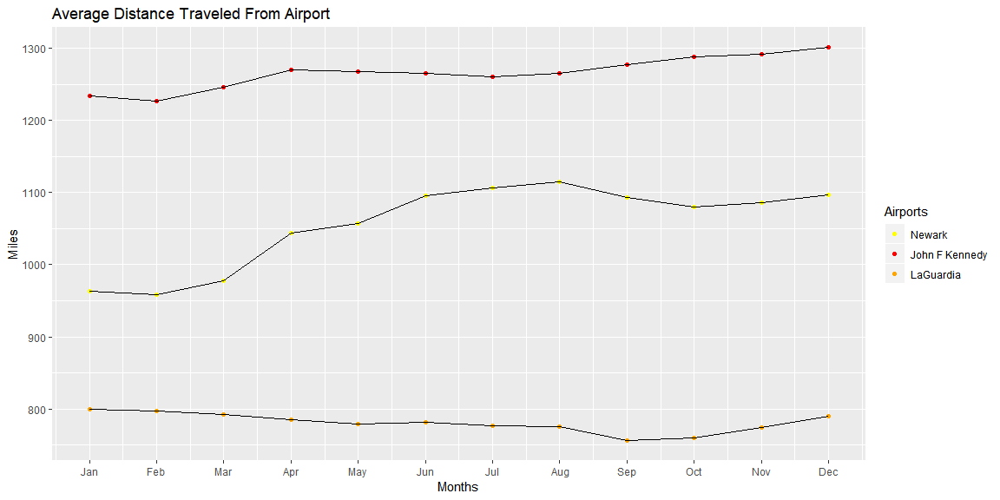
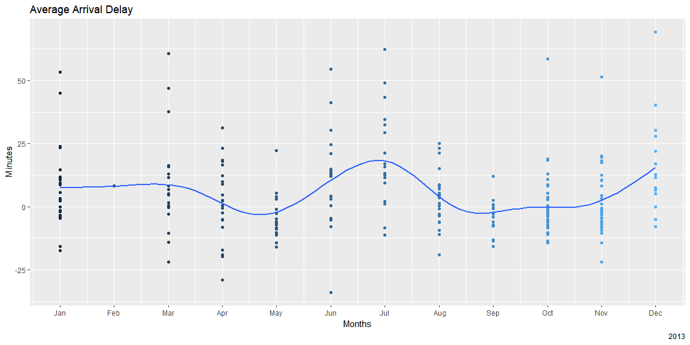
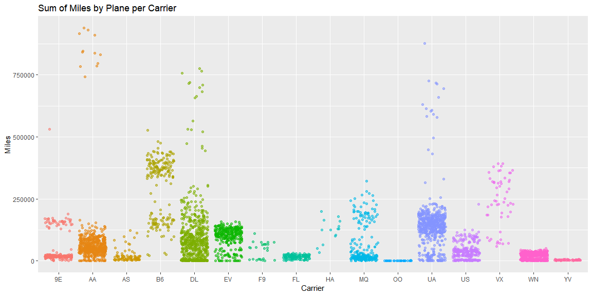
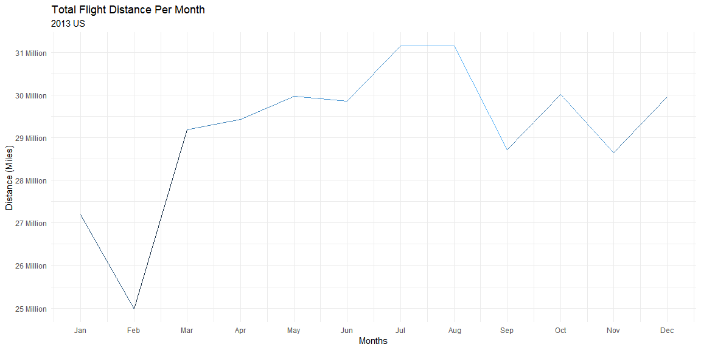

```r
flights <- nycflights13::flights
```

## Background

My task was to use the flights data to come up with some interesting graphics that communicate useful information.
 
 


```r
group_flights <- group_by(flights, origin, month) %>% 
  summarise(ave = mean(dep_delay), average = mean(arr_delay), dis = mean(distance))

leave <- group_by(flights, dest, month) %>% 
  summarise(ave = mean(dep_delay), average = mean(arr_delay), dis = mean(distance))

tail <- group_by(flights, carrier, tailnum) %>% 
  summarise(sum = sum(distance))

dist <- group_by(flights, month) %>% 
  summarise(ave = sum(distance))
```

## Data Visualization


```r
ggplot(group_flights, aes(x = month, y = dis)) +
  geom_point(aes(color = origin)) +
  geom_path(aes(mapping = origin))+
  scale_x_continuous(labels = c('Jan', 'Feb', 'Mar', 'Apr', 'May', 'Jun', 'Jul', ' Aug', 'Sep',
                                'Oct', 'Nov', 'Dec'), breaks = c(1,2,3,4,5,6,7,8,9,10,11,12)) +
  labs(title = "Average Distance Traveled From Airport", x = "Months", y = "Miles", 
       color = "Airports") +
   scale_color_manual(name = "Airports", labels = c("Newark","John F Kennedy","LaGuardia"),
                     values = c('EWR'='yellow','JFK'='red','LGA'='orange'))
```

<!-- -->
This graphics shows the total distance traveled per month from each airport.

```r
ggplot(leave, aes(x = month, y = average)) +
  geom_point(aes(color = month), show.legend = FALSE) +
  geom_smooth(aes(alpha = .01), se = FALSE, show.legend = FALSE) +
  scale_x_continuous(labels = c('Jan', 'Feb', 'Mar', 'Apr', 'May', 'Jun', 'Jul', ' Aug', 'Sep',
                                'Oct', 'Nov', 'Dec'), breaks = c(1,2,3,4,5,6,7,8,9,10,11,12)) +
  labs(title = "Average Arrival Delay ", x = "Months", y = "Minutes", caption = "2013")
```

<!-- -->
This graph show the average arrival delay from all airports for each month.

```r
ggplot(tail, aes(y = sum, x = carrier)) +
  geom_jitter(aes(color = carrier, alpha = .6), show.legend = FALSE) +
  labs(title = "Sum of Miles by Plane per Carrier", y = "Miles", x = "Carrier") +
  theme_grey()
```

<!-- -->
We can see here the total amount of miles traveled by carrier. It needs work as it is hard to know which carrier is which. I was not sure myself of all the names of the carriers.

```r
ggplot(dist, mapping = aes(y = ave, x = month)) +
  geom_line(aes(color = ave), show.legend = NULL) +
  theme_minimal() +
  scale_y_continuous(labels = c('25 Million', '26 Million','27 Million', '28 Million','29 Million',
                                '30 Million', '31 Million','32 Million'), breaks = c(25000000, 26000000,
                                27000000, 28000000, 29000000,30000000, 31000000, 32000000)) +
  scale_x_continuous(labels = c('Jan', 'Feb', 'Mar', 'Apr', 'May', 'Jun', 'Jul', ' Aug', 'Sep',
                     'Oct', 'Nov', 'Dec'), breaks = c(1,2,3,4,5,6,7,8,9,10,11,12)) +
  labs(title = "Total Flight Distance Per Month", x = "Months", y = "Distance (Miles)", subtitle = "2013 US")
```

<!-- -->
This shows the amount of miles traveled in total month to month.


## Conclusions
All of these graphics are simple in nature, but they were good practice to have in building graphs and using ggplot. I would love feedback on anything I could improve.

