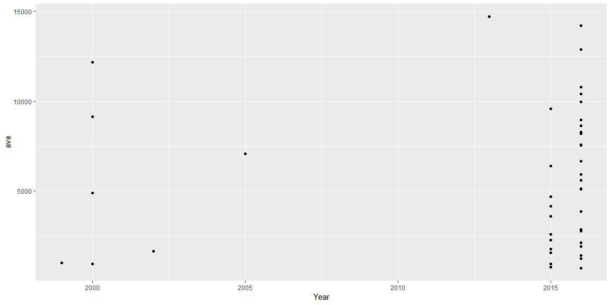
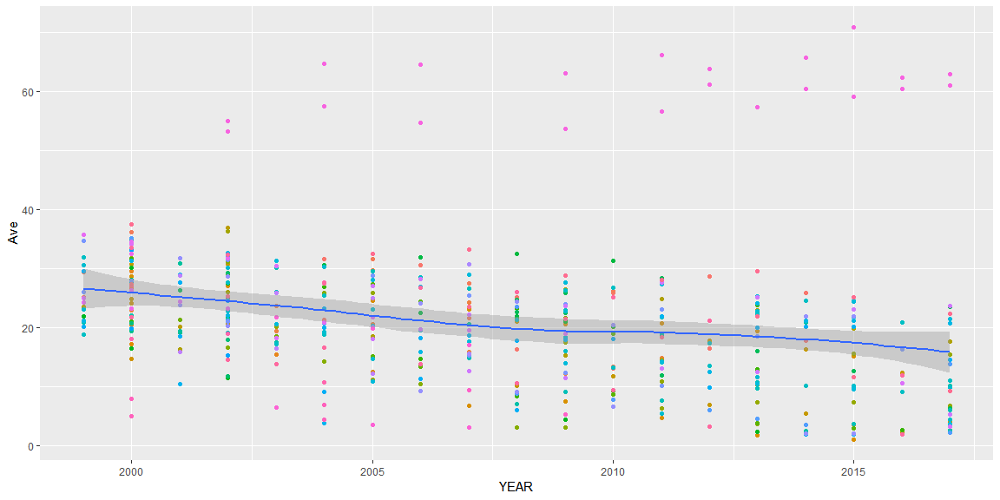

## Sources of Data

[FiveThirtyEight](https://fivethirtyeight.com/)

There are many graphs and data sets available on this site. It is useful because most of the data is already cleaned.

[Buzz Feed Github](https://github.com/BuzzFeedNews)

Here we have data sets that are available from Buzz Feed. That is nice because again a lot of the data is already cleaned and ready for use.

[Data.World](https://data.world/)

Data World has many different data sets from many different areas.

[Data Gov](https://www.data.gov/)

This is one of the coolest sites that I found. It has government data sets.

## Data Read In


```r
death <- read_csv(here::here("/Data/NCHS_-_Leading_Causes_of_Death__United_States.csv"))
drugs <- read_csv(here::here("/Data/Youth_Tobacco_Survey__YTS__Data.csv"))
```

## Data Visualization


```r
death %>% 
  group_by(State, Year) %>% 
  summarise(ave = mean(Deaths)) %>%
  arrange(ave) %>% filter(ave < 15000) %>% top_n(1) %>% 
  ggplot(aes(x = Year, y = ave)) +
  geom_point() +
  geom_line(aes(color = State), show.legend = FALSE)
```

<!-- -->

```r
drugs %>% 
  group_by(LocationAbbr, YEAR, Education) %>%
  summarise(Ave = mean(Data_Value, na.rm = TRUE)) %>% 
  ggplot(aes(x= YEAR, y = Ave)) +
  geom_point(aes(color = LocationAbbr), show.legend = FALSE) +
  geom_smooth()
```

<!-- -->

## Things I Learned

The coolest thing I learned was the here::here function. I am stil not exactly sure how it works, but I basically directs the computure to your working directary and then you tell it where to go from there. It took me a while to figure out what I even had from the data after reading it in. It takes time and I need to learn to plan for that. 
