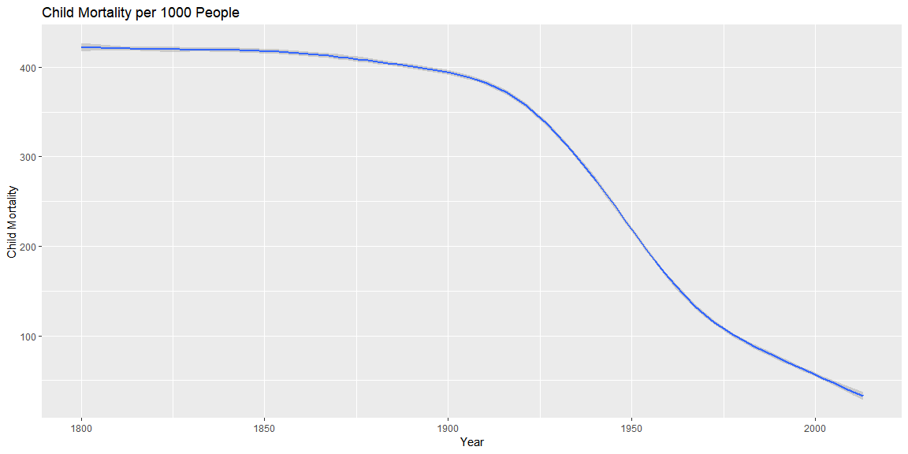

```r
health <- ourworldindata::financing_healthcare
```

## Background

I am not sure how well this graph works, but this shows the general trend of child mortality.


## Data Visualization


```r
health %>% 
  group_by(country, child_mort, continent, year) %>% filter(year >= 1800) %>% 
  ggplot(aes(x = year, y = child_mort)) +
  geom_smooth() +
  labs(title = "Child Mortality per 1000 People", x = "Year", y = "Child Mortality") +
  theme_grey()
```

<!-- -->


