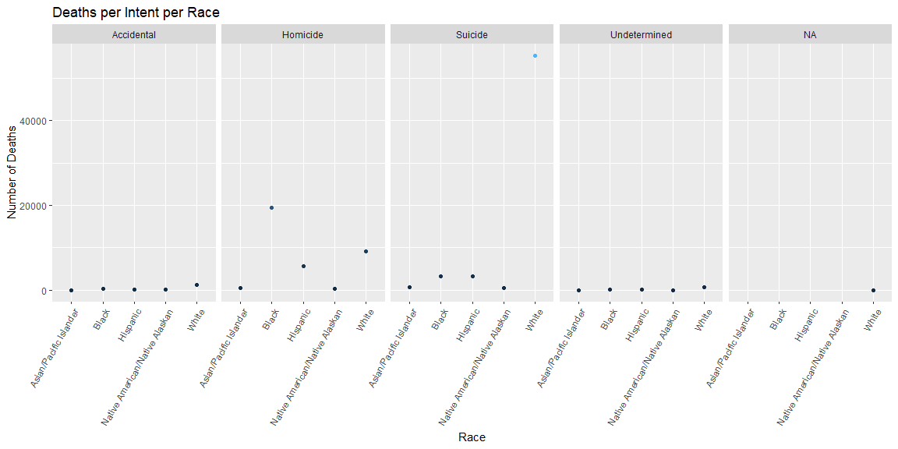
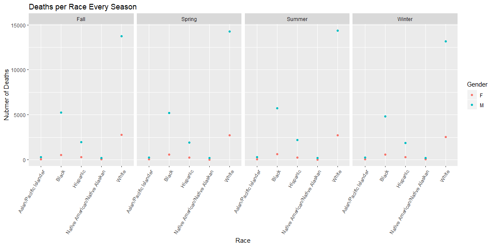
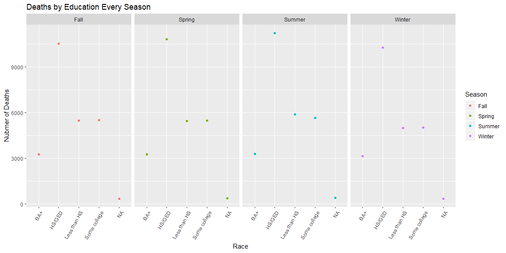

```r
gun_data <- read_csv(here::here("/Data/full_data_guns.csv"))

new_data_gun <- gun_data %>% 
  select(year:intent, sex:race, place, education) %>% 
  mutate(Season = case_when(month %in% c('01','02','12')~'Winter',
                            month %in% c('03','04','05')~'Spring',
                            month %in% c('06','07','08')~'Summer',
                            TRUE ~ 'Fall'))
```


## Data Visualization


```r
new_data_gun %>%
  count(intent, race) %>% 
  ggplot(aes(x = race, y = n), na.rm = TRUE) +
  geom_point(aes(color = n), show.legend = FALSE) +
  theme(axis.text.x = element_text(angle = 60, hjust = 1)) +
  facet_wrap(facets = vars(intent), nrow = 1) +
  labs(title = 'Deaths per Intent per Race', y = 'Number of Deaths', x = 'Race')
```

<!-- -->

This is the recreation of the graph from the website. The data shows the the gun death in america by race and gender. It also shows the intent of each death.

##Data By Season


```r
new_data_gun %>% 
  count(Season, sex, race) %>% 
  ggplot(aes(x = race, y = n)) +
  geom_point(aes(color = sex)) +
  theme(axis.text.x = element_text(angle = 60, hjust = 1)) +
  facet_wrap(facets = vars(Season), nrow = 1) +
  labs(title = "Deaths per Race Every Season", y = "Nubmer of Deaths", color = 'Gender',
       x = 'Race')
```

<!-- -->

This is the data by season for our client. It is by race and by gender.


```r
new_data_gun %>% 
  count(education, Season) %>% 
  ggplot(aes(x = education, y = n)) +
  geom_point(aes(color = Season)) +
  theme(axis.text.x = element_text(angle = 60, hjust = 1)) +
  facet_wrap(facets = vars(Season), nrow = 1) +
  labs(title = "Deaths by Education Every Season", y = "Nubmer of Deaths", color = 'Season',
       x = 'Race')
```

<!-- -->

This graph shows death by education amount per season.

## Conclusions

I learned a lot about mutating data and I feel that is the most applicable thing I can use in the future.
