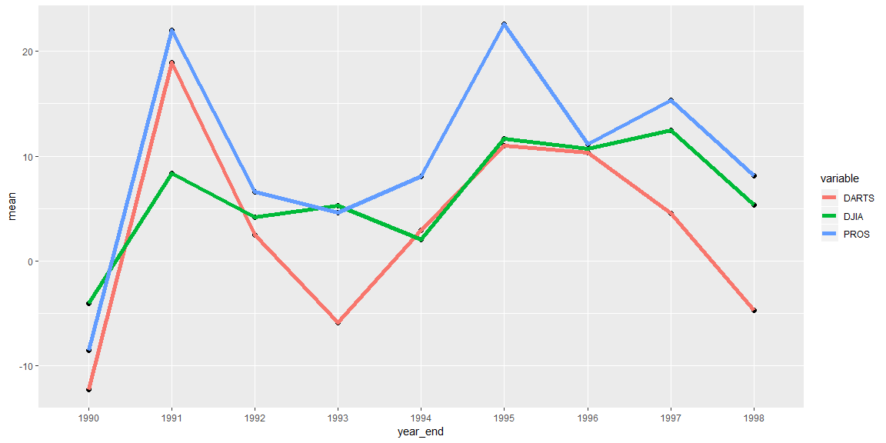

```r
dart_csv <- read_csv("https://github.com/byuistats/data/raw/master/Dart_Expert_Dow_6month_anova/Dart_Expert_Dow_6month_anova.csv")
```

## Background

With stock return data from the previous task, we need to tidy this data for the creation of a time series plot. We want to look at the returns for each six-month period of the year in which the returns were reported. Your plot should highlight the tighter spread of the DJIA as compared to the other two selection methods (DARTS and PROS). We need to display a table of the DJIA returns with months on the rows and years in the columns (i.e. “spread” the data).

## Data Wrangling


```r
clean_stocks <- dart_csv %>% 
  separate(contest_period, c("month_beg", "year")) %>% 
  separate(year, c("month_end", "year_end"), sep = -4) %>% 
  mutate(month_beg = str_extract(month_beg,".*[:alpha:]")) %>% 
  mutate(month_end = case_when(month_end == "Febuary" ~ "February",
                               TRUE ~ month_end)) %>% 
  filter(year_end <= "1998")
```

## Data Visualization


```r
clean_stocks %>% 
  group_by(year_end, variable) %>% 
  summarise(mean = mean(value)) %>% 
  ggplot(aes(x = year_end, y = mean)) +
  geom_point(size = 2) +
  geom_line(aes(color = variable, group = variable), size = 2)
```

<!-- -->
This graph shows average return for different stock indexes over ten years.

## Data Table

```r
clean_stocks %>% 
  filter(variable == "DJIA") %>% 
  mutate(month_end = fct_relevel(month_end, month.name)) %>% 
  group_by(month_end) %>% 
  spread(year_end,value) %>% 
  select(-1,-3) %>% 
  summarise_all(sum, na.rm = TRUE) %>% 
  pander::pander()
```


----------------------------------------------------------------------------
 month_end   1990    1991   1992   1993   1994   1995   1996   1997   1998  
----------- ------- ------ ------ ------ ------ ------ ------ ------ -------
  January      0     -0.8   6.5    -0.8   11.2   1.8     15    19.6   -0.3  

 February      0      11    8.6    2.5    5.5    3.2    15.6   20.1   10.7  

   March       0     15.8   7.2     9     1.6    7.3    18.4   9.6     7.6  

   April       0     16.2   10.6   5.8    0.5    12.8   14.8   15.3   22.5  

    May        0     17.3   17.6   6.7    1.3    19.5    9     13.3   10.6  

   June       2.5    17.7   3.6    7.7    -6.2    16    10.2   16.2    15   

   July      11.5    7.6    4.2    3.7    -5.3   19.6   1.3    20.8    7.1  

  August     -2.3    4.4    -0.3   7.3    1.5    15.3   0.6    8.3    -13.1 

 September   -9.2    3.4    -0.1   5.2    4.4     14    5.8    20.2   -11.8 

  October    -8.5    4.4     -5    5.7    6.9    8.2    7.2     3       0   

 November    -12.8   -3.3   -2.8   4.9    -0.3   13.1   15.1   3.8      0   

 December    -9.3    6.6    0.2     0     3.6    9.3    15.5   -0.7     0   
----------------------------------------------------------------------------

