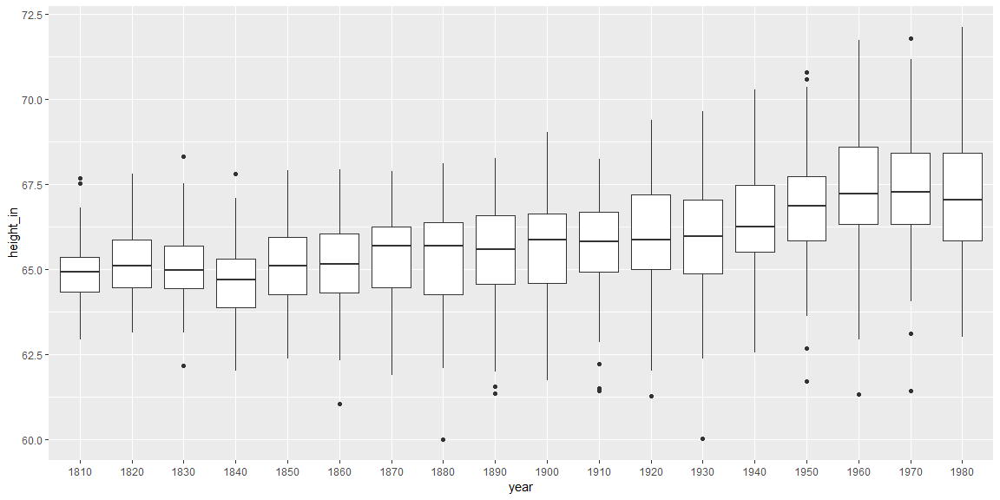
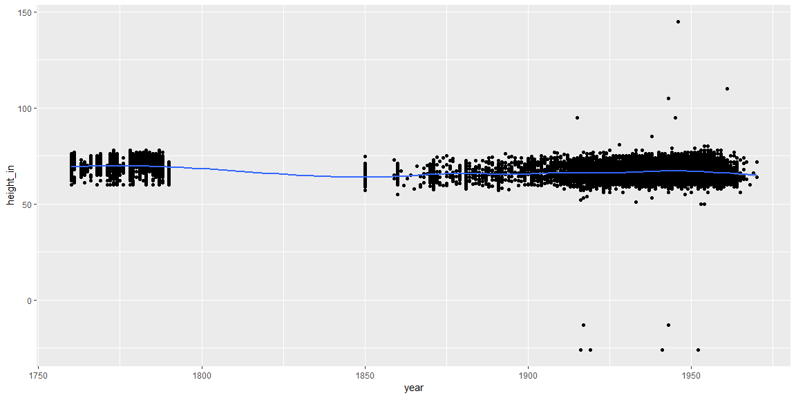
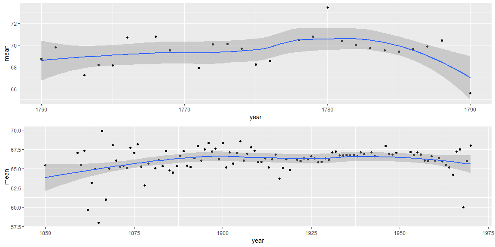

```r
temp <- tempfile()
download("https://byuistats.github.io/M335/data/heights/Height.xlsx", temp, mode = "wb")
```

## Background


The Scientific American argues that humans have been getting taller over the years. As the data scientists that we are becoming, we would like to find data that validates this concept. Our challenge is to show different male heights across the centuries.

This project is not as severe as the two quotes below, but it will give you a taste of pulling various data and file formats together into “tidy” data for visualization and analysis. You will not need to search for data as all the files are listed here

“Classroom data are like teddy bears and real data are like a grizzly bear with salmon blood dripping out its mouth.” - Jenny Bryan
“Up to 80% of data analysis is spent on the process of cleaning and preparing data” - Hadley Wickham


## Data Wrangling


```r
x19 <- readxl::read_xlsx(temp, skip = 2) %>% 
  gather("1800":"2011", key = "year", value = "height_cm", na.rm = TRUE) %>% 
  mutate(height_in = height_cm/2.54)

ger <- read.dbf(here::here("data/heights.DBF")) %>% 
  select(GEBJZ, CMETER,Z,F,ALTER, SJ) %>% 
  rename(decade = GEBJZ, height_cm = CMETER, age = ALTER, year = SJ, feet = F, inch = Z) %>%  
  mutate(height_in = feet*12+inch) %>% 
  select(year,height_cm,height_in)

b20 <- read_csv("https://github.com/hadley/r4ds/raw/master/data/heights.csv") %>% 
  mutate(year = 1950-age, height_cm = height*2.54) %>% 
  select(year:height_cm, height) %>% 
  rename(height_in = height) 

g19 <-  read_dta("https://byuistats.github.io/M335/data/heights/germanconscr.dta") %>% 
  mutate(year = age+bdec, height_in = height/2.54) %>% 
  select(year, height, height_in) %>% 
  rename(height_cm = height)

g20 <- read_dta("https://byuistats.github.io/M335/data/heights/germanprison.dta") %>% 
  mutate(year = bdec, height_in = height/2.54) %>% 
  select(year:height_in, height) %>% 
  rename(height_cm = height)

sur <-read_sav("http://www.ssc.wisc.edu/nsfh/wave3/NSFH3%20Apr%202005%20release/main05022005.sav") %>%  
  select(RT216F, RT216I, DOBM, DOBY) %>% 
  mutate(year = DOBY + 1900, height_in = (RT216F*12)+RT216I) %>% 
  mutate(height_cm = height_in*2.54) %>% 
  select(year:height_cm)


new_table <- bind_rows(b20,g19,g20,ger,sur) 
```

## Data Visualization


```r
x19 %>% 
  ggplot(aes(x = year, y = height_in)) +
  geom_boxplot(aes(group = year)) 
```

<!-- -->

This is a Germanic plot that has heights in inches summarised. 


```r
new_table %>% 
  ggplot(aes(x = year, y = height_in)) +
  geom_point(na.rm = TRUE) +
  geom_smooth()
```

<!-- -->

This graph shows all the data in plotted out with a mean line running through.


```r
p1 <- new_table %>% 
  filter(year < 1800) %>% 
  group_by(year) %>% 
  summarise(mean = mean(height_in)) %>% 
  ggplot(aes(x = year, y = mean)) +
  geom_point() +geom_smooth()


p2 <- new_table %>% 
  filter(year > 1800) %>% 
  group_by(year) %>% 
  summarise(mean = mean(height_in)) %>% 
  ggplot(aes(x = year, y = mean)) +
  geom_point() + geom_smooth()

gridExtra::grid.arrange(p1,p2)
```

<!-- -->

Here I have the average of each year plotted out with a mean line running through. I seperated the two graphs becasue I had a gap in my data from 1800 to 1850.

## Conclusions

We can see from the first graph that there is a trend in height over time, but when more data was shown, it shows the heights to be constant if not trending down over time. This means that we can not say with certainty that there is a corralation between height and years. 
