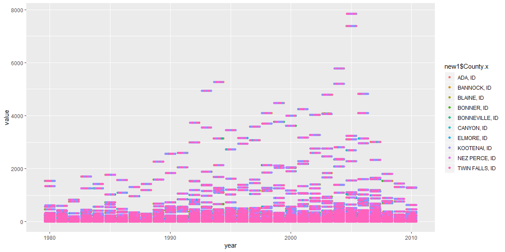

```r
build <- buildings::buildings0809
climate <- buildings::climate_zone_fips
permits <- buildings::permits %>% filter(state == 16) %>% rename("FIPS.state" = "state")
rest <- buildings::restaurants 


not_restaurants <- c("development","Food preperation center", "Food Services center","bakery","Grocery","concession","Cafeteria", "lunchroom","school","facility"," hall ")
standalone_retail <- c("Wine","Spirits","Liquor","Convenience","drugstore","Flying J", "Rite Aid ","walgreens ","Love's Travel ")
full_service_type <- c("Ristorante","mexican","pizza ","steakhouse"," grill ","buffet","tavern"," bar ","waffle","italian","steak house")
quick_service_type <- c("coffee"," java "," Donut ","Doughnut"," burger ","Ice Cream ","custard ","sandwich ","fast food "," bagel ")
quick_service_names <- restaurants$Restaurant[restaurants$Type %in% c("coffee","Ice Cream","Fast Food")]
full_service_names <- restaurants$Restaurant[restaurants$Type %in% c("Pizza","Casual Dining","Fast Casual")]


 
not_rest <- not_restaurants %>% str_trim() %>% str_to_lower() %>% str_c(collapse = "|")
standalone <- standalone_retail %>% str_trim() %>% str_to_lower() %>% str_c(collapse = "|")
full_types <- full_service_type %>% str_trim() %>% str_to_lower() %>% str_c(collapse = "|")
full_names <- full_service_names %>% str_trim() %>% str_to_lower() %>% str_c(collapse = "|")
```

## Background

It is 2010, and you are working for the Idaho restaurant commission, and they need your help getting a clearer picture of how restaurant construction changed across Idaho from 2008 to 2009. They provided you a dataset of all commercial construction in Idaho for those two years. The data has a variable Type with a general category called Food_Beverage_Service that has other buildings besides restaurants in the category. You will need to use the restaurant names (see restaurants data object) and some additional key words to create the correct subgroupings. Your client expects to provide new data for 2010 and 2011 so your script needs to do the work. Make sure you do not use Excel to manipulate anything.

How did full-service restaurant construction compare to quick service restaurant construction across county and years?
How did restaurant construction fare compare to the other commercial construction in Idaho?
Which county in Idaho spent the most on fast food construction each year?
In that county how did other commercial construction compare?

## Data Wrangling


```r
new <- left_join(build, climate, by = c("FIPS.county","FIPS.state"))
inter <- left_join(new, permits, by = c("FIPS.state"))


new1 <- inter %>% filter(Type == "Food_Beverage_Service") %>% 
  mutate(subgroup = case_when(str_detect(ProjectTitle %>% str_to_lower(), not_rest) ~ "not_restaurant",
                              str_detect(ProjectTitle %>% str_to_lower(), standalone) ~ "standalone_retail",
                              str_detect(ProjectTitle %>% str_to_lower(), full_types) ~ "full_service_type",
                              str_detect(ProjectTitle %>% str_to_lower(), full_names) ~ "full_service_names",
                              TRUE ~ "other")) %>%  
  mutate(type_restaurant = case_when(SqFt >= 4000 ~ "Full Service Restaurant",
                              SqFt <= 4000 ~ "Quick Service Restaurant"))
```

## Data Visualization


```r
new1 %>% 
 ggplot(aes(x = year, y = value)) +
  geom_jitter(aes(color = new1$County.x)) +
  labs(legend = "County")
```

<!-- -->

This graph attempts to show how much each county spends per year.

## Conclusions
