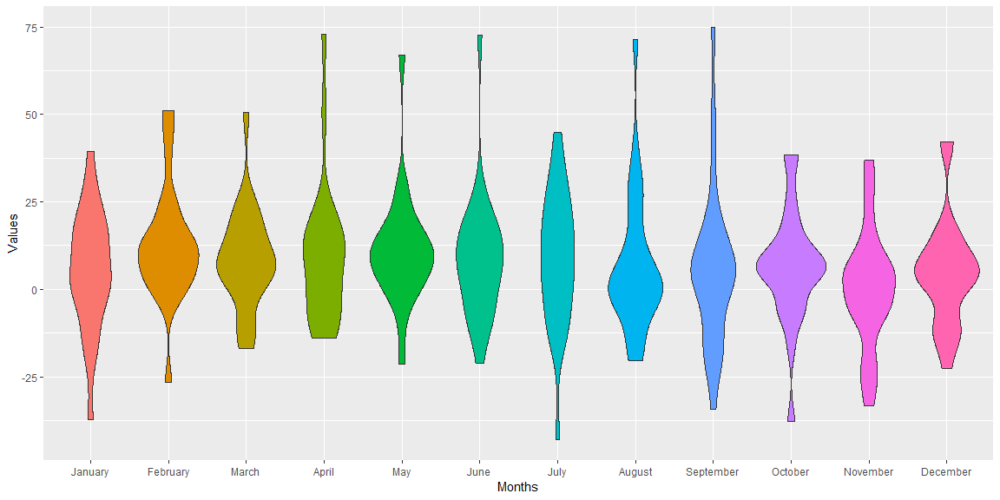

```r
dart_csv <- read_csv("https://github.com/byuistats/data/raw/master/Dart_Expert_Dow_6month_anova/Dart_Expert_Dow_6month_anova.csv")
```

## Background

When we are visualizing data with categorical variables, we have to deal with character strings as groupings. The problem with summarizing categorical data in a table or a plot is how to order the groups. Using the concept of Factors allows us to dictate the order of these groupings for presentation. We will revisit the stock data from a previous task to create a table and a plot that has the months correctly labeled and ordered.

## Data Wrangling


```r
clean_stocks <- dart_csv %>% 
  separate(contest_period, c("month_beg", "year"), sep = "-") %>%  
  separate(year, c("month_end", "year_end"), sep = -4) %>% 
  mutate(month_beg = str_extract(month_beg,".*[:alpha:]"), 
         month_end = case_when(month_end == "Dec." ~ "December",
                              month_end == "Febuary" ~ "February",
                              TRUE ~ month_end)) 
head(clean_stocks)
```

```
## # A tibble: 6 x 5
##   month_beg month_end year_end variable value
##   <chr>     <chr>     <chr>    <chr>    <dbl>
## 1 January   June      1990     PROS      12.7
## 2 February  July      1990     PROS      26.4
## 3 March     August    1990     PROS       2.5
## 4 April     September 1990     PROS     -20  
## 5 May       October   1990     PROS     -37.8
## 6 June      November  1990     PROS     -33.3
```

## Data Visualization


```r
clean_stocks %>% 
  ggplot(aes(x = month_end, y = value)) +
  geom_violin(aes(group = month_end, fill = month_end), show.legend = FALSE)
```

<!-- -->

## Conclusions
