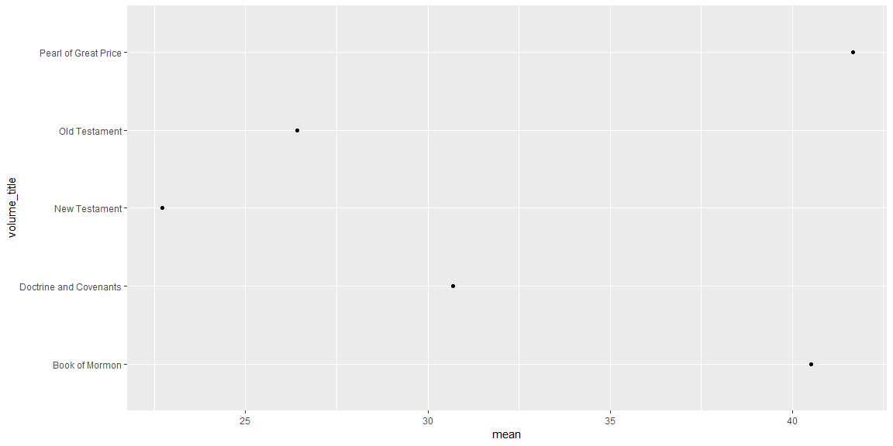
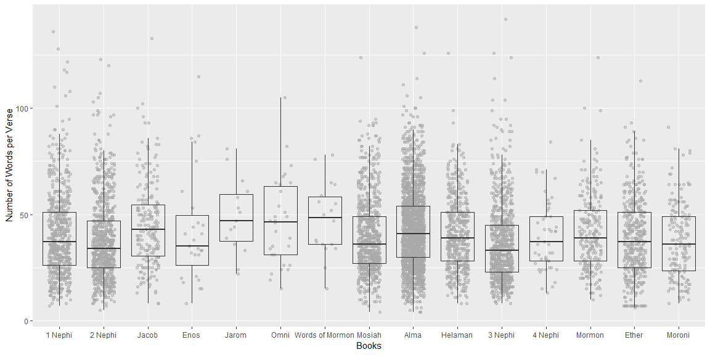

```r
scriptures <- read_csv(here::here("Data/lds-scripture.csv"))
```

## Background

In 1978 Susan Easton Black penned an article in the Ensign title Even statistically, he is the dominant figure of the Book of Mormon. which makes some statistical claims about the Book of Mormon. We are going to use some of our “string” skills to count words and occurrences in the New Testament and in the Book of Mormon.


## What is the average verse length (number of words) in the New Testament compared to the Book of Mormon?


```r
scriptures %>% 
  group_by(verse_short_title, volume_title) %>% 
  summarise(number = stri_stats_latex(scripture_text)["Words"]) %>% 
  ungroup() %>% 
  group_by(volume_title) %>% 
  summarize(mean = mean(number)) %>%  
  ggplot(aes(y = volume_title, x = mean)) +
  geom_point()
```

<!-- -->


## How often is the word Jesus in the New Testament compared to the Book of Mormon?


```r
scriptures %>% 
  filter(volume_title %in% c("New Testament", "Book of Mormon")) %>% 
  group_by(volume_title) %>% 
  summarise(text = str_c(scripture_text, collapse = " "),
            count = str_count(text, "Jesus")) %>%
  select(volume_title, count) %>% 
  head()
```

```
## # A tibble: 2 x 2
##   volume_title   count
##   <chr>          <int>
## 1 Book of Mormon   184
## 2 New Testament    976
```


## How does the word count distribution by verse look for each book in the Book of Mormon?


```r
flevels <- scriptures %>% filter(volume_title == "Book of Mormon") %>% .$book_title %>% unique()


scriptures %>% 
  filter(volume_title == "Book of Mormon") %>% 
  group_by(book_title, verse_id) %>% 
  mutate(number = stri_stats_latex(scripture_text)["Words"]) %>% 
  ungroup() %>% 
  ggplot(aes(x = factor(book_title, levels = flevels), y = number)) +
  geom_jitter(width = .25, height = 0, alpha = .5, color = "darkgrey") +
  geom_boxplot(outlier.colour = NA, fill = NA) +
  labs(x = "Books", y = "Number of Words per Verse")
```

<!-- -->

I was not sure about how to make this graph. It was something that we went over in class and I am a little confused about the factor releveling and at the words count. But it shows the amount of words per verse in each book of the Book of Mormon.
