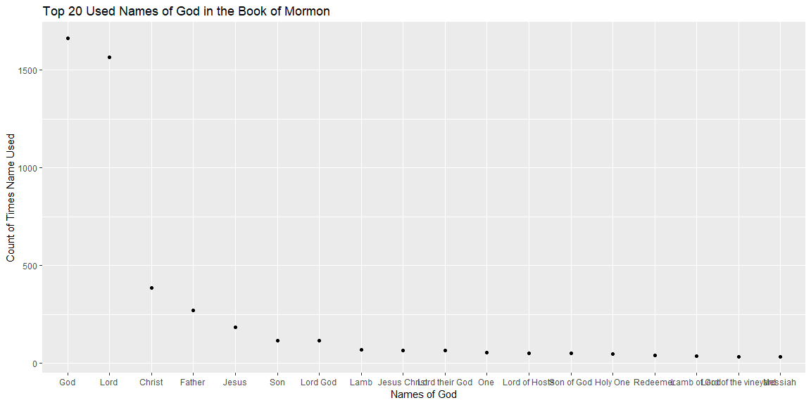

```r
scriptures <- rio::import("http://scriptures.nephi.org/downloads/lds-scriptures.csv.zip")

# to get the Savior names
bmnames <- read_rds(gzcon(url("https://byuistats.github.io/M335/data/BoM_SaviorNames.rds")))
```

## Background

In 1978 Susan Easton Black penned an article in the Ensign title Even statistically, he is the dominant figure of the Book of Mormon. which makes some statistical claims about the Book of Mormon. With our “string” skills we are going to check her result and build an improved statistic using using number of words between references.


## Data Wrangling


```r
verse <- scriptures %>% 
  filter(volume_title == "Book of Mormon") %>% 
  group_by(book_title) %>% .$scripture_text %>% str_flatten()

bmn <- bmnames$name %>% rev()

for (i in seq_along(bmn)){
  
   parts <- str_replace_all(verse, bmn[i], "CALLANMIX") %>% unlist()
   
}

split_text <- str_split(parts, "CALLANMIX") %>% unlist()

answer <- data.frame(text = split_text) %>% 
  mutate(words = unlist(map(text, function(x)(unname(stri_stats_latex(x)[4])))))


#############

store=c()
for (i in seq_along(bmn)){
  store[i] <- str_count(verse,bmn[i])
}

dat <- data.frame(name = bmn, count = store) %>% 
  arrange(desc(count)) %>% filter(count >= 30)

dat_name <- dat %>%  arrange(desc(count)) %>% filter(count >= 30) %>% .$name %>%  unique()
```

## Data Visualization


```r
dat %>% 
  ggplot(aes(x = factor(name, levels = dat_name), y = count)) +
  geom_point() +theme(axis.text.x = element_text(angle = 45, hjust = 1, vjust = 0.5)) +
  labs(title = "Top 20 Used Names of God in the Book of Mormon",
       x = "Names of God", y = "Count of Times Name Used") +
  theme_grey()
```

<!-- -->

## Conclusions
