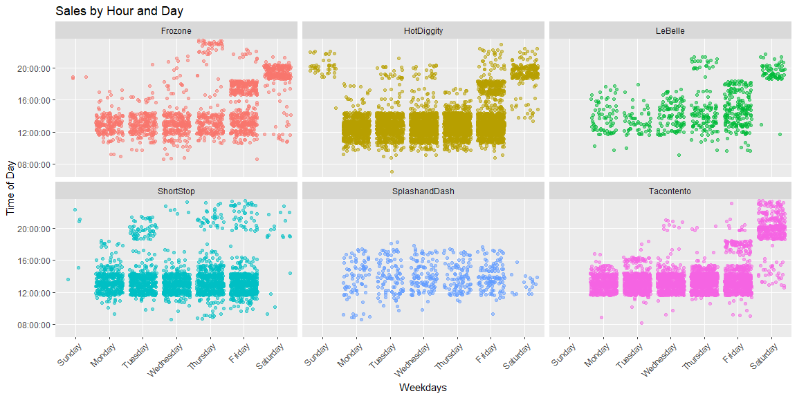

```r
sale <- read_csv("https://byuistats.github.io/M335/data/sales.csv")
```

## Background

We have transaction data for a few businesses that have been in operation for three months. Each of these companies has come to your investment company for a loan to expand their business. Your boss has asked you to go through the transactions for each business and provide daily, weekly, and monthly gross revenue summaries and comparisons. Your boss would like a short write up with tables and visualizations that help with the decision of which company did the best over the three month period. You will also need to provide a short paragraph with your recommendation after building your analysis.

In our course we are only looking at understanding and visualizing recorded time series data. If you would like to learn more about forecasting I would recommend Forecasting: Principles and Practice and for a quick introduction see here


## Data Wrangling


```r
dat_time <- sale %>% 
  mutate(fix_time = force_tz(Time, tzone = "GMT") %>% with_tz("America/Denver")) %>% 
  mutate(hour = ceiling_date(fix_time, unit = 'hour'),
         just_hours = format(as.POSIXct(hour) ,format = "%H:%M:%S"),
         day = ceiling_date(fix_time, unit = 'day'),
         week = ceiling_date(fix_time, unit = 'week'),
         month = ceiling_date(fix_time, unit = 'month'),
         weekdays = weekdays(as.Date(.$fix_time))) %>% 
  .[-15631, ] %>% 
  filter(month != "2016-05-01 MDT", Name != "Missing")
```

## Graphs By Hour


```r
dat_time %>% 
  filter(just_hours >= "09:00:00", Name != "Missing") %>% 
  group_by(Name, just_hours) %>% 
  summarise(price = median(Amount)) %>% 
  ggplot(aes(x = just_hours, y = price)) +
  geom_point(aes(color = Name)) +
  geom_path(aes(group = Name, color = Name)) + 
  facet_wrap(facets = "Name") +
  theme(axis.text.x = element_text(angle = 45, hjust = 1)) +
  scale_x_discrete(breaks = c("08:00:00","12:00:00","16:00:00","20:00:00"))
```

<!-- -->

A median of sales per hour of the day faceted by company. It is a summary statistic so it hides some information that could be important.


```r
dat_time %>% 
  filter(just_hours >= "08:00:00", Name != "Missing", Amount <= 250) %>% 
  group_by(just_hours) %>% 
  ggplot(aes(x = just_hours, y = Amount)) +
  geom_violin(aes(group = just_hours, fill = just_hours), show.legend = FALSE) +
  theme(axis.text.x = element_text(angle = 45, hjust = 1)) +
  scale_x_discrete(breaks = c("08:00:00","12:00:00","16:00:00","20:00:00"))
```

<!-- -->

This graph gives us an idea of the amount of sales variation that take place over all the businesses over the hours in a day. 

## Graphs By Day


```r
dat_time %>% 
  filter(just_hours >= "08:00:00", Name != "Missing", Amount <= 150, Amount >=-150) %>%
  group_by(just_hours) %>% 
  ggplot(aes(x = just_hours, y = Amount)) +
  geom_jitter(aes(color = weekdays), alpha = .5) +
  geom_boxplot(aes(group = just_hours), fill = NA, outlier.shape = NA) +
  theme(axis.text.x = element_text(angle = 45, hjust = 1)) +
  scale_x_discrete(breaks = c("08:00:00","12:00:00","16:00:00","20:00:00"))
```

<!-- -->

I tried to show some relationship between day of the week and sales over the hours of the day. This is confusing and does not clearly communicate any information.


```r
dat_time %>% 
  filter(just_hours >= "07:00:00", Name != "Missing") %>%
  ggplot(aes(x = factor(weekdays, levels = c("Sunday","Monday","Tuesday",
                                             "Wednesday","Thursday",
                                             "Friday","Saturday")), y = just_hours)) +
  geom_jitter(alpha = .5,aes(color=Name), show.legend = FALSE) +
  facet_wrap(facets = "Name") +
  theme(axis.text.x = element_text(angle = 45, hjust = 1)) +
  scale_y_discrete(breaks = c("08:00:00","12:00:00","16:00:00","20:00:00")) +
  labs(x = "Weekdays", title = "Sales by Hour and Day", y = "Time of Day")
```

<!-- -->

I think this graph helps the most to visualize the sales traffic per day of the week and hour of the day. We can see clearly what hours each should operate in during the week. 

## Graphs By Week


```r
dat_time %>% 
  filter(just_hours >= "07:00:00", Name != "Missing") %>%
  group_by(week, Name) %>% 
  summarise(sd = sd(Amount)) %>% filter(week != "2016-07-24") %>% 
  ggplot(aes(x = week, y = sd)) +
  geom_point(aes(color = Name)) +
  geom_line(aes(group = Name, color = Name), size = 1.25, alpha = .5)
```

<!-- -->

We can see the standard deviation of each business over the 3 month span of data. This can help us to see which companies are a safer investment or at least have a more stable income stream.

## Graphs By Month


```r
dat_time %>% 
  filter(just_hours >= "07:00:00", Name != "Missing") %>% 
  group_by(Name, month, week) %>% 
  summarise(mean = mean(Amount), sd = sd(Amount), median = median(Amount)) %>% 
  ggplot(aes(y = mean, x = week)) +
  geom_point(aes(color = Name)) +
  geom_line(aes(group = Name, color =  Name), size = .75) +
  facet_wrap(facets = "month", scales = "free")
```

<!-- -->

I like this graph because it shows us the average sale by week and also some of the variation in the data itself. I am not sure where all this variation comes from and requires more digging.


```r
dat_time %>% 
  group_by(month, day, Name) %>% 
  summarise(sum = sum(Amount)) %>% 
  ggplot(aes(y = sum, x = day)) +
  geom_point(aes(color = Name), show.legend = FALSE) +
  geom_smooth(alpha = .05) +
  facet_wrap(facets = "Name")
```

<!-- -->

Here we have a sum of sales by day over the 3 months of data faceted into each business. This give us an idea of the amount of revenue made by each.


```r
dat_time %>% 
  filter(just_hours >= "07:00:00", Name != "Missing") %>%
  ggplot(aes(x = factor(weekdays, levels = c("Sunday","Monday","Tuesday",
                                             "Wednesday","Thursday",
                                             "Friday","Saturday")), y = just_hours)) +
  geom_jitter(alpha = .5, aes(color = month), show.legend = FALSE) +
  facet_wrap(facets = "month") +
  theme(axis.text.x = element_text(angle = 45, hjust = 1)) +
  scale_y_discrete(breaks = c("08:00:00","10:00:00","12:00:00","14:00:00",
                              "16:00:00","18:00:00","20:00:00","22:00:00")) +
  labs(title = "Sales Traffic by Hour and Month", x = "Days of the Week", y = "Time of Day")
```

<!-- -->

This last graph is best for answering the question of which are the best hours of operation for the combined companies. We can see a majority of the traffic comes between 10am and 4pm during the week and 5pm til midnight on saturday. Sunday does not have enough data to make a good judgement.

## Conclusions

Based on the data given, I would pick shortstop as the company to invest in. They are one of the most stable and the consitantly bring in a profit. Their ideal hours of operation would be from 10 - 5 every day. 
