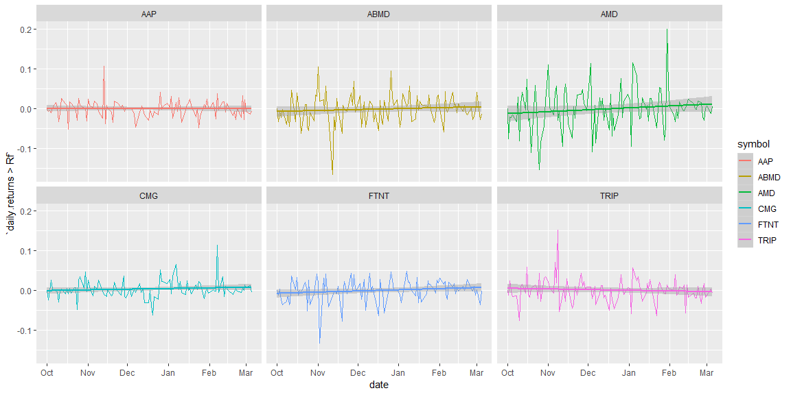
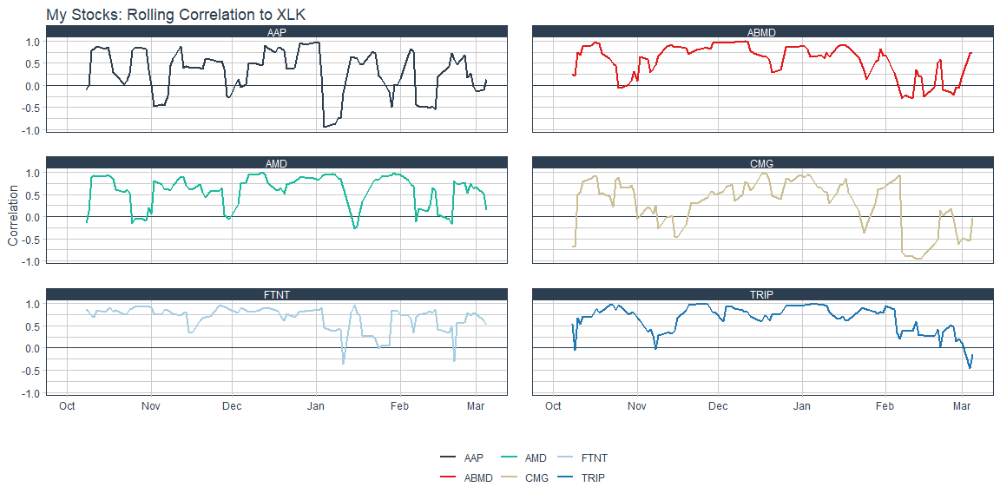
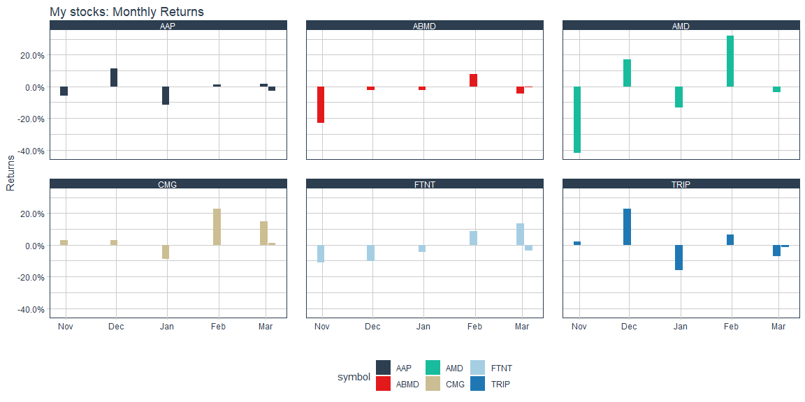
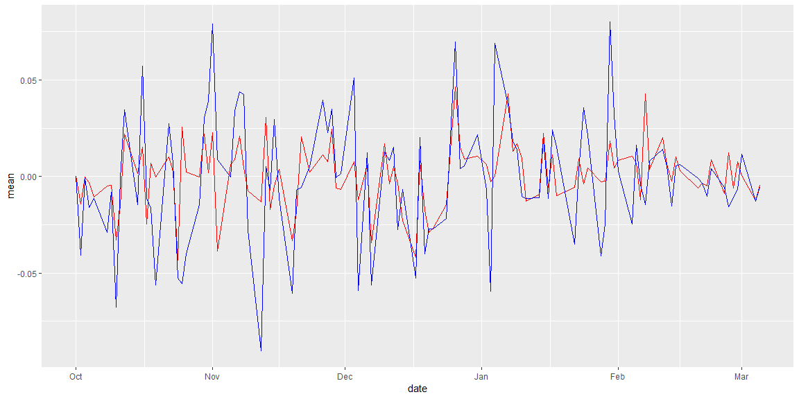

```r
name <- c("ABIOMED, Inc.","Advanced Micro Devices","TripAdvisor, Inc.","Fortinet, Inc.","Advance Auto Parts, Inc.","Chipotle Mexican Grill, Inc.")

tickers_today <- c("ABMD","AMD","TRIP","FTNT","AAP","CMG")

tick <- tidyquant::tq_get(tickers_today, get = "stock.price", from = "2018-10-01") 

tick_advanced <- tidyquant::tq_get(tickers_today, get = "key.ratios", from = "2018-10-01") %>% unnest()
```

## Background

The stock market is overflowing with data. There are many packages in R that allow us to get quick access to information on publicly traded companies. Imagine that you and a friend each purchased about $1,000 of stock in three different stocks at the start of October last year, and you want to compare your performance up to this week. Use the stock shares purchased and share prices to demonstrate how each of you fared over the period you were competing (assuming that you did not change your allocations).


## Data Visualizations

# Data Wrangling

```r
ticker <- tick %>% 
  group_by(symbol) %>% 
  tq_transmute(select     = adjusted, 
               mutate_fun = periodReturn, 
               period     = "daily", 
               col_rename = "Ra")

tick2 <- "XLK" %>% 
  tq_get(get = "stock.price", from = "2018-10-01") %>% 
  tq_transmute(select     = adjusted, 
               mutate_fun = periodReturn, 
               period     = "daily", 
               col_rename = "Rb")

base <- left_join(ticker,tick2,by = "date")

base %>% 
  group_by(symbol) %>% 
  summarise(mean = mean(Ra))
```

```
## # A tibble: 6 x 2
##   symbol      mean
##   <chr>      <dbl>
## 1 AAP    -0.000483
## 2 ABMD   -0.00207 
## 3 AMD    -0.00140 
## 4 CMG     0.00327 
## 5 FTNT   -0.000539
## 6 TRIP    0.000665
```

```r
base %>% 
  tq_performance(Ra = Ra, Rb = Rb, performance_fun = table.CAPM)
```

```
## # A tibble: 6 x 13
## # Groups:   symbol [6]
##   symbol ActivePremium   Alpha AnnualizedAlpha  Beta `Beta-` `Beta+`
##   <chr>          <dbl>   <dbl>           <dbl> <dbl>   <dbl>   <dbl>
## 1 ABMD         -0.359  -0.0016         -0.329  1.19    1.12    1.31 
## 2 AMD          -0.362  -0.0007         -0.162  1.72    1.87    1.51 
## 3 TRIP          0.195   0.0011          0.306  0.976   1.29    1.01 
## 4 FTNT         -0.0728 -0.0001         -0.0316 1.01    1.10    0.735
## 5 AAP          -0.0267 -0.0004         -0.0846 0.326   0.285   0.259
## 6 CMG           1.28    0.0035          1.38   0.457   0.602   0.491
## # ... with 6 more variables: Correlation <dbl>,
## #   `Correlationp-value` <dbl>, InformationRatio <dbl>, `R-squared` <dbl>,
## #   TrackingError <dbl>, TreynorRatio <dbl>
```

# Daily Returns


```r
tick %>%     
  group_by(symbol) %>%
  tq_transmute(adjusted, periodReturn, period = "daily") %>%
  tq_transmute(daily.returns, Return.clean, alpha = 0.05) %>%
  tq_transmute(daily.returns, Return.excess, Rf = 0.03 / 252) %>% 
  ggplot(aes(x = date, y = `daily.returns > Rf`, color = symbol)) +
  geom_line() +
  geom_smooth(method = "lm") +
  facet_wrap(facets = "symbol")
```

<!-- -->

# High and Lows


```r
base %>%
  tq_transmute_xy(x = Ra, 
                y = Rb,
                mutate_fun = runCor,
                n = 6,
                col_rename = "rolling.corr.6") %>% 
  ggplot(aes(x = date, y = rolling.corr.6, color = symbol)) +
  geom_hline(yintercept = 0, color = palette_light()[[1]]) +
  geom_line(size = 1) +
  labs(title = "My Stocks: Rolling Correlation to XLK",
       x = "", y = "Correlation", color = "") +
  facet_wrap(~ symbol, ncol = 2) +
  theme_tq() + 
  scale_color_tq()  
```

<!-- -->

# Correlation to the Tech Sector


```r
base %>%
  tq_transmute_xy(x = Ra, 
                y = Rb,
                mutate_fun = runCor,
                n = 6,
                col_rename = "rolling.corr.6") %>% 
  ggplot(aes(x = date, y = rolling.corr.6, color = symbol)) +
  geom_hline(yintercept = 0, color = palette_light()[[1]]) +
  geom_line(size = 1) +
  labs(title = "My Stocks: Rolling Correlation to XLK",
       x = "", y = "Correlation", color = "") +
  facet_wrap(~ symbol, ncol = 2) +
  theme_tq() + 
  scale_color_tq()  
```

<!-- -->

# Monthly Returns


```r
tick %>% 
  group_by(symbol) %>% 
  tq_transmute(select     = adjusted, 
               mutate_fun = periodReturn, 
               period     = "monthly", 
               col_rename = "daily.returns") %>% 
  ggplot(aes(x = date, y = daily.returns, fill = symbol)) +
  geom_bar(position = "dodge", stat = "identity") +
  labs(title = "My stocks: Monthly Returns",
       y = "Returns", x = "", color = "") +
  facet_wrap(~symbol) +
  scale_y_continuous(labels = scales::percent) +
  theme_tq() +
  scale_fill_tq()
```

<!-- -->

# Daily Returns of each combines three stocks


```r
c("FTNT","AAP","CMG") %>% tq_get(get = "stock.price", from = "2018-10-01") %>% 
  group_by(symbol) %>% 
  tq_transmute(select     = adjusted, 
               mutate_fun = periodReturn, 
               period     = "daily", 
               col_rename = "daily.returns") %>% 
  ungroup() %>% group_by(date) %>% 
  summarise(mean = mean(daily.returns)) %>% 
  ggplot(aes(x = date, y = mean)) +
  geom_line(color = "red") +
  geom_line(data = c("ABMD","AMD","TRIP") %>% tq_get(get = "stock.price", from = "2018-10-01") %>% 
              group_by(symbol) %>% 
              tq_transmute(select     = adjusted, 
                           mutate_fun = periodReturn, 
                           period     = "daily", 
                           col_rename = "daily.returns") %>% 
              ungroup() %>% group_by(date) %>% 
              summarise(mean = mean(daily.returns)), aes(x = date, y = mean), color = "blue")
```

<!-- -->

## Conclusions
