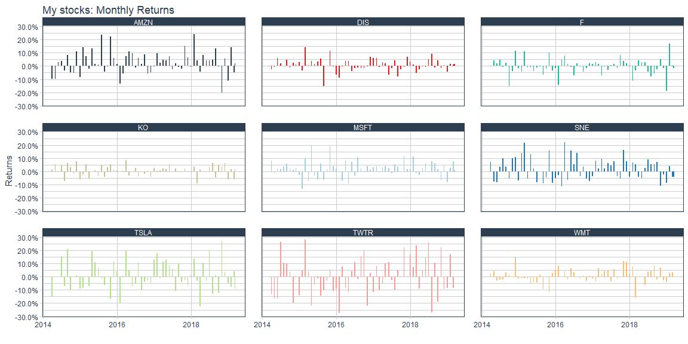
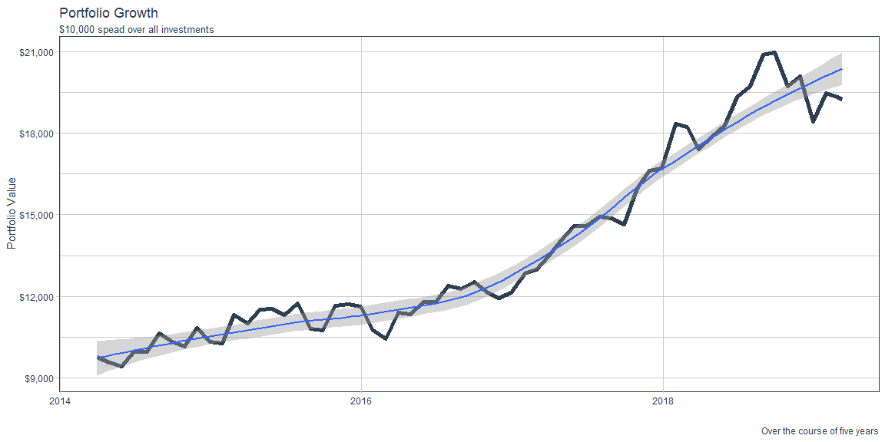

```r
## List of Stocks that you would like to use
## c("Ford","Amazon","Coca Cola","Tesla","Disney","Twitter","Microsoft","Sony","Walmart")
## List of tickers for those stocks
## c("F","AMZN","KO","TSLA","DIS","TWTR","MSFT","SNE","WMT")

tickers_used <- c("F","AMZN","KO","TSLA","DIS","TWTR","MSFT","SNE","WMT")

start_date <- "2014-03-07"

tick_for_ggplot <- tq_get(tickers_used, from = start_date, get = "stock.price")

int_stock <- cbind(tk_xts(tq_get("F", from = start_date, get = "stock.price"),start = start_date, date_var = date, select = adjusted),
          tk_xts(tq_get("AMZN", from = start_date, get = "stock.price"),start = start_date, date_var = date, select = adjusted),
          tk_xts(tq_get("KO", from = start_date, get = "stock.price"),start = start_date, date_var = date, select = adjusted),
          tk_xts(tq_get("TSLA", from = start_date, get = "stock.price"),start = start_date, date_var = date, select = adjusted),
          tk_xts(tq_get("DIS", from = start_date, get = "stock.price"),start = start_date, date_var = date, select = adjusted),
          tk_xts(tq_get("TWTR", from = start_date, get = "stock.price"),start = start_date, date_var = date, select = adjusted),
          tk_xts(tq_get("MSFT", from = start_date, get = "stock.price"),start = start_date, date_var = date, select = adjusted),
          tk_xts(tq_get("SNE", from = start_date, get = "stock.price"),start = start_date, date_var = date, select = adjusted),
          tk_xts(tq_get("WMT", from = start_date, get = "stock.price"),start = start_date, date_var = date, select = adjusted))  
          
colnames(int_stock) <- c("Ford","Amazon","Coca Cola","Tesla","Disney","Twitter","Microsoft","Sony","Walmart")
```

## Background

Your data science income has ballooned, and you need to find somewhere to invest $25,000 that you have saved over the last year. You have a savvy investment friend that is kind enough to tell you ten stocks he has been watching during the last year. You will need to visualize the last five years performance to help in the in the conversation with your friend.

Your friend is going to give you his tickers at the beginning of your half-hour meeting with him (he is a busy friend). You will need to build an .Rmd file that will build a suite of visualizations rapidly for your conversation. You will need a series of stock performance graphics using  library(dygraphs) and library(ggplot2). In real life, you might use one or the other, but this task is built to help you move from ts and xts to tidy objects for visualization.

Specifically, in class the Tuesday following this case study you will get 5 - 10 ticker symbols and will need to build visualizations quickly that allows you to answer questions about the stocks in a few seconds.

## Stock Names and Tickers

List of Stocks that you would like to use

"Ford","Amazon","Coca Cola","Tesla","Disney","Twitter","Microsoft","Sony","Walmart"

List of tickers for those stocks

"F","AMZN","KO","TSLA","DIS","TWTR","MSFT","SNE","WMT"

## Interactive Graphs


```r
dygraph(int_stock) %>% 
  dyRangeSelector() %>% 
  dyHighlight(highlightSeriesOpts = list(strokeWidth = 3))
```

<!--html_preserve--><div id="htmlwidget-52240b051da52a7683d9" style="width:1152px;height:576px;" class="dygraphs html-widget"></div>
<script type="application/json" data-for="htmlwidget-52240b051da52a7683d9">{"x":{"attrs":{"labels":["day","Ford","Amazon","Coca Cola","Tesla","Disney","Twitter","Microsoft","Sony","Walmart"],"legend":"auto","retainDateWindow":false,"axes":{"x":{"pixelsPerLabel":60}},"showRangeSelector":true,"rangeSelectorHeight":40,"rangeSelectorPlotFillColor":" #A7B1C4","rangeSelectorPlotStrokeColor":"#808FAB","interactionModel":"Dygraph.Interaction.defaultModel","highlightCircleSize":3,"highlightSeriesBackgroundAlpha":0.5,"highlightSeriesOpts":{"strokeWidth":3},"hideOverlayOnMouseOut":true},"scale":"daily","annotations":[],"shadings":[],"events":[],"format":"date","data":[["2014-03-07T00:00:00.000Z","2014-03-10T00:00:00.000Z","2014-03-11T00:00:00.000Z","2014-03-12T00:00:00.000Z","2014-03-13T00:00:00.000Z","2014-03-14T00:00:00.000Z","2014-03-17T00:00:00.000Z","2014-03-18T00:00:00.000Z","2014-03-19T00:00:00.000Z","2014-03-20T00:00:00.000Z","2014-03-21T00:00:00.000Z","2014-03-24T00:00:00.000Z","2014-03-25T00:00:00.000Z","2014-03-26T00:00:00.000Z","2014-03-27T00:00:00.000Z","2014-03-28T00:00:00.000Z","2014-03-31T00:00:00.000Z","2014-04-01T00:00:00.000Z","2014-04-02T00:00:00.000Z","2014-04-03T00:00:00.000Z","2014-04-04T00:00:00.000Z","2014-04-07T00:00:00.000Z","2014-04-08T00:00:00.000Z","2014-04-09T00:00:00.000Z","2014-04-10T00:00:00.000Z","2014-04-11T00:00:00.000Z","2014-04-14T00:00:00.000Z","2014-04-15T00:00:00.000Z","2014-04-16T00:00:00.000Z","2014-04-17T00:00:00.000Z","2014-04-21T00:00:00.000Z","2014-04-22T00:00:00.000Z","2014-04-23T00:00:00.000Z","2014-04-24T00:00:00.000Z","2014-04-25T00:00:00.000Z","2014-04-28T00:00:00.000Z","2014-04-29T00:00:00.000Z","2014-04-30T00:00:00.000Z","2014-05-01T00:00:00.000Z","2014-05-02T00:00:00.000Z","2014-05-05T00:00:00.000Z","2014-05-06T00:00:00.000Z","2014-05-07T00:00:00.000Z","2014-05-08T00:00:00.000Z","2014-05-09T00:00:00.000Z","2014-05-12T00:00:00.000Z","2014-05-13T00:00:00.000Z","2014-05-14T00:00:00.000Z","2014-05-15T00:00:00.000Z","2014-05-16T00:00:00.000Z","2014-05-19T00:00:00.000Z","2014-05-20T00:00:00.000Z","2014-05-21T00:00:00.000Z","2014-05-22T00:00:00.000Z","2014-05-23T00:00:00.000Z","2014-05-27T00:00:00.000Z","2014-05-28T00:00:00.000Z","2014-05-29T00:00:00.000Z","2014-05-30T00:00:00.000Z","2014-06-02T00:00:00.000Z","2014-06-03T00:00:00.000Z","2014-06-04T00:00:00.000Z","2014-06-05T00:00:00.000Z","2014-06-06T00:00:00.000Z","2014-06-09T00:00:00.000Z","2014-06-10T00:00:00.000Z","2014-06-11T00:00:00.000Z","2014-06-12T00:00:00.000Z","2014-06-13T00:00:00.000Z","2014-06-16T00:00:00.000Z","2014-06-17T00:00:00.000Z","2014-06-18T00:00:00.000Z","2014-06-19T00:00:00.000Z","2014-06-20T00:00:00.000Z","2014-06-23T00:00:00.000Z","2014-06-24T00:00:00.000Z","2014-06-25T00:00:00.000Z","2014-06-26T00:00:00.000Z","2014-06-27T00:00:00.000Z","2014-06-30T00:00:00.000Z","2014-07-01T00:00:00.000Z","2014-07-02T00:00:00.000Z","2014-07-03T00:00:00.000Z","2014-07-07T00:00:00.000Z","2014-07-08T00:00:00.000Z","2014-07-09T00:00:00.000Z","2014-07-10T00:00:00.000Z","2014-07-11T00:00:00.000Z","2014-07-14T00:00:00.000Z","2014-07-15T00:00:00.000Z","2014-07-16T00:00:00.000Z","2014-07-17T00:00:00.000Z","2014-07-18T00:00:00.000Z","2014-07-21T00:00:00.000Z","2014-07-22T00:00:00.000Z","2014-07-23T00:00:00.000Z","2014-07-24T00:00:00.000Z","2014-07-25T00:00:00.000Z","2014-07-28T00:00:00.000Z","2014-07-29T00:00:00.000Z","2014-07-30T00:00:00.000Z","2014-07-31T00:00:00.000Z","2014-08-01T00:00:00.000Z","2014-08-04T00:00:00.000Z","2014-08-05T00:00:00.000Z","2014-08-06T00:00:00.000Z","2014-08-07T00:00:00.000Z","2014-08-08T00:00:00.000Z","2014-08-11T00:00:00.000Z","2014-08-12T00:00:00.000Z","2014-08-13T00:00:00.000Z","2014-08-14T00:00:00.000Z","2014-08-15T00:00:00.000Z","2014-08-18T00:00:00.000Z","2014-08-19T00:00:00.000Z","2014-08-20T00:00:00.000Z","2014-08-21T00:00:00.000Z","2014-08-22T00:00:00.000Z","2014-08-25T00:00:00.000Z","2014-08-26T00:00:00.000Z","2014-08-27T00:00:00.000Z","2014-08-28T00:00:00.000Z","2014-08-29T00:00:00.000Z","2014-09-02T00:00:00.000Z","2014-09-03T00:00:00.000Z","2014-09-04T00:00:00.000Z","2014-09-05T00:00:00.000Z","2014-09-08T00:00:00.000Z","2014-09-09T00:00:00.000Z","2014-09-10T00:00:00.000Z","2014-09-11T00:00:00.000Z","2014-09-12T00:00:00.000Z","2014-09-15T00:00:00.000Z","2014-09-16T00:00:00.000Z","2014-09-17T00:00:00.000Z","2014-09-18T00:00:00.000Z","2014-09-19T00:00:00.000Z","2014-09-22T00:00:00.000Z","2014-09-23T00:00:00.000Z","2014-09-24T00:00:00.000Z","2014-09-25T00:00:00.000Z","2014-09-26T00:00:00.000Z","2014-09-29T00:00:00.000Z","2014-09-30T00:00:00.000Z","2014-10-01T00:00:00.000Z","2014-10-02T00:00:00.000Z","2014-10-03T00:00:00.000Z","2014-10-06T00:00:00.000Z","2014-10-07T00:00:00.000Z","2014-10-08T00:00:00.000Z","2014-10-09T00:00:00.000Z","2014-10-10T00:00:00.000Z","2014-10-13T00:00:00.000Z","2014-10-14T00:00:00.000Z","2014-10-15T00:00:00.000Z","2014-10-16T00:00:00.000Z","2014-10-17T00:00:00.000Z","2014-10-20T00:00:00.000Z","2014-10-21T00:00:00.000Z","2014-10-22T00:00:00.000Z","2014-10-23T00:00:00.000Z","2014-10-24T00:00:00.000Z","2014-10-27T00:00:00.000Z","2014-10-28T00:00:00.000Z","2014-10-29T00:00:00.000Z","2014-10-30T00:00:00.000Z","2014-10-31T00:00:00.000Z","2014-11-03T00:00:00.000Z","2014-11-04T00:00:00.000Z","2014-11-05T00:00:00.000Z","2014-11-06T00:00:00.000Z","2014-11-07T00:00:00.000Z","2014-11-10T00:00:00.000Z","2014-11-11T00:00:00.000Z","2014-11-12T00:00:00.000Z","2014-11-13T00:00:00.000Z","2014-11-14T00:00:00.000Z","2014-11-17T00:00:00.000Z","2014-11-18T00:00:00.000Z","2014-11-19T00:00:00.000Z","2014-11-20T00:00:00.000Z","2014-11-21T00:00:00.000Z","2014-11-24T00:00:00.000Z","2014-11-25T00:00:00.000Z","2014-11-26T00:00:00.000Z","2014-11-28T00:00:00.000Z","2014-12-01T00:00:00.000Z","2014-12-02T00:00:00.000Z","2014-12-03T00:00:00.000Z","2014-12-04T00:00:00.000Z","2014-12-05T00:00:00.000Z","2014-12-08T00:00:00.000Z","2014-12-09T00:00:00.000Z","2014-12-10T00:00:00.000Z","2014-12-11T00:00:00.000Z","2014-12-12T00:00:00.000Z","2014-12-15T00:00:00.000Z","2014-12-16T00:00:00.000Z","2014-12-17T00:00:00.000Z","2014-12-18T00:00:00.000Z","2014-12-19T00:00:00.000Z","2014-12-22T00:00:00.000Z","2014-12-23T00:00:00.000Z","2014-12-24T00:00:00.000Z","2014-12-26T00:00:00.000Z","2014-12-29T00:00:00.000Z","2014-12-30T00:00:00.000Z","2014-12-31T00:00:00.000Z","2015-01-02T00:00:00.000Z","2015-01-05T00:00:00.000Z","2015-01-06T00:00:00.000Z","2015-01-07T00:00:00.000Z","2015-01-08T00:00:00.000Z","2015-01-09T00:00:00.000Z","2015-01-12T00:00:00.000Z","2015-01-13T00:00:00.000Z","2015-01-14T00:00:00.000Z","2015-01-15T00:00:00.000Z","2015-01-16T00:00:00.000Z","2015-01-20T00:00:00.000Z","2015-01-21T00:00:00.000Z","2015-01-22T00:00:00.000Z","2015-01-23T00:00:00.000Z","2015-01-26T00:00:00.000Z","2015-01-27T00:00:00.000Z","2015-01-28T00:00:00.000Z","2015-01-29T00:00:00.000Z","2015-01-30T00:00:00.000Z","2015-02-02T00:00:00.000Z","2015-02-03T00:00:00.000Z","2015-02-04T00:00:00.000Z","2015-02-05T00:00:00.000Z","2015-02-06T00:00:00.000Z","2015-02-09T00:00:00.000Z","2015-02-10T00:00:00.000Z","2015-02-11T00:00:00.000Z","2015-02-12T00:00:00.000Z","2015-02-13T00:00:00.000Z","2015-02-17T00:00:00.000Z","2015-02-18T00:00:00.000Z","2015-02-19T00:00:00.000Z","2015-02-20T00:00:00.000Z","2015-02-23T00:00:00.000Z","2015-02-24T00:00:00.000Z","2015-02-25T00:00:00.000Z","2015-02-26T00:00:00.000Z","2015-02-27T00:00:00.000Z","2015-03-02T00:00:00.000Z","2015-03-03T00:00:00.000Z","2015-03-04T00:00:00.000Z","2015-03-05T00:00:00.000Z","2015-03-06T00:00:00.000Z","2015-03-09T00:00:00.000Z","2015-03-10T00:00:00.000Z","2015-03-11T00:00:00.000Z","2015-03-12T00:00:00.000Z","2015-03-13T00:00:00.000Z","2015-03-16T00:00:00.000Z","2015-03-17T00:00:00.000Z","2015-03-18T00:00:00.000Z","2015-03-19T00:00:00.000Z","2015-03-20T00:00:00.000Z","2015-03-23T00:00:00.000Z","2015-03-24T00:00:00.000Z","2015-03-25T00:00:00.000Z","2015-03-26T00:00:00.000Z","2015-03-27T00:00:00.000Z","2015-03-30T00:00:00.000Z","2015-03-31T00:00:00.000Z","2015-04-01T00:00:00.000Z","2015-04-02T00:00:00.000Z","2015-04-06T00:00:00.000Z","2015-04-07T00:00:00.000Z","2015-04-08T00:00:00.000Z","2015-04-09T00:00:00.000Z","2015-04-10T00:00:00.000Z","2015-04-13T00:00:00.000Z","2015-04-14T00:00:00.000Z","2015-04-15T00:00:00.000Z","2015-04-16T00:00:00.000Z","2015-04-17T00:00:00.000Z","2015-04-20T00:00:00.000Z","2015-04-21T00:00:00.000Z","2015-04-22T00:00:00.000Z","2015-04-23T00:00:00.000Z","2015-04-24T00:00:00.000Z","2015-04-27T00:00:00.000Z","2015-04-28T00:00:00.000Z","2015-04-29T00:00:00.000Z","2015-04-30T00:00:00.000Z","2015-05-01T00:00:00.000Z","2015-05-04T00:00:00.000Z","2015-05-05T00:00:00.000Z","2015-05-06T00:00:00.000Z","2015-05-07T00:00:00.000Z","2015-05-08T00:00:00.000Z","2015-05-11T00:00:00.000Z","2015-05-12T00:00:00.000Z","2015-05-13T00:00:00.000Z","2015-05-14T00:00:00.000Z","2015-05-15T00:00:00.000Z","2015-05-18T00:00:00.000Z","2015-05-19T00:00:00.000Z","2015-05-20T00:00:00.000Z","2015-05-21T00:00:00.000Z","2015-05-22T00:00:00.000Z","2015-05-26T00:00:00.000Z","2015-05-27T00:00:00.000Z","2015-05-28T00:00:00.000Z","2015-05-29T00:00:00.000Z","2015-06-01T00:00:00.000Z","2015-06-02T00:00:00.000Z","2015-06-03T00:00:00.000Z","2015-06-04T00:00:00.000Z","2015-06-05T00:00:00.000Z","2015-06-08T00:00:00.000Z","2015-06-09T00:00:00.000Z","2015-06-10T00:00:00.000Z","2015-06-11T00:00:00.000Z","2015-06-12T00:00:00.000Z","2015-06-15T00:00:00.000Z","2015-06-16T00:00:00.000Z","2015-06-17T00:00:00.000Z","2015-06-18T00:00:00.000Z","2015-06-19T00:00:00.000Z","2015-06-22T00:00:00.000Z","2015-06-23T00:00:00.000Z","2015-06-24T00:00:00.000Z","2015-06-25T00:00:00.000Z","2015-06-26T00:00:00.000Z","2015-06-29T00:00:00.000Z","2015-06-30T00:00:00.000Z","2015-07-01T00:00:00.000Z","2015-07-02T00:00:00.000Z","2015-07-06T00:00:00.000Z","2015-07-07T00:00:00.000Z","2015-07-08T00:00:00.000Z","2015-07-09T00:00:00.000Z","2015-07-10T00:00:00.000Z","2015-07-13T00:00:00.000Z","2015-07-14T00:00:00.000Z","2015-07-15T00:00:00.000Z","2015-07-16T00:00:00.000Z","2015-07-17T00:00:00.000Z","2015-07-20T00:00:00.000Z","2015-07-21T00:00:00.000Z","2015-07-22T00:00:00.000Z","2015-07-23T00:00:00.000Z","2015-07-24T00:00:00.000Z","2015-07-27T00:00:00.000Z","2015-07-28T00:00:00.000Z","2015-07-29T00:00:00.000Z","2015-07-30T00:00:00.000Z","2015-07-31T00:00:00.000Z","2015-08-03T00:00:00.000Z","2015-08-04T00:00:00.000Z","2015-08-05T00:00:00.000Z","2015-08-06T00:00:00.000Z","2015-08-07T00:00:00.000Z","2015-08-10T00:00:00.000Z","2015-08-11T00:00:00.000Z","2015-08-12T00:00:00.000Z","2015-08-13T00:00:00.000Z","2015-08-14T00:00:00.000Z","2015-08-17T00:00:00.000Z","2015-08-18T00:00:00.000Z","2015-08-19T00:00:00.000Z","2015-08-20T00:00:00.000Z","2015-08-21T00:00:00.000Z","2015-08-24T00:00:00.000Z","2015-08-25T00:00:00.000Z","2015-08-26T00:00:00.000Z","2015-08-27T00:00:00.000Z","2015-08-28T00:00:00.000Z","2015-08-31T00:00:00.000Z","2015-09-01T00:00:00.000Z","2015-09-02T00:00:00.000Z","2015-09-03T00:00:00.000Z","2015-09-04T00:00:00.000Z","2015-09-08T00:00:00.000Z","2015-09-09T00:00:00.000Z","2015-09-10T00:00:00.000Z","2015-09-11T00:00:00.000Z","2015-09-14T00:00:00.000Z","2015-09-15T00:00:00.000Z","2015-09-16T00:00:00.000Z","2015-09-17T00:00:00.000Z","2015-09-18T00:00:00.000Z","2015-09-21T00:00:00.000Z","2015-09-22T00:00:00.000Z","2015-09-23T00:00:00.000Z","2015-09-24T00:00:00.000Z","2015-09-25T00:00:00.000Z","2015-09-28T00:00:00.000Z","2015-09-29T00:00:00.000Z","2015-09-30T00:00:00.000Z","2015-10-01T00:00:00.000Z","2015-10-02T00:00:00.000Z","2015-10-05T00:00:00.000Z","2015-10-06T00:00:00.000Z","2015-10-07T00:00:00.000Z","2015-10-08T00:00:00.000Z","2015-10-09T00:00:00.000Z","2015-10-12T00:00:00.000Z","2015-10-13T00:00:00.000Z","2015-10-14T00:00:00.000Z","2015-10-15T00:00:00.000Z","2015-10-16T00:00:00.000Z","2015-10-19T00:00:00.000Z","2015-10-20T00:00:00.000Z","2015-10-21T00:00:00.000Z","2015-10-22T00:00:00.000Z","2015-10-23T00:00:00.000Z","2015-10-26T00:00:00.000Z","2015-10-27T00:00:00.000Z","2015-10-28T00:00:00.000Z","2015-10-29T00:00:00.000Z","2015-10-30T00:00:00.000Z","2015-11-02T00:00:00.000Z","2015-11-03T00:00:00.000Z","2015-11-04T00:00:00.000Z","2015-11-05T00:00:00.000Z","2015-11-06T00:00:00.000Z","2015-11-09T00:00:00.000Z","2015-11-10T00:00:00.000Z","2015-11-11T00:00:00.000Z","2015-11-12T00:00:00.000Z","2015-11-13T00:00:00.000Z","2015-11-16T00:00:00.000Z","2015-11-17T00:00:00.000Z","2015-11-18T00:00:00.000Z","2015-11-19T00:00:00.000Z","2015-11-20T00:00:00.000Z","2015-11-23T00:00:00.000Z","2015-11-24T00:00:00.000Z","2015-11-25T00:00:00.000Z","2015-11-27T00:00:00.000Z","2015-11-30T00:00:00.000Z","2015-12-01T00:00:00.000Z","2015-12-02T00:00:00.000Z","2015-12-03T00:00:00.000Z","2015-12-04T00:00:00.000Z","2015-12-07T00:00:00.000Z","2015-12-08T00:00:00.000Z","2015-12-09T00:00:00.000Z","2015-12-10T00:00:00.000Z","2015-12-11T00:00:00.000Z","2015-12-14T00:00:00.000Z","2015-12-15T00:00:00.000Z","2015-12-16T00:00:00.000Z","2015-12-17T00:00:00.000Z","2015-12-18T00:00:00.000Z","2015-12-21T00:00:00.000Z","2015-12-22T00:00:00.000Z","2015-12-23T00:00:00.000Z","2015-12-24T00:00:00.000Z","2015-12-28T00:00:00.000Z","2015-12-29T00:00:00.000Z","2015-12-30T00:00:00.000Z","2015-12-31T00:00:00.000Z","2016-01-04T00:00:00.000Z","2016-01-05T00:00:00.000Z","2016-01-06T00:00:00.000Z","2016-01-07T00:00:00.000Z","2016-01-08T00:00:00.000Z","2016-01-11T00:00:00.000Z","2016-01-12T00:00:00.000Z","2016-01-13T00:00:00.000Z","2016-01-14T00:00:00.000Z","2016-01-15T00:00:00.000Z","2016-01-19T00:00:00.000Z","2016-01-20T00:00:00.000Z","2016-01-21T00:00:00.000Z","2016-01-22T00:00:00.000Z","2016-01-25T00:00:00.000Z","2016-01-26T00:00:00.000Z","2016-01-27T00:00:00.000Z","2016-01-28T00:00:00.000Z","2016-01-29T00:00:00.000Z","2016-02-01T00:00:00.000Z","2016-02-02T00:00:00.000Z","2016-02-03T00:00:00.000Z","2016-02-04T00:00:00.000Z","2016-02-05T00:00:00.000Z","2016-02-08T00:00:00.000Z","2016-02-09T00:00:00.000Z","2016-02-10T00:00:00.000Z","2016-02-11T00:00:00.000Z","2016-02-12T00:00:00.000Z","2016-02-16T00:00:00.000Z","2016-02-17T00:00:00.000Z","2016-02-18T00:00:00.000Z","2016-02-19T00:00:00.000Z","2016-02-22T00:00:00.000Z","2016-02-23T00:00:00.000Z","2016-02-24T00:00:00.000Z","2016-02-25T00:00:00.000Z","2016-02-26T00:00:00.000Z","2016-02-29T00:00:00.000Z","2016-03-01T00:00:00.000Z","2016-03-02T00:00:00.000Z","2016-03-03T00:00:00.000Z","2016-03-04T00:00:00.000Z","2016-03-07T00:00:00.000Z","2016-03-08T00:00:00.000Z","2016-03-09T00:00:00.000Z","2016-03-10T00:00:00.000Z","2016-03-11T00:00:00.000Z","2016-03-14T00:00:00.000Z","2016-03-15T00:00:00.000Z","2016-03-16T00:00:00.000Z","2016-03-17T00:00:00.000Z","2016-03-18T00:00:00.000Z","2016-03-21T00:00:00.000Z","2016-03-22T00:00:00.000Z","2016-03-23T00:00:00.000Z","2016-03-24T00:00:00.000Z","2016-03-28T00:00:00.000Z","2016-03-29T00:00:00.000Z","2016-03-30T00:00:00.000Z","2016-03-31T00:00:00.000Z","2016-04-01T00:00:00.000Z","2016-04-04T00:00:00.000Z","2016-04-05T00:00:00.000Z","2016-04-06T00:00:00.000Z","2016-04-07T00:00:00.000Z","2016-04-08T00:00:00.000Z","2016-04-11T00:00:00.000Z","2016-04-12T00:00:00.000Z","2016-04-13T00:00:00.000Z","2016-04-14T00:00:00.000Z","2016-04-15T00:00:00.000Z","2016-04-18T00:00:00.000Z","2016-04-19T00:00:00.000Z","2016-04-20T00:00:00.000Z","2016-04-21T00:00:00.000Z","2016-04-22T00:00:00.000Z","2016-04-25T00:00:00.000Z","2016-04-26T00:00:00.000Z","2016-04-27T00:00:00.000Z","2016-04-28T00:00:00.000Z","2016-04-29T00:00:00.000Z","2016-05-02T00:00:00.000Z","2016-05-03T00:00:00.000Z","2016-05-04T00:00:00.000Z","2016-05-05T00:00:00.000Z","2016-05-06T00:00:00.000Z","2016-05-09T00:00:00.000Z","2016-05-10T00:00:00.000Z","2016-05-11T00:00:00.000Z","2016-05-12T00:00:00.000Z","2016-05-13T00:00:00.000Z","2016-05-16T00:00:00.000Z","2016-05-17T00:00:00.000Z","2016-05-18T00:00:00.000Z","2016-05-19T00:00:00.000Z","2016-05-20T00:00:00.000Z","2016-05-23T00:00:00.000Z","2016-05-24T00:00:00.000Z","2016-05-25T00:00:00.000Z","2016-05-26T00:00:00.000Z","2016-05-27T00:00:00.000Z","2016-05-31T00:00:00.000Z","2016-06-01T00:00:00.000Z","2016-06-02T00:00:00.000Z","2016-06-03T00:00:00.000Z","2016-06-06T00:00:00.000Z","2016-06-07T00:00:00.000Z","2016-06-08T00:00:00.000Z","2016-06-09T00:00:00.000Z","2016-06-10T00:00:00.000Z","2016-06-13T00:00:00.000Z","2016-06-14T00:00:00.000Z","2016-06-15T00:00:00.000Z","2016-06-16T00:00:00.000Z","2016-06-17T00:00:00.000Z","2016-06-20T00:00:00.000Z","2016-06-21T00:00:00.000Z","2016-06-22T00:00:00.000Z","2016-06-23T00:00:00.000Z","2016-06-24T00:00:00.000Z","2016-06-27T00:00:00.000Z","2016-06-28T00:00:00.000Z","2016-06-29T00:00:00.000Z","2016-06-30T00:00:00.000Z","2016-07-01T00:00:00.000Z","2016-07-05T00:00:00.000Z","2016-07-06T00:00:00.000Z","2016-07-07T00:00:00.000Z","2016-07-08T00:00:00.000Z","2016-07-11T00:00:00.000Z","2016-07-12T00:00:00.000Z","2016-07-13T00:00:00.000Z","2016-07-14T00:00:00.000Z","2016-07-15T00:00:00.000Z","2016-07-18T00:00:00.000Z","2016-07-19T00:00:00.000Z","2016-07-20T00:00:00.000Z","2016-07-21T00:00:00.000Z","2016-07-22T00:00:00.000Z","2016-07-25T00:00:00.000Z","2016-07-26T00:00:00.000Z","2016-07-27T00:00:00.000Z","2016-07-28T00:00:00.000Z","2016-07-29T00:00:00.000Z","2016-08-01T00:00:00.000Z","2016-08-02T00:00:00.000Z","2016-08-03T00:00:00.000Z","2016-08-04T00:00:00.000Z","2016-08-05T00:00:00.000Z","2016-08-08T00:00:00.000Z","2016-08-09T00:00:00.000Z","2016-08-10T00:00:00.000Z","2016-08-11T00:00:00.000Z","2016-08-12T00:00:00.000Z","2016-08-15T00:00:00.000Z","2016-08-16T00:00:00.000Z","2016-08-17T00:00:00.000Z","2016-08-18T00:00:00.000Z","2016-08-19T00:00:00.000Z","2016-08-22T00:00:00.000Z","2016-08-23T00:00:00.000Z","2016-08-24T00:00:00.000Z","2016-08-25T00:00:00.000Z","2016-08-26T00:00:00.000Z","2016-08-29T00:00:00.000Z","2016-08-30T00:00:00.000Z","2016-08-31T00:00:00.000Z","2016-09-01T00:00:00.000Z","2016-09-02T00:00:00.000Z","2016-09-06T00:00:00.000Z","2016-09-07T00:00:00.000Z","2016-09-08T00:00:00.000Z","2016-09-09T00:00:00.000Z","2016-09-12T00:00:00.000Z","2016-09-13T00:00:00.000Z","2016-09-14T00:00:00.000Z","2016-09-15T00:00:00.000Z","2016-09-16T00:00:00.000Z","2016-09-19T00:00:00.000Z","2016-09-20T00:00:00.000Z","2016-09-21T00:00:00.000Z","2016-09-22T00:00:00.000Z","2016-09-23T00:00:00.000Z","2016-09-26T00:00:00.000Z","2016-09-27T00:00:00.000Z","2016-09-28T00:00:00.000Z","2016-09-29T00:00:00.000Z","2016-09-30T00:00:00.000Z","2016-10-03T00:00:00.000Z","2016-10-04T00:00:00.000Z","2016-10-05T00:00:00.000Z","2016-10-06T00:00:00.000Z","2016-10-07T00:00:00.000Z","2016-10-10T00:00:00.000Z","2016-10-11T00:00:00.000Z","2016-10-12T00:00:00.000Z","2016-10-13T00:00:00.000Z","2016-10-14T00:00:00.000Z","2016-10-17T00:00:00.000Z","2016-10-18T00:00:00.000Z","2016-10-19T00:00:00.000Z","2016-10-20T00:00:00.000Z","2016-10-21T00:00:00.000Z","2016-10-24T00:00:00.000Z","2016-10-25T00:00:00.000Z","2016-10-26T00:00:00.000Z","2016-10-27T00:00:00.000Z","2016-10-28T00:00:00.000Z","2016-10-31T00:00:00.000Z","2016-11-01T00:00:00.000Z","2016-11-02T00:00:00.000Z","2016-11-03T00:00:00.000Z","2016-11-04T00:00:00.000Z","2016-11-07T00:00:00.000Z","2016-11-08T00:00:00.000Z","2016-11-09T00:00:00.000Z","2016-11-10T00:00:00.000Z","2016-11-11T00:00:00.000Z","2016-11-14T00:00:00.000Z","2016-11-15T00:00:00.000Z","2016-11-16T00:00:00.000Z","2016-11-17T00:00:00.000Z","2016-11-18T00:00:00.000Z","2016-11-21T00:00:00.000Z","2016-11-22T00:00:00.000Z","2016-11-23T00:00:00.000Z","2016-11-25T00:00:00.000Z","2016-11-28T00:00:00.000Z","2016-11-29T00:00:00.000Z","2016-11-30T00:00:00.000Z","2016-12-01T00:00:00.000Z","2016-12-02T00:00:00.000Z","2016-12-05T00:00:00.000Z","2016-12-06T00:00:00.000Z","2016-12-07T00:00:00.000Z","2016-12-08T00:00:00.000Z","2016-12-09T00:00:00.000Z","2016-12-12T00:00:00.000Z","2016-12-13T00:00:00.000Z","2016-12-14T00:00:00.000Z","2016-12-15T00:00:00.000Z","2016-12-16T00:00:00.000Z","2016-12-19T00:00:00.000Z","2016-12-20T00:00:00.000Z","2016-12-21T00:00:00.000Z","2016-12-22T00:00:00.000Z","2016-12-23T00:00:00.000Z","2016-12-27T00:00:00.000Z","2016-12-28T00:00:00.000Z","2016-12-29T00:00:00.000Z","2016-12-30T00:00:00.000Z","2017-01-03T00:00:00.000Z","2017-01-04T00:00:00.000Z","2017-01-05T00:00:00.000Z","2017-01-06T00:00:00.000Z","2017-01-09T00:00:00.000Z","2017-01-10T00:00:00.000Z","2017-01-11T00:00:00.000Z","2017-01-12T00:00:00.000Z","2017-01-13T00:00:00.000Z","2017-01-17T00:00:00.000Z","2017-01-18T00:00:00.000Z","2017-01-19T00:00:00.000Z","2017-01-20T00:00:00.000Z","2017-01-23T00:00:00.000Z","2017-01-24T00:00:00.000Z","2017-01-25T00:00:00.000Z","2017-01-26T00:00:00.000Z","2017-01-27T00:00:00.000Z","2017-01-30T00:00:00.000Z","2017-01-31T00:00:00.000Z","2017-02-01T00:00:00.000Z","2017-02-02T00:00:00.000Z","2017-02-03T00:00:00.000Z","2017-02-06T00:00:00.000Z","2017-02-07T00:00:00.000Z","2017-02-08T00:00:00.000Z","2017-02-09T00:00:00.000Z","2017-02-10T00:00:00.000Z","2017-02-13T00:00:00.000Z","2017-02-14T00:00:00.000Z","2017-02-15T00:00:00.000Z","2017-02-16T00:00:00.000Z","2017-02-17T00:00:00.000Z","2017-02-21T00:00:00.000Z","2017-02-22T00:00:00.000Z","2017-02-23T00:00:00.000Z","2017-02-24T00:00:00.000Z","2017-02-27T00:00:00.000Z","2017-02-28T00:00:00.000Z","2017-03-01T00:00:00.000Z","2017-03-02T00:00:00.000Z","2017-03-03T00:00:00.000Z","2017-03-06T00:00:00.000Z","2017-03-07T00:00:00.000Z","2017-03-08T00:00:00.000Z","2017-03-09T00:00:00.000Z","2017-03-10T00:00:00.000Z","2017-03-13T00:00:00.000Z","2017-03-14T00:00:00.000Z","2017-03-15T00:00:00.000Z","2017-03-16T00:00:00.000Z","2017-03-17T00:00:00.000Z","2017-03-20T00:00:00.000Z","2017-03-21T00:00:00.000Z","2017-03-22T00:00:00.000Z","2017-03-23T00:00:00.000Z","2017-03-24T00:00:00.000Z","2017-03-27T00:00:00.000Z","2017-03-28T00:00:00.000Z","2017-03-29T00:00:00.000Z","2017-03-30T00:00:00.000Z","2017-03-31T00:00:00.000Z","2017-04-03T00:00:00.000Z","2017-04-04T00:00:00.000Z","2017-04-05T00:00:00.000Z","2017-04-06T00:00:00.000Z","2017-04-07T00:00:00.000Z","2017-04-10T00:00:00.000Z","2017-04-11T00:00:00.000Z","2017-04-12T00:00:00.000Z","2017-04-13T00:00:00.000Z","2017-04-17T00:00:00.000Z","2017-04-18T00:00:00.000Z","2017-04-19T00:00:00.000Z","2017-04-20T00:00:00.000Z","2017-04-21T00:00:00.000Z","2017-04-24T00:00:00.000Z","2017-04-25T00:00:00.000Z","2017-04-26T00:00:00.000Z","2017-04-27T00:00:00.000Z","2017-04-28T00:00:00.000Z","2017-05-01T00:00:00.000Z","2017-05-02T00:00:00.000Z","2017-05-03T00:00:00.000Z","2017-05-04T00:00:00.000Z","2017-05-05T00:00:00.000Z","2017-05-08T00:00:00.000Z","2017-05-09T00:00:00.000Z","2017-05-10T00:00:00.000Z","2017-05-11T00:00:00.000Z","2017-05-12T00:00:00.000Z","2017-05-15T00:00:00.000Z","2017-05-16T00:00:00.000Z","2017-05-17T00:00:00.000Z","2017-05-18T00:00:00.000Z","2017-05-19T00:00:00.000Z","2017-05-22T00:00:00.000Z","2017-05-23T00:00:00.000Z","2017-05-24T00:00:00.000Z","2017-05-25T00:00:00.000Z","2017-05-26T00:00:00.000Z","2017-05-30T00:00:00.000Z","2017-05-31T00:00:00.000Z","2017-06-01T00:00:00.000Z","2017-06-02T00:00:00.000Z","2017-06-05T00:00:00.000Z","2017-06-06T00:00:00.000Z","2017-06-07T00:00:00.000Z","2017-06-08T00:00:00.000Z","2017-06-09T00:00:00.000Z","2017-06-12T00:00:00.000Z","2017-06-13T00:00:00.000Z","2017-06-14T00:00:00.000Z","2017-06-15T00:00:00.000Z","2017-06-16T00:00:00.000Z","2017-06-19T00:00:00.000Z","2017-06-20T00:00:00.000Z","2017-06-21T00:00:00.000Z","2017-06-22T00:00:00.000Z","2017-06-23T00:00:00.000Z","2017-06-26T00:00:00.000Z","2017-06-27T00:00:00.000Z","2017-06-28T00:00:00.000Z","2017-06-29T00:00:00.000Z","2017-06-30T00:00:00.000Z","2017-07-03T00:00:00.000Z","2017-07-05T00:00:00.000Z","2017-07-06T00:00:00.000Z","2017-07-07T00:00:00.000Z","2017-07-10T00:00:00.000Z","2017-07-11T00:00:00.000Z","2017-07-12T00:00:00.000Z","2017-07-13T00:00:00.000Z","2017-07-14T00:00:00.000Z","2017-07-17T00:00:00.000Z","2017-07-18T00:00:00.000Z","2017-07-19T00:00:00.000Z","2017-07-20T00:00:00.000Z","2017-07-21T00:00:00.000Z","2017-07-24T00:00:00.000Z","2017-07-25T00:00:00.000Z","2017-07-26T00:00:00.000Z","2017-07-27T00:00:00.000Z","2017-07-28T00:00:00.000Z","2017-07-31T00:00:00.000Z","2017-08-01T00:00:00.000Z","2017-08-02T00:00:00.000Z","2017-08-03T00:00:00.000Z","2017-08-04T00:00:00.000Z","2017-08-07T00:00:00.000Z","2017-08-08T00:00:00.000Z","2017-08-09T00:00:00.000Z","2017-08-10T00:00:00.000Z","2017-08-11T00:00:00.000Z","2017-08-14T00:00:00.000Z","2017-08-15T00:00:00.000Z","2017-08-16T00:00:00.000Z","2017-08-17T00:00:00.000Z","2017-08-18T00:00:00.000Z","2017-08-21T00:00:00.000Z","2017-08-22T00:00:00.000Z","2017-08-23T00:00:00.000Z","2017-08-24T00:00:00.000Z","2017-08-25T00:00:00.000Z","2017-08-28T00:00:00.000Z","2017-08-29T00:00:00.000Z","2017-08-30T00:00:00.000Z","2017-08-31T00:00:00.000Z","2017-09-01T00:00:00.000Z","2017-09-05T00:00:00.000Z","2017-09-06T00:00:00.000Z","2017-09-07T00:00:00.000Z","2017-09-08T00:00:00.000Z","2017-09-11T00:00:00.000Z","2017-09-12T00:00:00.000Z","2017-09-13T00:00:00.000Z","2017-09-14T00:00:00.000Z","2017-09-15T00:00:00.000Z","2017-09-18T00:00:00.000Z","2017-09-19T00:00:00.000Z","2017-09-20T00:00:00.000Z","2017-09-21T00:00:00.000Z","2017-09-22T00:00:00.000Z","2017-09-25T00:00:00.000Z","2017-09-26T00:00:00.000Z","2017-09-27T00:00:00.000Z","2017-09-28T00:00:00.000Z","2017-09-29T00:00:00.000Z","2017-10-02T00:00:00.000Z","2017-10-03T00:00:00.000Z","2017-10-04T00:00:00.000Z","2017-10-05T00:00:00.000Z","2017-10-06T00:00:00.000Z","2017-10-09T00:00:00.000Z","2017-10-10T00:00:00.000Z","2017-10-11T00:00:00.000Z","2017-10-12T00:00:00.000Z","2017-10-13T00:00:00.000Z","2017-10-16T00:00:00.000Z","2017-10-17T00:00:00.000Z","2017-10-18T00:00:00.000Z","2017-10-19T00:00:00.000Z","2017-10-20T00:00:00.000Z","2017-10-23T00:00:00.000Z","2017-10-24T00:00:00.000Z","2017-10-25T00:00:00.000Z","2017-10-26T00:00:00.000Z","2017-10-27T00:00:00.000Z","2017-10-30T00:00:00.000Z","2017-10-31T00:00:00.000Z","2017-11-01T00:00:00.000Z","2017-11-02T00:00:00.000Z","2017-11-03T00:00:00.000Z","2017-11-06T00:00:00.000Z","2017-11-07T00:00:00.000Z","2017-11-08T00:00:00.000Z","2017-11-09T00:00:00.000Z","2017-11-10T00:00:00.000Z","2017-11-13T00:00:00.000Z","2017-11-14T00:00:00.000Z","2017-11-15T00:00:00.000Z","2017-11-16T00:00:00.000Z","2017-11-17T00:00:00.000Z","2017-11-20T00:00:00.000Z","2017-11-21T00:00:00.000Z","2017-11-22T00:00:00.000Z","2017-11-24T00:00:00.000Z","2017-11-27T00:00:00.000Z","2017-11-28T00:00:00.000Z","2017-11-29T00:00:00.000Z","2017-11-30T00:00:00.000Z","2017-12-01T00:00:00.000Z","2017-12-04T00:00:00.000Z","2017-12-05T00:00:00.000Z","2017-12-06T00:00:00.000Z","2017-12-07T00:00:00.000Z","2017-12-08T00:00:00.000Z","2017-12-11T00:00:00.000Z","2017-12-12T00:00:00.000Z","2017-12-13T00:00:00.000Z","2017-12-14T00:00:00.000Z","2017-12-15T00:00:00.000Z","2017-12-18T00:00:00.000Z","2017-12-19T00:00:00.000Z","2017-12-20T00:00:00.000Z","2017-12-21T00:00:00.000Z","2017-12-22T00:00:00.000Z","2017-12-26T00:00:00.000Z","2017-12-27T00:00:00.000Z","2017-12-28T00:00:00.000Z","2017-12-29T00:00:00.000Z","2018-01-02T00:00:00.000Z","2018-01-03T00:00:00.000Z","2018-01-04T00:00:00.000Z","2018-01-05T00:00:00.000Z","2018-01-08T00:00:00.000Z","2018-01-09T00:00:00.000Z","2018-01-10T00:00:00.000Z","2018-01-11T00:00:00.000Z","2018-01-12T00:00:00.000Z","2018-01-16T00:00:00.000Z","2018-01-17T00:00:00.000Z","2018-01-18T00:00:00.000Z","2018-01-19T00:00:00.000Z","2018-01-22T00:00:00.000Z","2018-01-23T00:00:00.000Z","2018-01-24T00:00:00.000Z","2018-01-25T00:00:00.000Z","2018-01-26T00:00:00.000Z","2018-01-29T00:00:00.000Z","2018-01-30T00:00:00.000Z","2018-01-31T00:00:00.000Z","2018-02-01T00:00:00.000Z","2018-02-02T00:00:00.000Z","2018-02-05T00:00:00.000Z","2018-02-06T00:00:00.000Z","2018-02-07T00:00:00.000Z","2018-02-08T00:00:00.000Z","2018-02-09T00:00:00.000Z","2018-02-12T00:00:00.000Z","2018-02-13T00:00:00.000Z","2018-02-14T00:00:00.000Z","2018-02-15T00:00:00.000Z","2018-02-16T00:00:00.000Z","2018-02-20T00:00:00.000Z","2018-02-21T00:00:00.000Z","2018-02-22T00:00:00.000Z","2018-02-23T00:00:00.000Z","2018-02-26T00:00:00.000Z","2018-02-27T00:00:00.000Z","2018-02-28T00:00:00.000Z","2018-03-01T00:00:00.000Z","2018-03-02T00:00:00.000Z","2018-03-05T00:00:00.000Z","2018-03-06T00:00:00.000Z","2018-03-07T00:00:00.000Z","2018-03-08T00:00:00.000Z","2018-03-09T00:00:00.000Z","2018-03-12T00:00:00.000Z","2018-03-13T00:00:00.000Z","2018-03-14T00:00:00.000Z","2018-03-15T00:00:00.000Z","2018-03-16T00:00:00.000Z","2018-03-19T00:00:00.000Z","2018-03-20T00:00:00.000Z","2018-03-21T00:00:00.000Z","2018-03-22T00:00:00.000Z","2018-03-23T00:00:00.000Z","2018-03-26T00:00:00.000Z","2018-03-27T00:00:00.000Z","2018-03-28T00:00:00.000Z","2018-03-29T00:00:00.000Z","2018-04-02T00:00:00.000Z","2018-04-03T00:00:00.000Z","2018-04-04T00:00:00.000Z","2018-04-05T00:00:00.000Z","2018-04-06T00:00:00.000Z","2018-04-09T00:00:00.000Z","2018-04-10T00:00:00.000Z","2018-04-11T00:00:00.000Z","2018-04-12T00:00:00.000Z","2018-04-13T00:00:00.000Z","2018-04-16T00:00:00.000Z","2018-04-17T00:00:00.000Z","2018-04-18T00:00:00.000Z","2018-04-19T00:00:00.000Z","2018-04-20T00:00:00.000Z","2018-04-23T00:00:00.000Z","2018-04-24T00:00:00.000Z","2018-04-25T00:00:00.000Z","2018-04-26T00:00:00.000Z","2018-04-27T00:00:00.000Z","2018-04-30T00:00:00.000Z","2018-05-01T00:00:00.000Z","2018-05-02T00:00:00.000Z","2018-05-03T00:00:00.000Z","2018-05-04T00:00:00.000Z","2018-05-07T00:00:00.000Z","2018-05-08T00:00:00.000Z","2018-05-09T00:00:00.000Z","2018-05-10T00:00:00.000Z","2018-05-11T00:00:00.000Z","2018-05-14T00:00:00.000Z","2018-05-15T00:00:00.000Z","2018-05-16T00:00:00.000Z","2018-05-17T00:00:00.000Z","2018-05-18T00:00:00.000Z","2018-05-21T00:00:00.000Z","2018-05-22T00:00:00.000Z","2018-05-23T00:00:00.000Z","2018-05-24T00:00:00.000Z","2018-05-25T00:00:00.000Z","2018-05-29T00:00:00.000Z","2018-05-30T00:00:00.000Z","2018-05-31T00:00:00.000Z","2018-06-01T00:00:00.000Z","2018-06-04T00:00:00.000Z","2018-06-05T00:00:00.000Z","2018-06-06T00:00:00.000Z","2018-06-07T00:00:00.000Z","2018-06-08T00:00:00.000Z","2018-06-11T00:00:00.000Z","2018-06-12T00:00:00.000Z","2018-06-13T00:00:00.000Z","2018-06-14T00:00:00.000Z","2018-06-15T00:00:00.000Z","2018-06-18T00:00:00.000Z","2018-06-19T00:00:00.000Z","2018-06-20T00:00:00.000Z","2018-06-21T00:00:00.000Z","2018-06-22T00:00:00.000Z","2018-06-25T00:00:00.000Z","2018-06-26T00:00:00.000Z","2018-06-27T00:00:00.000Z","2018-06-28T00:00:00.000Z","2018-06-29T00:00:00.000Z","2018-07-02T00:00:00.000Z","2018-07-03T00:00:00.000Z","2018-07-05T00:00:00.000Z","2018-07-06T00:00:00.000Z","2018-07-09T00:00:00.000Z","2018-07-10T00:00:00.000Z","2018-07-11T00:00:00.000Z","2018-07-12T00:00:00.000Z","2018-07-13T00:00:00.000Z","2018-07-16T00:00:00.000Z","2018-07-17T00:00:00.000Z","2018-07-18T00:00:00.000Z","2018-07-19T00:00:00.000Z","2018-07-20T00:00:00.000Z","2018-07-23T00:00:00.000Z","2018-07-24T00:00:00.000Z","2018-07-25T00:00:00.000Z","2018-07-26T00:00:00.000Z","2018-07-27T00:00:00.000Z","2018-07-30T00:00:00.000Z","2018-07-31T00:00:00.000Z","2018-08-01T00:00:00.000Z","2018-08-02T00:00:00.000Z","2018-08-03T00:00:00.000Z","2018-08-06T00:00:00.000Z","2018-08-07T00:00:00.000Z","2018-08-08T00:00:00.000Z","2018-08-09T00:00:00.000Z","2018-08-10T00:00:00.000Z","2018-08-13T00:00:00.000Z","2018-08-14T00:00:00.000Z","2018-08-15T00:00:00.000Z","2018-08-16T00:00:00.000Z","2018-08-17T00:00:00.000Z","2018-08-20T00:00:00.000Z","2018-08-21T00:00:00.000Z","2018-08-22T00:00:00.000Z","2018-08-23T00:00:00.000Z","2018-08-24T00:00:00.000Z","2018-08-27T00:00:00.000Z","2018-08-28T00:00:00.000Z","2018-08-29T00:00:00.000Z","2018-08-30T00:00:00.000Z","2018-08-31T00:00:00.000Z","2018-09-04T00:00:00.000Z","2018-09-05T00:00:00.000Z","2018-09-06T00:00:00.000Z","2018-09-07T00:00:00.000Z","2018-09-10T00:00:00.000Z","2018-09-11T00:00:00.000Z","2018-09-12T00:00:00.000Z","2018-09-13T00:00:00.000Z","2018-09-14T00:00:00.000Z","2018-09-17T00:00:00.000Z","2018-09-18T00:00:00.000Z","2018-09-19T00:00:00.000Z","2018-09-20T00:00:00.000Z","2018-09-21T00:00:00.000Z","2018-09-24T00:00:00.000Z","2018-09-25T00:00:00.000Z","2018-09-26T00:00:00.000Z","2018-09-27T00:00:00.000Z","2018-09-28T00:00:00.000Z","2018-10-01T00:00:00.000Z","2018-10-02T00:00:00.000Z","2018-10-03T00:00:00.000Z","2018-10-04T00:00:00.000Z","2018-10-05T00:00:00.000Z","2018-10-08T00:00:00.000Z","2018-10-09T00:00:00.000Z","2018-10-10T00:00:00.000Z","2018-10-11T00:00:00.000Z","2018-10-12T00:00:00.000Z","2018-10-15T00:00:00.000Z","2018-10-16T00:00:00.000Z","2018-10-17T00:00:00.000Z","2018-10-18T00:00:00.000Z","2018-10-19T00:00:00.000Z","2018-10-22T00:00:00.000Z","2018-10-23T00:00:00.000Z","2018-10-24T00:00:00.000Z","2018-10-25T00:00:00.000Z","2018-10-26T00:00:00.000Z","2018-10-29T00:00:00.000Z","2018-10-30T00:00:00.000Z","2018-10-31T00:00:00.000Z","2018-11-01T00:00:00.000Z","2018-11-02T00:00:00.000Z","2018-11-05T00:00:00.000Z","2018-11-06T00:00:00.000Z","2018-11-07T00:00:00.000Z","2018-11-08T00:00:00.000Z","2018-11-09T00:00:00.000Z","2018-11-12T00:00:00.000Z","2018-11-13T00:00:00.000Z","2018-11-14T00:00:00.000Z","2018-11-15T00:00:00.000Z","2018-11-16T00:00:00.000Z","2018-11-19T00:00:00.000Z","2018-11-20T00:00:00.000Z","2018-11-21T00:00:00.000Z","2018-11-23T00:00:00.000Z","2018-11-26T00:00:00.000Z","2018-11-27T00:00:00.000Z","2018-11-28T00:00:00.000Z","2018-11-29T00:00:00.000Z","2018-11-30T00:00:00.000Z","2018-12-03T00:00:00.000Z","2018-12-04T00:00:00.000Z","2018-12-06T00:00:00.000Z","2018-12-07T00:00:00.000Z","2018-12-10T00:00:00.000Z","2018-12-11T00:00:00.000Z","2018-12-12T00:00:00.000Z","2018-12-13T00:00:00.000Z","2018-12-14T00:00:00.000Z","2018-12-17T00:00:00.000Z","2018-12-18T00:00:00.000Z","2018-12-19T00:00:00.000Z","2018-12-20T00:00:00.000Z","2018-12-21T00:00:00.000Z","2018-12-24T00:00:00.000Z","2018-12-26T00:00:00.000Z","2018-12-27T00:00:00.000Z","2018-12-28T00:00:00.000Z","2018-12-31T00:00:00.000Z","2019-01-02T00:00:00.000Z","2019-01-03T00:00:00.000Z","2019-01-04T00:00:00.000Z","2019-01-07T00:00:00.000Z","2019-01-08T00:00:00.000Z","2019-01-09T00:00:00.000Z","2019-01-10T00:00:00.000Z","2019-01-11T00:00:00.000Z","2019-01-14T00:00:00.000Z","2019-01-15T00:00:00.000Z","2019-01-16T00:00:00.000Z","2019-01-17T00:00:00.000Z","2019-01-18T00:00:00.000Z","2019-01-22T00:00:00.000Z","2019-01-23T00:00:00.000Z","2019-01-24T00:00:00.000Z","2019-01-25T00:00:00.000Z","2019-01-28T00:00:00.000Z","2019-01-29T00:00:00.000Z","2019-01-30T00:00:00.000Z","2019-01-31T00:00:00.000Z","2019-02-01T00:00:00.000Z","2019-02-04T00:00:00.000Z","2019-02-05T00:00:00.000Z","2019-02-06T00:00:00.000Z","2019-02-07T00:00:00.000Z","2019-02-08T00:00:00.000Z","2019-02-11T00:00:00.000Z","2019-02-12T00:00:00.000Z","2019-02-13T00:00:00.000Z","2019-02-14T00:00:00.000Z","2019-02-15T00:00:00.000Z","2019-02-19T00:00:00.000Z","2019-02-20T00:00:00.000Z","2019-02-21T00:00:00.000Z","2019-02-22T00:00:00.000Z","2019-02-25T00:00:00.000Z","2019-02-26T00:00:00.000Z","2019-02-27T00:00:00.000Z","2019-02-28T00:00:00.000Z","2019-03-01T00:00:00.000Z","2019-03-04T00:00:00.000Z","2019-03-05T00:00:00.000Z","2019-03-06T00:00:00.000Z","2019-03-07T00:00:00.000Z","2019-03-08T00:00:00.000Z","2019-03-11T00:00:00.000Z"],[12.336831,12.24995,12.084092,12.163073,11.989315,11.910332,12.068295,12.234155,12.226256,12.281544,12.218358,12.155173,12.107786,12.0446,12.0446,12.202563,12.321033,12.889696,13.000269,12.944983,12.739633,12.589571,12.715939,12.510589,12.344727,12.344727,12.400012,12.510589,12.692244,12.636958,12.621161,12.715939,12.818611,12.889696,12.463202,12.613263,12.731737,12.85511,12.664075,12.656116,12.52876,12.385481,12.305883,12.584478,12.552639,12.608357,12.624274,12.536716,12.488962,12.544679,12.672035,12.552639,12.664075,12.664075,12.751635,12.863072,12.982469,13.165546,13.085946,13.085946,13.173503,13.364542,13.276983,13.595374,13.531699,13.539658,13.452098,13.149626,13.181461,13.237184,13.364542,13.396378,13.356581,13.269023,13.436181,13.507818,13.690894,13.690894,13.754572,13.72273,13.698854,13.706812,13.786412,13.786412,13.619258,13.873969,13.77049,13.905807,13.969488,13.961527,14.168482,14.120721,14.104803,14.088884,14.1844,14.152561,14.200321,14.025204,14.041125,13.985404,13.997431,13.644689,13.476338,13.644689,13.524438,13.612624,13.484353,13.700808,13.764943,13.797014,13.965362,13.973381,13.877178,13.973381,13.917264,13.957348,13.949328,13.764943,13.813043,13.780975,13.917264,13.965362,13.957348,14.109669,14.005445,13.845112,13.740888,13.468323,13.332031,13.332031,13.356085,13.299964,13.203761,13.243848,13.251865,13.291948,13.348063,13.115578,12.963258,13.155661,12.987308,13.091525,12.11347,11.856931,11.696594,11.672542,11.696594,11.640475,11.303769,11.391953,11.095331,11.055245,10.854824,11.047229,10.918956,11.207565,11.239633,11.359886,11.432037,11.327818,11.544272,11.047229,11.079294,11.351869,11.250766,11.283119,11.396356,11.315471,11.283119,11.275031,11.477236,11.461061,11.32356,11.622825,11.792678,12.075768,12.245622,12.569151,12.536799,12.48827,12.504445,12.480181,12.6743,12.682389,12.625768,12.722828,12.755182,12.860329,12.9493,12.787534,12.698562,12.480181,12.480181,12.261799,12.358856,12.1243,11.550033,11.396356,11.687531,11.978709,12.156651,12.310328,12.399299,12.375035,12.496359,12.552974,12.536799,12.536799,12.423563,11.938266,11.825032,12.164741,12.472093,12.302238,12.310328,12.302238,12.221355,12.01915,12.148562,12.140473,12.108122,12.156651,12.059592,12.197091,12.011064,11.814963,12.133626,12.019231,12.476797,12.787288,12.967044,12.950705,12.958873,13.007897,13.146803,13.277534,13.367414,13.318389,13.163144,13.244849,13.424609,13.400097,13.383754,13.367414,13.489974,13.383754,13.351072,13.539001,13.212171,13.097776,13.163144,13.016069,13.097776,12.844481,12.868996,13.212171,13.236681,13.473634,13.391925,13.449121,13.351072,13.465465,13.539001,13.530828,13.22034,13.081436,13.056924,13.204,13.187656,12.999726,13.097776,13.073265,12.991556,13.056924,13.032411,13.097776,12.967044,13.048752,13.130461,13.024241,12.877168,12.999726,12.926189,12.999726,12.877168,12.885337,12.991556,13.12229,13.213016,13.031563,13.039813,13.015068,12.808873,12.767632,12.792378,12.924342,12.907847,12.833615,12.709898,12.59443,12.767632,12.850112,12.784128,12.619173,12.792378,12.59443,12.528446,12.635668,12.610926,12.511951,12.668658,12.586181,12.536693,12.412977,12.190286,12.28926,12.272765,12.396482,12.602676,12.561439,12.412977,12.371737,12.388233,12.487209,12.462464,12.47896,12.610926,12.784128,12.734641,12.701652,12.388233,12.379987,12.363492,12.264517,12.198532,12.248022,11.852124,11.819133,11.942852,12.074817,12.21503,12.165543,12.01708,12.116053,12.01708,11.967593,11.893364,12.050071,11.86862,12.000585,12.231525,12.673125,12.581472,12.356507,12.448157,12.423164,12.331511,12.356507,12.331511,12.48982,12.248188,12.231524,12.25652,12.314846,12.231524,12.356507,12.306514,12.023221,11.548292,10.99004,10.748411,11.006705,11.298328,11.448308,11.556625,11.431643,11.556625,11.531628,11.298328,11.389983,11.273331,11.439974,11.423309,11.481635,11.923237,12.198196,12.164868,11.898241,11.931567,11.598286,11.398315,11.373319,11.273331,10.931716,10.956713,11.306661,11.389983,11.65661,11.82325,11.923237,12.289849,12.48982,12.473157,12.481487,12.448157,12.506485,12.681458,12.731451,12.798107,12.814773,12.839767,12.981414,13.056403,13.064735,12.406499,12.600088,12.398079,12.465418,12.414917,12.465418,12.330746,12.26341,12.221328,12.061407,12.019323,12.044572,11.817317,11.716314,11.817317,11.909904,12.170825,12.26341,12.288663,12.246576,12.246576,12.246576,12.229743,12.061407,12.254994,12.002487,11.766817,11.951986,11.884652,11.7584,11.691064,11.749982,11.480639,11.463806,11.67423,12.086658,11.766817,11.615311,11.556392,11.951986,12.086658,12.044572,11.935155,11.977238,11.926736,11.859402,11.7584,11.547976,11.034546,10.689453,10.554782,10.74837,10.815706,10.26861,10.260192,10.075019,10.058187,10.016101,10.108688,10.218109,10.083437,10.31911,10.097561,9.978263,10.174249,10.285025,9.80784,9.765236,9.824884,9.756715,9.87601,9.671502,9.662981,9.518123,9.841925,10.114601,10.45545,10.446928,10.310591,10.702563,10.583265,10.293546,10.557702,10.625872,10.659955,11.154181,11.264957,11.537636,11.580239,11.605802,11.273479,11.239395,11.20531,11.324606,11.307564,11.273479,11.503548,11.477985,11.622844,11.639889,11.580239,11.299042,11.128618,11.154181,11.247915,11.375733,11.503548,11.162703,10.907069,10.881506,10.924111,10.668477,10.69404,10.787772,10.915588,11.128618,11.154181,11.026365,11.290522,11.452422,11.622844,11.631366,11.597281,11.571718,11.716579,11.768268,12.13872,11.682116,11.733808,11.570123,11.466742,11.475355,11.578735,11.475355,11.621813,11.475355,11.5012,11.389202,11.475355,11.320282,11.337512,11.277205,11.363358,11.311666,11.44951,11.647656,11.595965,11.58735,11.621813,11.294438,11.380588,11.234131,11.354744,11.527045,11.509814,11.423664,11.285822,11.182439,11.061829,11.208285,11.30305,11.423664,11.561506,11.389202,11.354744,11.544274,10.786142,10.475999,10.674148,10.811989,10.829219,10.958446,10.682761,10.829219,10.984292,11.277205,11.43228,11.58735,11.613196,11.707963,11.690731,11.759653,11.759653,11.837189,11.992264,11.923341,11.914725,12.071498,12.054078,11.069894,11.026347,10.869574,10.399256,10.564738,10.521192,10.616997,10.608287,10.721512,10.669253,10.721512,10.738931,10.826027,10.747642,10.791188,10.738931,10.791188,10.765059,10.817316,10.712801,10.860864,10.782478,10.860864,10.930541,10.974089,10.834738,10.886993,11.035056,11.061186,11.087312,10.782478,11.061186,10.782478,10.573448,10.547318,10.547318,10.547318,10.451513,10.529901,10.608287,10.599577,10.460224,10.434093,10.529901,10.425386,10.512481,10.53861,10.625707,10.869574,10.791188,10.704093,10.556028,10.442802,10.416677,10.373128,10.373128,10.346996,10.355708,10.460224,10.425386,10.468933,10.616997,10.449452,10.475904,10.352451,10.334817,10.352451,10.237818,10.052636,10.008548,9.99973,10.211363,10.123182,10.211363,10.528814,10.828631,10.634633,10.616997,10.581723,10.467088,10.370088,10.396544,10.484724,10.493541,10.616997,10.511177,10.511177,10.546452,10.960902,10.793358,10.969721,11.075538,11.516443,11.489988,11.613442,11.304808,11.260717,11.049082,11.093174,11.137263,11.163717,11.269535,11.146082,10.934447,10.987357,10.92563,10.802176,10.784538,10.696359,11.101991,11.613442,11.260717,11.251899,11.137263,11.331262,11.172536,11.101991,11.137263,11.119626,11.075006,11.092855,11.030385,10.985765,11.25349,11.414127,11.039309,11.1464,11.039309,11.030385,10.994688,10.958991,11.20887,11.173172,11.012536,11.048234,11.048234,11.164248,11.20887,11.289186,11.271339,11.191021,11.226718,11.324885,11.307036,11.20887,11.128552,11.298112,11.182096,11.324885,11.298112,11.289186,11.173172,11.119628,11.182096,11.155326,11.182096,11.191021,11.199944,11.289186,11.33381,11.137476,10.958991,10.459232,10.503853,10.414612,10.369988,10.227201,10.396762,10.423536,10.423536,10.387836,10.209352,10.146883,10.048717,10.057641,10.021943,10.039793,10.066565,10.021943,9.914853,10.066565,10.075609,10.120831,10.374079,10.256499,10.337902,10.383123,10.491658,10.374079,10.374079,10.328856,9.876631,10.012298,9.948984,10.075609,10.066566,10.093698,9.985164,9.958031,9.876631,9.894718,9.894718,9.731916,9.759048,9.831407,10.039432,9.994208,9.912807,9.822361,9.885674,10.021341,10.057519,10.319812,10.265545,10.1751,10.057519,10.012298,10.039432,10.066566,10.202231,10.19319,10.147965,10.166054,10.147965,10.166054,10.057519,9.985164,10.066566,9.985164,10.111788,10.021341,10.030387,10.102743,10.120831,10.455481,10.220323,10.111788,10.184143,10.256499,10.292678,10.374079,10.491658,10.564014,10.61828,10.627325,10.699682,10.718003,10.562271,10.342416,10.324095,10.131721,10.241649,10.232487,10.278291,10.030951,10.076755,10.01263,10.030951,10.00347,9.975987,10.00347,9.866059,9.866059,9.994308,9.930184,9.893541,9.746971,9.673685,9.682845,9.756129,9.811095,9.811095,9.911862,9.88438,9.930184,10.021791,10.104237,10.397381,10.40654,10.534789,10.443182,10.40654,10.452344,10.617235,10.644717,10.589753,10.644717,10.653878,10.736325,10.727163,10.736325,10.846253,10.93786,10.928699,10.947021,10.956181,10.965342,11.075271,11.304288,11.267645,11.22184,11.276807,11.304288,11.350091,11.340931,11.102753,11.038628,11.102753,11.240164,11.166877,11.20352,11.222069,11.166422,11.305538,11.166422,11.379735,11.184971,11.222069,11.379735,11.45393,11.51885,11.463204,11.43538,11.277716,11.184971,11.166422,11.138599,11.277716,11.147874,11.129325,11.166422,11.138599,11.249891,11.240618,11.194245,11.222069,11.231342,11.324087,11.648692,11.611595,11.667241,11.713613,11.528126,11.481753,11.620869,11.695064,11.667241,11.685791,11.713613,11.555948,11.667241,11.741437,11.769258,11.797083,11.713613,11.667241,11.685791,11.593047,11.667241,11.583771,11.741437,11.834182,12.038218,12.242256,12.195884,12.130962,12.084591,12.205158,12.27008,12.149512,11.296264,11.194245,11.129325,11.147874,11.092226,11.175696,10.730523,10.804719,10.447694,10.391321,10.306762,10.259786,10.062483,9.620898,10.109459,10.109459,9.799411,9.893364,10.053087,9.949737,10.090668,10.109459,9.968527,9.987319,9.959132,9.987319,10.053087,10.231599,9.968527,9.968527,9.667874,9.771224,9.940341,9.987319,9.987319,9.968527,10.081273,10.156437,10.128248,10.35374,10.400716,10.47588,10.344345,10.325552,10.428903,10.100062,9.921551,10.175226,10.175226,10.203412,10.41011,10.203412,10.47588,10.644998,10.663788,10.504066,10.569834,10.757742,10.738951,10.626207,10.59802,10.691973,10.691973,10.644998,10.435525,10.302224,10.511697,10.435525,10.578346,10.883034,10.940163,10.702126,10.721169,10.673561,10.664041,10.816383,10.797341,10.73069,10.530741,10.673561,10.654518,10.644999,10.683084,10.854468,10.911597,10.78782,10.959206,10.968728,10.892554,11.063941,10.959206,10.892554,10.997292,10.997292,11.149634,11.178199,11.263893,11.397194,11.454321,11.520972,11.454321,11.530492,11.444801,11.321022,11.3115,11.416236,11.321022,11.301978,11.149634,11.092505,10.949684,10.968728,10.873512,10.740211,10.540261,10.568826,10.464088,10.521218,10.530741,10.664041,10.711647,10.540261,10.521218,10.454567,10.33079,10.34031,10.349833,10.302224,10.196016,10.109118,10.20567,10.157395,9.549109,9.587731,9.722905,9.693939,9.558764,9.578075,9.693939,9.684284,9.732561,9.703595,9.568419,9.40428,9.133931,9.172552,9.124275,9.182208,9.220829,9.38497,9.520143,9.356003,9.298071,9.346348,9.645662,9.664974,9.626352,9.365658,9.153241,9.143586,9.162896,9.104965,8.95048,9.056689,8.989101,9.018067,9.047033,9.124275,9.220829,9.249795,9.442901,9.471868,9.510489,9.259451,9.066343,8.95048,8.911858,8.93117,8.998756,8.882892,8.815306,8.834616,8.805651,8.940825,8.641509,8.51599,8.506335,8.342196,8.506335,8.49668,8.458058,8.216676,8.20702,8.265993,8.442911,8.039932,8.836061,8.826233,9.121096,9.298014,9.386473,9.130924,9.219384,9.366815,9.376644,9.435616,9.298014,9.219384,9.327499,9.376644,9.376644,9.150582,8.895035,9.09161,8.904863,8.954006,8.973664,9.23904,9.121096,9.24887,9.209555,9.24887,9.435616,9.022809,8.865548,8.668972,8.37411,8.393767,8.492055,8.354452,8.37411,8.354452,8.324966,8.177534,8.118562,7.912158,7.49935,7.715582,7.715582,7.676267,7.519007,7.764726,7.646781,7.941644,8.148048,8.226678,8.570685,8.521542,8.668972,8.836061,8.68863,8.148048,8.216849,8.433083,8.354452,8.197192,8.45274,8.708287,8.511712,8.610001,8.71,8.8,8.72,8.7,8.75,8.72,8.31,8.39,8.33,8.46,8.41,8.42,8.54,8.83,8.94,8.71,8.71,8.76,8.88,8.78,8.77,8.79,8.81,8.77,8.58,8.48,8.42,8.61],[372.059998,370.529999,368.820007,370.640015,371.51001,373.73999,375.040009,378.769989,373.230011,368.970001,360.619995,351.850006,354.709991,343.410004,338.470001,338.290009,336.369995,342.98999,341.959991,333.619995,323,317.76001,327.070007,331.809998,317.109985,311.730011,315.910004,316.079987,323.679993,324.910004,330.869995,329.320007,324.579987,337.149994,303.829987,296.579987,300.380005,304.130005,307.890015,308.01001,310.049988,297.380005,292.709991,288.320007,292.23999,302.859985,304.640015,297.619995,295.190002,297.700012,296.76001,301.190002,305.01001,304.910004,312.23999,310.820007,310.160004,313.779999,312.549988,308.839996,307.190002,306.779999,323.570007,329.670013,327.5,332.410004,335.200012,325.910004,326.269989,327.619995,325.619995,334.380005,327,324.200012,327.23999,324.160004,327.440002,325.690002,324.570007,324.779999,332.390015,332.850006,337.48999,333.549988,323.809998,329.970001,327.920013,346.200012,355.320007,354.440002,355.899994,352.450012,358.660004,359.76001,360.839996,358.140015,358.609985,324.01001,320.410004,320,322.51001,312.98999,307.059998,313.649994,312.320007,313.890015,311.450012,316.799988,318.329987,319.320007,326.279999,333.209991,333.630005,334.529999,335.130005,335.779999,332.910004,331.589996,334.019989,341.829987,343.179993,340.019989,339.040009,342.380005,339,345.950012,346.380005,342.339996,329.75,331.329987,330.519989,331.190002,323.890015,327.76001,324,325,331.320007,324.5,323.630005,328.209991,321.929993,323.209991,321.820007,322.440002,317.459991,318.410004,322.73999,322.200012,316.980011,322.700012,315.369995,311.390015,306.450012,308.309998,305.970001,302.859985,303.640015,306.209991,315.329987,312.970001,313.179993,287.059998,289.970001,295.589996,294.119995,299.070007,305.459991,305.720001,302.809998,296.519989,296.640015,299.859985,305.109985,312.01001,311.51001,316.480011,327.820007,323.049988,324.929993,326.540009,330.540009,332.630005,335.640015,335.040009,333.570007,338.640015,326,326.309998,316.5,316.929993,312.630005,306.640015,312.5,305.839996,307.359985,307.320007,306.070007,295.059998,298.880005,297.730011,299.899994,306.540009,306.290009,303.029999,309.089996,312.040009,310.299988,310.350006,308.519989,302.190002,295.290009,298.420013,300.459991,296.929993,291.410004,294.73999,293.269989,286.950012,290.73999,289.440002,297.25,310.320007,312.390015,309.660004,306.75,303.910004,311.779999,354.529999,364.470001,363.549988,364.75,373.890015,374.279999,370.559998,373,375.140015,377.170013,381.829987,375.429993,373.369995,379,383.660004,380.140015,378.589996,385.369995,384.799988,380.160004,385.660004,384.609985,382.720001,387.829987,380.089996,378.559998,369.51001,366.369995,374.23999,370.579987,373.350006,371.920013,375.140015,373.23999,378.48999,375.109985,374.089996,370.959991,367.350006,370.559998,374.589996,372.100006,370.26001,372.25,377.040009,374.410004,381.200012,383.540009,382.649994,382.359985,385.109985,383.450012,386.040009,375.559998,389.51001,391.179993,389.799988,389.98999,445.100006,438.559998,429.309998,429.369995,421.779999,422.869995,423.040009,421.190002,419.100006,426.880005,433.690002,432.850006,431.019989,426.869995,432.279999,426,425.23999,421.709991,423.859985,431.630005,427.630005,425.470001,431.420013,426.570007,429.230011,430.920013,430.98999,436.589996,430.779999,426.950012,423.5,425.480011,430.769989,432.970001,429.920013,423.670013,427.26001,427.809998,439.390015,434.920013,436.290009,445.98999,440.839996,440.100006,438.100006,429.859985,434.089996,437.390015,437.709991,436.040009,436.720001,429.700012,434.390015,443.51001,455.570007,465.570007,461.190002,475.480011,483.01001,488.100006,488,488.269989,482.179993,529.419983,531.409973,526.030029,529,536.76001,536.150024,535.030029,531.900024,537.01001,529.460022,522.619995,524,527.460022,525.909973,529.659973,531.52002,535.219971,535.02002,532.919983,515.780029,494.470001,463.369995,466.369995,500.769989,518.369995,518.01001,512.890015,496.540009,510.549988,504.720001,499,517.539978,516.890015,522.23999,529.440002,521.380005,522.369995,527.390015,538.869995,540.26001,548.390015,538.400024,536.070007,533.75,524.25,504.059998,496.070007,511.890015,520.719971,532.539978,543.679993,537.47998,541.940002,533.159973,539.799988,550.190002,548.900024,544.830017,562.440002,570.76001,573.150024,560.880005,555.77002,563.909973,599.030029,608.609985,611.01001,617.099976,626.549988,625.900024,628.349976,625.309998,640.950012,655.650024,659.369995,655.48999,659.679993,673.25,665.599976,642.349976,647.809998,643.299988,663.539978,661.27002,668.450012,678.98999,671.150024,675.340027,673.26001,664.799988,679.059998,676.01001,666.25,672.640015,669.830017,677.330017,664.789978,662.320007,640.150024,657.909973,658.640015,675.77002,670.650024,664.140015,664.51001,663.150024,663.700012,662.789978,675.200012,693.969971,689.070007,675.890015,636.98999,633.789978,632.650024,607.940002,607.049988,617.73999,617.890015,581.809998,593,570.179993,574.47998,571.77002,575.02002,596.380005,596.530029,601.25,583.349976,635.349976,587,574.809998,552.099976,531.070007,536.26001,502.130005,488.100006,482.070007,490.480011,503.820007,507.079987,521.099976,534.099976,525,534.900024,559.5,552.940002,554.039978,555.150024,555.22998,552.52002,579.039978,580.210022,577.48999,575.140015,562.799988,560.26001,559.469971,558.929993,569.609985,573.369995,577.02002,574.27002,559.440002,552.080017,553.97998,560.47998,569.630005,582.950012,579.869995,593.859985,598.690002,593.640015,598.5,593.190002,586.140015,602.080017,591.429993,594.599976,595.929993,603.169983,614.820007,620.75,625.890015,635.349976,627.900024,632.98999,631,620.5,626.200012,616.880005,606.570007,602,659.590027,683.849976,671.320007,670.900024,659.090027,673.950012,679.75,703.070007,713.22998,717.929993,709.919983,710.659973,695.27002,697.450012,698.52002,702.799988,696.75,704.200012,708.349976,714.909973,712.23999,722.789978,719.440002,728.23999,725.539978,726.72998,723.73999,726.640015,727.650024,717.909973,715.23999,719.299988,714.26001,717.51001,706.390015,714.01001,715.820007,710.599976,722.080017,698.960022,691.359985,707.950012,715.599976,715.619995,725.679993,728.099976,737.609985,736.570007,745.809998,753.780029,748.210022,742.630005,741.200012,735.440002,736.070007,739.950012,745.719971,744.429993,744.859985,739.609985,735.590027,736.669983,752.609985,758.809998,767.73999,760.580017,754.640015,760.77002,765.97998,766.559998,768.309998,768.559998,771.23999,772.559998,768.48999,764.039978,764.630005,764.460022,757.309998,759.47998,762.450012,757.25,759.219971,769,771.289978,767.580017,769.159973,770.619995,772.440002,788.869995,784.47998,784.059998,760.140015,771.48999,761.01001,761.090027,769.690002,778.52002,775.099976,780.219971,789.73999,804.700012,805.75,799.159973,816.109985,828.719971,829.049988,837.309998,836.73999,834.030029,844.359985,841.659973,839.429993,841.710022,831,834.090027,829.280029,822.960022,812.950012,817.650024,817.690002,810.320007,818.98999,838.090027,835.179993,822.590027,818.359985,776.320007,789.820007,785.409973,765.559998,767.030029,755.049988,784.929993,787.75,771.880005,742.380005,739.01001,719.070007,743.23999,746.48999,756.400024,760.159973,780,785.330017,780.119995,780.369995,766.77002,762.52002,750.570007,743.650024,740.340027,759.359985,764.719971,770.419983,767.330017,768.659973,760.119995,774.340027,768.820007,761,757.77002,766,771.219971,770.599976,766.340027,760.590027,771.400024,772.130005,765.150024,749.869995,753.669983,757.179993,780.450012,795.98999,796.919983,795.900024,799.02002,813.640015,817.140015,809.719971,807.47998,809.039978,808.330017,817.880005,822.440002,836.52002,839.150024,835.77002,830.380005,823.47998,832.349976,839.950012,810.200012,807.640015,812.5,819.710022,821.359985,827.460022,836.530029,836.390015,842.700012,844.140015,845.070007,856.440002,855.609985,852.190002,845.23999,848.640015,845.039978,853.080017,848.909973,849.880005,846.609985,846.02002,850.5,853,852.460022,854.590027,852.530029,852.969971,853.419983,852.309998,856.969971,843.200012,848.059998,847.380005,845.609985,846.820007,856,874.320007,876.340027,886.539978,891.51001,906.830017,909.280029,898.280029,894.880005,907.039978,902.359985,896.22998,884.669983,901.98999,903.780029,899.200012,902.059998,898.530029,907.409973,907.619995,909.289978,918.380005,924.98999,948.22998,946.940002,941.030029,937.530029,934.150024,949.039978,952.820007,948.950012,947.619995,961.349976,957.969971,966.070007,944.76001,958.48999,959.840027,970.669983,971.539978,980.349976,993.380005,995.780029,996.700012,994.619995,995.950012,1006.72998,1011.340027,1003,1010.070007,1010.27002,978.309998,964.909973,980.789978,976.469971,964.169983,987.710022,995.169983,992.590027,1002.22998,1001.299988,1003.73999,993.97998,976.780029,990.330017,975.929993,968,953.659973,971.400024,965.140015,978.76001,996.469971,994.130005,1006.51001,1000.630005,1001.809998,1010.039978,1024.449951,1026.869995,1028.699951,1025.670044,1038.949951,1039.869995,1052.800049,1046,1020.039978,987.780029,996.190002,995.890015,986.919983,987.580017,992.27002,989.840027,982.01001,956.919983,967.98999,983.299988,982.73999,978.179993,960.570007,958.469971,953.289978,966.900024,958,952.450012,945.26001,946.02002,954.059998,967.590027,980.599976,978.25,965.27002,967.799988,979.469971,965.900024,977.960022,982.580017,999.599976,992.210022,986.789978,974.190002,969.859985,973.210022,964.650024,955.099976,939.789978,938.599976,950.869995,956.400024,961.349976,959.190002,957.099976,965.450012,980.849976,989.580017,990.98999,987.200012,995,1000.929993,1002.940002,1006.340027,1009.130005,997,986.609985,982.909973,966.299988,975.900024,972.909973,972.429993,1100.949951,1110.849976,1105.280029,1103.680054,1094.219971,1111.599976,1120.660034,1123.170044,1132.880005,1129.130005,1125.349976,1129.170044,1136.839966,1126.689941,1137.290039,1129.880005,1126.310059,1139.48999,1156.160034,1186,1195.829956,1193.599976,1161.27002,1176.75,1162.349976,1133.949951,1141.569946,1152.349976,1159.790039,1162,1168.920044,1165.079956,1164.130005,1174.26001,1179.140015,1190.579956,1187.380005,1177.619995,1174.76001,1168.359985,1176.76001,1182.26001,1186.099976,1169.469971,1189.01001,1204.199951,1209.589966,1229.140015,1246.869995,1252.699951,1254.329956,1276.680054,1305.199951,1304.859985,1295,1293.319946,1294.579956,1327.310059,1362.540039,1357.51001,1377.949951,1402.050049,1417.680054,1437.819946,1450.890015,1390,1429.949951,1390,1442.839966,1416.780029,1350.5,1339.599976,1386.22998,1414.51001,1451.050049,1461.76001,1448.689941,1468.349976,1482.920044,1485.339966,1500,1521.949951,1511.97998,1512.449951,1493.449951,1500.25,1523.609985,1537.640015,1545,1551.859985,1578.890015,1598.390015,1588.180054,1591,1582.319946,1571.680054,1544.930054,1586.51001,1581.859985,1544.920044,1495.560059,1555.859985,1497.050049,1431.420044,1447.339966,1371.98999,1392.050049,1410.569946,1451.75,1405.22998,1406.079956,1436.219971,1427.050049,1448.5,1430.790039,1441.5,1503.829956,1527.839966,1556.910034,1527.48999,1517.859985,1460.089966,1460.170044,1517.959961,1572.619995,1566.130005,1582.26001,1569.680054,1572.079956,1580.949951,1600.140015,1592.390015,1608,1609.079956,1602.910034,1601.540039,1576.119995,1587.280029,1581.76001,1574.369995,1585.459961,1581.400024,1601.859985,1603.069946,1610.150024,1612.869995,1624.890015,1629.619995,1641.540039,1665.27002,1696.349976,1695.75,1689.300049,1683.98999,1689.119995,1698.75,1704.859985,1723.859985,1715.969971,1723.790039,1734.780029,1750.079956,1730.219971,1715.670044,1663.150024,1691.089966,1660.51001,1701.449951,1699.800049,1713.780029,1693.959961,1699.72998,1710.630005,1739.02002,1743.069946,1755,1796.619995,1813.030029,1822.48999,1843.930054,1842.920044,1812.969971,1813.699951,1802,1829.23999,1863.609985,1808,1817.27002,1779.219971,1777.439941,1797.170044,1834.329956,1823.290039,1847.75,1862.47998,1886.52002,1898.52002,1886.300049,1896.199951,1919.650024,1882.619995,1886.52002,1882.219971,1876.709961,1883.420044,1904.900024,1902.900024,1905.390015,1927.680054,1932.819946,1998.099976,2002.380005,2012.709961,2039.51001,1994.819946,1958.310059,1952.069946,1939.01001,1987.150024,1990,1989.869995,1970.189941,1908.030029,1941.050049,1926.420044,1944.300049,1915.01001,1934.359985,1974.550049,1974.849976,2012.97998,2003,2004.359985,1971.310059,1952.76001,1909.420044,1889.650024,1864.420044,1870.319946,1755.25,1719.359985,1788.609985,1760.949951,1819.959961,1831.72998,1770.719971,1764.030029,1789.300049,1768.699951,1664.199951,1782.170044,1642.810059,1538.880005,1530.420044,1598.01001,1665.530029,1665.530029,1627.800049,1642.810059,1755.48999,1754.910034,1712.430054,1636.849976,1631.170044,1599.01001,1619.439941,1593.410034,1512.290039,1495.459961,1516.72998,1502.060059,1581.329956,1581.420044,1677.75,1673.569946,1690.170044,1772.359985,1668.400024,1699.189941,1629.130005,1641.030029,1643.23999,1663.540039,1658.380005,1591.910034,1520.910034,1551.47998,1495.079956,1460.829956,1377.449951,1343.959961,1470.900024,1461.640015,1478.02002,1501.969971,1539.130005,1500.280029,1575.390015,1629.51001,1656.579956,1659.420044,1656.219971,1640.560059,1617.209961,1674.560059,1683.780029,1693.219971,1696.199951,1632.170044,1640.02002,1654.930054,1670.569946,1637.890015,1593.880005,1670.430054,1718.72998,1626.22998,1633.310059,1658.810059,1640.26001,1614.369995,1588.219971,1591,1638.01001,1640,1622.650024,1607.949951,1627.579956,1622.099976,1619.439941,1631.560059,1633,1636.400024,1641.089966,1639.829956,1671.72998,1696.170044,1692.430054,1668.949951,1625.949951,1620.800049,1670.619995],[32.806923,32.892025,33.019676,32.998241,32.569351,32.740906,32.826679,32.93819,32.715179,32.981075,32.972504,32.93819,33.126896,33.118317,33.298454,33.409962,33.161205,32.94677,32.878147,32.655132,32.783791,33.126896,33.367081,33.444271,33.358498,33.135475,33.221249,34.465015,34.816696,34.928207,34.953938,34.919628,34.93679,34.911057,35.176956,35.194115,34.799541,34.988251,34.979668,35.125492,34.962517,34.730919,35.091179,34.93679,35.056873,35.013977,35.262737,35.07402,34.756653,35.07402,34.919628,34.808121,35.056873,34.808121,34.808121,34.971092,34.808121,34.876743,35.091179,35.04829,35.065449,34.988251,35.07402,35.159805,35.091179,35.22842,35.04829,34.931625,34.888416,35.139038,35.363728,35.916832,36.115608,36.029179,36.063747,36.167454,36.262516,36.323009,36.461292,36.608196,36.547714,36.547714,36.495853,36.418083,36.245235,36.253876,36.52179,36.271156,36.625488,36.383507,36.400795,36.314365,36.668694,36.64278,35.597073,35.268681,35.406952,35.432861,35.156322,34.871132,34.240246,33.955063,33.955063,34.050129,33.859993,34.499519,34.006916,34.093338,34.197033,34.292103,34.5168,34.724216,35.329166,35.735348,35.657558,35.64893,35.787193,35.536579,35.787193,35.951397,35.951397,35.977325,36.055107,35.985973,36.10696,36.184734,36.158806,36.10696,36.245235,36.444,36.517994,36.091454,36.126266,36.248142,36.222027,36.378723,36.605045,36.753033,36.465763,36.796566,36.37001,36.735634,36.779152,37.136063,37.205708,37.136063,37.432034,37.954338,38.23291,38.78133,38.189381,38.711689,38.363487,37.989162,37.632259,37.049,37.327568,37.68449,35.412449,35.360207,35.569138,35.717129,35.482086,35.30798,35.656185,36.039211,36.457054,36.39613,36.404827,36.831383,36.813976,36.84008,36.901012,37.005478,37.179585,37.249233,37.196995,37.362392,37.893402,38.494061,38.520176,38.737812,38.537575,38.676872,38.821495,39.294827,39.049393,39.04063,38.391991,38.12904,38.155334,37.81348,36.8493,36.463631,36.402275,35.858822,35.560802,35.40303,36.419807,37.156082,36.770416,37.121029,37.664474,37.638176,37.655708,37.568058,37.4804,37.007076,36.936962,36.936962,37.217442,37.682014,38.137806,37.717075,37.375221,37.366455,37.305096,37.147327,37.278797,37.831013,38.006325,38.374462,37.962498,37.690773,37.156082,36.744114,36.90189,36.086716,36.454861,36.489925,36.533749,36.630173,36.332153,36.139309,37.16486,37.138557,36.963242,36.805477,36.647701,36.577576,36.910664,36.787941,36.682758,36.928188,36.858074,37.217442,37.953728,37.866077,37.646938,37.252506,37.16486,36.393505,36.27956,35.665981,35.14883,35.855877,35.272568,35.608414,35.802849,35.882389,35.369789,35.926582,35.90007,35.767498,35.749825,35.661442,35.422813,35.802849,35.838207,35.953094,35.953094,36.386154,36.244747,36.138695,36.280098,36.129856,35.970779,35.802849,35.705635,35.882389,35.617249,35.935421,36.04147,36.509892,36.191723,36.138695,36.085667,36.032635,35.785175,35.847038,36.156376,36.200562,36.014957,35.935421,35.970779,36.218243,36.182877,35.961937,36.280098,36.677814,36.695488,36.518723,36.509892,36.545242,36.439182,36.421513,36.227074,36.341965,36.359638,36.200562,36.182877,36.227074,36.121021,35.873558,35.440487,35.493523,35.528873,35.643772,35.732868,35.608124,35.278416,35.715057,35.884361,36.222977,36.00021,36.071491,35.98238,35.813068,35.661587,35.643768,35.109108,34.957619,35.198212,35.189316,35.126926,35.866539,35.519012,35.572475,35.991291,36.231884,36.686344,36.6507,36.962585,36.757637,36.873474,36.704163,36.445751,36.392288,36.035854,36.124962,36.133865,36.169506,36.14278,36.606155,37.016045,37.292286,37.532887,37.354664,37.220997,37.1408,36.962585,36.766541,36.623962,36.757637,36.846741,36.802181,36.338814,36.133865,35.224949,34.200195,33.852669,34.512077,34.993271,35.15366,35.037827,34.529892,34.663563,34.895245,34.324944,34.663563,34.128906,34.235836,34.271793,34.244823,34.604347,35.188576,35.395309,35.035778,35.224537,34.865005,34.838039,35.188576,35.611015,35.530128,35.64698,36.060429,35.772804,36.303104,36.860378,36.815426,37.318775,37.73222,37.768177,37.750195,37.435619,37.462578,37.678295,37.768177,37.741207,38.01086,37.920975,38.864731,38.460266,38.280495,38.298477,38.40633,38.460266,38.064785,37.965919,37.894012,37.723244,38.046806,37.714249,37.336742,37.543468,37.786152,37.372704,37.192936,37.714249,37.45359,38.001869,38.747883,38.136696,38.613056,38.97258,38.97258,39.081272,38.601246,38.845779,38.737099,38.456333,39.208065,39.126556,38.954472,38.637474,38.728039,38.284252,38.447277,39.008812,39.706211,39.38921,38.492561,38.746155,39.208065,39.552242,39.434502,39.38921,39.58847,39.46167,38.909184,38.401993,38.537842,38.329536,37.695538,37.595905,37.659313,38.148396,37.903851,37.931023,37.586853,37.967247,37.478172,37.487221,38.094048,38.184624,38.112167,38.121216,38.555965,38.872963,38.945423,38.438217,38.691811,38.51973,38.438217,38.628422,39.217129,38.537842,38.411049,39.045044,39.271465,39.38921,39.49789,39.642807,39.79678,39.570354,39.769604,39.996033,39.072216,39.063156,39.570354,39.642807,39.814892,39.950752,39.86018,40.140942,40.584747,40.965141,41.257225,41.339378,41.293743,41.120316,41.777508,41.62233,41.68623,41.531059,41.494549,41.604084,41.80489,42.425579,42.516861,42.343418,42.745049,42.799805,42.471214,42.635517,42.31604,42.781555,42.389065,42.580746,42.02396,41.832279,42.078728,42.188255,42.535103,40.499626,39.851555,40.654804,40.809967,40.645668,40.782593,40.73695,40.89212,41.056419,40.928638,41.056419,41.12944,41.366756,41.293743,41.759258,41.494549,41.832279,41.394146,41.640594,40.846485,40.600033,40.453991,40.116272,40.134525,40.499626,40.508762,40.791714,40.873867,40.709564,40.80085,40.819099,41.111187,41.412399,41.366756,41.576691,41.768375,41.978317,41.500034,41.426453,41.398853,41.674797,41.196514,41.371265,41.509239,41.260899,41.463249,40.40551,40.267544,40.635452,40.874592,41.693192,41.500034,41.785164,41.637997,41.472439,41.739178,41.913933,41.92313,42.070297,42.0243,41.969124,41.969124,41.969124,41.858749,41.803562,42.153076,41.913933,41.279289,39.918034,40.147976,40.129574,39.96402,40.037601,40.138771,40.019211,39.991619,39.954823,39.982414,40.111179,40.239948,40.497482,40.690639,40.313534,40.525085,40.561867,40.396309,40.230759,40.331924,40.331924,40.16637,39.844456,40.046799,39.770866,39.945625,39.872044,40.157166,40.276741,40.138771,40.129574,38.878693,39.72488,39.205593,39.047958,39.279785,39.075783,39.038689,39.261234,39.43742,39.836151,39.632156,38.992325,39.493057,39.085052,38.973782,39.242691,38.973782,38.797596,38.769775,38.677048,38.695595,38.695595,38.519413,38.741959,38.723412,38.63995,38.575043,38.918148,38.992325,38.881042,39.066509,39.46524,39.446697,39.353966,39.057236,39.159237,39.316872,39.057236,38.992325,38.973782,38.658497,39.372509,39.761971,39.196331,37.963032,38.04649,38.176315,38.426682,38.259766,38.129948,37.935215,38.352505,38.361767,38.129948,38.510136,38.714138,38.480358,37.732262,37.563934,37.741608,37.984745,37.937988,38.611275,38.321384,39.275215,39.181702,39.050781,38.536457,38.854401,39.032078,38.966614,38.957272,38.873108,38.854401,38.901161,38.910515,38.704784,38.901161,38.770248,39.088184,38.947922,39.041431,39.032078,38.639324,38.377495,38.386845,38.293331,38.227875,38.545822,38.611275,38.471008,38.639324,38.742199,39.181702,39.387428,39.097538,38.760895,38.695442,38.873108,38.583218,38.714142,38.845058,38.86375,39.181702,39.293911,38.573868,37.947342,37.984745,37.900578,37.816418,38.527111,38.555164,38.770248,38.901161,38.957272,39.069485,38.966614,39.237812,39.424831,39.714722,39.724072,39.443539,39.265862,39.265862,39.303268,39.546398,39.650173,39.593571,39.735073,39.857712,39.650173,39.791679,40.093559,39.980354,39.782246,39.735073,39.923756,40.027523,40.018082,40.187893,40.036957,40.008652,40.263367,40.159599,40.253933,40.19733,40.272797,40.244499,40.50864,40.367138,40.631283,41.018074,40.782223,40.650154,40.631283,40.829391,40.669022,40.791656,40.574677,40.706753,40.772789,40.933167,40.867134,41.187874,41.216179,41.404858,41.046371,41.10297,41.197311,41.121838,41.25391,41.367115,41.442589,41.31995,41.414288,41.678432,41.876537,42.480305,42.838791,42.819916,42.857655,42.895393,43.197273,43.291615,43.385944,43.376511,42.933128,42.574646,42.753883,42.763325,42.829899,43.086704,43.03915,43.096222,43.162796,43.381561,43.010616,42.867943,43.03915,43.210354,42.848923,43.105728,42.639671,42.658691,42.573086,42.630157,42.230682,42.221169,42.211662,42.164097,42.3353,42.259216,42.497002,42.544556,42.487484,42.639671,42.630157,42.829899,42.649181,43.029636,43.505215,43.866638,43.762012,43.600327,43.467163,43.362537,43.438625,43.276936,43.410091,43.372047,43.362537,43.505215,43.362537,43.562279,43.933224,43.942734,43.619347,43.438625,43.448139,43.372047,43.314983,43.19133,43.34351,43.200844,43.229378,43.172306,43.32449,43.543247,43.676407,43.714458,44.018826,44.037846,44.247097,44.437328,44.580002,44.206104,44.273212,44.206104,44.08147,43.889721,43.525417,43.611702,43.80344,43.688393,42.796799,43.055653,43.15152,42.950191,43.324089,43.621288,43.640461,43.611702,43.535,43.976009,44.19651,44.206104,44.273212,44.695045,44.599167,44.484123,44.666283,44.464951,44.407433,44.273212,44.148579,44.321144,44.167751,43.966423,44.08147,43.908897,43.9856,44.071884,43.592529,44.043114,44.273212,44.321144,44.618343,44.790913,45.4716,44.877197,44.627937,43.822617,43.582939,43.889721,43.94725,43.9856,44.004772,43.937664,43.621288,44.239895,44.433208,44.684513,44.713509,44.89716,44.249554,43.795273,43.814606,43.77594,44.365543,44.491196,44.645847,44.394547,44.587856,44.539532,44.075569,44.06591,44.278557,44.394547,44.191566,44.346218,44.017586,43.920921,44.539532,44.529861,44.462208,44.684513,44.529861,44.50087,44.607185,44.974487,45.254791,45.312786,45.583424,45.79607,45.863735,46.231026,46.240692,46.907619,46.10537,45.825069,45.99905,45.863735,45.167793,43.389313,43.176666,43.070343,41.659153,41.688145,42.500072,42.712708,42.625717,43.282986,43.476303,42.519398,41.891129,42.065109,42.56773,42.558056,42.161766,41.775143,41.978119,42.258427,42.422741,42.461407,42.35508,42.96402,43.321648,43.041344,43.080009,42.689968,42.582706,42.377934,42.182911,42.085407,41.92939,41.695358,41.27607,41.627106,41.822124,42.241421,42.348679,41.607597,42.299927,43.138515,43.294529,42.826481,42.738724,42.894741,42.894741,42.933739,43.401787,43.567558,43.762581,43.401787,43.206776,42.650963,42.884987,41.997646,41.373581,41.685612,42.23167,42.134159,41.529594,41.012794,40.847027,41.305321,41.090801,40.769016,40.739761,41.129803,41.090801,40.993286,40.681255,40.515488,41.246815,41.129803,41.354076,41.198059,41.34433,41.266315,41.34433,41.617355,42.056149,41.92939,42.046398,42.407188,42.036652,42.377934,42.358429,42.855736,43.031254,43.304283,43.080009,42.873413,43.404655,42.843899,42.893085,42.558598,42.391357,42.548763,42.873413,42.627468,42.371681,42.765198,43.148872,43.040653,43.276768,43.935902,43.916225,43.680115,44.240875,44.063793,43.945736,44.014606,44.004768,44.516335,44.388443,44.378605,44.545849,44.221199,44.526173,45.342716,45.490284,45.46077,45.480446,45.873962,45.637852,45.431259,45.864124,45.893639,45.746067,45.401745,45.598499,45.332878,45.086933,45.145958,45.332878,45.470608,45.844444,45.972336,45.470608,45.18531,44.959042,44.890175,44.9492,44.634392,44.595039,44.221199,43.847363,44.034279,44.64423,45.027905,44.978718,45.313202,45.273853,45.490284,45.47044,45.629185,45.956596,45.569656,45.599419,46.274086,46.214558,45.708557,45.321617,45.49028,45.649025,45.827614,45.867302,46.145103,45.510124,45.49028,45.52005,46.115341,46.026047,45.321617,44.289776,44.329464,44.557659,45.13311,45.500206,45.252167,45.966518,45.609344,45.996281,46.363377,46.145103,45.559731,46.095497,47.256317,47.504356,47.365456,47.623413,48.307999,48.724709,48.982666,48.942982,49.290234,49.478745,49.468822,49.369606,49.349766,49.77639,50.11372,48.992588,48.347687,48.635414,48.486588,48.982666,49.32,48.98,50.400002,49.689999,49.580002,49.380001,49.09,49.240002,49.540001,49.220001,49.470001,49.34,48.330002,48.32,47.900002,47.540001,47.57,45.959999,46.939999,47.529999,47.200001,47.349998,46.93,46.639999,47.57,46.950001,47.48,46.57,47.07,47.34,47.150002,47.57,46.919998,47.060001,47.610001,47.720001,48.27,47.689999,47.369999,47.169998,47.400002,47.860001,48.130001,48.700001,49.25,49.259998,49.259998,49.419998,49.5,49.610001,49.66,49.790001,45.59,45.240002,44.830002,45.099998,45.860001,45.279999,44.939999,44.689999,44.939999,45.34,45.380001,45.650002,45.599998,45.450001,45.279999,44.84,46.18],[246.210007,238.839996,234.410004,241.490005,237.789993,230.970001,233.979996,240.039993,235.839996,234.910004,228.889999,220.169998,220.440002,212.960007,207.320007,212.369995,208.449997,216.970001,230.289993,225.399994,212.229996,207.520004,215.460007,216.929993,204.190002,203.779999,198.089996,193.910004,199.110001,198.119995,204.380005,218.639999,207.990005,207.860001,199.850006,198.509995,206.919998,207.889999,207.729996,210.910004,216.610001,207.279999,201.350006,178.589996,182.259995,184.669998,190.160004,190.619995,188.589996,191.559998,196.089996,195.300003,199.449997,204.880005,207.300003,211.559998,210.240005,210.240005,207.770004,204.699997,204.940002,203.990005,206.899994,208.169998,205.309998,202.300003,204.470001,203.520004,206.419998,224.610001,231.669998,227.119995,227.789993,229.589996,237.220001,232.5,236.889999,235.600006,239.059998,240.059998,239.720001,229.429993,229.25,222.660004,219.070007,223.059998,219.460007,218.130005,226.699997,219.580002,217.160004,215.399994,220.020004,220.539993,219.580002,222.490005,223.539993,223.570007,224.820007,225.009995,228.919998,223.300003,233.270004,238.520004,238.490005,248.929993,252.389999,248.130005,259.320007,259.959991,260.309998,261.380005,262.01001,259.940002,256.76001,255.710007,254.339996,256.779999,262.549988,261.73999,263.25,263.859985,269.700012,284.119995,281.190002,286.040009,277.390015,282.109985,278.480011,281.100006,280.309998,279.200012,253.860001,260.73999,261.380005,263.820007,259.320007,250.029999,250.410004,252.139999,246.949997,246.600006,245.259995,242.679993,240.240005,251.419998,255.210007,260.619995,259.570007,259.279999,257.01001,236.910004,224.589996,227.059998,229.699997,226.350006,227.479996,230.470001,235.339996,231.100006,235.289993,235.240005,221.669998,242.770004,238.100006,238.660004,241.699997,242.589996,238.929993,230.970001,241.220001,240.199997,241.929993,251.080002,249.100006,251.699997,258.679993,253.979996,257.700012,247.740005,248.710007,242.779999,246.720001,248.089996,248.440002,244.520004,231.639999,231.429993,229.300003,228.279999,223.710007,214.360001,216.889999,209.839996,208.880005,207,204.039993,197.809998,205.820007,218.259995,219.289993,222.600006,220.970001,222.259995,227.820007,225.710007,222.229996,222.410004,219.309998,210.089996,211.279999,210.949997,210.619995,206.660004,202.210007,204.25,192.690002,191.869995,193.070007,191.929993,196.570007,201.619995,201.289993,206.550003,205.979996,199.369995,205.199997,203.600006,210.940002,218.360001,218.550003,220.990005,217.360001,217.479996,216.289993,212.800003,202.880005,203.770004,204.350006,204.460007,211.710007,217.110001,207.339996,204.110001,203.759995,207.190002,203.339996,197.330002,199.559998,202.440002,200.630005,193.880005,190.880005,190.320007,193.740005,191.070007,188.679993,195.699997,194.729996,200.710007,195.649994,198.080002,199.630005,201.720001,194.300003,190.410004,185,190.570007,188.770004,187.589996,191,203.100006,203.25,207.669998,210.089996,210.899994,209.779999,207.460007,207.830002,206.699997,206.789993,205.270004,209.410004,219.440002,218.600006,218.429993,231.550003,230.479996,232.449997,226.050003,226.029999,230.509995,232.949997,230.429993,236.800003,236.610001,239.490005,244.740005,243.179993,244.100006,248.839996,248.75,247.139999,244.350006,245.619995,247.729996,247.460007,247.429993,251.449997,250.800003,249.449997,248.350006,248.990005,245.919998,249.139999,256.290009,256,250.699997,251.410004,250.690002,250.380005,253.119995,260.410004,261.890015,262.51001,259.790009,267.670013,265.170013,268.790009,267.089996,262.019989,268.26001,269.149994,280.019989,279.720001,267.880005,254.960007,257.920013,259.149994,262.160004,265.649994,263.140015,266.679993,274.660004,282.26001,266.769989,267.869995,267.200012,265.410004,253.009995,264.820007,263.820007,266.790009,266.149994,259.98999,266.279999,270.130005,246.130005,242.509995,241.139999,237.369995,238.169998,242.509995,243.149994,254.990005,260.720001,255.25,242.179993,230.770004,218.869995,220.029999,224.839996,242.990005,248.479996,249.059998,238.630005,247.690002,245.570007,241.929993,248.169998,248.910004,248.479996,250.240005,253.190002,253.570007,262.25,262.070007,260.619995,264.200012,260.940002,261.059998,263.119995,256.910004,248.429993,246.649994,248.399994,239.880005,247.570007,246.149994,241.460007,231.960007,226.720001,220.690002,215.580002,219.25,216.880005,221.309998,227.009995,228.100006,213.029999,210.089996,211.720001,209.089996,215.259995,210.350006,212.960007,211.630005,206.929993,213.789993,208.350006,231.630005,231.770004,232.360001,225.330002,216.5,219.080002,212.940002,207.190002,214.309998,214,221.070007,221.800003,220.009995,217.75,218.25,229.639999,231.610001,230.259995,237.190002,231.990005,232.710007,230.380005,231.130005,226.720001,224.520004,227.070007,217.020004,218.580002,221.089996,234.509995,233.389999,230.460007,232.559998,229.949997,229.699997,230.570007,228.949997,237.190002,238.089996,240.009995,223.410004,223.429993,219.039993,215.649994,211,207.850006,209.970001,200.309998,206.179993,204.990005,204.720001,198.699997,199.970001,202.550003,196.380005,193.559998,188.070007,189.699997,191.199997,196.940002,182.779999,173.479996,175.330002,162.600006,147.990005,148.25,143.669998,150.470001,151.039993,155.169998,168.679993,166.770004,166.580002,177.740005,177.210007,179,187.429993,190.339996,191.929993,186.350006,188.339996,195.740005,201.039993,205.289993,202.600006,208.720001,205.179993,207.5,215.149994,218.339996,221.929993,226.380005,232.740005,238.320007,234.240005,222.580002,227.75,230.259995,230.130005,226.889999,229.770004,237.589996,246.990005,255.470001,265.420013,257.200012,250.070007,249.919998,247.820007,254.529999,251.860001,254.509995,253.880005,247.369995,249.970001,248.289993,253.75,251.820007,253.740005,251.470001,247.710007,240.759995,241.800003,232.320007,222.559998,211.529999,214.929993,208.919998,208.690002,208.960007,207.279999,207.610001,208.289993,204.660004,211.169998,215.210007,220.279999,216.220001,217.910004,219.580002,225.119995,223.039993,223.229996,219.559998,218.960007,218.990005,220.679993,232.339996,235.520004,229.360001,218.789993,217.869995,214.960007,217.699997,217.929993,215.470001,219.699997,219.610001,196.660004,196.399994,193.149994,198.550003,201.789993,210.190002,212.279999,216.5,213.979996,214.440002,215.940002,216.779999,224.779999,224.649994,222.529999,221.529999,220.399994,226.25,225.259995,228.360001,220.5,222.270004,230.009995,229.509995,228.490005,230.610001,234.789993,230.009995,227.199997,225.789993,230.610001,230.029999,226.160004,229.080002,225.649994,224.910004,225.610001,225.589996,223.610001,223.240005,223.509995,225,222.929993,224.839996,222.619995,220.960007,219.990005,215.199997,211.339996,212.009995,200.770004,197.779999,202.830002,201.710007,197.360001,194.470001,198.300003,196.050003,196.410004,200.419998,205.399994,206.339996,204.639999,205.220001,206.429993,207.449997,208.990005,205.809998,206.270004,200.699997,204.029999,213.699997,211.410004,208.460007,201,196.610001,200.949997,200.100006,201.509995,200.240005,196.509995,193.960007,199.100006,203.559998,199.100006,200.089996,202.759995,202.339996,202.240005,204.009995,199.970001,197.729996,190.789993,188.020004,187.419998,190.559998,193.210007,194.940002,190.059998,185.350006,188.559998,181.449997,183.770004,183.929993,188.660004,185.020004,184.520004,191.169998,193.139999,196.649994,196.119995,189.570007,189.399994,181.880005,181.470001,186.800003,185.850006,193.149994,192.289993,192.179993,192.429993,198.149994,198.690002,197.580002,202.490005,202.729996,208.789993,207.699997,208.449997,213.339996,219.529999,219.740005,214.679993,213.690002,216.990005,226.990005,226.75,229.009995,231.279999,229.869995,229.729996,229.589996,237.75,235.580002,238.360001,243.759995,244.729996,248.919998,254.610001,254.470001,252.509995,252.949997,250.630005,251.929993,249.240005,251.550003,251.330002,257.769989,257.480011,262.079987,269.200012,269.230011,280.600006,280.980011,279.76001,268.950012,272.230011,277.390015,273.51001,255.990005,257,246.229996,249.990005,250.020004,250.479996,251.570007,251.210007,248.589996,246.869995,244.899994,243.690002,246.169998,258,255.729996,262.049988,261.5,261.920013,250.679993,255.009995,254.779999,263.160004,270.220001,277.450012,277.380005,277.920013,278.299988,298.519989,303.700012,295,298.700012,302.540009,312.390015,308.709991,296.839996,304,301.440002,300.25,305.519989,302.51001,305.600006,308.029999,313.790009,310.170013,308.630005,314.070007,322.829987,318.890015,311.019989,295.459991,308.350006,307.190002,321.26001,325.220001,323.100006,324.809998,315.880005,317.01001,306.109985,313.059998,310.829987,310.350006,303.859985,310.220001,316.829987,325.140015,335.100006,341.01001,340.369995,339.850006,347.320007,352.850006,359.649994,370,357.320007,359.01001,375.950012,380.660004,375.339996,371.399994,369.799988,372.23999,376.399994,382.609985,383.450012,377.48999,362.369995,371.23999,360.75,361.609985,352.619995,327.089996,308.829987,313.220001,316.049988,327.220001,329.519989,323.410004,327.779999,319.570007,328.23999,325.26001,329.920013,328.399994,342.519989,339.600006,343.850006,334.459991,335.070007,323.470001,319.570007,325.890015,347.089996,356.910004,355.170013,365.220001,363.529999,355.399994,357.869995,363.799988,362.329987,362.910004,351.920013,347.459991,337.859985,341.350006,352.769989,352.929993,348.049988,345.660004,347.359985,353.179993,355.899994,355.399994,349.589996,344.529999,350.609985,343.399994,363.690002,362.75,366.230011,377.640015,379.809998,385,375.100006,373.910004,366.480011,351.089996,344.98999,345.25,340.970001,339.600006,341.100006,341.529999,348.140015,355.01001,355.329987,356.880005,342.940002,355.589996,354.600006,355.679993,355.570007,350.600006,355.75,359.649994,351.809998,345.100006,337.019989,337.339996,325.839996,326.170013,320.869995,320.079987,331.529999,321.079987,299.26001,306.089996,302.779999,306.049988,304.390015,302.98999,302.98999,315.399994,308.700012,311.299988,312.5,315.049988,308.73999,317.809998,312.600006,315.549988,316.809998,317.549988,307.540009,308.850006,306.529999,305.200012,303.700012,313.26001,311.23999,315.130005,328.910004,341.029999,339.029999,337.890015,343.450012,338.869995,331.100006,328.980011,331.660004,325.200012,317.290009,311.640015,315.359985,311.350006,320.529999,317.25,314.619995,316.579987,336.410004,333.690002,334.799988,337.950012,336.220001,340.059998,347.160004,344.570007,350.019989,351.559998,352.790009,345.890015,337.640015,342.850006,349.529999,345.820007,354.309998,349.25,343.75,333.130005,333.970001,345,315.230011,310.420013,315.730011,323.660004,322.309998,334.070007,335.48999,334.769989,333.299988,346.170013,352.049988,357.420013,350.98999,343.059998,330.929993,335.119995,333.350006,328.200012,332.299988,329.100006,327.170013,345.51001,341.839996,326.630005,325.600006,321.350006,313.559998,310.549988,316.529999,309.100006,301.540009,304.179993,279.179993,257.779999,266.130005,252.479996,267.529999,286.940002,305.720001,299.299988,289.660004,304.700012,300.929993,294.079987,300.339996,291.209991,287.690002,293.350006,300.079987,290.23999,283.369995,283.459991,280.690002,285.480011,294.079987,293.899994,299.920013,301.149994,284.450012,294.089996,302.769989,301.970001,306.850006,305.019989,301.059998,291.970001,284.179993,286.480011,284.540009,276.820007,284.48999,275.01001,279.070007,277.850006,278.850006,283.76001,291.720001,284.730011,291.820007,296.73999,291.130005,319.5,316.089996,317.660004,332.100006,342.769989,344.779999,357.720001,358.170013,370.829987,352.549988,362.220001,347.51001,333.630005,333.01001,342,344.5,349.929993,342.950012,335.070007,310.859985,309.160004,308.899994,318.51001,322.470001,318.959991,316.709991,318.869995,310.100006,322.690002,323.850006,320.230011,313.579987,303.200012,297.429993,308.73999,306.649994,297.179993,290.170013,298.140015,300.839996,349.540009,348.170013,341.98999,379.570007,370.339996,352.450012,355.48999,356.410004,347.640015,338.690002,335.450012,305.5,308.440002,321.899994,321.640015,320.100006,322.820007,319.269989,311.859985,305.01001,303.149994,301.660004,288.950012,280.73999,280.950012,263.23999,285.5,279.440002,290.540009,289.459991,295.200012,294.839996,284.959991,299.019989,298.329987,299.100006,299.679993,300.98999,309.579987,307.519989,264.769989,310.700012,301.019989,294.799988,281.829987,261.950012,250.559998,262.799988,256.880005,252.229996,258.779999,259.589996,276.589996,271.779999,263.910004,260,260.950012,294.140015,288.5,314.859985,330.899994,334.850006,329.899994,337.320007,344.279999,346.410004,341.399994,341.059998,348.160004,351.399994,350.51001,331.279999,338.730011,344,348.440002,354.309998,353.470001,347.48999,338.190002,325.829987,346,343.920013,347.869995,341.170013,350.480011,358.48999,359.700012,363.059998,357.970001,365.149994,366.76001,366.600006,376.790009,365.709991,348.420013,337.029999,332.970001,315.380005,319.769989,295.390015,326.089996,316.130005,333.869995,332.799988,310.119995,300.359985,317.690002,334.959991,335.350006,338.529999,344.970001,347.26001,334.399994,344.429993,346.049988,347.309998,302.26001,298.920013,287.589996,291.51001,297.040009,296.380005,297.459991,308.769989,307.019989,312.209991,312.890015,321.350006,317.220001,307.51001,305.799988,312.839996,311.809998,308.170013,303.769989,307.880005,305.640015,302.559998,291.230011,294.709991,298.769989,297.859985,314.73999,319.880005,294.790009,285.359985,276.540009,276.23999,276.589996,284.140015,290.920013],[76.583839,76.360268,75.503227,75.810638,74.459885,74.590302,75.819969,76.378899,75.009491,75.279655,74.851128,74.049988,74.105888,73.239517,73.109123,73.584206,74.590302,75.98764,76.080803,76.099426,74.925652,73.714622,74.124496,74.962921,72.205505,71.739708,72.307976,72.34523,73.546936,74.51577,73.695999,74.012718,74.077927,74.14315,72.876213,72.457001,73.258156,73.910248,74.115189,74.813866,75.661598,75.484596,74.795242,76.015587,76.341637,76.779472,76.462738,75.382118,74.664825,74.88839,75.503227,75.540489,76.565216,76.714264,77.617882,78.009132,77.878708,78.279282,78.260651,78.502853,78.139542,78.474915,78.977951,78.819603,79.630066,78.950005,78.540115,77.133476,77.133476,77.599243,77.468819,77.860092,78.037086,77.1521,77.096207,77.021667,78.158188,78.670547,79.462372,79.872261,80.552299,80.524345,80.89698,80.664085,79.984047,81.250977,80.915611,80.943558,80.822464,80.254211,79.508949,79.210854,79.937462,79.872261,80.310089,80.151726,80.859726,80.328735,81.185776,80.300789,81.241661,80.002678,79.536896,81.269608,80.813156,80.664085,79.658012,80.906296,81.511818,81.241661,81.604973,82.545853,83.169998,83.812782,83.924561,83.691673,84.194717,84.297195,84.194717,83.859344,84.18541,84.054993,83.728943,84.585983,84.716385,83.971146,84.716385,84.362389,83.468102,83.39357,83.812782,83.533318,83.915253,84.092239,84.14814,84.157448,84.297195,83.179306,82.266365,83.328362,82.042809,82.666954,82.750801,82.937088,81.502487,80.850395,82.396797,82.499275,81.148506,82.08007,79.844315,80.365982,78.16748,78.381752,76.462738,76.146004,78.092972,79.66732,81.54908,81.139191,81.968285,82.545853,82.396797,83.775505,83.402885,84.045654,85.126274,85.433693,84.166771,84.772278,85.703842,83.840714,83.63578,83.82209,83.747559,84.297195,84.585983,84.222672,84.101555,83.673035,82.816002,82.871895,84.381035,85.377792,85.629318,86.178947,86.355942,87.073242,86.737892,86.849686,87.343407,87.380669,86.579529,85.359161,86.557289,86.312004,85.755417,85.066711,86.208229,87.368607,87.632774,88.868629,89.330902,89.076172,89.651657,90.095055,89.34034,88.859207,88.444107,87.151634,86.689369,87.576164,88.481834,88.915787,89.113914,89.802589,88.896935,89.010139,89.793159,89.378067,88.84034,89.764862,89.359207,89.595055,88.651657,87.425217,87.944107,85.811996,86.727112,88.774292,95.547928,96.830963,96.246048,95.972458,96.151718,96.104546,97.717766,98.274376,98.227203,97.981911,98.010208,98.632866,99.047966,98.746063,99.595131,98.642303,98.189468,99.897018,100.330986,99.595131,99.085693,97.944168,99.302681,97.255493,97.066818,101.104576,100.415901,101.293259,100.906464,101.859306,101.293259,102.293266,102.095154,101.047974,99.057396,99.283798,99.510231,100.114014,98.953621,99.472488,100.000793,99.651733,99.463058,100.340424,100.727203,100.897018,100.481934,100.623451,100.925339,101.981949,100.651741,102.095154,101.585716,101.831009,102.831001,103.331009,103.925362,103.698936,103.595154,102.566872,104.264977,104.746117,104.538567,103.510262,103.076286,103.878189,102.453651,103.057419,103.010246,103.708374,104.057434,104.085739,104.302719,103.963089,104.142334,104.019707,103.246109,104.123466,104.274414,104.123466,104.680077,104.481964,104.878197,104.057434,104.057434,103.104599,102.378174,103.774406,104.359337,103.727242,103.944221,104.774422,105.180084,106.81218,106.246124,107.104622,107.934822,107.331039,107.972557,108.481995,106.651794,107.680107,109.245766,109.093941,109.786644,111.115082,109.302704,109.691742,110.488823,112.016533,111.826759,112.253761,112.984406,112.785133,113.468323,113.212135,113.23111,112.728203,112.832581,112.206322,112.405579,113.715042,113.89534,113.866859,114.929626,115.47049,104.880875,103.002068,103.761177,105.326851,102.480179,101.521805,102.024704,101.683113,103.476509,101.474373,101.009407,94.908043,93.788338,90.486198,90.989128,94.158409,96.948143,97.242317,96.672958,94.424095,96.682457,96.777351,95.809486,98.694107,96.701447,97.356178,99.140099,98.513809,98.143745,98.646667,98.87439,97.583916,98.124771,97.251801,96.378815,95.477371,95.173729,93.45623,94.338699,96.976608,97.4226,97.735733,98.542274,98.46637,98.105797,99.263451,100.164879,100.914513,101.142242,100.326202,102.375809,102.707916,103.875053,104.226135,104.463348,107.461853,107.310028,107.718056,107.955284,108.49614,109.160378,107.926804,109.160378,109.634811,107.461853,107.22464,109.758171,110.469841,111.418732,110.564728,110.270576,108.970596,109.995392,110.194664,112.101936,112.642799,113.933304,113.316513,111.921638,112.604851,109.245766,107.670609,109.492477,108.173531,106.171356,108.401253,108.012207,106.731209,105.772842,105.772835,103.175308,104.426315,107.109802,108.666389,106.966553,102.869705,101.790588,101.933838,100.806961,101.093452,102.420876,102.258537,101.551849,100.348587,98.343132,96.356804,95.841103,95.019829,94.78109,95.420921,96.891579,94.045761,94.6474,89.671982,89.738831,88.373215,89.786575,92.536896,90.999397,91.935265,90.073067,89.318642,91.505531,90.865692,88.927101,90.85614,91.133087,89.671982,87.97213,88.163124,84.849373,86.243629,87.045807,88.72657,91.199936,90.884789,90.73201,92.030769,91.08535,91.133087,91.343185,91.018494,91.219032,93.253136,92.632408,94.370453,94.045761,94.914787,93.415482,93.26268,92.670601,93.530075,94.360893,93.816566,94.007561,95.115341,94.733337,94.026657,93.186287,92.470055,92.842499,93.673309,93.740166,94.45639,94.838394,94.609192,94.236755,92.632408,93.090797,91.830223,92.078514,91.935265,92.966644,95.000725,94.188995,94.150803,96.910683,98.01844,98.620079,98.276299,99.097565,99.861557,100.167137,100.539581,99.345856,98.610527,99.661011,99.107109,99.002075,100.205338,100.787865,100.596878,101.80014,97.684204,97.130325,95.993896,95.841103,95.440025,94.542343,93.97892,95.287216,94.714249,95.029381,95.363632,95.315872,95.774269,94.752434,94.083954,94.274956,94.303604,94.332245,93.921608,93.625572,93.434578,92.957085,93.176735,93.969368,93.845222,93.950264,94.542343,95.086685,94.370453,94.341805,94.561447,91.410034,90.130371,91.725174,92.613304,93.415482,93.616013,93.26268,94.017105,94.661598,95.825508,96.171806,96.383408,96.0756,96.162178,95.998642,96.33532,95.681221,94.478836,94.276825,93.988251,93.680443,93.007111,92.66082,92.256828,92.295296,91.900909,91.391106,92.429955,91.535385,92.179871,92.102913,92.987869,94.132538,94.045959,93.151375,93.401497,93.189865,93.180252,92.968643,92.718529,92.218346,92.314529,92.170258,91.91053,91.583473,91.256432,91.246811,90.862045,90.669655,90.82357,90.227196,90.140617,90.506134,88.89975,90.07328,89.169075,88.745842,88.9767,89.034416,89.101738,89.409569,88.870903,89.852043,89.717377,88.457268,88.22641,88.688126,88.30336,89.322998,88.967079,89.063263,88.928604,89.294128,88.967079,88.967079,88.361076,87.92823,87.649269,87.822411,87.370308,87.697357,88.428413,88.524605,89.486519,89.813568,89.217186,89.928986,90.438797,90.275276,89.159462,88.870903,88.409172,89.813568,88.928604,90.833191,90.785088,91.035194,91.343002,93.959396,94.190254,93.97863,95.344551,95.58503,94.498062,93.911301,93.988251,94.517311,95.055969,95.200256,95.873589,95.344551,95.171402,94.748169,96.152557,96.825897,98.105232,100.208656,101.643257,100.867798,100.664246,100.858109,101.187675,100.722404,102.069771,102.224854,102.321785,102.186081,101.92437,101.943748,101.100441,101.352463,101.022896,102.825844,104.144119,104.085953,105.636887,105.035889,105.055283,106.082764,104.231361,104.745094,104.657867,104.842033,103.989021,104.357368,103.833939,104.590004,104.725708,104.745094,105.947067,107.536743,107.255653,107.885712,107.216873,106.916389,106.208778,105.65625,105.65625,106.131226,105.908287,106.286324,106.945465,106.800064,107.313797,106.683739,106.635284,106.741905,106.363869,106.935768,106.848534,106.712822,107.633675,107.197479,107.827545,107.275032,107.459206,107.439812,107.623985,107.517357,108.098953,108.864723,108.438225,108.283119,108.331596,109.252449,108.321899,108.641777,108.796875,108.699944,108.932579,109.582031,109.077965,109.708031,109.911591,109.727425,109.572327,109.533554,109.582031,109.126442,108.981041,109.601402,109.572327,109.727425,110.289627,110.68705,110.241173,111.268646,110.929382,110.21209,111.646683,112.034409,112.28643,112.053802,111.210487,110.861534,108.195885,107.759682,108.554535,108.002022,108.63208,106.296028,106.21846,106.325096,105.782272,104.667557,103.048782,103.407433,104.221664,104.328285,103.737,104.40583,103.979324,105.084366,105.016502,104.628792,104.890495,103.89209,103.252335,102.263634,102.670746,101.11982,102.379951,103.756386,103.291107,102.883995,102.728905,102.273315,102.137619,100.751488,101.585106,101.022896,101.1586,102.33149,102.176384,103.581909,102.467186,102.990623,104.163506,102.389633,100.924843,100.895546,101.159203,101.403328,101.930656,101.842781,102.624001,102.331047,103.268517,104.313416,104.840744,104.577072,104.489189,103.922791,104.430603,107.418793,107.37973,107.350433,108.014481,106.119995,106.559441,105.162994,103.854439,104.469658,100.417038,98.971764,99.596748,99.020599,99.128021,99.801819,99.00106,98.337021,98.79599,100.358444,99.118248,99.137772,100.006897,100.153374,100.163132,100.4561,98.825287,99.118248,99.215904,99.118248,94.782433,94.792198,94.811729,95.592957,96.501137,95.60273,96.208168,95.798035,96.120285,96.881981,96.569489,96.286301,97.233536,96.31559,96.911278,95.749207,96.257004,97.516731,98.424911,98.190544,97.760864,97.721802,97.233536,97.243309,96.237473,94.655487,95.094925,95.827324,96.051933,95.944511,96.686684,97.067528,96.383949,95.983566,95.505081,96.247231,96.003098,95.739441,95.514832,96.706207,96.04216,96.325356,98.278427,99.22567,98.805756,100.270561,102.321281,102.282219,100.749054,101.256866,101.168968,101.012726,100.338921,100.583054,100.329147,100.231499,100.377983,100.983429,102.770485,102.360344,102.780258,107.633629,104.704025,102.985321,102.790024,102.602989,105.162399,105.753029,105.930222,108.844017,109.533081,109.296829,110.064659,107.977753,107.859619,106.973671,106.432259,105.959755,106.087715,105.831787,110.054825,110.527321,110.478111,109.877625,108.302597,108.223854,107.761185,109.257462,110.714363,108.962143,110.22216,108.696358,108.863701,109.365746,108.686516,108.775108,108.824333,110.438728,109.798874,108.391197,106.973671,108.765259,107.003204,103.065643,104.512703,103.12471,99.767937,101.480774,101.776093,102.494705,102.967201,103.538155,104.867073,104.325668,103.410179,103.597214,105.575844,108.095879,103.232994,101.54969,100.968887,101.382339,101.795784,103.301895,101.972969,102.406105,103.095177,103.528305,102.110786,102.278137,101.628441,101.264214,99.895912,99.767937,100.230598,99.029648,97.001801,99.078873,97.809006,97.001801,98.872147,97.119934,97.868065,99.374184,100.516083,98.783546,98.143692,99.787628,99.226524,98.822922,98.783546,98.675262,100.575134,99.630127,99.315117,98.675262,98.58667,97.90744,99.57106,98.281509,97.681038,98.763863,98.498077,98.064949,97.218369,99.57106,100.880302,100.201065,98.409485,100.092789,100.4767,100.840927,101.313423,103.400345,102.711266,102.307663,102.435631,102.44548,101.283905,100.516083,100.604668,98.13385,98.419327,97.91729,97.809006,98.675262,98.379951,100.319199,100.870453,102.356888,102.721107,102.701424,104.650513,107.052429,107.150864,105.388809,104.443787,105.477402,104.237068,104.680038,102.81955,102.632523,102.337196,103.134552,103.173927,103.685814,102.415947,103.695656,103.973503,105.203957,105.213882,107.208412,107.416794,109.153328,109.351784,109.451019,109.838013,111.26693,110.621933,110.234932,109.847931,110.324242,112.636307,111.753159,111.763077,112.685921,112.100464,111.882156,113.211838,115.047607,115.662827,113.102692,113.281311,111.812698,111.257011,111.882156,111.981384,111.614243,111.614243,111.128006,111.524925,111.078392,111.137932,111.068466,111.465393,111.71347,111.584465,111.058548,111.157776,109.99678,109.02433,109.411324,110.11586,109.828094,108.756401,108.617477,109.818169,108.419022,108.51825,108.686943,108.944939,110.760857,109.550247,111.902,112.755379,114.323219,115.146835,116.039909,115.345291,116.754372,116.010139,115.236137,113.89653,115.126984,115.990295,111.99131,110.294472,111.743233,112.566849,115.295685,116.228439,115.285759,117.984825,117.359665,116.942902,110.750931,113.281311,112.318771,112.16993,113.876686,113.946152,115.206375,114.293457,114.561371,115.811676,116.149063,115.10714,117.091751,115.80175,115.9506,116.218521,116.208603,115.295685,114.531609,111.008934,112.160004,111.217316,111.683701,113.023308,115.206375,115.712448,114.601067,114.849144,112.001236,113.449997,111.980003,111.860001,111.970001,112.209999,113.389999,112.199997,110.620003,109.449997,109.220001,107,104.220001,100.349998,105.830002,106.519997,107.300003,109.650002,108.970001,106.330002,109.610001,110.559998,111.419998,112.669998,112.800003,112.650002,112.419998,111.760002,110.910004,111.010002,111.040001,110.599998,111.120003,110.550003,111.089996,110.809998,110.900002,110.129997,111.519997,111.300003,111.800003,112.660004,111.410004,110.949997,111.510002,109.440002,109.199997,110.199997,110.660004,112.589996,113.510002,113.68,114.290001,115.25,113.589996,113.5,112.779999,112.839996,114.010002,114.330002,114,114.849998,114.010002,113.809998,114.75],[53.529999,53.880001,54.02,54.5,53.57,51.919998,52.049999,51.130001,51.240002,50.119999,50.919998,48.77,47.880001,44.43,46.32,47.299999,46.669998,46.98,45.73,44.049999,43.139999,42.450001,41.779999,42.490002,41.34,40.049999,40.869999,45.52,44.419998,45.009998,46.130001,46.02,45.950001,44.82,41.610001,40.73,42.619999,38.970001,39.09,39.02,38.75,31.85,30.66,31.959999,32.049999,33.939999,33.389999,32.849998,32.77,32.259998,32.07,31.77,31.75,31.52,30.5,30.51,33.77,34,32.439999,31.75,32.580002,32.900002,33.889999,33.330002,34.470001,35.369999,35.540001,36.790001,36.900002,38.02,38.02,38.740002,38.900002,39.240002,39.52,38.48,39.459999,41.439999,40.93,40.970001,42.049999,41.77,41.330002,40.23,37.41,38.060001,37.84,38.330002,38.310001,37.880001,37.43,36.869999,37.049999,38.049999,37.650002,37.75,38.709999,38.16,37.93,38.59,46.299999,45.189999,44.130001,43.470001,43.830002,43.459999,43,43.130001,43.27,43.810001,44.150002,45.330002,44.759998,45.119999,45.09,45.060001,45.110001,45.98,46.099998,48.169998,48.060001,49.43,49.75,51.02,49.330002,50.240002,50.700001,52,50.610001,52.91,52.639999,52.110001,49.380001,50.830002,50.700001,50.880001,53,51.939999,52.169998,52.959999,51.450001,51.889999,51.740002,51.580002,50.060001,51.849998,53.939999,53.490002,53.529999,55.419998,55.290001,50.400002,48.490002,48.580002,49.990002,48.23,48.77,50.700001,50.630001,49.080002,49.669998,49.950001,48.560001,43.779999,42.080002,41.799999,41.470001,40.209999,40.900002,40.369999,40.84,40.310001,39.59,39.59,42.540001,40.040001,41.849998,40.470001,40.610001,39.709999,39.810001,40.029999,40.189999,39.759998,41.130001,41.740002,39.040001,38.91,39.060001,38.790001,38.490002,36.290001,37.049999,36.349998,36.700001,37.099998,36.849998,35.130001,35.57,36.73,37.080002,38.43,37.57,37.610001,37.599998,36.419998,35.860001,35.869999,36.560001,36.380001,38.759998,37.279999,39.09,40.169998,39.369999,39.650002,39.849998,36.93,37.310001,37.57,37.830002,39.07,39.419998,40.099998,38.919998,37.150002,36.68,37.529999,37.459999,39.790001,40.720001,41.259998,48.009998,47.32,46.259998,47.5,47.950001,48.5,48.029999,47.82,48.700001,49.110001,48.470001,48.689999,48.549999,49.41,48.080002,48.150002,47.709999,47.57,47.349998,46.75,47.59,45.84,46.27,47.07,46.66,46.43,46.93,47.200001,47.93,48.439999,48.459999,51.470001,49.5,49.919998,50.009998,49.889999,50.080002,50.470001,50.419998,50.84,52.869999,52.299999,52.169998,51.939999,51.619999,51.200001,51.299999,52.029999,50.66,51.400002,51.32,51.73,51.41,50.82,51.66,42.27,38.490002,38.959999,37.84,37.880001,37.419998,37.259998,37.709999,37.59,37.310001,37.48,37.720001,37.330002,37.099998,37.279999,37.5,36.779999,36.68,36.599998,36.509998,36.41,36.830002,36.669998,36.630001,36.400002,37,36.709999,37,36.459999,35.880001,35.849998,35.84,35.900002,34.669998,34.82,34.689999,34.66,35.860001,35.549999,35.369999,35.169998,35.169998,35.259998,34.209999,36.220001,35.400002,35.720001,35.43,35.52,34.759998,34.360001,34.91,35.779999,36.720001,35.66,36.099998,35.669998,35.810001,36.630001,36.09,36.189999,35.419998,34.700001,36.540001,31.24,31.469999,31.01,29.27,29.34,28.48,27.540001,27.040001,29.5,29.620001,29.389999,28.540001,29.059999,29.059999,28.299999,27.610001,26,25.870001,25.17,24.379999,25.030001,26.459999,26.83,27.790001,27.030001,27.82,28.299999,28.15,27.18,27.18,27.709999,27.389999,26.9,27.17,27.75,27.41,27.959999,27.379999,26.83,26.790001,26.6,25.290001,25.26,25.59,26.940001,24.68,26.309999,28.15,27.620001,29.83,30.32,30.85,28.75,29.059999,29.379999,29.709999,31.15,30.91,30.91,29.299999,29.15,30.280001,30.889999,31.34,30.870001,29.059999,28.459999,29.200001,29.129999,29.360001,28.66,28.280001,27.09,27.049999,26.5,26.129999,25.18,25.41,25.23,25.9,26.32,26.27,25.200001,25.52,26.059999,25.75,25.4,25.530001,25.4,25.9,25.02,24.459999,24.99,24.309999,25.91,24.84,24.92,23.950001,24.299999,23.309999,22.99,22.139999,22.559999,22.67,22.969999,22.530001,22.469999,22.23,23.139999,22.559999,21.92,21.389999,20.26,19.98,19.65,19.620001,18.68,19,17.940001,16.690001,17.379999,17.83,17.84,17.02,17.01,16.780001,16.49,16.799999,17.91,16.08,16.559999,16.91,15.72,14.9,14.4,14.98,14.31,15.88,16.360001,17.459999,18.43,18.309999,18.299999,18.299999,18,17.59,17.940001,18.120001,17.85,18.540001,19.309999,19.360001,19.17,18.33,17.66,16.610001,16.809999,17.120001,16.190001,16.700001,16.85,16.85,16.889999,16.860001,16.01,15.91,15.6,15.97,16.360001,16.549999,15.98,17.09,17.049999,17.26,16.98,16.65,16.51,16.57,17.370001,17.530001,17.58,17.309999,16.92,17.4,17.51,17.23,17.09,17.75,14.86,14.64,14.62,14.4,14.01,14.84,14.12,14.4,14.2,14.63,14.59,14.08,14.1,14.29,14.34,14.14,14.15,14.43,14.41,14.03,14.41,14.3,15.1,15.22,15.02,15.2,15.2,15.27,15,14.95,14.6,14.02,14.55,15.36,15.96,15.87,16.1,16.34,16.32,16.129999,17.040001,16.440001,15.84,16.42,16.83,16.91,17.280001,17.139999,17.200001,17.370001,18.08,17.709999,18.1,17.74,17.959999,18.08,18.65,18.33,18.559999,18.389999,18.370001,18.65,18.450001,15.77,16.309999,16.639999,16.639999,16.42,17.610001,18.129999,18.26,18.200001,18.68,19.040001,19.780001,19.540001,20.860001,20.4,20.17,19,18.98,18.549999,18.690001,18.25,18.32,18.299999,18.469999,18.379999,19.209999,19.5,19.549999,19.93,19.870001,18.700001,18.110001,18.15,17.76,18.08,18.299999,19.110001,18.360001,18.389999,18.49,18.629999,22.620001,23.370001,23.719999,22.959999,23.01,23.049999,24,23.52,24.870001,19.870001,19.85,17.559999,18,18.049999,17.790001,16.879999,16.73,16.83,17.07,16.9,18.09,18.030001,17.26,17.290001,17.4,17.66,17.950001,17.49,17.610001,17.58,18.02,18.41,18.379999,19.129999,18.370001,18.549999,19.139999,18.98,18.629999,18.549999,18.73,18.6,18.629999,18.219999,18.059999,18.299999,18.190001,18.49,18.030001,17.93,18.23,18.23,19.48,19.639999,19.65,18.93,19.370001,18.93,18.790001,18.629999,18.24,17.92,17.08,16.41,16.5,16.610001,16.389999,16.389999,16.299999,16.440001,16.860001,17.09,17.17,17.5,17.370001,17.299999,17.379999,17.25,16.959999,17.110001,16.790001,16.58,16.610001,16.52,16.73,16.809999,16.57,16.940001,17.620001,17.24,17.780001,17.610001,17.93,18.26,18.719999,16.41,15.58,15.81,16.52,16.74,16.35,16.620001,16.42,16.08,16.030001,15.98,16.059999,15.77,15.79,15.79,15.75,15.56,15.18,15.24,15.22,15.12,15.21,15.32,15.03,15.19,15.08,15.09,14.54,14.98,14.93,15.14,14.99,14.94,15.04,14.92,14.95,14.84,14.69,14.53,14.39,14.29,14.36,14.31,14.42,14.3,14.4,14.44,14.54,14.65,14.63,14.71,14.66,15.82,16.610001,16.48,17.540001,18.24,18.57,18.48,18.690001,18.309999,18.370001,18.540001,18.389999,18.610001,19.23,19.49,18.280001,18.51,18.35,18.43,18.15,17.98,17.950001,18.23,18.43,18.32,18.530001,18.309999,18.23,17.57,17.440001,17.59,16.9,17.040001,16.969999,16.76,16.83,16.67,17.059999,16.91,17.780001,18.15,18.5,18.290001,18.120001,17.950001,17.65,17.870001,17.65,17.82,17.92,18.02,18.08,18.639999,19.25,19.32,19.639999,19.940001,19.98,20.120001,20.530001,20.110001,20,19.969999,19.610001,16.84,16.75,16.09,16.209999,16.07,16.18,16.290001,16.4,16.15,16.139999,15.75,15.92,16.09,15.95,16.16,15.87,15.99,16.110001,16.629999,16.959999,16.889999,16.65,16.77,16.93,16.93,16.91,16.860001,16.65,16.83,17.219999,17.450001,17.66,18.17,18.200001,18.209999,18.01,17.6,17.76,17.620001,17.58,17.610001,16.98,16.59,16.950001,16.85,16.870001,17.09,17.59,17.75,18.25,17.85,17.67,17.41,17.73,18.450001,18.629999,18.33,18.280001,18.02,17.889999,17.870001,17.370001,17.25,17.139999,20.309999,21.68,21.25,20.620001,20.610001,19.709999,19.9,19.389999,19.66,19.59,19.9,20.32,20.17,20.049999,19.91,20.360001,20.76,21.129999,21.879999,22.27,22.42,21.82,21.83,20.790001,20.58,20.709999,20.4,20.77,21.09,21.01,21.1,22.049999,21.65,21.66,22.58,22.23,24.68,25.08,25.200001,25.049999,24.459999,24.26,24.23,24.309999,24.01,24.51,24.450001,23.99,24.32,24.59,24.17,24.25,24.35,25.41,24.66,24.559999,24.040001,23.66,23.32,22.75,22.370001,22.16,24.27,25.18,25.620001,25.809999,27.139999,25.92,25.129999,25.24,26.91,30.18,31.51,30.950001,33.439999,33.75,33.610001,33.060001,32.84,33.380001,32.110001,32.66,32.16,31.32,31.860001,32.240002,33,34.580002,34.43,35.759998,34.849998,35.349998,35.5,34.110001,36.599998,35.799999,35.580002,34.98,31.35,32.73,31.200001,31.030001,31.91,28.07,28.450001,29.01,28.040001,27.540001,28.25,28.639999,28.1,28.01,29.530001,29.389999,29,28.76,28.58,31.84,31.540001,31.540001,31.91,31.219999,30.469999,29.75,30.27,29,30.309999,30.299999,30.549999,30.67,31.040001,31.33,31.85,32.459999,32.869999,32.75,33.389999,32.75,32.77,32.580002,32.630001,33.630001,32.860001,33.419998,33.52,33.630001,34.040001,34.360001,34.700001,36.650002,37.880001,39.799999,40.099998,39.700001,41.209999,41.419998,43.490002,44.07,46.759998,45.799999,46,44.950001,46.130001,45.240002,45.880001,44.169998,44.84,43.700001,44.790001,43.669998,44.98,43.889999,45.060001,46.650002,44.139999,43.75,43.869999,45.259998,44.490002,44.259998,44.709999,43.34,43.439999,43.419998,43.310001,42.169998,44.220001,42.939999,34.119999,31.379999,31.870001,31.91,32.82,31.959999,32.98,32.669998,31.84,31.959999,32.009998,32.799999,33.189999,32.380001,32.830002,32.73,32.599998,33.689999,33.810001,33.880001,34.279999,35.889999,35.490002,35.349998,35.639999,35.18,34.84,32.73,30.809999,30.49,30.540001,30.889999,29.75,30.389999,30.120001,28.860001,29.219999,29.52,29.85,28.5,28.6,29.110001,29.01,29.42,28.459999,28.309999,28.190001,29.01,28.23,28.389999,28.450001,29.27,26.790001,27,27.99,28.610001,29.870001,29.549999,29.290001,28.83,29.18,28.77,27.540001,31.799999,32.360001,32.389999,33.860001,34.75,34.619999,34.299999,34.02,34.419998,34.990002,34.18,34.080002,32.009998,32.490002,32.91,33.150002,33.669998,31.98,31.059999,31.610001,31.120001,32.82,32.610001,32.73,31.299999,31.450001,33.66,32.560001,32.959999,32.830002,33.43,34.450001,36.25,35.889999,35.869999,33.43,33.740002,32.93,29.290001,27.309999,26.450001,28.66,28.68,28.43,28.74,28.809999,27.99,29.950001,31.34,31.799999,32.25,33.09,32.869999,32.369999,33.02,32.470001,32.849998,33.27,32.25,30.969999,31.610001,32.900002,33.130001,31.639999,32.259998,33.560001,33.189999,33.939999,34.369999,34.16,30.799999,30.01,30.23,30.389999,31.120001,30.959999,31.23,31.65,31.370001,30.76,31.709999,31.99,31.01,30.41,30.780001,30.620001,30.5,31.030001,30.799999,30.120001,30.040001,30.870001],[33.715904,33.644733,33.822651,34.045048,33.707001,33.537979,33.849331,35.183739,34.93465,35.877625,35.726387,36.028862,35.886524,35.39724,35.014717,35.850937,36.464771,36.847294,36.785027,36.482552,35.46841,35.406139,35.423935,36.002178,35.014717,34.881275,34.854584,35.361652,35.939903,35.592957,35.530682,35.575169,35.308277,35.459515,35.503998,36.358013,36.037754,35.939903,35.584057,35.308277,35.076996,34.747845,35.068089,35.263802,35.174843,35.557369,36.211361,36.050106,35.476738,35.682789,35.611122,35.548412,36.148647,35.924675,35.9426,36.005314,35.844055,36.13969,36.677219,36.542839,36.094894,36.121773,36.919106,37.160988,36.972858,36.829517,36.605553,36.354706,36.937023,37.178921,37.340168,37.313301,37.187866,37.340168,37.617886,37.402878,37.653725,37.376007,37.850819,37.358082,37.510387,37.537262,37.447678,37.617886,37.429752,37.331211,37.349121,37.707474,37.752266,38.029995,39.490276,39.893414,40.036755,40.171135,40.162186,40.198009,39.776955,39.866547,39.391735,39.320049,39.042336,38.66608,38.397308,38.854206,38.594391,38.289806,38.728779,38.701908,38.701908,38.98859,39.490276,39.660484,40.126343,40.413033,40.863766,40.521202,40.764599,40.701496,40.719521,40.575291,40.449081,40.458096,40.953911,40.647408,40.530216,40.800655,41.386623,41.891441,42.152874,42.224979,42.369221,42.098778,41.684109,42.152874,41.936523,42.080761,42.83799,42.423309,41.97258,42.441345,41.503811,41.837353,41.864391,41.792278,41.377613,41.251396,41.548889,41.548889,41.044056,42.170902,41.332531,39.691845,39.349293,39.42141,38.961666,38.528957,39.331261,39.736931,40.458096,40.00737,40.584309,41.584953,41.386623,41.909466,42.026661,41.512829,42.324146,42.765865,42.883072,43.144485,43.90173,43.883701,44.073002,44.054977,43.973846,44.722069,44.695026,44.586849,44.214912,43.743187,44.178627,43.525475,43.171677,43.062813,43.316818,43.371258,44.106049,43.960907,43.616184,44.305626,43.924622,43.271461,43.171677,42.545731,42.790676,42.591095,42.33709,40.967281,41.493439,43.108177,43.23518,43.525475,43.951839,43.67062,43.434746,43.044674,42.654591,42.13752,42.418739,42.02866,41.411785,41.937946,43.171677,42.808815,42.273586,42.05587,41.693005,41.257576,41.947018,42.083084,41.656715,42.754383,42.799744,42.645527,38.699383,37.36586,38.10973,36.649212,37.447506,37.737797,37.955521,38.508881,38.472599,38.427227,38.644958,38.445389,39.089466,39.797047,39.815327,39.769634,39.742237,40.071136,40.336079,40.281261,40.189899,40.25386,40.061993,40.089405,39.541237,39.340244,39.385925,38.700706,39.14838,38.399216,38.353531,37.476471,37.805367,37.969818,38.097729,38.828625,38.636761,39.175793,39.157516,39.194061,37.87846,37.650059,37.43079,37.421658,37.147564,37.202381,36.809528,37.96069,37.942402,37.841911,37.896729,38.115993,38.152542,38.052044,38.609344,38.51799,38.024628,39.203194,38.956524,39.276295,39.596054,43.734726,43.880901,44.91328,44.821926,44.43821,44.456478,44.072769,43.488049,42.282074,42.665791,43.625092,43.277916,43.259651,43.515453,44.511295,44.127586,43.862637,43.752285,43.752285,43.605152,43.126991,42.841934,43.779873,43.632744,43.09021,43.430428,43.145382,43.081013,42.630428,42.428131,42.051117,41.977551,42.860321,42.703983,42.271805,41.821232,42.143066,42.271805,42.961472,42.391354,42.510891,42.216637,41.968357,41.977551,41.618927,40.800522,40.598217,40.874092,40.82811,40.818909,40.736153,40.680973,40.938461,41.021217,41.8764,41.949966,42.078697,42.906292,42.869511,43.145382,43.476418,41.8764,42.400547,42.244221,41.701679,41.69249,42.566055,43.108604,42.943081,43.044235,43.7155,43.752285,42.869511,42.979866,43.5224,42.676407,42.979866,42.970665,43.218945,43.513199,43.753864,43.14296,42.263615,39.866272,38.579666,37.459671,39.533051,40.634541,40.6623,40.282799,38.709255,40.134701,40.264301,39.440491,40.625278,39.866272,40.069916,40.245777,39.838512,40.708591,41.004784,40.9585,40.245777,40.828915,40.634541,40.606762,40.643791,40.671562,40.069916,40.208755,40.967751,41.291721,42.180313,43.161465,43.272541,43.318817,43.920475,43.605762,43.503944,43.402126,43.207748,43.513195,43.976013,44.077824,44.216675,43.689068,44.457325,48.937309,50.214668,49.696312,49.964745,49.390865,48.724419,49.279785,50.122112,50.353508,50.334995,50.834816,50.131359,49.529709,49.659294,49.35384,48.909542,49.770363,49.360348,50.180378,50.264259,50.497215,50.497215,50.553131,50.031288,50.254925,50.646305,51.457031,51.447712,50.506531,52.099998,52.006817,51.988182,51.233383,51.503613,50.376076,51.382481,51.438385,52.305008,51.904312,50.441303,51.093605,51.578163,52.016132,51.876358,52.137276,52.696388,52.472748,51.69931,51.065639,51.298611,50.366753,48.614864,48.763962,48.736,49.183296,48.120983,49.490814,47.515282,47.114582,47.328907,47.040028,48.726696,48.260765,48.614864,47.72961,48.512363,51.335884,50.981773,49.388306,48.605545,48.456451,46.74184,46.042942,45.92181,46.322506,46.303867,47.058666,47.950283,49.198555,48.982681,48.635426,49.414413,48.034756,48.203693,48.898209,48.147377,47.753189,49.348721,49.69598,49.132851,48.832516,47.89397,48.475876,49.592743,48.851292,49.808609,49.902466,50.29665,51.009941,51.300888,50.202793,50.55006,50.74715,50.653297,50.878551,50.249725,51.347816,51.666927,51.835869,52.154972,52.023575,51.207035,51.732613,51.113182,51.075642,50.972408,51.291508,51.94849,51.957878,52.230061,52.99028,52.924572,52.173744,52.352062,48.597881,48.9076,48.278786,47.809502,46.833416,46.805256,47.499786,46.720787,46.805256,46.870964,47.293301,46.99297,47.884594,47.912746,48.344475,47.940903,48.64481,47.737503,48.021042,47.55793,47.841461,47.283848,48.758228,49.259132,49.041752,49.448154,50.090828,49.949059,49.59938,48.947247,49.268585,49.240223,49.183525,48.786575,48.654259,47.38781,47.094833,46.962517,47.624084,47.378368,47.321655,48.38018,48.191162,49.060658,47.094833,45.771671,46.726238,47.765865,48.361279,48.351826,48.361279,48.559753,48.559753,49.429249,49.703339,50.28931,50.572834,50.790203,50.752407,50.998131,50.175888,52.841095,52.737137,53.46487,53.616085,53.64444,53.105728,53.124634,53.568832,53.474319,53.474319,53.842911,54.239864,54.778572,54.873081,55.005402,54.835285,55.099915,54.759674,54.92979,54.625465,54.73959,54.777634,54.796646,54.844193,55.053417,55.110477,55.319695,55.186558,55.253128,55.053417,54.644493,54.76812,54.844193,54.787144,54.83469,54.615955,53.455742,54.254581,53.760063,53.503292,54.387718,54.444786,54.140461,54.026337,54.929794,54.986847,54.615955,54.111935,55.110477,55.186558,54.587433,54.777634,54.606445,54.435272,54.81567,54.91077,54.967827,55.196068,54.387718,54.311638,54.130955,54.606445,54.416248,54.83469,54.711056,54.444786,56.736691,58.011032,58.00153,57.659161,57.155128,56.936398,56.983955,56.869835,56.51796,56.308739,55.833241,57.45945,57.507,57.221699,55.823734,56.128056,55.272148,56.363617,57.110409,58.058262,57.780605,58.26889,58.517818,57.82848,57.952934,58.029533,58.489094,57.694431,56.679558,56.727432,57.656143,57.397633,58.757179,58.412502,59.331631,59.523117,60.29863,60.011402,59.915661,59.647575,60.911385,60.834789,60.834789,60.844364,60.547562,60.585857,60.308201,60.222038,59.494389,59.915661,59.647575,59.647575,60.164589,59.973103,59.953957,60.499687,59.944386,60.030556,59.867786,59.839069,59.647575,60.068851,60.27948,60.815643,60.968834,61.533703,62.979427,62.35709,61.897533,60.873089,60.480537,60.968834,60.930534,60.729473,60.643307,61.332649,61.275208,61.964558,62.195728,62.157196,62.147564,62.243885,62.118668,61.99345,62.243885,62.243885,61.868233,61.627422,62.552128,61.656315,61.887489,61.906754,62.031982,62.600281,62.349838,62.542484,62.330578,62.041611,62.369106,62.263157,62.484695,62.542484,61.848965,62.638809,62.484695,62.590652,62.706234,62.889248,63.062626,63.293816,63.438282,63.139694,63.31308,63.149323,63.31308,63.264923,63.120426,63.072266,62.831455,62.561749,63.072266,62.98558,62.648449,63.091534,63.958435,65.046883,65.422546,65.335854,65.759674,65.942688,66.857765,66.751801,66.539902,66.279816,66.46283,66.405045,66.501373,66.761436,65.942688,65.865623,65.913788,67.24099,65.371292,65.594101,65.574738,66.310966,66.533798,66.620972,67.444427,67.773788,68.209732,67.657547,67.909416,69.517555,70.021294,70.253784,70.127869,69.701607,68.122536,67.599419,68.44223,68.074112,67.715675,67.812546,68.655357,67.725357,68.074112,68.064423,68.984726,68.325989,67.047234,67.618805,66.349731,66.775978,66.039726,66.921303,66.427231,67.289413,67.793182,67.802856,68.926613,69.527222,70.505669,71.057854,71.009422,71.551918,71.900673,71.484108,71.300049,71.871605,71.735985,70.87381,70.757545,70.428162,70.311943,70.00193,69.89537,70.408791,70.13755,70.515366,70.205368,69.178482,70.234421,71.290359,71.30983,71.728622,70.511238,70.598885,70.267754,71.251404,70.822876,70.793663,70.920265,70.930008,71.144272,72.079231,72.819397,72.011063,71.689659,71.485146,72.400627,72.050011,72.809662,72.73175,73.247917,72.819397,73.345314,73.199234,73.471931,72.98497,72.274002,72.468796,71.348785,71.348785,71.923409,71.942886,72.546715,72.663582,72.322716,72.741486,73.988106,74.017319,74.299751,74.299751,74.426353,75.108101,75.468445,75.624268,75.565826,75.585312,75.877495,76.754005,76.773491,76.802704,76.57869,76.705315,81.623573,81.701469,81.01001,81.01001,81.857307,81.944954,82.26635,82.071564,82.353996,81.896255,81.682007,81.740433,81.857307,81.221085,81.436417,80.653381,80.780617,81.945396,81.348335,81.495148,82.092224,83.080803,81.573456,82.385864,82.473946,79.361351,79.860535,81.025314,80.741463,82.376076,83.423393,83.765968,83.540848,82.894844,85.009048,84.549004,84.010674,83.70723,83.68766,83.697456,83.589783,83.893211,83.903008,83.726814,84.128128,84.519646,85.263542,86.320648,86.408737,86.350014,85.958488,86.212975,87.700768,86.477257,88.229317,88.190163,88.092278,89.668152,89.951996,89.873703,90.372894,92.066223,91.929192,90.774193,92.996078,92.261978,89.834541,86.134674,89.394089,87.710548,83.208054,86.310867,87.240715,87.92588,89.302643,91.121948,90.472893,91.180946,89.971359,90.207382,92.498703,93.836113,92.636375,92.213516,91.308777,91.50547,92.08567,91.770981,92.302025,92.862556,94.937538,95.163712,92.842896,92.292183,92.616714,93.029739,91.348114,91.584137,90.944923,88.299576,85.732895,92.223343,87.984894,87.906212,89.755013,87.050652,88.220894,90.797409,90.846581,88.732277,89.263313,91.33828,90.335213,92.026665,91.534966,92.606865,94.475334,94.839195,94.514664,93.423088,93.767281,91.574295,90.77774,92.695389,94.229485,91.967659,93.423088,91.957832,92.50853,93.580437,94.622849,94.21965,95.330902,96.284805,96.078278,96.402802,95.70459,95.9515,94.993469,95.171249,96.39595,96.297188,97.442871,97.097191,97.146576,96.800896,97.729294,97.620651,99.5466,100.415741,100.929337,101.225624,99.635483,100.376228,99.803398,100.060181,99.605858,100.168823,98.894745,99.615738,99.615738,100.613281,99.892273,99.171288,97.176208,97.857689,96.336693,97.413246,97.393494,98.776222,97.828064,98.529305,99.912033,100.593529,100.860191,100.721924,102.904655,104.129356,103.615776,104.642937,103.823181,103.112061,104.958992,106.638016,106.331848,109.462738,108.26767,106.351593,104.070107,104.771339,104.968872,106.24295,106.707153,106.796051,107.536789,108.139275,108.317047,107.655319,106.875061,108.208405,106.741043,106.721214,106.661728,105.957787,105.075386,106.146156,106.641891,107.474731,108.664482,109.318848,111.063828,110.994423,111.371185,110.75647,107.563957,107.811821,107.286346,108.446358,110.290482,110.75647,111.946236,112.402298,111.1828,112.243668,110.746552,112.600594,113.284706,113.691208,113.473083,113.007103,113.433426,113.393768,114.623184,114.167114,114.186935,111.827248,111.17289,109.903809,111.301773,105.253845,105.005981,108.634735,106.681557,110.052536,109.765007,107.573868,107.732506,108.694221,107.177284,101.446625,107.37558,106.047012,102.963562,102.844597,105.898293,105.015892,105.253845,106.592323,106.800529,111.004333,110.796135,108.634735,105.957787,106.027191,104.523613,106.823784,107.829491,104.175102,101.277473,102.671516,102.631691,106.017235,106.68438,110.647461,109.721413,110.418434,111.613327,108.05851,108.72567,104.374245,107.132462,108.128212,108.616135,108.984558,105.579102,102.452454,103.527863,103.249054,101.078323,97.812279,93.729706,100.132362,100.749725,99.963089,101.138069,100.689987,96.985802,101.496536,101.625984,102.362839,103.826584,103.159431,102.362839,101.616028,104.563438,104.931862,105.668724,107.251953,105.230591,106.25621,105.748375,106.714249,104.633141,102.502243,105.927612,103.985909,102.342918,105.290337,106.764046,105.579102,104.822327,105.220634,104.802422,106.435448,106.355782,106.445404,107.759789,107.709999,107.150002,109.410004,110.970001,111.589996,112.360001,112.169998,112.029999,112.529999,112.260002,111.699997,111.75,110.389999,110.510002,112.830002],[17.470602,17.558203,17.37327,17.363543,17.159145,16.711433,16.760098,16.691965,16.691965,17.139683,17.285675,17.178614,17.76259,17.686054,17.901621,18.273958,18.734482,19.048031,18.901054,18.705086,18.646297,18.665892,18.518917,18.440533,17.784039,18.009401,18.215166,18.175972,18.401339,18.332745,18.616899,18.303354,18.283756,17.784039,17.509684,17.58807,17.597872,17.284323,16.814003,17.274521,17.284323,17.156944,17.196138,17.137348,17.029564,17.098154,17.284323,16.167309,16.059528,16.049725,15.990936,15.687189,15.726382,15.853762,15.785172,16.304485,16.000734,15.883154,15.853762,15.961543,15.755777,15.912552,15.912552,15.775374,15.97134,15.853762,15.667592,15.765574,15.892953,15.932149,15.794973,15.97134,16.500458,16.627831,16.441664,16.304485,16.56904,16.471056,16.422068,16.431862,16.784605,16.578842,16.500458,16.588636,16.431862,16.451462,16.314283,16.324083,16.333881,16.196703,16.422068,16.363276,16.451462,16.373075,16.353479,16.549442,16.980574,17.323519,17.352907,17.117748,17.17654,18.058395,17.656664,17.931013,17.646864,17.392103,16.99037,17.068756,17.019768,17.00997,17.578276,17.705652,18.038799,18.14658,18.479725,18.567909,18.450327,18.479725,18.587505,18.489523,18.450327,18.518917,18.724684,19.008837,19.312582,19.224401,18.881458,18.822666,18.81287,19.106821,19.400772,19.420366,19.469358,19.841698,18.499321,17.67626,17.333313,17.00997,17.019768,17.00017,16.921783,17.068756,17.421503,17.67626,17.411699,17.107952,17.254929,17.401905,17.019768,17.431297,16.833595,16.774809,16.63763,16.706217,16.696423,16.549442,16.892387,17.17654,17.078558,17.274521,17.509684,17.362713,17.127548,17.362713,17.989807,18.342546,19.420366,19.753511,19.606537,19.773108,19.30279,19.224401,20.086658,20.292421,20.214035,19.99847,20.223835,19.851494,20.831333,20.390406,20.067059,20.811737,21.193871,21.487825,21.252663,21.546614,21.703384,21.517218,21.50742,21.673994,21.713186,20.723549,20.282625,20.37081,20.321817,19.920082,19.322384,19.322384,19.978874,20.713749,20.165043,20.36101,20.4394,20.890123,20.841129,20.743145,20.165043,20.057261,20.145449,19.851494,19.841698,21.09589,21.125284,20.909721,20.929317,20.752947,20.282625,20.507986,20.253227,20.400204,21.468225,21.722984,22.144314,22.898787,22.595039,22.986973,23.094753,22.820402,22.859592,22.918385,25.416969,26.279226,26.034266,25.172009,25.534552,25.573742,26.563377,26.749546,26.063662,27.45503,26.818134,26.710356,26.484993,27.180676,27.131683,27.562813,27.748981,27.543217,27.26886,27.32765,27.494221,26.955311,26.720152,26.034266,26.298824,26.582975,26.024467,25.299389,26.210636,27.543217,27.288458,27.347248,27.21987,27.014101,26.151846,26.004873,26.240036,26.543781,26.240036,26.710356,27.288458,28.758211,28.385876,28.924788,29.297121,29.943815,29.757648,30.502319,31.109821,30.453331,29.404905,29.747847,30.257364,31.697725,30.10059,30.70809,30.561113,30.384741,30.080994,29.620468,30.286757,30.521919,29.718454,29.355911,29.689058,30.022202,30.218168,30.874662,31.354782,31.540951,32.079861,31.79571,31.952482,31.521349,31.16861,31.080425,30.992243,30.610106,30.551317,30.296558,30.178976,29.924219,29.816437,29.414705,29.444098,28.679825,28.552448,29.375511,29.894823,29.826235,30.061396,29.826235,29.346115,29.581274,29.07176,29.885027,30.384741,29.894823,30.521919,30.541515,29.747847,27.81757,27.93515,27.81757,27.474628,27.602005,26.269424,26.808338,27.82737,28.091923,27.729383,27.357046,27.415834,27.553013,27.543217,27.87636,27.80777,28.611242,28.679825,28.297689,28.650431,28.944382,28.532852,27.778376,27.200272,26.808338,26.563377,26.024467,26.289024,26.602571,26.798536,26.181244,26.426201,26.573175,26.289024,26.328218,26.093054,25.00544,24.015804,22.781206,23.31032,24.535118,25.338583,25.348381,25.260197,24.378344,24.956446,24.809471,24.064795,24.39794,24.554714,25.407171,25.632534,25.436565,25.318987,25.612936,25.887293,24.897655,24.946646,24.51552,24.476324,24.51552,24.909576,23.641485,23.208963,24.083843,24.300108,25.322443,26.040043,25.882761,26.305456,25.971233,26.148176,26.256304,25.961399,25.568197,26.531548,26.718321,26.964075,26.767471,27.622698,28.251825,28.310804,28.448429,28.114201,28.477917,27.622698,27.917599,28.389446,28.418938,27.966749,27.868448,27.573544,27.396605,27.622698,27.819298,27.396605,26.846113,26.973907,26.413589,26.531548,26.403757,26.433247,26.334946,26.50206,26.059702,26.040043,25.479725,25.754971,24.968557,24.821104,24.958725,24.870255,24.37875,23.946224,24.211634,23.926561,24.231297,24.083843,24.811275,24.703144,24.024862,23.936394,23.887241,24.201807,24.280451,24.250957,24.408239,24.300108,24.191977,24.309937,25.037369,23.228619,22.874737,22.609325,22.963209,22.46187,22.107985,21.921213,21.075821,21.832741,20.682615,20.800577,21.370726,20.771086,20.869387,20.682615,19.945354,23.474377,22.914057,22.009684,21.6558,21.70495,21.360895,20.839897,20.397539,20.436863,19.915865,20.466352,21.203613,21.803251,21.842573,21.596815,21.931042,21.144632,21.065989,20.977522,21.174124,20.761259,21.242933,21.62631,21.73444,22.540514,22.825586,22.078497,22.884569,23.258114,24.191977,24.162485,24.103504,25.066858,25.646835,25.82378,26.02038,25.81395,25.135666,25.037369,25.205145,25.806913,25.44191,25.37285,24.583649,25.264338,25.343258,25.491234,24.958521,25.718126,26.615843,27.592485,27.72073,27.237343,26.300165,26.122595,26.38895,27.543158,26.063402,26.280436,25.353123,25.422176,25.264338,23.932558,23.774717,24.386349,23.794447,23.528091,23.656338,23.547823,23.607012,24.435675,24.22851,25.491234,25.767454,26.004213,25.570154,26.418545,25.737856,26.083134,25.915426,27.464237,27.523428,27.671404,27.641809,27.483967,27.483967,27.622078,27.572752,28.41128,28.500065,28.78615,28.381687,27.651672,27.148558,27.296532,27.622078,27.464237,27.543158,28.154791,28.6875,28.223846,28.608582,27.227476,26.714497,27.740458,28.943991,28.953856,28.993317,28.796013,29.683868,29.674004,30.17712,30.778889,30.17712,29.151155,29.634544,29.634544,29.891031,29.861441,30.108063,29.595085,29.802248,29.447109,29.802248,29.97982,30.265903,32.959057,32.061337,32.061337,31.913364,32.159992,32.278374,31.864038,32.406612,32.406612,32.594051,32.377022,32.317829,32.337563,31.933098,32.65324,32.278374,32.564453,32.67297,32.801216,32.988655,32.732162,32.406612,32.150127,31.725929,31.7062,32.199448,33.067577,32.988655,32.67297,32.012012,32.229046,31.725929,31.785122,32.03175,31.360926,31.459574,32.021881,32.978786,33.452312,33.146496,33.008381,33.105202,33.214001,32.877705,32.84803,32.739231,32.383152,32.580975,32.363373,32.175442,32.373264,32.422714,32.34359,32.907375,32.531517,32.43261,33.134869,32.5513,32.363373,31.760021,31.789694,31.502851,31.492962,31.18634,31.146778,30.988522,30.39506,31.028086,31.057758,30.493971,30.068657,30.315931,29.88073,29.514763,29.781818,29.663124,29.287268,29.049885,29.376289,28.861956,29.435633,29.851057,29.732361,29.178469,29.247704,29.168575,28.753153,27.912416,27.75416,27.83329,27.853073,28.29817,28.842173,29.079556,28.802608,29.257595,28.50588,28.545443,28.130022,28.525661,28.42675,28.179474,28.041,28.149801,28.070673,27.971766,27.84318,27.724489,27.981657,28.268494,28.406967,28.644354,28.50588,29.208141,30.108221,30.533537,30.681898,30.523643,30.375278,30.068657,30.167568,30.09833,30.157677,30.454409,30.780811,30.187351,29.119122,29.940075,29.910402,31.591875,31.314924,31.591875,31.760021,31.483072,31.453398,31.423727,31.334705,31.285252,31.225906,30.958847,30.998411,30.889612,30.968737,30.899502,30.592882,30.434626,30.622553,31.18634,31.06765,31.216011,30.840155,30.513752,30.404951,30.484079,31.364376,31.552307,31.117104,31.344597,31.542416,31.74024,31.7798,31.413836,31.631435,31.433619,31.858927,32.135876,32.196636,32.881042,33.208363,33.456329,32.75209,32.861202,32.494198,31.948664,31.819723,31.670937,31.591585,31.224588,31.065884,31.581667,31.422966,31.710611,32.563641,33.406742,33.545601,33.37698,33.307552,33.446415,34.239925,34.398624,34.458138,34.329193,34.309357,34.497814,34.874729,35.122704,35.311157,35.301239,35.261566,35.073109,35.182217,35.073109,35.033428,35.370674,35.241726,35.261566,35.727757,35.87653,36.382397,36.184021,36.322884,36.213779,37.443718,37.364365,37.820633,37.532986,37.582584,36.670044,36.749397,36.650208,36.759319,37.126312,37.027126,38.326496,37.850391,37.830547,38.098358,38.20747,38.366169,38.257061,38.554626,37.969418,37.880146,37.880146,37.622257,37.23542,37.483395,37.840473,38.53479,39.40765,39.477081,39.893677,39.804409,40.042458,40.230919,40.30035,40.478889,40.280514,39.854004,40.468967,40.954994,40.637589,40.736778,40.379704,39.487003,39.87384,40.012703,39.665543,40.230919,39.695301,38.564548,38.683571,38.832359,38.604221,39.070412,38.683571,38.455441,38.187634,38.395924,38.495117,37.880146,38.187634,38.167797,38.326496,38.88195,39.308464,39.397736,39.010902,39.010902,39.110088,39.60603,40.022621,39.854004,39.417572,38.048767,38.346333,38.078522,37.354446,37.453632,37.156071,37.195744,36.670044,36.164181,36.193943,36.533318,37.150162,37.130264,37.359097,37.339199,36.772095,36.891487,36.851692,36.523365,36.433823,36.135349,36.632809,36.861637,36.762146,37.269554,37.249653,37.359097,37.319298,37.508335,36.971081,37.667522,37.637672,38.652489,43.189304,43.318645,44.661777,44.582188,45.636795,45.776085,47.228664,45.656696,45.98502,45.84573,45.815884,45.010002,45.865627,45.935268,46.731205,46.870495,46.979935,47.646526,47.775867,48.054443,47.129173,46.562069,45.328377,45.547256,45.636795,44.681675,45.517406,45.557205,44.67173,44.403103,44.423004,44.224018,44.612034,45.497509,45.109493,44.801067,45.179138,45.447765,44.980152,45.029896,45.05975,44.721474,45.557205,46.064613,47.009781,48.452412,48.750885,49.298088,49.526917,50.024376,49.77565,48.701138,49.566715,48.920017,49.63636,50.541733,50.163662,48.900124,48.153938,49.228443,47.626629,47.109272,47.69627,48.900124,51.725685,48.750885,50.511887,49.865189,46.721256,46.810799,48.024597,46.979935,48.342972,48.561852,49.298088,49.158802,49.248344,49.596561,49.974628,50.661121,50.014427,50.203461,48.472309,49.427429,50.273106,49.904987,50.631275,51.019291,51.138683,49.755749,49.815445,50.690971,51.078987,50.382545,48.094242,48.581749,48.442459,47.885307,47.646526,48.422562,47.626629,47.9734,48.232822,47.883598,48.731712,48.861427,49.041027,48.3326,48.462311,49.639694,49.240582,49.031048,48.781601,49.240582,49.659653,50.348122,49.61974,49.649673,49.300449,49.280495,49.470074,50.068741,45.39912,45.72839,46.247234,46.556545,46.995571,47.464527,47.334816,47.284927,47.205109,46.776058,47.9734,48.232822,47.404659,47.713974,48.691803,48.492245,48.282711,46.955662,46.36697,46.356991,46.297123,46.496677,47.105328,46.985592,47.564304,48.971184,49.200672,50.068741,49.769409,49.849228,50.388031,49.739471,49.709541,49.021072,49.011093,48.262753,48.133045,49.450119,49.11087,50.25832,49.420181,49.889141,50.178501,51.585373,51.146347,50.827057,50.856991,48.951225,49.470074,51.495571,51.565418,51.844795,52.094242,53.191803,53.15189,53.511093,52.952335,52.513309,52.8326,53.032158,52.553219,53.541027,53.541027,53.281605,52.223953,53.90023,54.878056,55.157433,54.838142,54.339252,55.426834,54.668522,55.267189,54.528831,54.049892,54.159649,53.590916,53.720627,54.748344,54.468964,54.299339,54.498898,54.289364,54.419075,55.895794,55.646347,56.943466,56.554333,56.703999,56.055439,55.376945,56.235043,56.404663,56.554333,56.723953,57.342579,57.631935,59.308208,59.158546,59.69735,58.869186,58.968964,56.873623,56.723953,58.400227,59.318192,59.529999,60.650002,60.580002,59.82,58.32,57.07,57.23,57.07,57.970001,56.099998,55.52,55.509998,56.25,57.5,57.900002,56.029999,55.669998,55.779999,55.07,53.080002,53.48,52.41,51,53.43,54.130001,55.66,53.66,53.32,53.5,55.259998,54.41,54.07,51.529999,51.240002,51.139999,51.650002,50.810001,50.990002,49.529999,50.52,49.689999,51.02,51.369999,52.91,51.880001,52.82,54.169998,51.509998,51.860001,51.130001,51.110001,51.150002,52.619999,52.200001,51.290001,50.5,49.389999,48.759998,48.27,46.73,45.880001,47.619999,48.529999,48.139999,48.279999,48.720001,47.02,49.209999,49.720001,49.889999,49.93,49.099998,48.98,48.419998,49.84,49.610001,49.509998,50.18,48.470001,48.459999,48.369999,48.759998,48.830002,48.779999,49.200001,50.119999,46.150002,46.290001,45.860001,44.220001,43.060001,44.290001,44.59,44.279999,45.060001,45.119999,45.790001,46.220001,46.880001,47.639999,47.889999,48.459999,48.189999,48.43,47.990002,47.889999,47.619999,47.66,47.529999,46.400002,45.950001,46.099998],[65.925919,65.793335,66.226463,66.765686,66.235313,65.660713,66.014328,66.093872,65.749123,66.633102,67.269539,67.852974,67.950195,67.38446,67.304901,67.189987,67.561249,67.861786,68.22419,68.471741,68.339127,68.339127,69.108185,68.922554,67.967888,67.623131,68.401024,67.959015,68.259575,68.648537,68.595505,68.560127,68.984436,69.223099,69.497147,70.504868,70.425278,70.46064,70.451797,69.93911,69.497147,68.957916,69.340363,69.989662,70.44326,70.398788,70.3899,70.034142,68.33532,68.495407,68.139633,67.321342,67.294678,67.054504,67.250191,67.232414,67.179024,67.579277,68.281929,68.273056,68.228569,68.602119,68.771133,68.673286,68.495407,68.148529,67.739403,67.356926,66.956688,67.01004,66.698746,67.330238,67.481453,67.312447,67.410286,67.570404,67.259094,66.627594,67.01004,66.769905,66.956688,67.259094,67.37471,67.65934,68.175217,68.673286,68.539879,68.326416,68.086266,68.344208,68.361992,68.139633,68.566559,68.281929,68.166306,68.477615,67.908379,67.570404,67.339134,67.098999,66.511963,65.444649,65.409065,65.409065,65.231171,66.430862,66.207047,66.851646,66.57412,66.448776,66.278671,66.60099,66.162285,66.690506,67.039665,67.111313,67.639534,67.800682,67.764862,67.612663,67.908112,67.952888,67.594749,67.818581,68.051353,68.54377,69.394295,68.516914,68.70491,68.499016,68.131943,67.836472,67.872292,68.328888,68.257278,68.239357,68.794434,68.319954,67.684265,69.009315,68.149857,68.481079,68.114021,68.463196,68.149857,68.248337,69.224197,69.251053,69.206291,70.047844,69.707649,70.092644,69.439056,69.815079,67.326172,66.09066,66.341347,67.272461,68.06031,68.069275,68.26622,68.382622,68.570625,68.355774,68.391563,68.445282,68.284119,68.293091,69.170471,69.564392,69.662895,70.522362,71.122223,70.737244,70.907341,74.255753,74.273651,74.819786,75.016754,76.091103,75.724022,75.786697,76.458176,76.055283,76.082161,78.374092,77.192329,77.35347,76.471184,76.309128,75.732925,75.83197,75.22876,74.706596,75.471855,75.453842,75.570885,74.688591,75.83197,77.371483,76.66925,77.767601,78.019707,77.812645,78.244766,78.001678,78.136726,77.317451,77.33548,77.110397,77.70459,79.766251,81.449814,80.44149,81.044685,80.405472,77.97467,78.667908,78.118721,78.046707,78.001678,79.496178,79.685242,79.793282,78.802956,78.163734,78.974014,76.507202,77.164406,77.596558,78.010689,78.577881,78.622887,77.344475,78.586876,77.73159,77.326462,77.254433,77.389473,77.686584,75.192757,75.894981,76.165092,76.138069,75.237778,75.444832,75.561897,75.58889,75.057732,74.346497,75.237778,74.355484,74.61657,73.887329,73.081268,74.17717,74.17717,75.436081,74.829269,74.747749,73.833008,75.390793,75.454201,75.218727,73.65184,74.168083,73.679008,74.747749,74.494148,73.099365,73.117485,73.352966,72.909157,73.389198,73.217117,73.045029,72.718964,72.592171,72.220825,71.76799,70.536224,70.771706,70.672081,71.034363,71.713646,72.311409,71.885742,71.64119,70.536224,70.690201,71.188354,71.713646,70.762665,70.771767,71.118111,71.573807,71.181908,71.965729,71.236595,71.747009,72.220924,72.840683,69.659836,69.176781,69.368179,69.140312,68.265373,68.529678,68.210686,67.691154,68.110413,67.928131,68.256256,67.58181,66.588341,66.178215,66.050613,66.469879,66.478981,66.01416,65.558449,65.941223,66.287582,66.515434,66.296692,66.342255,66.141754,65.968575,65.494644,65.731628,65.09362,64.647034,65.512871,65.494644,66.105278,67.253685,66.588341,66.333153,66.643028,67.335709,67.253685,67.126099,67.290154,66.889107,66.624809,66.296692,66.679497,66.087074,65.239441,65.057159,65.713379,65.831879,65.768082,65.604019,65.786293,65.850105,67.455978,66.795258,65.382103,65.593163,66.006096,66.602577,66.17128,66.419022,65.98774,63.757877,62.922817,62.79435,61.059998,58.683308,57.903297,59.490826,60.637882,59.591774,59.399071,58.564011,59.13295,59.518364,58.628242,60.913166,59.756947,58.839302,59.325645,58.986122,59.022835,59.362373,59.160484,58.123535,58.472248,58.352951,58.472248,58.573193,58.527298,58.417187,58.527298,59.5,58.976948,59.628479,60.445183,60.270824,60.894836,61.372002,61.197643,61.417889,61.234337,55.086136,54.443794,54.040024,54.003319,53.911556,53.810619,54.049206,53.498615,53.241676,52.746151,52.892975,53.186615,52.525921,52.865437,53.324268,53.562843,53.783089,53.939083,53.67297,53.847321,52.83791,52.259792,51.773445,53.104034,54.985191,55.912014,55.700966,55.122852,55.297203,54.985191,55.278851,54.957676,53.994141,54.131798,53.992996,54.63147,55.205173,55.982449,55.158905,54.714752,55.112644,54.927582,55.880669,55.186668,55.797382,54.575947,54.455654,55.103394,56.019463,56.528397,56.287811,56.213783,57.009567,57.074345,56.722713,56.870766,58.221748,58.804699,60.174198,58.795456,59.424686,58.86948,57.296421,58.351288,57.305668,57.888638,56.297058,57.259415,58.008923,58.712177,59.221107,59.174843,59.424686,61.404896,62.459755,61.867542,61.321609,61.460403,61.997078,61.904556,60.895958,60.877445,60.442543,61.238327,60.979233,61.17355,59.332146,59.831829,60.729389,61.515919,62.108139,62.959446,61.543678,61.386375,61.49741,61.266083,61.201305,61.793526,62.820637,62.959446,62.950108,62.838257,62.614521,62.791641,63.472134,63.378914,62.87553,62.409451,63.360279,63.267044,62.884865,63.388237,63.500107,63.416218,64.133987,63.84499,64.37635,64.413628,63.984837,64.357704,63.593315,63.444168,62.82893,64.133987,64.460251,64.133987,64.37635,65.122101,65.0382,64.516167,63.82637,64.05941,64.758537,64.600075,64.711937,64.236534,62.334877,63.006042,62.456051,62.633175,62.651814,63.621277,64.273804,64.124672,62.359337,62.772495,60.979,61.993118,61.12923,59.298176,64.979149,65.598907,65.260857,65.955711,66.181091,66.528511,66.434608,66.462784,66.199867,66.622414,66.547302,66.716309,66.697517,66.932297,66.753868,66.800812,66.228043,66.622414,66.782028,66.951065,66.622414,66.763268,67.101311,67.373604,67.702263,67.570816,67.138863,67.148262,68.040298,68.566162,68.36895,68.678825,69.31736,69.045044,69.336121,69.542717,68.800903,69.12957,69.204681,69.176498,69.336121,69.167114,69.289192,69.035652,69.06382,69.251633,69.232849,68.847862,68.77272,68.519196,69.279793,68.669449,68.491043,68.829079,69.261017,68.866631,69.054443,69.914764,69.772972,69.858055,69.319168,68.912621,68.950447,70.245689,68.836975,68.732979,68.042831,68.288651,67.333748,67.25811,67.503929,67.418846,67.541756,68.865349,68.5439,69.016617,68.127922,67.910454,66.463951,68.014465,67.560661,67.617371,68.449364,68.893715,68.156265,68.042831,68.250809,68.326447,68.402084,67.711937,68.383186,67.872643,66.870491,68.184647,68.080635,67.834816,67.759186,65.575241,64.951263,64.270546,63.712742,63.778923,64.506897,64.714897,64.497452,65.111977,65.130882,64.979645,64.610893,65.41452,65.575241,65.792686,66.0196,66.17086,66.199226,65.518517,65.660324,65.830505,65.386162,65.972321,65.981789,67.220306,67.494461,67.343201,66.643593,67.522835,67.494461,65.41452,64.799995,65.584702,66.293785,66.965042,67.343201,67.305405,67.475571,66.586845,66.813774,67.012291,66.123596,66.520668,67.225296,66.977722,66.730156,68.244156,68.367958,67.929932,67.682373,67.587143,68.158463,68.386986,67.834709,66.26358,66.215965,66.368324,65.996971,65.949364,65.816048,65.378029,65.758911,65.901741,64.997162,65.425652,64.968582,65.254257,64.721024,63.921162,65.149498,64.854332,64.387741,63.968781,63.464115,64.178268,63.692646,63.540283,62.52145,63.245113,63.549805,63.064194,63.51173,63.321285,63.226063,63.692646,64.568665,65.777969,64.768631,64.530579,65.378029,65.406601,65.577995,66.0541,68.034676,68.282257,67.901367,68.929741,68.310806,67.539543,67.082466,67.377663,66.682549,66.539726,66.530197,66.95224,67.009804,67.240005,67.096115,67.834717,67.700424,67.566139,67.038567,67.124901,67.048172,67.383888,67.009804,66.770004,66.81797,67.451035,67.853897,68.669212,69.139221,68.899414,69.072083,68.726768,68.515747,69.925781,70.079231,70.434151,70.443741,70.165573,70.491692,70.875381,71.048042,71.748245,71.882538,71.729057,71.98806,72.352539,72.362152,72.11274,72.160713,72.438873,72.669083,73.225426,73.378899,73.014404,73.58992,74.063072,73.512657,73.107101,73.667168,72.527733,72.537399,74.874199,76.061897,75.84948,75.791534,75.463219,75.617714,75.443901,75.463219,75.897751,77.066147,76.882683,77.500671,76.2164,76.428848,76.2164,76.689568,76.515747,76.786118,77.153053,76.197098,72.653259,72.90432,72.942947,73.618881,72.92363,72.267014,72.90432,73.396805,73.879608,73.31955,73.078133,72.769142,72.730507,72.875359,72.740173,70.712364,70.944122,71.397964,72.469795,73.715446,73.744423,73.580261,73.261604,73.406441,73.531982,74.246544,75.820496,76.187439,77.037186,77.066147,77.23996,77.73243,77.761391,78.089706,77.713135,78.485603,78.784943,79.29995,78.376846,78.124207,78.415703,78.483719,78.687782,77.444008,77.065048,77.453728,77.754959,77.696655,76.122505,76.404305,75.821289,76.540337,76.316849,75.860146,76.151665,77.541191,77.813255,77.852127,76.647224,76.841576,77.356575,77.599487,77.424583,78.104767,77.735519,77.784103,78.221367,77.745232,77.278831,76.909592,77.142784,77.045616,76.715233,75.928177,76.229393,76.9776,76.85128,77.162224,76.763824,78.250511,81.748611,83.303337,83.662857,84.168152,83.313042,83.546249,83.779465,83.954369,84.964928,86.140678,85.489655,85.975487,86.111526,85.674263,84.488792,84.8386,85.450775,86.286438,87.141525,86.189255,86.43219,87.705109,87.743973,88.346413,88.414436,88.511612,87.28727,96.800163,94.711029,94.720741,93.787903,93.68103,93.885071,93.885071,94.03083,94.798462,94.477814,94.594406,94.264046,95.060829,94.526398,94.536156,94.311501,94.682693,94.458008,95.493439,94.878044,94.858513,95.630196,96.509331,96.460487,95.786484,95.933006,96.860985,96.958664,97.095421,96.460487,96.304199,97.144257,97.232178,97.808487,99.254173,98.062462,97.359154,97.701035,98.531342,98.355515,100.318901,101.881821,102.165077,103.00515,103.444717,103.337273,104.128487,105.876984,107.010101,105.2323,104.128487,103.073524,102.057648,97.769424,98.560638,100.465424,97.701035,97.066116,97.241943,98.638794,99.342087,100.836624,102.350677,91.928062,89.398109,90.619125,90.736359,90.961021,89.398109,87.923126,87.014687,86.711876,87.893822,86.995148,85.705757,86.3936,87.179718,86.541,86.767006,86.147942,85.990723,87.621895,85.931763,86.423073,86.649086,85.627144,83.937004,85.980888,84.556076,86.246201,87.425377,84.064751,85.293045,85.705757,86.285507,85.184959,84.782074,84.94912,84.418503,83.946831,84.526581,85.332352,86.373947,86.049683,86.364128,85.469925,84.605194,85.027733,85.656624,86.413254,85.774536,86.924232,85.892456,84.841026,84.732941,86.010376,83.986137,84.25145,81.617981,81.766304,82.448593,83.447304,83.575851,85.16787,83.546188,82.705688,83.565971,82.438705,82.082726,81.924515,81.538864,81.479538,83.180328,81.617973,82.062943,84.465805,83.674744,83.615402,84.001053,83.417648,83.358315,83.160553,83.150658,82.854012,82.765015,82.072838,82.676018,82.676018,83.269318,83.872513,85.504082,85.019547,85.91938,84.900894,84.693237,83.061668,83.496758,83.625298,83.565971,84.970108,86.235809,85.5634,85.553513,86.720337,86.661003,87.204865,87.086205,86.740112,87.076317,86.651115,86.977432,86.918098,87.244423,87.145531,87.887146,88.233246,87.254303,87.768501,88.599106,88.668327,88.767204,89.04409,88.526909,89.690552,89.153488,90.356918,89.730339,98.104637,97.318924,95.478966,95.558533,95.150757,94.663422,94.434662,94.026894,95.548584,95.120918,95.578423,95.339729,94.842445,96.095604,95.926521,95.309891,96.374084,96.115494,95.449135,94.603745,94.076614,94.305374,94.912064,94.723091,95.230324,95.379509,94.404831,94.583847,94.076614,93.619118,93.400314,93.88765,94.633583,93.559441,93.698685,92.803566,94.176079,96.553108,95.240273,93.410255,94.295425,93.310799,95.289993,96.035927,95.648041,96.622726,96.612778,97.269203,97.030495,98.641708,98.403015,99.258347,101.86412,99.735741,100.034111,100.789978,102.351471,102.769188,103.753815,104.310768,104.987076,103.306259,102.381302,100.978951,98.999756,97.159798,96.25473,93.648956,93.658897,94.583847,94.633583,94.524178,96.931046,96.761971,97.12001,98.214043,95.289993,94.769997,93.190002,93.940002,93.849998,93.110001,92.959999,91.849998,90.769997,91.080002,90.550003,87.279999,87.129997,85.82,90.410004,91.589996,92.129997,93.150002,93.339996,92.860001,93.440002,94.540001,95.199997,94.889999,94.959999,94.839996,94.949997,96.25,96.349998,96.739998,97.730003,97.489998,98.709999,98.360001,96.940002,97.059998,96.709999,94.800003,95.830002,93.860001,94.769997,95.599998,95.639999,96.730003,95.580002,96.199997,96.970001,97.940002,98.519997,99.989998,102.199997,99.879997,99.389999,99.550003,99.120003,98.690002,98.110001,98.989998,97.93,97.849998,98.339996,98.260002,97.449997,97.589996,98.480003]]},"evals":["attrs.interactionModel"],"jsHooks":[]}</script><!--/html_preserve-->


```r
dygraph(int_stock) %>% 
  dyRebase(value = 100) %>% 
  dyRangeSelector() %>% 
  dyHighlight(highlightSeriesOpts = list(strokeWidth = 3))
```

<!--html_preserve--><div id="htmlwidget-35e917bc0174bd8addca" style="width:1152px;height:576px;" class="dygraphs html-widget"></div>
<script type="application/json" data-for="htmlwidget-35e917bc0174bd8addca">{"x":{"attrs":{"labels":["day","Ford","Amazon","Coca Cola","Tesla","Disney","Twitter","Microsoft","Sony","Walmart"],"legend":"auto","retainDateWindow":false,"axes":{"x":{"pixelsPerLabel":60}},"showRangeSelector":true,"rangeSelectorHeight":40,"rangeSelectorPlotFillColor":" #A7B1C4","rangeSelectorPlotStrokeColor":"#808FAB","interactionModel":"Dygraph.Interaction.defaultModel","highlightCircleSize":3,"highlightSeriesBackgroundAlpha":0.5,"highlightSeriesOpts":{"strokeWidth":3},"hideOverlayOnMouseOut":true},"scale":"daily","annotations":[],"shadings":[],"events":[],"format":"date","data":[["2014-03-07T00:00:00.000Z","2014-03-10T00:00:00.000Z","2014-03-11T00:00:00.000Z","2014-03-12T00:00:00.000Z","2014-03-13T00:00:00.000Z","2014-03-14T00:00:00.000Z","2014-03-17T00:00:00.000Z","2014-03-18T00:00:00.000Z","2014-03-19T00:00:00.000Z","2014-03-20T00:00:00.000Z","2014-03-21T00:00:00.000Z","2014-03-24T00:00:00.000Z","2014-03-25T00:00:00.000Z","2014-03-26T00:00:00.000Z","2014-03-27T00:00:00.000Z","2014-03-28T00:00:00.000Z","2014-03-31T00:00:00.000Z","2014-04-01T00:00:00.000Z","2014-04-02T00:00:00.000Z","2014-04-03T00:00:00.000Z","2014-04-04T00:00:00.000Z","2014-04-07T00:00:00.000Z","2014-04-08T00:00:00.000Z","2014-04-09T00:00:00.000Z","2014-04-10T00:00:00.000Z","2014-04-11T00:00:00.000Z","2014-04-14T00:00:00.000Z","2014-04-15T00:00:00.000Z","2014-04-16T00:00:00.000Z","2014-04-17T00:00:00.000Z","2014-04-21T00:00:00.000Z","2014-04-22T00:00:00.000Z","2014-04-23T00:00:00.000Z","2014-04-24T00:00:00.000Z","2014-04-25T00:00:00.000Z","2014-04-28T00:00:00.000Z","2014-04-29T00:00:00.000Z","2014-04-30T00:00:00.000Z","2014-05-01T00:00:00.000Z","2014-05-02T00:00:00.000Z","2014-05-05T00:00:00.000Z","2014-05-06T00:00:00.000Z","2014-05-07T00:00:00.000Z","2014-05-08T00:00:00.000Z","2014-05-09T00:00:00.000Z","2014-05-12T00:00:00.000Z","2014-05-13T00:00:00.000Z","2014-05-14T00:00:00.000Z","2014-05-15T00:00:00.000Z","2014-05-16T00:00:00.000Z","2014-05-19T00:00:00.000Z","2014-05-20T00:00:00.000Z","2014-05-21T00:00:00.000Z","2014-05-22T00:00:00.000Z","2014-05-23T00:00:00.000Z","2014-05-27T00:00:00.000Z","2014-05-28T00:00:00.000Z","2014-05-29T00:00:00.000Z","2014-05-30T00:00:00.000Z","2014-06-02T00:00:00.000Z","2014-06-03T00:00:00.000Z","2014-06-04T00:00:00.000Z","2014-06-05T00:00:00.000Z","2014-06-06T00:00:00.000Z","2014-06-09T00:00:00.000Z","2014-06-10T00:00:00.000Z","2014-06-11T00:00:00.000Z","2014-06-12T00:00:00.000Z","2014-06-13T00:00:00.000Z","2014-06-16T00:00:00.000Z","2014-06-17T00:00:00.000Z","2014-06-18T00:00:00.000Z","2014-06-19T00:00:00.000Z","2014-06-20T00:00:00.000Z","2014-06-23T00:00:00.000Z","2014-06-24T00:00:00.000Z","2014-06-25T00:00:00.000Z","2014-06-26T00:00:00.000Z","2014-06-27T00:00:00.000Z","2014-06-30T00:00:00.000Z","2014-07-01T00:00:00.000Z","2014-07-02T00:00:00.000Z","2014-07-03T00:00:00.000Z","2014-07-07T00:00:00.000Z","2014-07-08T00:00:00.000Z","2014-07-09T00:00:00.000Z","2014-07-10T00:00:00.000Z","2014-07-11T00:00:00.000Z","2014-07-14T00:00:00.000Z","2014-07-15T00:00:00.000Z","2014-07-16T00:00:00.000Z","2014-07-17T00:00:00.000Z","2014-07-18T00:00:00.000Z","2014-07-21T00:00:00.000Z","2014-07-22T00:00:00.000Z","2014-07-23T00:00:00.000Z","2014-07-24T00:00:00.000Z","2014-07-25T00:00:00.000Z","2014-07-28T00:00:00.000Z","2014-07-29T00:00:00.000Z","2014-07-30T00:00:00.000Z","2014-07-31T00:00:00.000Z","2014-08-01T00:00:00.000Z","2014-08-04T00:00:00.000Z","2014-08-05T00:00:00.000Z","2014-08-06T00:00:00.000Z","2014-08-07T00:00:00.000Z","2014-08-08T00:00:00.000Z","2014-08-11T00:00:00.000Z","2014-08-12T00:00:00.000Z","2014-08-13T00:00:00.000Z","2014-08-14T00:00:00.000Z","2014-08-15T00:00:00.000Z","2014-08-18T00:00:00.000Z","2014-08-19T00:00:00.000Z","2014-08-20T00:00:00.000Z","2014-08-21T00:00:00.000Z","2014-08-22T00:00:00.000Z","2014-08-25T00:00:00.000Z","2014-08-26T00:00:00.000Z","2014-08-27T00:00:00.000Z","2014-08-28T00:00:00.000Z","2014-08-29T00:00:00.000Z","2014-09-02T00:00:00.000Z","2014-09-03T00:00:00.000Z","2014-09-04T00:00:00.000Z","2014-09-05T00:00:00.000Z","2014-09-08T00:00:00.000Z","2014-09-09T00:00:00.000Z","2014-09-10T00:00:00.000Z","2014-09-11T00:00:00.000Z","2014-09-12T00:00:00.000Z","2014-09-15T00:00:00.000Z","2014-09-16T00:00:00.000Z","2014-09-17T00:00:00.000Z","2014-09-18T00:00:00.000Z","2014-09-19T00:00:00.000Z","2014-09-22T00:00:00.000Z","2014-09-23T00:00:00.000Z","2014-09-24T00:00:00.000Z","2014-09-25T00:00:00.000Z","2014-09-26T00:00:00.000Z","2014-09-29T00:00:00.000Z","2014-09-30T00:00:00.000Z","2014-10-01T00:00:00.000Z","2014-10-02T00:00:00.000Z","2014-10-03T00:00:00.000Z","2014-10-06T00:00:00.000Z","2014-10-07T00:00:00.000Z","2014-10-08T00:00:00.000Z","2014-10-09T00:00:00.000Z","2014-10-10T00:00:00.000Z","2014-10-13T00:00:00.000Z","2014-10-14T00:00:00.000Z","2014-10-15T00:00:00.000Z","2014-10-16T00:00:00.000Z","2014-10-17T00:00:00.000Z","2014-10-20T00:00:00.000Z","2014-10-21T00:00:00.000Z","2014-10-22T00:00:00.000Z","2014-10-23T00:00:00.000Z","2014-10-24T00:00:00.000Z","2014-10-27T00:00:00.000Z","2014-10-28T00:00:00.000Z","2014-10-29T00:00:00.000Z","2014-10-30T00:00:00.000Z","2014-10-31T00:00:00.000Z","2014-11-03T00:00:00.000Z","2014-11-04T00:00:00.000Z","2014-11-05T00:00:00.000Z","2014-11-06T00:00:00.000Z","2014-11-07T00:00:00.000Z","2014-11-10T00:00:00.000Z","2014-11-11T00:00:00.000Z","2014-11-12T00:00:00.000Z","2014-11-13T00:00:00.000Z","2014-11-14T00:00:00.000Z","2014-11-17T00:00:00.000Z","2014-11-18T00:00:00.000Z","2014-11-19T00:00:00.000Z","2014-11-20T00:00:00.000Z","2014-11-21T00:00:00.000Z","2014-11-24T00:00:00.000Z","2014-11-25T00:00:00.000Z","2014-11-26T00:00:00.000Z","2014-11-28T00:00:00.000Z","2014-12-01T00:00:00.000Z","2014-12-02T00:00:00.000Z","2014-12-03T00:00:00.000Z","2014-12-04T00:00:00.000Z","2014-12-05T00:00:00.000Z","2014-12-08T00:00:00.000Z","2014-12-09T00:00:00.000Z","2014-12-10T00:00:00.000Z","2014-12-11T00:00:00.000Z","2014-12-12T00:00:00.000Z","2014-12-15T00:00:00.000Z","2014-12-16T00:00:00.000Z","2014-12-17T00:00:00.000Z","2014-12-18T00:00:00.000Z","2014-12-19T00:00:00.000Z","2014-12-22T00:00:00.000Z","2014-12-23T00:00:00.000Z","2014-12-24T00:00:00.000Z","2014-12-26T00:00:00.000Z","2014-12-29T00:00:00.000Z","2014-12-30T00:00:00.000Z","2014-12-31T00:00:00.000Z","2015-01-02T00:00:00.000Z","2015-01-05T00:00:00.000Z","2015-01-06T00:00:00.000Z","2015-01-07T00:00:00.000Z","2015-01-08T00:00:00.000Z","2015-01-09T00:00:00.000Z","2015-01-12T00:00:00.000Z","2015-01-13T00:00:00.000Z","2015-01-14T00:00:00.000Z","2015-01-15T00:00:00.000Z","2015-01-16T00:00:00.000Z","2015-01-20T00:00:00.000Z","2015-01-21T00:00:00.000Z","2015-01-22T00:00:00.000Z","2015-01-23T00:00:00.000Z","2015-01-26T00:00:00.000Z","2015-01-27T00:00:00.000Z","2015-01-28T00:00:00.000Z","2015-01-29T00:00:00.000Z","2015-01-30T00:00:00.000Z","2015-02-02T00:00:00.000Z","2015-02-03T00:00:00.000Z","2015-02-04T00:00:00.000Z","2015-02-05T00:00:00.000Z","2015-02-06T00:00:00.000Z","2015-02-09T00:00:00.000Z","2015-02-10T00:00:00.000Z","2015-02-11T00:00:00.000Z","2015-02-12T00:00:00.000Z","2015-02-13T00:00:00.000Z","2015-02-17T00:00:00.000Z","2015-02-18T00:00:00.000Z","2015-02-19T00:00:00.000Z","2015-02-20T00:00:00.000Z","2015-02-23T00:00:00.000Z","2015-02-24T00:00:00.000Z","2015-02-25T00:00:00.000Z","2015-02-26T00:00:00.000Z","2015-02-27T00:00:00.000Z","2015-03-02T00:00:00.000Z","2015-03-03T00:00:00.000Z","2015-03-04T00:00:00.000Z","2015-03-05T00:00:00.000Z","2015-03-06T00:00:00.000Z","2015-03-09T00:00:00.000Z","2015-03-10T00:00:00.000Z","2015-03-11T00:00:00.000Z","2015-03-12T00:00:00.000Z","2015-03-13T00:00:00.000Z","2015-03-16T00:00:00.000Z","2015-03-17T00:00:00.000Z","2015-03-18T00:00:00.000Z","2015-03-19T00:00:00.000Z","2015-03-20T00:00:00.000Z","2015-03-23T00:00:00.000Z","2015-03-24T00:00:00.000Z","2015-03-25T00:00:00.000Z","2015-03-26T00:00:00.000Z","2015-03-27T00:00:00.000Z","2015-03-30T00:00:00.000Z","2015-03-31T00:00:00.000Z","2015-04-01T00:00:00.000Z","2015-04-02T00:00:00.000Z","2015-04-06T00:00:00.000Z","2015-04-07T00:00:00.000Z","2015-04-08T00:00:00.000Z","2015-04-09T00:00:00.000Z","2015-04-10T00:00:00.000Z","2015-04-13T00:00:00.000Z","2015-04-14T00:00:00.000Z","2015-04-15T00:00:00.000Z","2015-04-16T00:00:00.000Z","2015-04-17T00:00:00.000Z","2015-04-20T00:00:00.000Z","2015-04-21T00:00:00.000Z","2015-04-22T00:00:00.000Z","2015-04-23T00:00:00.000Z","2015-04-24T00:00:00.000Z","2015-04-27T00:00:00.000Z","2015-04-28T00:00:00.000Z","2015-04-29T00:00:00.000Z","2015-04-30T00:00:00.000Z","2015-05-01T00:00:00.000Z","2015-05-04T00:00:00.000Z","2015-05-05T00:00:00.000Z","2015-05-06T00:00:00.000Z","2015-05-07T00:00:00.000Z","2015-05-08T00:00:00.000Z","2015-05-11T00:00:00.000Z","2015-05-12T00:00:00.000Z","2015-05-13T00:00:00.000Z","2015-05-14T00:00:00.000Z","2015-05-15T00:00:00.000Z","2015-05-18T00:00:00.000Z","2015-05-19T00:00:00.000Z","2015-05-20T00:00:00.000Z","2015-05-21T00:00:00.000Z","2015-05-22T00:00:00.000Z","2015-05-26T00:00:00.000Z","2015-05-27T00:00:00.000Z","2015-05-28T00:00:00.000Z","2015-05-29T00:00:00.000Z","2015-06-01T00:00:00.000Z","2015-06-02T00:00:00.000Z","2015-06-03T00:00:00.000Z","2015-06-04T00:00:00.000Z","2015-06-05T00:00:00.000Z","2015-06-08T00:00:00.000Z","2015-06-09T00:00:00.000Z","2015-06-10T00:00:00.000Z","2015-06-11T00:00:00.000Z","2015-06-12T00:00:00.000Z","2015-06-15T00:00:00.000Z","2015-06-16T00:00:00.000Z","2015-06-17T00:00:00.000Z","2015-06-18T00:00:00.000Z","2015-06-19T00:00:00.000Z","2015-06-22T00:00:00.000Z","2015-06-23T00:00:00.000Z","2015-06-24T00:00:00.000Z","2015-06-25T00:00:00.000Z","2015-06-26T00:00:00.000Z","2015-06-29T00:00:00.000Z","2015-06-30T00:00:00.000Z","2015-07-01T00:00:00.000Z","2015-07-02T00:00:00.000Z","2015-07-06T00:00:00.000Z","2015-07-07T00:00:00.000Z","2015-07-08T00:00:00.000Z","2015-07-09T00:00:00.000Z","2015-07-10T00:00:00.000Z","2015-07-13T00:00:00.000Z","2015-07-14T00:00:00.000Z","2015-07-15T00:00:00.000Z","2015-07-16T00:00:00.000Z","2015-07-17T00:00:00.000Z","2015-07-20T00:00:00.000Z","2015-07-21T00:00:00.000Z","2015-07-22T00:00:00.000Z","2015-07-23T00:00:00.000Z","2015-07-24T00:00:00.000Z","2015-07-27T00:00:00.000Z","2015-07-28T00:00:00.000Z","2015-07-29T00:00:00.000Z","2015-07-30T00:00:00.000Z","2015-07-31T00:00:00.000Z","2015-08-03T00:00:00.000Z","2015-08-04T00:00:00.000Z","2015-08-05T00:00:00.000Z","2015-08-06T00:00:00.000Z","2015-08-07T00:00:00.000Z","2015-08-10T00:00:00.000Z","2015-08-11T00:00:00.000Z","2015-08-12T00:00:00.000Z","2015-08-13T00:00:00.000Z","2015-08-14T00:00:00.000Z","2015-08-17T00:00:00.000Z","2015-08-18T00:00:00.000Z","2015-08-19T00:00:00.000Z","2015-08-20T00:00:00.000Z","2015-08-21T00:00:00.000Z","2015-08-24T00:00:00.000Z","2015-08-25T00:00:00.000Z","2015-08-26T00:00:00.000Z","2015-08-27T00:00:00.000Z","2015-08-28T00:00:00.000Z","2015-08-31T00:00:00.000Z","2015-09-01T00:00:00.000Z","2015-09-02T00:00:00.000Z","2015-09-03T00:00:00.000Z","2015-09-04T00:00:00.000Z","2015-09-08T00:00:00.000Z","2015-09-09T00:00:00.000Z","2015-09-10T00:00:00.000Z","2015-09-11T00:00:00.000Z","2015-09-14T00:00:00.000Z","2015-09-15T00:00:00.000Z","2015-09-16T00:00:00.000Z","2015-09-17T00:00:00.000Z","2015-09-18T00:00:00.000Z","2015-09-21T00:00:00.000Z","2015-09-22T00:00:00.000Z","2015-09-23T00:00:00.000Z","2015-09-24T00:00:00.000Z","2015-09-25T00:00:00.000Z","2015-09-28T00:00:00.000Z","2015-09-29T00:00:00.000Z","2015-09-30T00:00:00.000Z","2015-10-01T00:00:00.000Z","2015-10-02T00:00:00.000Z","2015-10-05T00:00:00.000Z","2015-10-06T00:00:00.000Z","2015-10-07T00:00:00.000Z","2015-10-08T00:00:00.000Z","2015-10-09T00:00:00.000Z","2015-10-12T00:00:00.000Z","2015-10-13T00:00:00.000Z","2015-10-14T00:00:00.000Z","2015-10-15T00:00:00.000Z","2015-10-16T00:00:00.000Z","2015-10-19T00:00:00.000Z","2015-10-20T00:00:00.000Z","2015-10-21T00:00:00.000Z","2015-10-22T00:00:00.000Z","2015-10-23T00:00:00.000Z","2015-10-26T00:00:00.000Z","2015-10-27T00:00:00.000Z","2015-10-28T00:00:00.000Z","2015-10-29T00:00:00.000Z","2015-10-30T00:00:00.000Z","2015-11-02T00:00:00.000Z","2015-11-03T00:00:00.000Z","2015-11-04T00:00:00.000Z","2015-11-05T00:00:00.000Z","2015-11-06T00:00:00.000Z","2015-11-09T00:00:00.000Z","2015-11-10T00:00:00.000Z","2015-11-11T00:00:00.000Z","2015-11-12T00:00:00.000Z","2015-11-13T00:00:00.000Z","2015-11-16T00:00:00.000Z","2015-11-17T00:00:00.000Z","2015-11-18T00:00:00.000Z","2015-11-19T00:00:00.000Z","2015-11-20T00:00:00.000Z","2015-11-23T00:00:00.000Z","2015-11-24T00:00:00.000Z","2015-11-25T00:00:00.000Z","2015-11-27T00:00:00.000Z","2015-11-30T00:00:00.000Z","2015-12-01T00:00:00.000Z","2015-12-02T00:00:00.000Z","2015-12-03T00:00:00.000Z","2015-12-04T00:00:00.000Z","2015-12-07T00:00:00.000Z","2015-12-08T00:00:00.000Z","2015-12-09T00:00:00.000Z","2015-12-10T00:00:00.000Z","2015-12-11T00:00:00.000Z","2015-12-14T00:00:00.000Z","2015-12-15T00:00:00.000Z","2015-12-16T00:00:00.000Z","2015-12-17T00:00:00.000Z","2015-12-18T00:00:00.000Z","2015-12-21T00:00:00.000Z","2015-12-22T00:00:00.000Z","2015-12-23T00:00:00.000Z","2015-12-24T00:00:00.000Z","2015-12-28T00:00:00.000Z","2015-12-29T00:00:00.000Z","2015-12-30T00:00:00.000Z","2015-12-31T00:00:00.000Z","2016-01-04T00:00:00.000Z","2016-01-05T00:00:00.000Z","2016-01-06T00:00:00.000Z","2016-01-07T00:00:00.000Z","2016-01-08T00:00:00.000Z","2016-01-11T00:00:00.000Z","2016-01-12T00:00:00.000Z","2016-01-13T00:00:00.000Z","2016-01-14T00:00:00.000Z","2016-01-15T00:00:00.000Z","2016-01-19T00:00:00.000Z","2016-01-20T00:00:00.000Z","2016-01-21T00:00:00.000Z","2016-01-22T00:00:00.000Z","2016-01-25T00:00:00.000Z","2016-01-26T00:00:00.000Z","2016-01-27T00:00:00.000Z","2016-01-28T00:00:00.000Z","2016-01-29T00:00:00.000Z","2016-02-01T00:00:00.000Z","2016-02-02T00:00:00.000Z","2016-02-03T00:00:00.000Z","2016-02-04T00:00:00.000Z","2016-02-05T00:00:00.000Z","2016-02-08T00:00:00.000Z","2016-02-09T00:00:00.000Z","2016-02-10T00:00:00.000Z","2016-02-11T00:00:00.000Z","2016-02-12T00:00:00.000Z","2016-02-16T00:00:00.000Z","2016-02-17T00:00:00.000Z","2016-02-18T00:00:00.000Z","2016-02-19T00:00:00.000Z","2016-02-22T00:00:00.000Z","2016-02-23T00:00:00.000Z","2016-02-24T00:00:00.000Z","2016-02-25T00:00:00.000Z","2016-02-26T00:00:00.000Z","2016-02-29T00:00:00.000Z","2016-03-01T00:00:00.000Z","2016-03-02T00:00:00.000Z","2016-03-03T00:00:00.000Z","2016-03-04T00:00:00.000Z","2016-03-07T00:00:00.000Z","2016-03-08T00:00:00.000Z","2016-03-09T00:00:00.000Z","2016-03-10T00:00:00.000Z","2016-03-11T00:00:00.000Z","2016-03-14T00:00:00.000Z","2016-03-15T00:00:00.000Z","2016-03-16T00:00:00.000Z","2016-03-17T00:00:00.000Z","2016-03-18T00:00:00.000Z","2016-03-21T00:00:00.000Z","2016-03-22T00:00:00.000Z","2016-03-23T00:00:00.000Z","2016-03-24T00:00:00.000Z","2016-03-28T00:00:00.000Z","2016-03-29T00:00:00.000Z","2016-03-30T00:00:00.000Z","2016-03-31T00:00:00.000Z","2016-04-01T00:00:00.000Z","2016-04-04T00:00:00.000Z","2016-04-05T00:00:00.000Z","2016-04-06T00:00:00.000Z","2016-04-07T00:00:00.000Z","2016-04-08T00:00:00.000Z","2016-04-11T00:00:00.000Z","2016-04-12T00:00:00.000Z","2016-04-13T00:00:00.000Z","2016-04-14T00:00:00.000Z","2016-04-15T00:00:00.000Z","2016-04-18T00:00:00.000Z","2016-04-19T00:00:00.000Z","2016-04-20T00:00:00.000Z","2016-04-21T00:00:00.000Z","2016-04-22T00:00:00.000Z","2016-04-25T00:00:00.000Z","2016-04-26T00:00:00.000Z","2016-04-27T00:00:00.000Z","2016-04-28T00:00:00.000Z","2016-04-29T00:00:00.000Z","2016-05-02T00:00:00.000Z","2016-05-03T00:00:00.000Z","2016-05-04T00:00:00.000Z","2016-05-05T00:00:00.000Z","2016-05-06T00:00:00.000Z","2016-05-09T00:00:00.000Z","2016-05-10T00:00:00.000Z","2016-05-11T00:00:00.000Z","2016-05-12T00:00:00.000Z","2016-05-13T00:00:00.000Z","2016-05-16T00:00:00.000Z","2016-05-17T00:00:00.000Z","2016-05-18T00:00:00.000Z","2016-05-19T00:00:00.000Z","2016-05-20T00:00:00.000Z","2016-05-23T00:00:00.000Z","2016-05-24T00:00:00.000Z","2016-05-25T00:00:00.000Z","2016-05-26T00:00:00.000Z","2016-05-27T00:00:00.000Z","2016-05-31T00:00:00.000Z","2016-06-01T00:00:00.000Z","2016-06-02T00:00:00.000Z","2016-06-03T00:00:00.000Z","2016-06-06T00:00:00.000Z","2016-06-07T00:00:00.000Z","2016-06-08T00:00:00.000Z","2016-06-09T00:00:00.000Z","2016-06-10T00:00:00.000Z","2016-06-13T00:00:00.000Z","2016-06-14T00:00:00.000Z","2016-06-15T00:00:00.000Z","2016-06-16T00:00:00.000Z","2016-06-17T00:00:00.000Z","2016-06-20T00:00:00.000Z","2016-06-21T00:00:00.000Z","2016-06-22T00:00:00.000Z","2016-06-23T00:00:00.000Z","2016-06-24T00:00:00.000Z","2016-06-27T00:00:00.000Z","2016-06-28T00:00:00.000Z","2016-06-29T00:00:00.000Z","2016-06-30T00:00:00.000Z","2016-07-01T00:00:00.000Z","2016-07-05T00:00:00.000Z","2016-07-06T00:00:00.000Z","2016-07-07T00:00:00.000Z","2016-07-08T00:00:00.000Z","2016-07-11T00:00:00.000Z","2016-07-12T00:00:00.000Z","2016-07-13T00:00:00.000Z","2016-07-14T00:00:00.000Z","2016-07-15T00:00:00.000Z","2016-07-18T00:00:00.000Z","2016-07-19T00:00:00.000Z","2016-07-20T00:00:00.000Z","2016-07-21T00:00:00.000Z","2016-07-22T00:00:00.000Z","2016-07-25T00:00:00.000Z","2016-07-26T00:00:00.000Z","2016-07-27T00:00:00.000Z","2016-07-28T00:00:00.000Z","2016-07-29T00:00:00.000Z","2016-08-01T00:00:00.000Z","2016-08-02T00:00:00.000Z","2016-08-03T00:00:00.000Z","2016-08-04T00:00:00.000Z","2016-08-05T00:00:00.000Z","2016-08-08T00:00:00.000Z","2016-08-09T00:00:00.000Z","2016-08-10T00:00:00.000Z","2016-08-11T00:00:00.000Z","2016-08-12T00:00:00.000Z","2016-08-15T00:00:00.000Z","2016-08-16T00:00:00.000Z","2016-08-17T00:00:00.000Z","2016-08-18T00:00:00.000Z","2016-08-19T00:00:00.000Z","2016-08-22T00:00:00.000Z","2016-08-23T00:00:00.000Z","2016-08-24T00:00:00.000Z","2016-08-25T00:00:00.000Z","2016-08-26T00:00:00.000Z","2016-08-29T00:00:00.000Z","2016-08-30T00:00:00.000Z","2016-08-31T00:00:00.000Z","2016-09-01T00:00:00.000Z","2016-09-02T00:00:00.000Z","2016-09-06T00:00:00.000Z","2016-09-07T00:00:00.000Z","2016-09-08T00:00:00.000Z","2016-09-09T00:00:00.000Z","2016-09-12T00:00:00.000Z","2016-09-13T00:00:00.000Z","2016-09-14T00:00:00.000Z","2016-09-15T00:00:00.000Z","2016-09-16T00:00:00.000Z","2016-09-19T00:00:00.000Z","2016-09-20T00:00:00.000Z","2016-09-21T00:00:00.000Z","2016-09-22T00:00:00.000Z","2016-09-23T00:00:00.000Z","2016-09-26T00:00:00.000Z","2016-09-27T00:00:00.000Z","2016-09-28T00:00:00.000Z","2016-09-29T00:00:00.000Z","2016-09-30T00:00:00.000Z","2016-10-03T00:00:00.000Z","2016-10-04T00:00:00.000Z","2016-10-05T00:00:00.000Z","2016-10-06T00:00:00.000Z","2016-10-07T00:00:00.000Z","2016-10-10T00:00:00.000Z","2016-10-11T00:00:00.000Z","2016-10-12T00:00:00.000Z","2016-10-13T00:00:00.000Z","2016-10-14T00:00:00.000Z","2016-10-17T00:00:00.000Z","2016-10-18T00:00:00.000Z","2016-10-19T00:00:00.000Z","2016-10-20T00:00:00.000Z","2016-10-21T00:00:00.000Z","2016-10-24T00:00:00.000Z","2016-10-25T00:00:00.000Z","2016-10-26T00:00:00.000Z","2016-10-27T00:00:00.000Z","2016-10-28T00:00:00.000Z","2016-10-31T00:00:00.000Z","2016-11-01T00:00:00.000Z","2016-11-02T00:00:00.000Z","2016-11-03T00:00:00.000Z","2016-11-04T00:00:00.000Z","2016-11-07T00:00:00.000Z","2016-11-08T00:00:00.000Z","2016-11-09T00:00:00.000Z","2016-11-10T00:00:00.000Z","2016-11-11T00:00:00.000Z","2016-11-14T00:00:00.000Z","2016-11-15T00:00:00.000Z","2016-11-16T00:00:00.000Z","2016-11-17T00:00:00.000Z","2016-11-18T00:00:00.000Z","2016-11-21T00:00:00.000Z","2016-11-22T00:00:00.000Z","2016-11-23T00:00:00.000Z","2016-11-25T00:00:00.000Z","2016-11-28T00:00:00.000Z","2016-11-29T00:00:00.000Z","2016-11-30T00:00:00.000Z","2016-12-01T00:00:00.000Z","2016-12-02T00:00:00.000Z","2016-12-05T00:00:00.000Z","2016-12-06T00:00:00.000Z","2016-12-07T00:00:00.000Z","2016-12-08T00:00:00.000Z","2016-12-09T00:00:00.000Z","2016-12-12T00:00:00.000Z","2016-12-13T00:00:00.000Z","2016-12-14T00:00:00.000Z","2016-12-15T00:00:00.000Z","2016-12-16T00:00:00.000Z","2016-12-19T00:00:00.000Z","2016-12-20T00:00:00.000Z","2016-12-21T00:00:00.000Z","2016-12-22T00:00:00.000Z","2016-12-23T00:00:00.000Z","2016-12-27T00:00:00.000Z","2016-12-28T00:00:00.000Z","2016-12-29T00:00:00.000Z","2016-12-30T00:00:00.000Z","2017-01-03T00:00:00.000Z","2017-01-04T00:00:00.000Z","2017-01-05T00:00:00.000Z","2017-01-06T00:00:00.000Z","2017-01-09T00:00:00.000Z","2017-01-10T00:00:00.000Z","2017-01-11T00:00:00.000Z","2017-01-12T00:00:00.000Z","2017-01-13T00:00:00.000Z","2017-01-17T00:00:00.000Z","2017-01-18T00:00:00.000Z","2017-01-19T00:00:00.000Z","2017-01-20T00:00:00.000Z","2017-01-23T00:00:00.000Z","2017-01-24T00:00:00.000Z","2017-01-25T00:00:00.000Z","2017-01-26T00:00:00.000Z","2017-01-27T00:00:00.000Z","2017-01-30T00:00:00.000Z","2017-01-31T00:00:00.000Z","2017-02-01T00:00:00.000Z","2017-02-02T00:00:00.000Z","2017-02-03T00:00:00.000Z","2017-02-06T00:00:00.000Z","2017-02-07T00:00:00.000Z","2017-02-08T00:00:00.000Z","2017-02-09T00:00:00.000Z","2017-02-10T00:00:00.000Z","2017-02-13T00:00:00.000Z","2017-02-14T00:00:00.000Z","2017-02-15T00:00:00.000Z","2017-02-16T00:00:00.000Z","2017-02-17T00:00:00.000Z","2017-02-21T00:00:00.000Z","2017-02-22T00:00:00.000Z","2017-02-23T00:00:00.000Z","2017-02-24T00:00:00.000Z","2017-02-27T00:00:00.000Z","2017-02-28T00:00:00.000Z","2017-03-01T00:00:00.000Z","2017-03-02T00:00:00.000Z","2017-03-03T00:00:00.000Z","2017-03-06T00:00:00.000Z","2017-03-07T00:00:00.000Z","2017-03-08T00:00:00.000Z","2017-03-09T00:00:00.000Z","2017-03-10T00:00:00.000Z","2017-03-13T00:00:00.000Z","2017-03-14T00:00:00.000Z","2017-03-15T00:00:00.000Z","2017-03-16T00:00:00.000Z","2017-03-17T00:00:00.000Z","2017-03-20T00:00:00.000Z","2017-03-21T00:00:00.000Z","2017-03-22T00:00:00.000Z","2017-03-23T00:00:00.000Z","2017-03-24T00:00:00.000Z","2017-03-27T00:00:00.000Z","2017-03-28T00:00:00.000Z","2017-03-29T00:00:00.000Z","2017-03-30T00:00:00.000Z","2017-03-31T00:00:00.000Z","2017-04-03T00:00:00.000Z","2017-04-04T00:00:00.000Z","2017-04-05T00:00:00.000Z","2017-04-06T00:00:00.000Z","2017-04-07T00:00:00.000Z","2017-04-10T00:00:00.000Z","2017-04-11T00:00:00.000Z","2017-04-12T00:00:00.000Z","2017-04-13T00:00:00.000Z","2017-04-17T00:00:00.000Z","2017-04-18T00:00:00.000Z","2017-04-19T00:00:00.000Z","2017-04-20T00:00:00.000Z","2017-04-21T00:00:00.000Z","2017-04-24T00:00:00.000Z","2017-04-25T00:00:00.000Z","2017-04-26T00:00:00.000Z","2017-04-27T00:00:00.000Z","2017-04-28T00:00:00.000Z","2017-05-01T00:00:00.000Z","2017-05-02T00:00:00.000Z","2017-05-03T00:00:00.000Z","2017-05-04T00:00:00.000Z","2017-05-05T00:00:00.000Z","2017-05-08T00:00:00.000Z","2017-05-09T00:00:00.000Z","2017-05-10T00:00:00.000Z","2017-05-11T00:00:00.000Z","2017-05-12T00:00:00.000Z","2017-05-15T00:00:00.000Z","2017-05-16T00:00:00.000Z","2017-05-17T00:00:00.000Z","2017-05-18T00:00:00.000Z","2017-05-19T00:00:00.000Z","2017-05-22T00:00:00.000Z","2017-05-23T00:00:00.000Z","2017-05-24T00:00:00.000Z","2017-05-25T00:00:00.000Z","2017-05-26T00:00:00.000Z","2017-05-30T00:00:00.000Z","2017-05-31T00:00:00.000Z","2017-06-01T00:00:00.000Z","2017-06-02T00:00:00.000Z","2017-06-05T00:00:00.000Z","2017-06-06T00:00:00.000Z","2017-06-07T00:00:00.000Z","2017-06-08T00:00:00.000Z","2017-06-09T00:00:00.000Z","2017-06-12T00:00:00.000Z","2017-06-13T00:00:00.000Z","2017-06-14T00:00:00.000Z","2017-06-15T00:00:00.000Z","2017-06-16T00:00:00.000Z","2017-06-19T00:00:00.000Z","2017-06-20T00:00:00.000Z","2017-06-21T00:00:00.000Z","2017-06-22T00:00:00.000Z","2017-06-23T00:00:00.000Z","2017-06-26T00:00:00.000Z","2017-06-27T00:00:00.000Z","2017-06-28T00:00:00.000Z","2017-06-29T00:00:00.000Z","2017-06-30T00:00:00.000Z","2017-07-03T00:00:00.000Z","2017-07-05T00:00:00.000Z","2017-07-06T00:00:00.000Z","2017-07-07T00:00:00.000Z","2017-07-10T00:00:00.000Z","2017-07-11T00:00:00.000Z","2017-07-12T00:00:00.000Z","2017-07-13T00:00:00.000Z","2017-07-14T00:00:00.000Z","2017-07-17T00:00:00.000Z","2017-07-18T00:00:00.000Z","2017-07-19T00:00:00.000Z","2017-07-20T00:00:00.000Z","2017-07-21T00:00:00.000Z","2017-07-24T00:00:00.000Z","2017-07-25T00:00:00.000Z","2017-07-26T00:00:00.000Z","2017-07-27T00:00:00.000Z","2017-07-28T00:00:00.000Z","2017-07-31T00:00:00.000Z","2017-08-01T00:00:00.000Z","2017-08-02T00:00:00.000Z","2017-08-03T00:00:00.000Z","2017-08-04T00:00:00.000Z","2017-08-07T00:00:00.000Z","2017-08-08T00:00:00.000Z","2017-08-09T00:00:00.000Z","2017-08-10T00:00:00.000Z","2017-08-11T00:00:00.000Z","2017-08-14T00:00:00.000Z","2017-08-15T00:00:00.000Z","2017-08-16T00:00:00.000Z","2017-08-17T00:00:00.000Z","2017-08-18T00:00:00.000Z","2017-08-21T00:00:00.000Z","2017-08-22T00:00:00.000Z","2017-08-23T00:00:00.000Z","2017-08-24T00:00:00.000Z","2017-08-25T00:00:00.000Z","2017-08-28T00:00:00.000Z","2017-08-29T00:00:00.000Z","2017-08-30T00:00:00.000Z","2017-08-31T00:00:00.000Z","2017-09-01T00:00:00.000Z","2017-09-05T00:00:00.000Z","2017-09-06T00:00:00.000Z","2017-09-07T00:00:00.000Z","2017-09-08T00:00:00.000Z","2017-09-11T00:00:00.000Z","2017-09-12T00:00:00.000Z","2017-09-13T00:00:00.000Z","2017-09-14T00:00:00.000Z","2017-09-15T00:00:00.000Z","2017-09-18T00:00:00.000Z","2017-09-19T00:00:00.000Z","2017-09-20T00:00:00.000Z","2017-09-21T00:00:00.000Z","2017-09-22T00:00:00.000Z","2017-09-25T00:00:00.000Z","2017-09-26T00:00:00.000Z","2017-09-27T00:00:00.000Z","2017-09-28T00:00:00.000Z","2017-09-29T00:00:00.000Z","2017-10-02T00:00:00.000Z","2017-10-03T00:00:00.000Z","2017-10-04T00:00:00.000Z","2017-10-05T00:00:00.000Z","2017-10-06T00:00:00.000Z","2017-10-09T00:00:00.000Z","2017-10-10T00:00:00.000Z","2017-10-11T00:00:00.000Z","2017-10-12T00:00:00.000Z","2017-10-13T00:00:00.000Z","2017-10-16T00:00:00.000Z","2017-10-17T00:00:00.000Z","2017-10-18T00:00:00.000Z","2017-10-19T00:00:00.000Z","2017-10-20T00:00:00.000Z","2017-10-23T00:00:00.000Z","2017-10-24T00:00:00.000Z","2017-10-25T00:00:00.000Z","2017-10-26T00:00:00.000Z","2017-10-27T00:00:00.000Z","2017-10-30T00:00:00.000Z","2017-10-31T00:00:00.000Z","2017-11-01T00:00:00.000Z","2017-11-02T00:00:00.000Z","2017-11-03T00:00:00.000Z","2017-11-06T00:00:00.000Z","2017-11-07T00:00:00.000Z","2017-11-08T00:00:00.000Z","2017-11-09T00:00:00.000Z","2017-11-10T00:00:00.000Z","2017-11-13T00:00:00.000Z","2017-11-14T00:00:00.000Z","2017-11-15T00:00:00.000Z","2017-11-16T00:00:00.000Z","2017-11-17T00:00:00.000Z","2017-11-20T00:00:00.000Z","2017-11-21T00:00:00.000Z","2017-11-22T00:00:00.000Z","2017-11-24T00:00:00.000Z","2017-11-27T00:00:00.000Z","2017-11-28T00:00:00.000Z","2017-11-29T00:00:00.000Z","2017-11-30T00:00:00.000Z","2017-12-01T00:00:00.000Z","2017-12-04T00:00:00.000Z","2017-12-05T00:00:00.000Z","2017-12-06T00:00:00.000Z","2017-12-07T00:00:00.000Z","2017-12-08T00:00:00.000Z","2017-12-11T00:00:00.000Z","2017-12-12T00:00:00.000Z","2017-12-13T00:00:00.000Z","2017-12-14T00:00:00.000Z","2017-12-15T00:00:00.000Z","2017-12-18T00:00:00.000Z","2017-12-19T00:00:00.000Z","2017-12-20T00:00:00.000Z","2017-12-21T00:00:00.000Z","2017-12-22T00:00:00.000Z","2017-12-26T00:00:00.000Z","2017-12-27T00:00:00.000Z","2017-12-28T00:00:00.000Z","2017-12-29T00:00:00.000Z","2018-01-02T00:00:00.000Z","2018-01-03T00:00:00.000Z","2018-01-04T00:00:00.000Z","2018-01-05T00:00:00.000Z","2018-01-08T00:00:00.000Z","2018-01-09T00:00:00.000Z","2018-01-10T00:00:00.000Z","2018-01-11T00:00:00.000Z","2018-01-12T00:00:00.000Z","2018-01-16T00:00:00.000Z","2018-01-17T00:00:00.000Z","2018-01-18T00:00:00.000Z","2018-01-19T00:00:00.000Z","2018-01-22T00:00:00.000Z","2018-01-23T00:00:00.000Z","2018-01-24T00:00:00.000Z","2018-01-25T00:00:00.000Z","2018-01-26T00:00:00.000Z","2018-01-29T00:00:00.000Z","2018-01-30T00:00:00.000Z","2018-01-31T00:00:00.000Z","2018-02-01T00:00:00.000Z","2018-02-02T00:00:00.000Z","2018-02-05T00:00:00.000Z","2018-02-06T00:00:00.000Z","2018-02-07T00:00:00.000Z","2018-02-08T00:00:00.000Z","2018-02-09T00:00:00.000Z","2018-02-12T00:00:00.000Z","2018-02-13T00:00:00.000Z","2018-02-14T00:00:00.000Z","2018-02-15T00:00:00.000Z","2018-02-16T00:00:00.000Z","2018-02-20T00:00:00.000Z","2018-02-21T00:00:00.000Z","2018-02-22T00:00:00.000Z","2018-02-23T00:00:00.000Z","2018-02-26T00:00:00.000Z","2018-02-27T00:00:00.000Z","2018-02-28T00:00:00.000Z","2018-03-01T00:00:00.000Z","2018-03-02T00:00:00.000Z","2018-03-05T00:00:00.000Z","2018-03-06T00:00:00.000Z","2018-03-07T00:00:00.000Z","2018-03-08T00:00:00.000Z","2018-03-09T00:00:00.000Z","2018-03-12T00:00:00.000Z","2018-03-13T00:00:00.000Z","2018-03-14T00:00:00.000Z","2018-03-15T00:00:00.000Z","2018-03-16T00:00:00.000Z","2018-03-19T00:00:00.000Z","2018-03-20T00:00:00.000Z","2018-03-21T00:00:00.000Z","2018-03-22T00:00:00.000Z","2018-03-23T00:00:00.000Z","2018-03-26T00:00:00.000Z","2018-03-27T00:00:00.000Z","2018-03-28T00:00:00.000Z","2018-03-29T00:00:00.000Z","2018-04-02T00:00:00.000Z","2018-04-03T00:00:00.000Z","2018-04-04T00:00:00.000Z","2018-04-05T00:00:00.000Z","2018-04-06T00:00:00.000Z","2018-04-09T00:00:00.000Z","2018-04-10T00:00:00.000Z","2018-04-11T00:00:00.000Z","2018-04-12T00:00:00.000Z","2018-04-13T00:00:00.000Z","2018-04-16T00:00:00.000Z","2018-04-17T00:00:00.000Z","2018-04-18T00:00:00.000Z","2018-04-19T00:00:00.000Z","2018-04-20T00:00:00.000Z","2018-04-23T00:00:00.000Z","2018-04-24T00:00:00.000Z","2018-04-25T00:00:00.000Z","2018-04-26T00:00:00.000Z","2018-04-27T00:00:00.000Z","2018-04-30T00:00:00.000Z","2018-05-01T00:00:00.000Z","2018-05-02T00:00:00.000Z","2018-05-03T00:00:00.000Z","2018-05-04T00:00:00.000Z","2018-05-07T00:00:00.000Z","2018-05-08T00:00:00.000Z","2018-05-09T00:00:00.000Z","2018-05-10T00:00:00.000Z","2018-05-11T00:00:00.000Z","2018-05-14T00:00:00.000Z","2018-05-15T00:00:00.000Z","2018-05-16T00:00:00.000Z","2018-05-17T00:00:00.000Z","2018-05-18T00:00:00.000Z","2018-05-21T00:00:00.000Z","2018-05-22T00:00:00.000Z","2018-05-23T00:00:00.000Z","2018-05-24T00:00:00.000Z","2018-05-25T00:00:00.000Z","2018-05-29T00:00:00.000Z","2018-05-30T00:00:00.000Z","2018-05-31T00:00:00.000Z","2018-06-01T00:00:00.000Z","2018-06-04T00:00:00.000Z","2018-06-05T00:00:00.000Z","2018-06-06T00:00:00.000Z","2018-06-07T00:00:00.000Z","2018-06-08T00:00:00.000Z","2018-06-11T00:00:00.000Z","2018-06-12T00:00:00.000Z","2018-06-13T00:00:00.000Z","2018-06-14T00:00:00.000Z","2018-06-15T00:00:00.000Z","2018-06-18T00:00:00.000Z","2018-06-19T00:00:00.000Z","2018-06-20T00:00:00.000Z","2018-06-21T00:00:00.000Z","2018-06-22T00:00:00.000Z","2018-06-25T00:00:00.000Z","2018-06-26T00:00:00.000Z","2018-06-27T00:00:00.000Z","2018-06-28T00:00:00.000Z","2018-06-29T00:00:00.000Z","2018-07-02T00:00:00.000Z","2018-07-03T00:00:00.000Z","2018-07-05T00:00:00.000Z","2018-07-06T00:00:00.000Z","2018-07-09T00:00:00.000Z","2018-07-10T00:00:00.000Z","2018-07-11T00:00:00.000Z","2018-07-12T00:00:00.000Z","2018-07-13T00:00:00.000Z","2018-07-16T00:00:00.000Z","2018-07-17T00:00:00.000Z","2018-07-18T00:00:00.000Z","2018-07-19T00:00:00.000Z","2018-07-20T00:00:00.000Z","2018-07-23T00:00:00.000Z","2018-07-24T00:00:00.000Z","2018-07-25T00:00:00.000Z","2018-07-26T00:00:00.000Z","2018-07-27T00:00:00.000Z","2018-07-30T00:00:00.000Z","2018-07-31T00:00:00.000Z","2018-08-01T00:00:00.000Z","2018-08-02T00:00:00.000Z","2018-08-03T00:00:00.000Z","2018-08-06T00:00:00.000Z","2018-08-07T00:00:00.000Z","2018-08-08T00:00:00.000Z","2018-08-09T00:00:00.000Z","2018-08-10T00:00:00.000Z","2018-08-13T00:00:00.000Z","2018-08-14T00:00:00.000Z","2018-08-15T00:00:00.000Z","2018-08-16T00:00:00.000Z","2018-08-17T00:00:00.000Z","2018-08-20T00:00:00.000Z","2018-08-21T00:00:00.000Z","2018-08-22T00:00:00.000Z","2018-08-23T00:00:00.000Z","2018-08-24T00:00:00.000Z","2018-08-27T00:00:00.000Z","2018-08-28T00:00:00.000Z","2018-08-29T00:00:00.000Z","2018-08-30T00:00:00.000Z","2018-08-31T00:00:00.000Z","2018-09-04T00:00:00.000Z","2018-09-05T00:00:00.000Z","2018-09-06T00:00:00.000Z","2018-09-07T00:00:00.000Z","2018-09-10T00:00:00.000Z","2018-09-11T00:00:00.000Z","2018-09-12T00:00:00.000Z","2018-09-13T00:00:00.000Z","2018-09-14T00:00:00.000Z","2018-09-17T00:00:00.000Z","2018-09-18T00:00:00.000Z","2018-09-19T00:00:00.000Z","2018-09-20T00:00:00.000Z","2018-09-21T00:00:00.000Z","2018-09-24T00:00:00.000Z","2018-09-25T00:00:00.000Z","2018-09-26T00:00:00.000Z","2018-09-27T00:00:00.000Z","2018-09-28T00:00:00.000Z","2018-10-01T00:00:00.000Z","2018-10-02T00:00:00.000Z","2018-10-03T00:00:00.000Z","2018-10-04T00:00:00.000Z","2018-10-05T00:00:00.000Z","2018-10-08T00:00:00.000Z","2018-10-09T00:00:00.000Z","2018-10-10T00:00:00.000Z","2018-10-11T00:00:00.000Z","2018-10-12T00:00:00.000Z","2018-10-15T00:00:00.000Z","2018-10-16T00:00:00.000Z","2018-10-17T00:00:00.000Z","2018-10-18T00:00:00.000Z","2018-10-19T00:00:00.000Z","2018-10-22T00:00:00.000Z","2018-10-23T00:00:00.000Z","2018-10-24T00:00:00.000Z","2018-10-25T00:00:00.000Z","2018-10-26T00:00:00.000Z","2018-10-29T00:00:00.000Z","2018-10-30T00:00:00.000Z","2018-10-31T00:00:00.000Z","2018-11-01T00:00:00.000Z","2018-11-02T00:00:00.000Z","2018-11-05T00:00:00.000Z","2018-11-06T00:00:00.000Z","2018-11-07T00:00:00.000Z","2018-11-08T00:00:00.000Z","2018-11-09T00:00:00.000Z","2018-11-12T00:00:00.000Z","2018-11-13T00:00:00.000Z","2018-11-14T00:00:00.000Z","2018-11-15T00:00:00.000Z","2018-11-16T00:00:00.000Z","2018-11-19T00:00:00.000Z","2018-11-20T00:00:00.000Z","2018-11-21T00:00:00.000Z","2018-11-23T00:00:00.000Z","2018-11-26T00:00:00.000Z","2018-11-27T00:00:00.000Z","2018-11-28T00:00:00.000Z","2018-11-29T00:00:00.000Z","2018-11-30T00:00:00.000Z","2018-12-03T00:00:00.000Z","2018-12-04T00:00:00.000Z","2018-12-06T00:00:00.000Z","2018-12-07T00:00:00.000Z","2018-12-10T00:00:00.000Z","2018-12-11T00:00:00.000Z","2018-12-12T00:00:00.000Z","2018-12-13T00:00:00.000Z","2018-12-14T00:00:00.000Z","2018-12-17T00:00:00.000Z","2018-12-18T00:00:00.000Z","2018-12-19T00:00:00.000Z","2018-12-20T00:00:00.000Z","2018-12-21T00:00:00.000Z","2018-12-24T00:00:00.000Z","2018-12-26T00:00:00.000Z","2018-12-27T00:00:00.000Z","2018-12-28T00:00:00.000Z","2018-12-31T00:00:00.000Z","2019-01-02T00:00:00.000Z","2019-01-03T00:00:00.000Z","2019-01-04T00:00:00.000Z","2019-01-07T00:00:00.000Z","2019-01-08T00:00:00.000Z","2019-01-09T00:00:00.000Z","2019-01-10T00:00:00.000Z","2019-01-11T00:00:00.000Z","2019-01-14T00:00:00.000Z","2019-01-15T00:00:00.000Z","2019-01-16T00:00:00.000Z","2019-01-17T00:00:00.000Z","2019-01-18T00:00:00.000Z","2019-01-22T00:00:00.000Z","2019-01-23T00:00:00.000Z","2019-01-24T00:00:00.000Z","2019-01-25T00:00:00.000Z","2019-01-28T00:00:00.000Z","2019-01-29T00:00:00.000Z","2019-01-30T00:00:00.000Z","2019-01-31T00:00:00.000Z","2019-02-01T00:00:00.000Z","2019-02-04T00:00:00.000Z","2019-02-05T00:00:00.000Z","2019-02-06T00:00:00.000Z","2019-02-07T00:00:00.000Z","2019-02-08T00:00:00.000Z","2019-02-11T00:00:00.000Z","2019-02-12T00:00:00.000Z","2019-02-13T00:00:00.000Z","2019-02-14T00:00:00.000Z","2019-02-15T00:00:00.000Z","2019-02-19T00:00:00.000Z","2019-02-20T00:00:00.000Z","2019-02-21T00:00:00.000Z","2019-02-22T00:00:00.000Z","2019-02-25T00:00:00.000Z","2019-02-26T00:00:00.000Z","2019-02-27T00:00:00.000Z","2019-02-28T00:00:00.000Z","2019-03-01T00:00:00.000Z","2019-03-04T00:00:00.000Z","2019-03-05T00:00:00.000Z","2019-03-06T00:00:00.000Z","2019-03-07T00:00:00.000Z","2019-03-08T00:00:00.000Z","2019-03-11T00:00:00.000Z"],[12.336831,12.24995,12.084092,12.163073,11.989315,11.910332,12.068295,12.234155,12.226256,12.281544,12.218358,12.155173,12.107786,12.0446,12.0446,12.202563,12.321033,12.889696,13.000269,12.944983,12.739633,12.589571,12.715939,12.510589,12.344727,12.344727,12.400012,12.510589,12.692244,12.636958,12.621161,12.715939,12.818611,12.889696,12.463202,12.613263,12.731737,12.85511,12.664075,12.656116,12.52876,12.385481,12.305883,12.584478,12.552639,12.608357,12.624274,12.536716,12.488962,12.544679,12.672035,12.552639,12.664075,12.664075,12.751635,12.863072,12.982469,13.165546,13.085946,13.085946,13.173503,13.364542,13.276983,13.595374,13.531699,13.539658,13.452098,13.149626,13.181461,13.237184,13.364542,13.396378,13.356581,13.269023,13.436181,13.507818,13.690894,13.690894,13.754572,13.72273,13.698854,13.706812,13.786412,13.786412,13.619258,13.873969,13.77049,13.905807,13.969488,13.961527,14.168482,14.120721,14.104803,14.088884,14.1844,14.152561,14.200321,14.025204,14.041125,13.985404,13.997431,13.644689,13.476338,13.644689,13.524438,13.612624,13.484353,13.700808,13.764943,13.797014,13.965362,13.973381,13.877178,13.973381,13.917264,13.957348,13.949328,13.764943,13.813043,13.780975,13.917264,13.965362,13.957348,14.109669,14.005445,13.845112,13.740888,13.468323,13.332031,13.332031,13.356085,13.299964,13.203761,13.243848,13.251865,13.291948,13.348063,13.115578,12.963258,13.155661,12.987308,13.091525,12.11347,11.856931,11.696594,11.672542,11.696594,11.640475,11.303769,11.391953,11.095331,11.055245,10.854824,11.047229,10.918956,11.207565,11.239633,11.359886,11.432037,11.327818,11.544272,11.047229,11.079294,11.351869,11.250766,11.283119,11.396356,11.315471,11.283119,11.275031,11.477236,11.461061,11.32356,11.622825,11.792678,12.075768,12.245622,12.569151,12.536799,12.48827,12.504445,12.480181,12.6743,12.682389,12.625768,12.722828,12.755182,12.860329,12.9493,12.787534,12.698562,12.480181,12.480181,12.261799,12.358856,12.1243,11.550033,11.396356,11.687531,11.978709,12.156651,12.310328,12.399299,12.375035,12.496359,12.552974,12.536799,12.536799,12.423563,11.938266,11.825032,12.164741,12.472093,12.302238,12.310328,12.302238,12.221355,12.01915,12.148562,12.140473,12.108122,12.156651,12.059592,12.197091,12.011064,11.814963,12.133626,12.019231,12.476797,12.787288,12.967044,12.950705,12.958873,13.007897,13.146803,13.277534,13.367414,13.318389,13.163144,13.244849,13.424609,13.400097,13.383754,13.367414,13.489974,13.383754,13.351072,13.539001,13.212171,13.097776,13.163144,13.016069,13.097776,12.844481,12.868996,13.212171,13.236681,13.473634,13.391925,13.449121,13.351072,13.465465,13.539001,13.530828,13.22034,13.081436,13.056924,13.204,13.187656,12.999726,13.097776,13.073265,12.991556,13.056924,13.032411,13.097776,12.967044,13.048752,13.130461,13.024241,12.877168,12.999726,12.926189,12.999726,12.877168,12.885337,12.991556,13.12229,13.213016,13.031563,13.039813,13.015068,12.808873,12.767632,12.792378,12.924342,12.907847,12.833615,12.709898,12.59443,12.767632,12.850112,12.784128,12.619173,12.792378,12.59443,12.528446,12.635668,12.610926,12.511951,12.668658,12.586181,12.536693,12.412977,12.190286,12.28926,12.272765,12.396482,12.602676,12.561439,12.412977,12.371737,12.388233,12.487209,12.462464,12.47896,12.610926,12.784128,12.734641,12.701652,12.388233,12.379987,12.363492,12.264517,12.198532,12.248022,11.852124,11.819133,11.942852,12.074817,12.21503,12.165543,12.01708,12.116053,12.01708,11.967593,11.893364,12.050071,11.86862,12.000585,12.231525,12.673125,12.581472,12.356507,12.448157,12.423164,12.331511,12.356507,12.331511,12.48982,12.248188,12.231524,12.25652,12.314846,12.231524,12.356507,12.306514,12.023221,11.548292,10.99004,10.748411,11.006705,11.298328,11.448308,11.556625,11.431643,11.556625,11.531628,11.298328,11.389983,11.273331,11.439974,11.423309,11.481635,11.923237,12.198196,12.164868,11.898241,11.931567,11.598286,11.398315,11.373319,11.273331,10.931716,10.956713,11.306661,11.389983,11.65661,11.82325,11.923237,12.289849,12.48982,12.473157,12.481487,12.448157,12.506485,12.681458,12.731451,12.798107,12.814773,12.839767,12.981414,13.056403,13.064735,12.406499,12.600088,12.398079,12.465418,12.414917,12.465418,12.330746,12.26341,12.221328,12.061407,12.019323,12.044572,11.817317,11.716314,11.817317,11.909904,12.170825,12.26341,12.288663,12.246576,12.246576,12.246576,12.229743,12.061407,12.254994,12.002487,11.766817,11.951986,11.884652,11.7584,11.691064,11.749982,11.480639,11.463806,11.67423,12.086658,11.766817,11.615311,11.556392,11.951986,12.086658,12.044572,11.935155,11.977238,11.926736,11.859402,11.7584,11.547976,11.034546,10.689453,10.554782,10.74837,10.815706,10.26861,10.260192,10.075019,10.058187,10.016101,10.108688,10.218109,10.083437,10.31911,10.097561,9.978263,10.174249,10.285025,9.80784,9.765236,9.824884,9.756715,9.87601,9.671502,9.662981,9.518123,9.841925,10.114601,10.45545,10.446928,10.310591,10.702563,10.583265,10.293546,10.557702,10.625872,10.659955,11.154181,11.264957,11.537636,11.580239,11.605802,11.273479,11.239395,11.20531,11.324606,11.307564,11.273479,11.503548,11.477985,11.622844,11.639889,11.580239,11.299042,11.128618,11.154181,11.247915,11.375733,11.503548,11.162703,10.907069,10.881506,10.924111,10.668477,10.69404,10.787772,10.915588,11.128618,11.154181,11.026365,11.290522,11.452422,11.622844,11.631366,11.597281,11.571718,11.716579,11.768268,12.13872,11.682116,11.733808,11.570123,11.466742,11.475355,11.578735,11.475355,11.621813,11.475355,11.5012,11.389202,11.475355,11.320282,11.337512,11.277205,11.363358,11.311666,11.44951,11.647656,11.595965,11.58735,11.621813,11.294438,11.380588,11.234131,11.354744,11.527045,11.509814,11.423664,11.285822,11.182439,11.061829,11.208285,11.30305,11.423664,11.561506,11.389202,11.354744,11.544274,10.786142,10.475999,10.674148,10.811989,10.829219,10.958446,10.682761,10.829219,10.984292,11.277205,11.43228,11.58735,11.613196,11.707963,11.690731,11.759653,11.759653,11.837189,11.992264,11.923341,11.914725,12.071498,12.054078,11.069894,11.026347,10.869574,10.399256,10.564738,10.521192,10.616997,10.608287,10.721512,10.669253,10.721512,10.738931,10.826027,10.747642,10.791188,10.738931,10.791188,10.765059,10.817316,10.712801,10.860864,10.782478,10.860864,10.930541,10.974089,10.834738,10.886993,11.035056,11.061186,11.087312,10.782478,11.061186,10.782478,10.573448,10.547318,10.547318,10.547318,10.451513,10.529901,10.608287,10.599577,10.460224,10.434093,10.529901,10.425386,10.512481,10.53861,10.625707,10.869574,10.791188,10.704093,10.556028,10.442802,10.416677,10.373128,10.373128,10.346996,10.355708,10.460224,10.425386,10.468933,10.616997,10.449452,10.475904,10.352451,10.334817,10.352451,10.237818,10.052636,10.008548,9.99973,10.211363,10.123182,10.211363,10.528814,10.828631,10.634633,10.616997,10.581723,10.467088,10.370088,10.396544,10.484724,10.493541,10.616997,10.511177,10.511177,10.546452,10.960902,10.793358,10.969721,11.075538,11.516443,11.489988,11.613442,11.304808,11.260717,11.049082,11.093174,11.137263,11.163717,11.269535,11.146082,10.934447,10.987357,10.92563,10.802176,10.784538,10.696359,11.101991,11.613442,11.260717,11.251899,11.137263,11.331262,11.172536,11.101991,11.137263,11.119626,11.075006,11.092855,11.030385,10.985765,11.25349,11.414127,11.039309,11.1464,11.039309,11.030385,10.994688,10.958991,11.20887,11.173172,11.012536,11.048234,11.048234,11.164248,11.20887,11.289186,11.271339,11.191021,11.226718,11.324885,11.307036,11.20887,11.128552,11.298112,11.182096,11.324885,11.298112,11.289186,11.173172,11.119628,11.182096,11.155326,11.182096,11.191021,11.199944,11.289186,11.33381,11.137476,10.958991,10.459232,10.503853,10.414612,10.369988,10.227201,10.396762,10.423536,10.423536,10.387836,10.209352,10.146883,10.048717,10.057641,10.021943,10.039793,10.066565,10.021943,9.914853,10.066565,10.075609,10.120831,10.374079,10.256499,10.337902,10.383123,10.491658,10.374079,10.374079,10.328856,9.876631,10.012298,9.948984,10.075609,10.066566,10.093698,9.985164,9.958031,9.876631,9.894718,9.894718,9.731916,9.759048,9.831407,10.039432,9.994208,9.912807,9.822361,9.885674,10.021341,10.057519,10.319812,10.265545,10.1751,10.057519,10.012298,10.039432,10.066566,10.202231,10.19319,10.147965,10.166054,10.147965,10.166054,10.057519,9.985164,10.066566,9.985164,10.111788,10.021341,10.030387,10.102743,10.120831,10.455481,10.220323,10.111788,10.184143,10.256499,10.292678,10.374079,10.491658,10.564014,10.61828,10.627325,10.699682,10.718003,10.562271,10.342416,10.324095,10.131721,10.241649,10.232487,10.278291,10.030951,10.076755,10.01263,10.030951,10.00347,9.975987,10.00347,9.866059,9.866059,9.994308,9.930184,9.893541,9.746971,9.673685,9.682845,9.756129,9.811095,9.811095,9.911862,9.88438,9.930184,10.021791,10.104237,10.397381,10.40654,10.534789,10.443182,10.40654,10.452344,10.617235,10.644717,10.589753,10.644717,10.653878,10.736325,10.727163,10.736325,10.846253,10.93786,10.928699,10.947021,10.956181,10.965342,11.075271,11.304288,11.267645,11.22184,11.276807,11.304288,11.350091,11.340931,11.102753,11.038628,11.102753,11.240164,11.166877,11.20352,11.222069,11.166422,11.305538,11.166422,11.379735,11.184971,11.222069,11.379735,11.45393,11.51885,11.463204,11.43538,11.277716,11.184971,11.166422,11.138599,11.277716,11.147874,11.129325,11.166422,11.138599,11.249891,11.240618,11.194245,11.222069,11.231342,11.324087,11.648692,11.611595,11.667241,11.713613,11.528126,11.481753,11.620869,11.695064,11.667241,11.685791,11.713613,11.555948,11.667241,11.741437,11.769258,11.797083,11.713613,11.667241,11.685791,11.593047,11.667241,11.583771,11.741437,11.834182,12.038218,12.242256,12.195884,12.130962,12.084591,12.205158,12.27008,12.149512,11.296264,11.194245,11.129325,11.147874,11.092226,11.175696,10.730523,10.804719,10.447694,10.391321,10.306762,10.259786,10.062483,9.620898,10.109459,10.109459,9.799411,9.893364,10.053087,9.949737,10.090668,10.109459,9.968527,9.987319,9.959132,9.987319,10.053087,10.231599,9.968527,9.968527,9.667874,9.771224,9.940341,9.987319,9.987319,9.968527,10.081273,10.156437,10.128248,10.35374,10.400716,10.47588,10.344345,10.325552,10.428903,10.100062,9.921551,10.175226,10.175226,10.203412,10.41011,10.203412,10.47588,10.644998,10.663788,10.504066,10.569834,10.757742,10.738951,10.626207,10.59802,10.691973,10.691973,10.644998,10.435525,10.302224,10.511697,10.435525,10.578346,10.883034,10.940163,10.702126,10.721169,10.673561,10.664041,10.816383,10.797341,10.73069,10.530741,10.673561,10.654518,10.644999,10.683084,10.854468,10.911597,10.78782,10.959206,10.968728,10.892554,11.063941,10.959206,10.892554,10.997292,10.997292,11.149634,11.178199,11.263893,11.397194,11.454321,11.520972,11.454321,11.530492,11.444801,11.321022,11.3115,11.416236,11.321022,11.301978,11.149634,11.092505,10.949684,10.968728,10.873512,10.740211,10.540261,10.568826,10.464088,10.521218,10.530741,10.664041,10.711647,10.540261,10.521218,10.454567,10.33079,10.34031,10.349833,10.302224,10.196016,10.109118,10.20567,10.157395,9.549109,9.587731,9.722905,9.693939,9.558764,9.578075,9.693939,9.684284,9.732561,9.703595,9.568419,9.40428,9.133931,9.172552,9.124275,9.182208,9.220829,9.38497,9.520143,9.356003,9.298071,9.346348,9.645662,9.664974,9.626352,9.365658,9.153241,9.143586,9.162896,9.104965,8.95048,9.056689,8.989101,9.018067,9.047033,9.124275,9.220829,9.249795,9.442901,9.471868,9.510489,9.259451,9.066343,8.95048,8.911858,8.93117,8.998756,8.882892,8.815306,8.834616,8.805651,8.940825,8.641509,8.51599,8.506335,8.342196,8.506335,8.49668,8.458058,8.216676,8.20702,8.265993,8.442911,8.039932,8.836061,8.826233,9.121096,9.298014,9.386473,9.130924,9.219384,9.366815,9.376644,9.435616,9.298014,9.219384,9.327499,9.376644,9.376644,9.150582,8.895035,9.09161,8.904863,8.954006,8.973664,9.23904,9.121096,9.24887,9.209555,9.24887,9.435616,9.022809,8.865548,8.668972,8.37411,8.393767,8.492055,8.354452,8.37411,8.354452,8.324966,8.177534,8.118562,7.912158,7.49935,7.715582,7.715582,7.676267,7.519007,7.764726,7.646781,7.941644,8.148048,8.226678,8.570685,8.521542,8.668972,8.836061,8.68863,8.148048,8.216849,8.433083,8.354452,8.197192,8.45274,8.708287,8.511712,8.610001,8.71,8.8,8.72,8.7,8.75,8.72,8.31,8.39,8.33,8.46,8.41,8.42,8.54,8.83,8.94,8.71,8.71,8.76,8.88,8.78,8.77,8.79,8.81,8.77,8.58,8.48,8.42,8.61],[372.059998,370.529999,368.820007,370.640015,371.51001,373.73999,375.040009,378.769989,373.230011,368.970001,360.619995,351.850006,354.709991,343.410004,338.470001,338.290009,336.369995,342.98999,341.959991,333.619995,323,317.76001,327.070007,331.809998,317.109985,311.730011,315.910004,316.079987,323.679993,324.910004,330.869995,329.320007,324.579987,337.149994,303.829987,296.579987,300.380005,304.130005,307.890015,308.01001,310.049988,297.380005,292.709991,288.320007,292.23999,302.859985,304.640015,297.619995,295.190002,297.700012,296.76001,301.190002,305.01001,304.910004,312.23999,310.820007,310.160004,313.779999,312.549988,308.839996,307.190002,306.779999,323.570007,329.670013,327.5,332.410004,335.200012,325.910004,326.269989,327.619995,325.619995,334.380005,327,324.200012,327.23999,324.160004,327.440002,325.690002,324.570007,324.779999,332.390015,332.850006,337.48999,333.549988,323.809998,329.970001,327.920013,346.200012,355.320007,354.440002,355.899994,352.450012,358.660004,359.76001,360.839996,358.140015,358.609985,324.01001,320.410004,320,322.51001,312.98999,307.059998,313.649994,312.320007,313.890015,311.450012,316.799988,318.329987,319.320007,326.279999,333.209991,333.630005,334.529999,335.130005,335.779999,332.910004,331.589996,334.019989,341.829987,343.179993,340.019989,339.040009,342.380005,339,345.950012,346.380005,342.339996,329.75,331.329987,330.519989,331.190002,323.890015,327.76001,324,325,331.320007,324.5,323.630005,328.209991,321.929993,323.209991,321.820007,322.440002,317.459991,318.410004,322.73999,322.200012,316.980011,322.700012,315.369995,311.390015,306.450012,308.309998,305.970001,302.859985,303.640015,306.209991,315.329987,312.970001,313.179993,287.059998,289.970001,295.589996,294.119995,299.070007,305.459991,305.720001,302.809998,296.519989,296.640015,299.859985,305.109985,312.01001,311.51001,316.480011,327.820007,323.049988,324.929993,326.540009,330.540009,332.630005,335.640015,335.040009,333.570007,338.640015,326,326.309998,316.5,316.929993,312.630005,306.640015,312.5,305.839996,307.359985,307.320007,306.070007,295.059998,298.880005,297.730011,299.899994,306.540009,306.290009,303.029999,309.089996,312.040009,310.299988,310.350006,308.519989,302.190002,295.290009,298.420013,300.459991,296.929993,291.410004,294.73999,293.269989,286.950012,290.73999,289.440002,297.25,310.320007,312.390015,309.660004,306.75,303.910004,311.779999,354.529999,364.470001,363.549988,364.75,373.890015,374.279999,370.559998,373,375.140015,377.170013,381.829987,375.429993,373.369995,379,383.660004,380.140015,378.589996,385.369995,384.799988,380.160004,385.660004,384.609985,382.720001,387.829987,380.089996,378.559998,369.51001,366.369995,374.23999,370.579987,373.350006,371.920013,375.140015,373.23999,378.48999,375.109985,374.089996,370.959991,367.350006,370.559998,374.589996,372.100006,370.26001,372.25,377.040009,374.410004,381.200012,383.540009,382.649994,382.359985,385.109985,383.450012,386.040009,375.559998,389.51001,391.179993,389.799988,389.98999,445.100006,438.559998,429.309998,429.369995,421.779999,422.869995,423.040009,421.190002,419.100006,426.880005,433.690002,432.850006,431.019989,426.869995,432.279999,426,425.23999,421.709991,423.859985,431.630005,427.630005,425.470001,431.420013,426.570007,429.230011,430.920013,430.98999,436.589996,430.779999,426.950012,423.5,425.480011,430.769989,432.970001,429.920013,423.670013,427.26001,427.809998,439.390015,434.920013,436.290009,445.98999,440.839996,440.100006,438.100006,429.859985,434.089996,437.390015,437.709991,436.040009,436.720001,429.700012,434.390015,443.51001,455.570007,465.570007,461.190002,475.480011,483.01001,488.100006,488,488.269989,482.179993,529.419983,531.409973,526.030029,529,536.76001,536.150024,535.030029,531.900024,537.01001,529.460022,522.619995,524,527.460022,525.909973,529.659973,531.52002,535.219971,535.02002,532.919983,515.780029,494.470001,463.369995,466.369995,500.769989,518.369995,518.01001,512.890015,496.540009,510.549988,504.720001,499,517.539978,516.890015,522.23999,529.440002,521.380005,522.369995,527.390015,538.869995,540.26001,548.390015,538.400024,536.070007,533.75,524.25,504.059998,496.070007,511.890015,520.719971,532.539978,543.679993,537.47998,541.940002,533.159973,539.799988,550.190002,548.900024,544.830017,562.440002,570.76001,573.150024,560.880005,555.77002,563.909973,599.030029,608.609985,611.01001,617.099976,626.549988,625.900024,628.349976,625.309998,640.950012,655.650024,659.369995,655.48999,659.679993,673.25,665.599976,642.349976,647.809998,643.299988,663.539978,661.27002,668.450012,678.98999,671.150024,675.340027,673.26001,664.799988,679.059998,676.01001,666.25,672.640015,669.830017,677.330017,664.789978,662.320007,640.150024,657.909973,658.640015,675.77002,670.650024,664.140015,664.51001,663.150024,663.700012,662.789978,675.200012,693.969971,689.070007,675.890015,636.98999,633.789978,632.650024,607.940002,607.049988,617.73999,617.890015,581.809998,593,570.179993,574.47998,571.77002,575.02002,596.380005,596.530029,601.25,583.349976,635.349976,587,574.809998,552.099976,531.070007,536.26001,502.130005,488.100006,482.070007,490.480011,503.820007,507.079987,521.099976,534.099976,525,534.900024,559.5,552.940002,554.039978,555.150024,555.22998,552.52002,579.039978,580.210022,577.48999,575.140015,562.799988,560.26001,559.469971,558.929993,569.609985,573.369995,577.02002,574.27002,559.440002,552.080017,553.97998,560.47998,569.630005,582.950012,579.869995,593.859985,598.690002,593.640015,598.5,593.190002,586.140015,602.080017,591.429993,594.599976,595.929993,603.169983,614.820007,620.75,625.890015,635.349976,627.900024,632.98999,631,620.5,626.200012,616.880005,606.570007,602,659.590027,683.849976,671.320007,670.900024,659.090027,673.950012,679.75,703.070007,713.22998,717.929993,709.919983,710.659973,695.27002,697.450012,698.52002,702.799988,696.75,704.200012,708.349976,714.909973,712.23999,722.789978,719.440002,728.23999,725.539978,726.72998,723.73999,726.640015,727.650024,717.909973,715.23999,719.299988,714.26001,717.51001,706.390015,714.01001,715.820007,710.599976,722.080017,698.960022,691.359985,707.950012,715.599976,715.619995,725.679993,728.099976,737.609985,736.570007,745.809998,753.780029,748.210022,742.630005,741.200012,735.440002,736.070007,739.950012,745.719971,744.429993,744.859985,739.609985,735.590027,736.669983,752.609985,758.809998,767.73999,760.580017,754.640015,760.77002,765.97998,766.559998,768.309998,768.559998,771.23999,772.559998,768.48999,764.039978,764.630005,764.460022,757.309998,759.47998,762.450012,757.25,759.219971,769,771.289978,767.580017,769.159973,770.619995,772.440002,788.869995,784.47998,784.059998,760.140015,771.48999,761.01001,761.090027,769.690002,778.52002,775.099976,780.219971,789.73999,804.700012,805.75,799.159973,816.109985,828.719971,829.049988,837.309998,836.73999,834.030029,844.359985,841.659973,839.429993,841.710022,831,834.090027,829.280029,822.960022,812.950012,817.650024,817.690002,810.320007,818.98999,838.090027,835.179993,822.590027,818.359985,776.320007,789.820007,785.409973,765.559998,767.030029,755.049988,784.929993,787.75,771.880005,742.380005,739.01001,719.070007,743.23999,746.48999,756.400024,760.159973,780,785.330017,780.119995,780.369995,766.77002,762.52002,750.570007,743.650024,740.340027,759.359985,764.719971,770.419983,767.330017,768.659973,760.119995,774.340027,768.820007,761,757.77002,766,771.219971,770.599976,766.340027,760.590027,771.400024,772.130005,765.150024,749.869995,753.669983,757.179993,780.450012,795.98999,796.919983,795.900024,799.02002,813.640015,817.140015,809.719971,807.47998,809.039978,808.330017,817.880005,822.440002,836.52002,839.150024,835.77002,830.380005,823.47998,832.349976,839.950012,810.200012,807.640015,812.5,819.710022,821.359985,827.460022,836.530029,836.390015,842.700012,844.140015,845.070007,856.440002,855.609985,852.190002,845.23999,848.640015,845.039978,853.080017,848.909973,849.880005,846.609985,846.02002,850.5,853,852.460022,854.590027,852.530029,852.969971,853.419983,852.309998,856.969971,843.200012,848.059998,847.380005,845.609985,846.820007,856,874.320007,876.340027,886.539978,891.51001,906.830017,909.280029,898.280029,894.880005,907.039978,902.359985,896.22998,884.669983,901.98999,903.780029,899.200012,902.059998,898.530029,907.409973,907.619995,909.289978,918.380005,924.98999,948.22998,946.940002,941.030029,937.530029,934.150024,949.039978,952.820007,948.950012,947.619995,961.349976,957.969971,966.070007,944.76001,958.48999,959.840027,970.669983,971.539978,980.349976,993.380005,995.780029,996.700012,994.619995,995.950012,1006.72998,1011.340027,1003,1010.070007,1010.27002,978.309998,964.909973,980.789978,976.469971,964.169983,987.710022,995.169983,992.590027,1002.22998,1001.299988,1003.73999,993.97998,976.780029,990.330017,975.929993,968,953.659973,971.400024,965.140015,978.76001,996.469971,994.130005,1006.51001,1000.630005,1001.809998,1010.039978,1024.449951,1026.869995,1028.699951,1025.670044,1038.949951,1039.869995,1052.800049,1046,1020.039978,987.780029,996.190002,995.890015,986.919983,987.580017,992.27002,989.840027,982.01001,956.919983,967.98999,983.299988,982.73999,978.179993,960.570007,958.469971,953.289978,966.900024,958,952.450012,945.26001,946.02002,954.059998,967.590027,980.599976,978.25,965.27002,967.799988,979.469971,965.900024,977.960022,982.580017,999.599976,992.210022,986.789978,974.190002,969.859985,973.210022,964.650024,955.099976,939.789978,938.599976,950.869995,956.400024,961.349976,959.190002,957.099976,965.450012,980.849976,989.580017,990.98999,987.200012,995,1000.929993,1002.940002,1006.340027,1009.130005,997,986.609985,982.909973,966.299988,975.900024,972.909973,972.429993,1100.949951,1110.849976,1105.280029,1103.680054,1094.219971,1111.599976,1120.660034,1123.170044,1132.880005,1129.130005,1125.349976,1129.170044,1136.839966,1126.689941,1137.290039,1129.880005,1126.310059,1139.48999,1156.160034,1186,1195.829956,1193.599976,1161.27002,1176.75,1162.349976,1133.949951,1141.569946,1152.349976,1159.790039,1162,1168.920044,1165.079956,1164.130005,1174.26001,1179.140015,1190.579956,1187.380005,1177.619995,1174.76001,1168.359985,1176.76001,1182.26001,1186.099976,1169.469971,1189.01001,1204.199951,1209.589966,1229.140015,1246.869995,1252.699951,1254.329956,1276.680054,1305.199951,1304.859985,1295,1293.319946,1294.579956,1327.310059,1362.540039,1357.51001,1377.949951,1402.050049,1417.680054,1437.819946,1450.890015,1390,1429.949951,1390,1442.839966,1416.780029,1350.5,1339.599976,1386.22998,1414.51001,1451.050049,1461.76001,1448.689941,1468.349976,1482.920044,1485.339966,1500,1521.949951,1511.97998,1512.449951,1493.449951,1500.25,1523.609985,1537.640015,1545,1551.859985,1578.890015,1598.390015,1588.180054,1591,1582.319946,1571.680054,1544.930054,1586.51001,1581.859985,1544.920044,1495.560059,1555.859985,1497.050049,1431.420044,1447.339966,1371.98999,1392.050049,1410.569946,1451.75,1405.22998,1406.079956,1436.219971,1427.050049,1448.5,1430.790039,1441.5,1503.829956,1527.839966,1556.910034,1527.48999,1517.859985,1460.089966,1460.170044,1517.959961,1572.619995,1566.130005,1582.26001,1569.680054,1572.079956,1580.949951,1600.140015,1592.390015,1608,1609.079956,1602.910034,1601.540039,1576.119995,1587.280029,1581.76001,1574.369995,1585.459961,1581.400024,1601.859985,1603.069946,1610.150024,1612.869995,1624.890015,1629.619995,1641.540039,1665.27002,1696.349976,1695.75,1689.300049,1683.98999,1689.119995,1698.75,1704.859985,1723.859985,1715.969971,1723.790039,1734.780029,1750.079956,1730.219971,1715.670044,1663.150024,1691.089966,1660.51001,1701.449951,1699.800049,1713.780029,1693.959961,1699.72998,1710.630005,1739.02002,1743.069946,1755,1796.619995,1813.030029,1822.48999,1843.930054,1842.920044,1812.969971,1813.699951,1802,1829.23999,1863.609985,1808,1817.27002,1779.219971,1777.439941,1797.170044,1834.329956,1823.290039,1847.75,1862.47998,1886.52002,1898.52002,1886.300049,1896.199951,1919.650024,1882.619995,1886.52002,1882.219971,1876.709961,1883.420044,1904.900024,1902.900024,1905.390015,1927.680054,1932.819946,1998.099976,2002.380005,2012.709961,2039.51001,1994.819946,1958.310059,1952.069946,1939.01001,1987.150024,1990,1989.869995,1970.189941,1908.030029,1941.050049,1926.420044,1944.300049,1915.01001,1934.359985,1974.550049,1974.849976,2012.97998,2003,2004.359985,1971.310059,1952.76001,1909.420044,1889.650024,1864.420044,1870.319946,1755.25,1719.359985,1788.609985,1760.949951,1819.959961,1831.72998,1770.719971,1764.030029,1789.300049,1768.699951,1664.199951,1782.170044,1642.810059,1538.880005,1530.420044,1598.01001,1665.530029,1665.530029,1627.800049,1642.810059,1755.48999,1754.910034,1712.430054,1636.849976,1631.170044,1599.01001,1619.439941,1593.410034,1512.290039,1495.459961,1516.72998,1502.060059,1581.329956,1581.420044,1677.75,1673.569946,1690.170044,1772.359985,1668.400024,1699.189941,1629.130005,1641.030029,1643.23999,1663.540039,1658.380005,1591.910034,1520.910034,1551.47998,1495.079956,1460.829956,1377.449951,1343.959961,1470.900024,1461.640015,1478.02002,1501.969971,1539.130005,1500.280029,1575.390015,1629.51001,1656.579956,1659.420044,1656.219971,1640.560059,1617.209961,1674.560059,1683.780029,1693.219971,1696.199951,1632.170044,1640.02002,1654.930054,1670.569946,1637.890015,1593.880005,1670.430054,1718.72998,1626.22998,1633.310059,1658.810059,1640.26001,1614.369995,1588.219971,1591,1638.01001,1640,1622.650024,1607.949951,1627.579956,1622.099976,1619.439941,1631.560059,1633,1636.400024,1641.089966,1639.829956,1671.72998,1696.170044,1692.430054,1668.949951,1625.949951,1620.800049,1670.619995],[32.806923,32.892025,33.019676,32.998241,32.569351,32.740906,32.826679,32.93819,32.715179,32.981075,32.972504,32.93819,33.126896,33.118317,33.298454,33.409962,33.161205,32.94677,32.878147,32.655132,32.783791,33.126896,33.367081,33.444271,33.358498,33.135475,33.221249,34.465015,34.816696,34.928207,34.953938,34.919628,34.93679,34.911057,35.176956,35.194115,34.799541,34.988251,34.979668,35.125492,34.962517,34.730919,35.091179,34.93679,35.056873,35.013977,35.262737,35.07402,34.756653,35.07402,34.919628,34.808121,35.056873,34.808121,34.808121,34.971092,34.808121,34.876743,35.091179,35.04829,35.065449,34.988251,35.07402,35.159805,35.091179,35.22842,35.04829,34.931625,34.888416,35.139038,35.363728,35.916832,36.115608,36.029179,36.063747,36.167454,36.262516,36.323009,36.461292,36.608196,36.547714,36.547714,36.495853,36.418083,36.245235,36.253876,36.52179,36.271156,36.625488,36.383507,36.400795,36.314365,36.668694,36.64278,35.597073,35.268681,35.406952,35.432861,35.156322,34.871132,34.240246,33.955063,33.955063,34.050129,33.859993,34.499519,34.006916,34.093338,34.197033,34.292103,34.5168,34.724216,35.329166,35.735348,35.657558,35.64893,35.787193,35.536579,35.787193,35.951397,35.951397,35.977325,36.055107,35.985973,36.10696,36.184734,36.158806,36.10696,36.245235,36.444,36.517994,36.091454,36.126266,36.248142,36.222027,36.378723,36.605045,36.753033,36.465763,36.796566,36.37001,36.735634,36.779152,37.136063,37.205708,37.136063,37.432034,37.954338,38.23291,38.78133,38.189381,38.711689,38.363487,37.989162,37.632259,37.049,37.327568,37.68449,35.412449,35.360207,35.569138,35.717129,35.482086,35.30798,35.656185,36.039211,36.457054,36.39613,36.404827,36.831383,36.813976,36.84008,36.901012,37.005478,37.179585,37.249233,37.196995,37.362392,37.893402,38.494061,38.520176,38.737812,38.537575,38.676872,38.821495,39.294827,39.049393,39.04063,38.391991,38.12904,38.155334,37.81348,36.8493,36.463631,36.402275,35.858822,35.560802,35.40303,36.419807,37.156082,36.770416,37.121029,37.664474,37.638176,37.655708,37.568058,37.4804,37.007076,36.936962,36.936962,37.217442,37.682014,38.137806,37.717075,37.375221,37.366455,37.305096,37.147327,37.278797,37.831013,38.006325,38.374462,37.962498,37.690773,37.156082,36.744114,36.90189,36.086716,36.454861,36.489925,36.533749,36.630173,36.332153,36.139309,37.16486,37.138557,36.963242,36.805477,36.647701,36.577576,36.910664,36.787941,36.682758,36.928188,36.858074,37.217442,37.953728,37.866077,37.646938,37.252506,37.16486,36.393505,36.27956,35.665981,35.14883,35.855877,35.272568,35.608414,35.802849,35.882389,35.369789,35.926582,35.90007,35.767498,35.749825,35.661442,35.422813,35.802849,35.838207,35.953094,35.953094,36.386154,36.244747,36.138695,36.280098,36.129856,35.970779,35.802849,35.705635,35.882389,35.617249,35.935421,36.04147,36.509892,36.191723,36.138695,36.085667,36.032635,35.785175,35.847038,36.156376,36.200562,36.014957,35.935421,35.970779,36.218243,36.182877,35.961937,36.280098,36.677814,36.695488,36.518723,36.509892,36.545242,36.439182,36.421513,36.227074,36.341965,36.359638,36.200562,36.182877,36.227074,36.121021,35.873558,35.440487,35.493523,35.528873,35.643772,35.732868,35.608124,35.278416,35.715057,35.884361,36.222977,36.00021,36.071491,35.98238,35.813068,35.661587,35.643768,35.109108,34.957619,35.198212,35.189316,35.126926,35.866539,35.519012,35.572475,35.991291,36.231884,36.686344,36.6507,36.962585,36.757637,36.873474,36.704163,36.445751,36.392288,36.035854,36.124962,36.133865,36.169506,36.14278,36.606155,37.016045,37.292286,37.532887,37.354664,37.220997,37.1408,36.962585,36.766541,36.623962,36.757637,36.846741,36.802181,36.338814,36.133865,35.224949,34.200195,33.852669,34.512077,34.993271,35.15366,35.037827,34.529892,34.663563,34.895245,34.324944,34.663563,34.128906,34.235836,34.271793,34.244823,34.604347,35.188576,35.395309,35.035778,35.224537,34.865005,34.838039,35.188576,35.611015,35.530128,35.64698,36.060429,35.772804,36.303104,36.860378,36.815426,37.318775,37.73222,37.768177,37.750195,37.435619,37.462578,37.678295,37.768177,37.741207,38.01086,37.920975,38.864731,38.460266,38.280495,38.298477,38.40633,38.460266,38.064785,37.965919,37.894012,37.723244,38.046806,37.714249,37.336742,37.543468,37.786152,37.372704,37.192936,37.714249,37.45359,38.001869,38.747883,38.136696,38.613056,38.97258,38.97258,39.081272,38.601246,38.845779,38.737099,38.456333,39.208065,39.126556,38.954472,38.637474,38.728039,38.284252,38.447277,39.008812,39.706211,39.38921,38.492561,38.746155,39.208065,39.552242,39.434502,39.38921,39.58847,39.46167,38.909184,38.401993,38.537842,38.329536,37.695538,37.595905,37.659313,38.148396,37.903851,37.931023,37.586853,37.967247,37.478172,37.487221,38.094048,38.184624,38.112167,38.121216,38.555965,38.872963,38.945423,38.438217,38.691811,38.51973,38.438217,38.628422,39.217129,38.537842,38.411049,39.045044,39.271465,39.38921,39.49789,39.642807,39.79678,39.570354,39.769604,39.996033,39.072216,39.063156,39.570354,39.642807,39.814892,39.950752,39.86018,40.140942,40.584747,40.965141,41.257225,41.339378,41.293743,41.120316,41.777508,41.62233,41.68623,41.531059,41.494549,41.604084,41.80489,42.425579,42.516861,42.343418,42.745049,42.799805,42.471214,42.635517,42.31604,42.781555,42.389065,42.580746,42.02396,41.832279,42.078728,42.188255,42.535103,40.499626,39.851555,40.654804,40.809967,40.645668,40.782593,40.73695,40.89212,41.056419,40.928638,41.056419,41.12944,41.366756,41.293743,41.759258,41.494549,41.832279,41.394146,41.640594,40.846485,40.600033,40.453991,40.116272,40.134525,40.499626,40.508762,40.791714,40.873867,40.709564,40.80085,40.819099,41.111187,41.412399,41.366756,41.576691,41.768375,41.978317,41.500034,41.426453,41.398853,41.674797,41.196514,41.371265,41.509239,41.260899,41.463249,40.40551,40.267544,40.635452,40.874592,41.693192,41.500034,41.785164,41.637997,41.472439,41.739178,41.913933,41.92313,42.070297,42.0243,41.969124,41.969124,41.969124,41.858749,41.803562,42.153076,41.913933,41.279289,39.918034,40.147976,40.129574,39.96402,40.037601,40.138771,40.019211,39.991619,39.954823,39.982414,40.111179,40.239948,40.497482,40.690639,40.313534,40.525085,40.561867,40.396309,40.230759,40.331924,40.331924,40.16637,39.844456,40.046799,39.770866,39.945625,39.872044,40.157166,40.276741,40.138771,40.129574,38.878693,39.72488,39.205593,39.047958,39.279785,39.075783,39.038689,39.261234,39.43742,39.836151,39.632156,38.992325,39.493057,39.085052,38.973782,39.242691,38.973782,38.797596,38.769775,38.677048,38.695595,38.695595,38.519413,38.741959,38.723412,38.63995,38.575043,38.918148,38.992325,38.881042,39.066509,39.46524,39.446697,39.353966,39.057236,39.159237,39.316872,39.057236,38.992325,38.973782,38.658497,39.372509,39.761971,39.196331,37.963032,38.04649,38.176315,38.426682,38.259766,38.129948,37.935215,38.352505,38.361767,38.129948,38.510136,38.714138,38.480358,37.732262,37.563934,37.741608,37.984745,37.937988,38.611275,38.321384,39.275215,39.181702,39.050781,38.536457,38.854401,39.032078,38.966614,38.957272,38.873108,38.854401,38.901161,38.910515,38.704784,38.901161,38.770248,39.088184,38.947922,39.041431,39.032078,38.639324,38.377495,38.386845,38.293331,38.227875,38.545822,38.611275,38.471008,38.639324,38.742199,39.181702,39.387428,39.097538,38.760895,38.695442,38.873108,38.583218,38.714142,38.845058,38.86375,39.181702,39.293911,38.573868,37.947342,37.984745,37.900578,37.816418,38.527111,38.555164,38.770248,38.901161,38.957272,39.069485,38.966614,39.237812,39.424831,39.714722,39.724072,39.443539,39.265862,39.265862,39.303268,39.546398,39.650173,39.593571,39.735073,39.857712,39.650173,39.791679,40.093559,39.980354,39.782246,39.735073,39.923756,40.027523,40.018082,40.187893,40.036957,40.008652,40.263367,40.159599,40.253933,40.19733,40.272797,40.244499,40.50864,40.367138,40.631283,41.018074,40.782223,40.650154,40.631283,40.829391,40.669022,40.791656,40.574677,40.706753,40.772789,40.933167,40.867134,41.187874,41.216179,41.404858,41.046371,41.10297,41.197311,41.121838,41.25391,41.367115,41.442589,41.31995,41.414288,41.678432,41.876537,42.480305,42.838791,42.819916,42.857655,42.895393,43.197273,43.291615,43.385944,43.376511,42.933128,42.574646,42.753883,42.763325,42.829899,43.086704,43.03915,43.096222,43.162796,43.381561,43.010616,42.867943,43.03915,43.210354,42.848923,43.105728,42.639671,42.658691,42.573086,42.630157,42.230682,42.221169,42.211662,42.164097,42.3353,42.259216,42.497002,42.544556,42.487484,42.639671,42.630157,42.829899,42.649181,43.029636,43.505215,43.866638,43.762012,43.600327,43.467163,43.362537,43.438625,43.276936,43.410091,43.372047,43.362537,43.505215,43.362537,43.562279,43.933224,43.942734,43.619347,43.438625,43.448139,43.372047,43.314983,43.19133,43.34351,43.200844,43.229378,43.172306,43.32449,43.543247,43.676407,43.714458,44.018826,44.037846,44.247097,44.437328,44.580002,44.206104,44.273212,44.206104,44.08147,43.889721,43.525417,43.611702,43.80344,43.688393,42.796799,43.055653,43.15152,42.950191,43.324089,43.621288,43.640461,43.611702,43.535,43.976009,44.19651,44.206104,44.273212,44.695045,44.599167,44.484123,44.666283,44.464951,44.407433,44.273212,44.148579,44.321144,44.167751,43.966423,44.08147,43.908897,43.9856,44.071884,43.592529,44.043114,44.273212,44.321144,44.618343,44.790913,45.4716,44.877197,44.627937,43.822617,43.582939,43.889721,43.94725,43.9856,44.004772,43.937664,43.621288,44.239895,44.433208,44.684513,44.713509,44.89716,44.249554,43.795273,43.814606,43.77594,44.365543,44.491196,44.645847,44.394547,44.587856,44.539532,44.075569,44.06591,44.278557,44.394547,44.191566,44.346218,44.017586,43.920921,44.539532,44.529861,44.462208,44.684513,44.529861,44.50087,44.607185,44.974487,45.254791,45.312786,45.583424,45.79607,45.863735,46.231026,46.240692,46.907619,46.10537,45.825069,45.99905,45.863735,45.167793,43.389313,43.176666,43.070343,41.659153,41.688145,42.500072,42.712708,42.625717,43.282986,43.476303,42.519398,41.891129,42.065109,42.56773,42.558056,42.161766,41.775143,41.978119,42.258427,42.422741,42.461407,42.35508,42.96402,43.321648,43.041344,43.080009,42.689968,42.582706,42.377934,42.182911,42.085407,41.92939,41.695358,41.27607,41.627106,41.822124,42.241421,42.348679,41.607597,42.299927,43.138515,43.294529,42.826481,42.738724,42.894741,42.894741,42.933739,43.401787,43.567558,43.762581,43.401787,43.206776,42.650963,42.884987,41.997646,41.373581,41.685612,42.23167,42.134159,41.529594,41.012794,40.847027,41.305321,41.090801,40.769016,40.739761,41.129803,41.090801,40.993286,40.681255,40.515488,41.246815,41.129803,41.354076,41.198059,41.34433,41.266315,41.34433,41.617355,42.056149,41.92939,42.046398,42.407188,42.036652,42.377934,42.358429,42.855736,43.031254,43.304283,43.080009,42.873413,43.404655,42.843899,42.893085,42.558598,42.391357,42.548763,42.873413,42.627468,42.371681,42.765198,43.148872,43.040653,43.276768,43.935902,43.916225,43.680115,44.240875,44.063793,43.945736,44.014606,44.004768,44.516335,44.388443,44.378605,44.545849,44.221199,44.526173,45.342716,45.490284,45.46077,45.480446,45.873962,45.637852,45.431259,45.864124,45.893639,45.746067,45.401745,45.598499,45.332878,45.086933,45.145958,45.332878,45.470608,45.844444,45.972336,45.470608,45.18531,44.959042,44.890175,44.9492,44.634392,44.595039,44.221199,43.847363,44.034279,44.64423,45.027905,44.978718,45.313202,45.273853,45.490284,45.47044,45.629185,45.956596,45.569656,45.599419,46.274086,46.214558,45.708557,45.321617,45.49028,45.649025,45.827614,45.867302,46.145103,45.510124,45.49028,45.52005,46.115341,46.026047,45.321617,44.289776,44.329464,44.557659,45.13311,45.500206,45.252167,45.966518,45.609344,45.996281,46.363377,46.145103,45.559731,46.095497,47.256317,47.504356,47.365456,47.623413,48.307999,48.724709,48.982666,48.942982,49.290234,49.478745,49.468822,49.369606,49.349766,49.77639,50.11372,48.992588,48.347687,48.635414,48.486588,48.982666,49.32,48.98,50.400002,49.689999,49.580002,49.380001,49.09,49.240002,49.540001,49.220001,49.470001,49.34,48.330002,48.32,47.900002,47.540001,47.57,45.959999,46.939999,47.529999,47.200001,47.349998,46.93,46.639999,47.57,46.950001,47.48,46.57,47.07,47.34,47.150002,47.57,46.919998,47.060001,47.610001,47.720001,48.27,47.689999,47.369999,47.169998,47.400002,47.860001,48.130001,48.700001,49.25,49.259998,49.259998,49.419998,49.5,49.610001,49.66,49.790001,45.59,45.240002,44.830002,45.099998,45.860001,45.279999,44.939999,44.689999,44.939999,45.34,45.380001,45.650002,45.599998,45.450001,45.279999,44.84,46.18],[246.210007,238.839996,234.410004,241.490005,237.789993,230.970001,233.979996,240.039993,235.839996,234.910004,228.889999,220.169998,220.440002,212.960007,207.320007,212.369995,208.449997,216.970001,230.289993,225.399994,212.229996,207.520004,215.460007,216.929993,204.190002,203.779999,198.089996,193.910004,199.110001,198.119995,204.380005,218.639999,207.990005,207.860001,199.850006,198.509995,206.919998,207.889999,207.729996,210.910004,216.610001,207.279999,201.350006,178.589996,182.259995,184.669998,190.160004,190.619995,188.589996,191.559998,196.089996,195.300003,199.449997,204.880005,207.300003,211.559998,210.240005,210.240005,207.770004,204.699997,204.940002,203.990005,206.899994,208.169998,205.309998,202.300003,204.470001,203.520004,206.419998,224.610001,231.669998,227.119995,227.789993,229.589996,237.220001,232.5,236.889999,235.600006,239.059998,240.059998,239.720001,229.429993,229.25,222.660004,219.070007,223.059998,219.460007,218.130005,226.699997,219.580002,217.160004,215.399994,220.020004,220.539993,219.580002,222.490005,223.539993,223.570007,224.820007,225.009995,228.919998,223.300003,233.270004,238.520004,238.490005,248.929993,252.389999,248.130005,259.320007,259.959991,260.309998,261.380005,262.01001,259.940002,256.76001,255.710007,254.339996,256.779999,262.549988,261.73999,263.25,263.859985,269.700012,284.119995,281.190002,286.040009,277.390015,282.109985,278.480011,281.100006,280.309998,279.200012,253.860001,260.73999,261.380005,263.820007,259.320007,250.029999,250.410004,252.139999,246.949997,246.600006,245.259995,242.679993,240.240005,251.419998,255.210007,260.619995,259.570007,259.279999,257.01001,236.910004,224.589996,227.059998,229.699997,226.350006,227.479996,230.470001,235.339996,231.100006,235.289993,235.240005,221.669998,242.770004,238.100006,238.660004,241.699997,242.589996,238.929993,230.970001,241.220001,240.199997,241.929993,251.080002,249.100006,251.699997,258.679993,253.979996,257.700012,247.740005,248.710007,242.779999,246.720001,248.089996,248.440002,244.520004,231.639999,231.429993,229.300003,228.279999,223.710007,214.360001,216.889999,209.839996,208.880005,207,204.039993,197.809998,205.820007,218.259995,219.289993,222.600006,220.970001,222.259995,227.820007,225.710007,222.229996,222.410004,219.309998,210.089996,211.279999,210.949997,210.619995,206.660004,202.210007,204.25,192.690002,191.869995,193.070007,191.929993,196.570007,201.619995,201.289993,206.550003,205.979996,199.369995,205.199997,203.600006,210.940002,218.360001,218.550003,220.990005,217.360001,217.479996,216.289993,212.800003,202.880005,203.770004,204.350006,204.460007,211.710007,217.110001,207.339996,204.110001,203.759995,207.190002,203.339996,197.330002,199.559998,202.440002,200.630005,193.880005,190.880005,190.320007,193.740005,191.070007,188.679993,195.699997,194.729996,200.710007,195.649994,198.080002,199.630005,201.720001,194.300003,190.410004,185,190.570007,188.770004,187.589996,191,203.100006,203.25,207.669998,210.089996,210.899994,209.779999,207.460007,207.830002,206.699997,206.789993,205.270004,209.410004,219.440002,218.600006,218.429993,231.550003,230.479996,232.449997,226.050003,226.029999,230.509995,232.949997,230.429993,236.800003,236.610001,239.490005,244.740005,243.179993,244.100006,248.839996,248.75,247.139999,244.350006,245.619995,247.729996,247.460007,247.429993,251.449997,250.800003,249.449997,248.350006,248.990005,245.919998,249.139999,256.290009,256,250.699997,251.410004,250.690002,250.380005,253.119995,260.410004,261.890015,262.51001,259.790009,267.670013,265.170013,268.790009,267.089996,262.019989,268.26001,269.149994,280.019989,279.720001,267.880005,254.960007,257.920013,259.149994,262.160004,265.649994,263.140015,266.679993,274.660004,282.26001,266.769989,267.869995,267.200012,265.410004,253.009995,264.820007,263.820007,266.790009,266.149994,259.98999,266.279999,270.130005,246.130005,242.509995,241.139999,237.369995,238.169998,242.509995,243.149994,254.990005,260.720001,255.25,242.179993,230.770004,218.869995,220.029999,224.839996,242.990005,248.479996,249.059998,238.630005,247.690002,245.570007,241.929993,248.169998,248.910004,248.479996,250.240005,253.190002,253.570007,262.25,262.070007,260.619995,264.200012,260.940002,261.059998,263.119995,256.910004,248.429993,246.649994,248.399994,239.880005,247.570007,246.149994,241.460007,231.960007,226.720001,220.690002,215.580002,219.25,216.880005,221.309998,227.009995,228.100006,213.029999,210.089996,211.720001,209.089996,215.259995,210.350006,212.960007,211.630005,206.929993,213.789993,208.350006,231.630005,231.770004,232.360001,225.330002,216.5,219.080002,212.940002,207.190002,214.309998,214,221.070007,221.800003,220.009995,217.75,218.25,229.639999,231.610001,230.259995,237.190002,231.990005,232.710007,230.380005,231.130005,226.720001,224.520004,227.070007,217.020004,218.580002,221.089996,234.509995,233.389999,230.460007,232.559998,229.949997,229.699997,230.570007,228.949997,237.190002,238.089996,240.009995,223.410004,223.429993,219.039993,215.649994,211,207.850006,209.970001,200.309998,206.179993,204.990005,204.720001,198.699997,199.970001,202.550003,196.380005,193.559998,188.070007,189.699997,191.199997,196.940002,182.779999,173.479996,175.330002,162.600006,147.990005,148.25,143.669998,150.470001,151.039993,155.169998,168.679993,166.770004,166.580002,177.740005,177.210007,179,187.429993,190.339996,191.929993,186.350006,188.339996,195.740005,201.039993,205.289993,202.600006,208.720001,205.179993,207.5,215.149994,218.339996,221.929993,226.380005,232.740005,238.320007,234.240005,222.580002,227.75,230.259995,230.130005,226.889999,229.770004,237.589996,246.990005,255.470001,265.420013,257.200012,250.070007,249.919998,247.820007,254.529999,251.860001,254.509995,253.880005,247.369995,249.970001,248.289993,253.75,251.820007,253.740005,251.470001,247.710007,240.759995,241.800003,232.320007,222.559998,211.529999,214.929993,208.919998,208.690002,208.960007,207.279999,207.610001,208.289993,204.660004,211.169998,215.210007,220.279999,216.220001,217.910004,219.580002,225.119995,223.039993,223.229996,219.559998,218.960007,218.990005,220.679993,232.339996,235.520004,229.360001,218.789993,217.869995,214.960007,217.699997,217.929993,215.470001,219.699997,219.610001,196.660004,196.399994,193.149994,198.550003,201.789993,210.190002,212.279999,216.5,213.979996,214.440002,215.940002,216.779999,224.779999,224.649994,222.529999,221.529999,220.399994,226.25,225.259995,228.360001,220.5,222.270004,230.009995,229.509995,228.490005,230.610001,234.789993,230.009995,227.199997,225.789993,230.610001,230.029999,226.160004,229.080002,225.649994,224.910004,225.610001,225.589996,223.610001,223.240005,223.509995,225,222.929993,224.839996,222.619995,220.960007,219.990005,215.199997,211.339996,212.009995,200.770004,197.779999,202.830002,201.710007,197.360001,194.470001,198.300003,196.050003,196.410004,200.419998,205.399994,206.339996,204.639999,205.220001,206.429993,207.449997,208.990005,205.809998,206.270004,200.699997,204.029999,213.699997,211.410004,208.460007,201,196.610001,200.949997,200.100006,201.509995,200.240005,196.509995,193.960007,199.100006,203.559998,199.100006,200.089996,202.759995,202.339996,202.240005,204.009995,199.970001,197.729996,190.789993,188.020004,187.419998,190.559998,193.210007,194.940002,190.059998,185.350006,188.559998,181.449997,183.770004,183.929993,188.660004,185.020004,184.520004,191.169998,193.139999,196.649994,196.119995,189.570007,189.399994,181.880005,181.470001,186.800003,185.850006,193.149994,192.289993,192.179993,192.429993,198.149994,198.690002,197.580002,202.490005,202.729996,208.789993,207.699997,208.449997,213.339996,219.529999,219.740005,214.679993,213.690002,216.990005,226.990005,226.75,229.009995,231.279999,229.869995,229.729996,229.589996,237.75,235.580002,238.360001,243.759995,244.729996,248.919998,254.610001,254.470001,252.509995,252.949997,250.630005,251.929993,249.240005,251.550003,251.330002,257.769989,257.480011,262.079987,269.200012,269.230011,280.600006,280.980011,279.76001,268.950012,272.230011,277.390015,273.51001,255.990005,257,246.229996,249.990005,250.020004,250.479996,251.570007,251.210007,248.589996,246.869995,244.899994,243.690002,246.169998,258,255.729996,262.049988,261.5,261.920013,250.679993,255.009995,254.779999,263.160004,270.220001,277.450012,277.380005,277.920013,278.299988,298.519989,303.700012,295,298.700012,302.540009,312.390015,308.709991,296.839996,304,301.440002,300.25,305.519989,302.51001,305.600006,308.029999,313.790009,310.170013,308.630005,314.070007,322.829987,318.890015,311.019989,295.459991,308.350006,307.190002,321.26001,325.220001,323.100006,324.809998,315.880005,317.01001,306.109985,313.059998,310.829987,310.350006,303.859985,310.220001,316.829987,325.140015,335.100006,341.01001,340.369995,339.850006,347.320007,352.850006,359.649994,370,357.320007,359.01001,375.950012,380.660004,375.339996,371.399994,369.799988,372.23999,376.399994,382.609985,383.450012,377.48999,362.369995,371.23999,360.75,361.609985,352.619995,327.089996,308.829987,313.220001,316.049988,327.220001,329.519989,323.410004,327.779999,319.570007,328.23999,325.26001,329.920013,328.399994,342.519989,339.600006,343.850006,334.459991,335.070007,323.470001,319.570007,325.890015,347.089996,356.910004,355.170013,365.220001,363.529999,355.399994,357.869995,363.799988,362.329987,362.910004,351.920013,347.459991,337.859985,341.350006,352.769989,352.929993,348.049988,345.660004,347.359985,353.179993,355.899994,355.399994,349.589996,344.529999,350.609985,343.399994,363.690002,362.75,366.230011,377.640015,379.809998,385,375.100006,373.910004,366.480011,351.089996,344.98999,345.25,340.970001,339.600006,341.100006,341.529999,348.140015,355.01001,355.329987,356.880005,342.940002,355.589996,354.600006,355.679993,355.570007,350.600006,355.75,359.649994,351.809998,345.100006,337.019989,337.339996,325.839996,326.170013,320.869995,320.079987,331.529999,321.079987,299.26001,306.089996,302.779999,306.049988,304.390015,302.98999,302.98999,315.399994,308.700012,311.299988,312.5,315.049988,308.73999,317.809998,312.600006,315.549988,316.809998,317.549988,307.540009,308.850006,306.529999,305.200012,303.700012,313.26001,311.23999,315.130005,328.910004,341.029999,339.029999,337.890015,343.450012,338.869995,331.100006,328.980011,331.660004,325.200012,317.290009,311.640015,315.359985,311.350006,320.529999,317.25,314.619995,316.579987,336.410004,333.690002,334.799988,337.950012,336.220001,340.059998,347.160004,344.570007,350.019989,351.559998,352.790009,345.890015,337.640015,342.850006,349.529999,345.820007,354.309998,349.25,343.75,333.130005,333.970001,345,315.230011,310.420013,315.730011,323.660004,322.309998,334.070007,335.48999,334.769989,333.299988,346.170013,352.049988,357.420013,350.98999,343.059998,330.929993,335.119995,333.350006,328.200012,332.299988,329.100006,327.170013,345.51001,341.839996,326.630005,325.600006,321.350006,313.559998,310.549988,316.529999,309.100006,301.540009,304.179993,279.179993,257.779999,266.130005,252.479996,267.529999,286.940002,305.720001,299.299988,289.660004,304.700012,300.929993,294.079987,300.339996,291.209991,287.690002,293.350006,300.079987,290.23999,283.369995,283.459991,280.690002,285.480011,294.079987,293.899994,299.920013,301.149994,284.450012,294.089996,302.769989,301.970001,306.850006,305.019989,301.059998,291.970001,284.179993,286.480011,284.540009,276.820007,284.48999,275.01001,279.070007,277.850006,278.850006,283.76001,291.720001,284.730011,291.820007,296.73999,291.130005,319.5,316.089996,317.660004,332.100006,342.769989,344.779999,357.720001,358.170013,370.829987,352.549988,362.220001,347.51001,333.630005,333.01001,342,344.5,349.929993,342.950012,335.070007,310.859985,309.160004,308.899994,318.51001,322.470001,318.959991,316.709991,318.869995,310.100006,322.690002,323.850006,320.230011,313.579987,303.200012,297.429993,308.73999,306.649994,297.179993,290.170013,298.140015,300.839996,349.540009,348.170013,341.98999,379.570007,370.339996,352.450012,355.48999,356.410004,347.640015,338.690002,335.450012,305.5,308.440002,321.899994,321.640015,320.100006,322.820007,319.269989,311.859985,305.01001,303.149994,301.660004,288.950012,280.73999,280.950012,263.23999,285.5,279.440002,290.540009,289.459991,295.200012,294.839996,284.959991,299.019989,298.329987,299.100006,299.679993,300.98999,309.579987,307.519989,264.769989,310.700012,301.019989,294.799988,281.829987,261.950012,250.559998,262.799988,256.880005,252.229996,258.779999,259.589996,276.589996,271.779999,263.910004,260,260.950012,294.140015,288.5,314.859985,330.899994,334.850006,329.899994,337.320007,344.279999,346.410004,341.399994,341.059998,348.160004,351.399994,350.51001,331.279999,338.730011,344,348.440002,354.309998,353.470001,347.48999,338.190002,325.829987,346,343.920013,347.869995,341.170013,350.480011,358.48999,359.700012,363.059998,357.970001,365.149994,366.76001,366.600006,376.790009,365.709991,348.420013,337.029999,332.970001,315.380005,319.769989,295.390015,326.089996,316.130005,333.869995,332.799988,310.119995,300.359985,317.690002,334.959991,335.350006,338.529999,344.970001,347.26001,334.399994,344.429993,346.049988,347.309998,302.26001,298.920013,287.589996,291.51001,297.040009,296.380005,297.459991,308.769989,307.019989,312.209991,312.890015,321.350006,317.220001,307.51001,305.799988,312.839996,311.809998,308.170013,303.769989,307.880005,305.640015,302.559998,291.230011,294.709991,298.769989,297.859985,314.73999,319.880005,294.790009,285.359985,276.540009,276.23999,276.589996,284.140015,290.920013],[76.583839,76.360268,75.503227,75.810638,74.459885,74.590302,75.819969,76.378899,75.009491,75.279655,74.851128,74.049988,74.105888,73.239517,73.109123,73.584206,74.590302,75.98764,76.080803,76.099426,74.925652,73.714622,74.124496,74.962921,72.205505,71.739708,72.307976,72.34523,73.546936,74.51577,73.695999,74.012718,74.077927,74.14315,72.876213,72.457001,73.258156,73.910248,74.115189,74.813866,75.661598,75.484596,74.795242,76.015587,76.341637,76.779472,76.462738,75.382118,74.664825,74.88839,75.503227,75.540489,76.565216,76.714264,77.617882,78.009132,77.878708,78.279282,78.260651,78.502853,78.139542,78.474915,78.977951,78.819603,79.630066,78.950005,78.540115,77.133476,77.133476,77.599243,77.468819,77.860092,78.037086,77.1521,77.096207,77.021667,78.158188,78.670547,79.462372,79.872261,80.552299,80.524345,80.89698,80.664085,79.984047,81.250977,80.915611,80.943558,80.822464,80.254211,79.508949,79.210854,79.937462,79.872261,80.310089,80.151726,80.859726,80.328735,81.185776,80.300789,81.241661,80.002678,79.536896,81.269608,80.813156,80.664085,79.658012,80.906296,81.511818,81.241661,81.604973,82.545853,83.169998,83.812782,83.924561,83.691673,84.194717,84.297195,84.194717,83.859344,84.18541,84.054993,83.728943,84.585983,84.716385,83.971146,84.716385,84.362389,83.468102,83.39357,83.812782,83.533318,83.915253,84.092239,84.14814,84.157448,84.297195,83.179306,82.266365,83.328362,82.042809,82.666954,82.750801,82.937088,81.502487,80.850395,82.396797,82.499275,81.148506,82.08007,79.844315,80.365982,78.16748,78.381752,76.462738,76.146004,78.092972,79.66732,81.54908,81.139191,81.968285,82.545853,82.396797,83.775505,83.402885,84.045654,85.126274,85.433693,84.166771,84.772278,85.703842,83.840714,83.63578,83.82209,83.747559,84.297195,84.585983,84.222672,84.101555,83.673035,82.816002,82.871895,84.381035,85.377792,85.629318,86.178947,86.355942,87.073242,86.737892,86.849686,87.343407,87.380669,86.579529,85.359161,86.557289,86.312004,85.755417,85.066711,86.208229,87.368607,87.632774,88.868629,89.330902,89.076172,89.651657,90.095055,89.34034,88.859207,88.444107,87.151634,86.689369,87.576164,88.481834,88.915787,89.113914,89.802589,88.896935,89.010139,89.793159,89.378067,88.84034,89.764862,89.359207,89.595055,88.651657,87.425217,87.944107,85.811996,86.727112,88.774292,95.547928,96.830963,96.246048,95.972458,96.151718,96.104546,97.717766,98.274376,98.227203,97.981911,98.010208,98.632866,99.047966,98.746063,99.595131,98.642303,98.189468,99.897018,100.330986,99.595131,99.085693,97.944168,99.302681,97.255493,97.066818,101.104576,100.415901,101.293259,100.906464,101.859306,101.293259,102.293266,102.095154,101.047974,99.057396,99.283798,99.510231,100.114014,98.953621,99.472488,100.000793,99.651733,99.463058,100.340424,100.727203,100.897018,100.481934,100.623451,100.925339,101.981949,100.651741,102.095154,101.585716,101.831009,102.831001,103.331009,103.925362,103.698936,103.595154,102.566872,104.264977,104.746117,104.538567,103.510262,103.076286,103.878189,102.453651,103.057419,103.010246,103.708374,104.057434,104.085739,104.302719,103.963089,104.142334,104.019707,103.246109,104.123466,104.274414,104.123466,104.680077,104.481964,104.878197,104.057434,104.057434,103.104599,102.378174,103.774406,104.359337,103.727242,103.944221,104.774422,105.180084,106.81218,106.246124,107.104622,107.934822,107.331039,107.972557,108.481995,106.651794,107.680107,109.245766,109.093941,109.786644,111.115082,109.302704,109.691742,110.488823,112.016533,111.826759,112.253761,112.984406,112.785133,113.468323,113.212135,113.23111,112.728203,112.832581,112.206322,112.405579,113.715042,113.89534,113.866859,114.929626,115.47049,104.880875,103.002068,103.761177,105.326851,102.480179,101.521805,102.024704,101.683113,103.476509,101.474373,101.009407,94.908043,93.788338,90.486198,90.989128,94.158409,96.948143,97.242317,96.672958,94.424095,96.682457,96.777351,95.809486,98.694107,96.701447,97.356178,99.140099,98.513809,98.143745,98.646667,98.87439,97.583916,98.124771,97.251801,96.378815,95.477371,95.173729,93.45623,94.338699,96.976608,97.4226,97.735733,98.542274,98.46637,98.105797,99.263451,100.164879,100.914513,101.142242,100.326202,102.375809,102.707916,103.875053,104.226135,104.463348,107.461853,107.310028,107.718056,107.955284,108.49614,109.160378,107.926804,109.160378,109.634811,107.461853,107.22464,109.758171,110.469841,111.418732,110.564728,110.270576,108.970596,109.995392,110.194664,112.101936,112.642799,113.933304,113.316513,111.921638,112.604851,109.245766,107.670609,109.492477,108.173531,106.171356,108.401253,108.012207,106.731209,105.772842,105.772835,103.175308,104.426315,107.109802,108.666389,106.966553,102.869705,101.790588,101.933838,100.806961,101.093452,102.420876,102.258537,101.551849,100.348587,98.343132,96.356804,95.841103,95.019829,94.78109,95.420921,96.891579,94.045761,94.6474,89.671982,89.738831,88.373215,89.786575,92.536896,90.999397,91.935265,90.073067,89.318642,91.505531,90.865692,88.927101,90.85614,91.133087,89.671982,87.97213,88.163124,84.849373,86.243629,87.045807,88.72657,91.199936,90.884789,90.73201,92.030769,91.08535,91.133087,91.343185,91.018494,91.219032,93.253136,92.632408,94.370453,94.045761,94.914787,93.415482,93.26268,92.670601,93.530075,94.360893,93.816566,94.007561,95.115341,94.733337,94.026657,93.186287,92.470055,92.842499,93.673309,93.740166,94.45639,94.838394,94.609192,94.236755,92.632408,93.090797,91.830223,92.078514,91.935265,92.966644,95.000725,94.188995,94.150803,96.910683,98.01844,98.620079,98.276299,99.097565,99.861557,100.167137,100.539581,99.345856,98.610527,99.661011,99.107109,99.002075,100.205338,100.787865,100.596878,101.80014,97.684204,97.130325,95.993896,95.841103,95.440025,94.542343,93.97892,95.287216,94.714249,95.029381,95.363632,95.315872,95.774269,94.752434,94.083954,94.274956,94.303604,94.332245,93.921608,93.625572,93.434578,92.957085,93.176735,93.969368,93.845222,93.950264,94.542343,95.086685,94.370453,94.341805,94.561447,91.410034,90.130371,91.725174,92.613304,93.415482,93.616013,93.26268,94.017105,94.661598,95.825508,96.171806,96.383408,96.0756,96.162178,95.998642,96.33532,95.681221,94.478836,94.276825,93.988251,93.680443,93.007111,92.66082,92.256828,92.295296,91.900909,91.391106,92.429955,91.535385,92.179871,92.102913,92.987869,94.132538,94.045959,93.151375,93.401497,93.189865,93.180252,92.968643,92.718529,92.218346,92.314529,92.170258,91.91053,91.583473,91.256432,91.246811,90.862045,90.669655,90.82357,90.227196,90.140617,90.506134,88.89975,90.07328,89.169075,88.745842,88.9767,89.034416,89.101738,89.409569,88.870903,89.852043,89.717377,88.457268,88.22641,88.688126,88.30336,89.322998,88.967079,89.063263,88.928604,89.294128,88.967079,88.967079,88.361076,87.92823,87.649269,87.822411,87.370308,87.697357,88.428413,88.524605,89.486519,89.813568,89.217186,89.928986,90.438797,90.275276,89.159462,88.870903,88.409172,89.813568,88.928604,90.833191,90.785088,91.035194,91.343002,93.959396,94.190254,93.97863,95.344551,95.58503,94.498062,93.911301,93.988251,94.517311,95.055969,95.200256,95.873589,95.344551,95.171402,94.748169,96.152557,96.825897,98.105232,100.208656,101.643257,100.867798,100.664246,100.858109,101.187675,100.722404,102.069771,102.224854,102.321785,102.186081,101.92437,101.943748,101.100441,101.352463,101.022896,102.825844,104.144119,104.085953,105.636887,105.035889,105.055283,106.082764,104.231361,104.745094,104.657867,104.842033,103.989021,104.357368,103.833939,104.590004,104.725708,104.745094,105.947067,107.536743,107.255653,107.885712,107.216873,106.916389,106.208778,105.65625,105.65625,106.131226,105.908287,106.286324,106.945465,106.800064,107.313797,106.683739,106.635284,106.741905,106.363869,106.935768,106.848534,106.712822,107.633675,107.197479,107.827545,107.275032,107.459206,107.439812,107.623985,107.517357,108.098953,108.864723,108.438225,108.283119,108.331596,109.252449,108.321899,108.641777,108.796875,108.699944,108.932579,109.582031,109.077965,109.708031,109.911591,109.727425,109.572327,109.533554,109.582031,109.126442,108.981041,109.601402,109.572327,109.727425,110.289627,110.68705,110.241173,111.268646,110.929382,110.21209,111.646683,112.034409,112.28643,112.053802,111.210487,110.861534,108.195885,107.759682,108.554535,108.002022,108.63208,106.296028,106.21846,106.325096,105.782272,104.667557,103.048782,103.407433,104.221664,104.328285,103.737,104.40583,103.979324,105.084366,105.016502,104.628792,104.890495,103.89209,103.252335,102.263634,102.670746,101.11982,102.379951,103.756386,103.291107,102.883995,102.728905,102.273315,102.137619,100.751488,101.585106,101.022896,101.1586,102.33149,102.176384,103.581909,102.467186,102.990623,104.163506,102.389633,100.924843,100.895546,101.159203,101.403328,101.930656,101.842781,102.624001,102.331047,103.268517,104.313416,104.840744,104.577072,104.489189,103.922791,104.430603,107.418793,107.37973,107.350433,108.014481,106.119995,106.559441,105.162994,103.854439,104.469658,100.417038,98.971764,99.596748,99.020599,99.128021,99.801819,99.00106,98.337021,98.79599,100.358444,99.118248,99.137772,100.006897,100.153374,100.163132,100.4561,98.825287,99.118248,99.215904,99.118248,94.782433,94.792198,94.811729,95.592957,96.501137,95.60273,96.208168,95.798035,96.120285,96.881981,96.569489,96.286301,97.233536,96.31559,96.911278,95.749207,96.257004,97.516731,98.424911,98.190544,97.760864,97.721802,97.233536,97.243309,96.237473,94.655487,95.094925,95.827324,96.051933,95.944511,96.686684,97.067528,96.383949,95.983566,95.505081,96.247231,96.003098,95.739441,95.514832,96.706207,96.04216,96.325356,98.278427,99.22567,98.805756,100.270561,102.321281,102.282219,100.749054,101.256866,101.168968,101.012726,100.338921,100.583054,100.329147,100.231499,100.377983,100.983429,102.770485,102.360344,102.780258,107.633629,104.704025,102.985321,102.790024,102.602989,105.162399,105.753029,105.930222,108.844017,109.533081,109.296829,110.064659,107.977753,107.859619,106.973671,106.432259,105.959755,106.087715,105.831787,110.054825,110.527321,110.478111,109.877625,108.302597,108.223854,107.761185,109.257462,110.714363,108.962143,110.22216,108.696358,108.863701,109.365746,108.686516,108.775108,108.824333,110.438728,109.798874,108.391197,106.973671,108.765259,107.003204,103.065643,104.512703,103.12471,99.767937,101.480774,101.776093,102.494705,102.967201,103.538155,104.867073,104.325668,103.410179,103.597214,105.575844,108.095879,103.232994,101.54969,100.968887,101.382339,101.795784,103.301895,101.972969,102.406105,103.095177,103.528305,102.110786,102.278137,101.628441,101.264214,99.895912,99.767937,100.230598,99.029648,97.001801,99.078873,97.809006,97.001801,98.872147,97.119934,97.868065,99.374184,100.516083,98.783546,98.143692,99.787628,99.226524,98.822922,98.783546,98.675262,100.575134,99.630127,99.315117,98.675262,98.58667,97.90744,99.57106,98.281509,97.681038,98.763863,98.498077,98.064949,97.218369,99.57106,100.880302,100.201065,98.409485,100.092789,100.4767,100.840927,101.313423,103.400345,102.711266,102.307663,102.435631,102.44548,101.283905,100.516083,100.604668,98.13385,98.419327,97.91729,97.809006,98.675262,98.379951,100.319199,100.870453,102.356888,102.721107,102.701424,104.650513,107.052429,107.150864,105.388809,104.443787,105.477402,104.237068,104.680038,102.81955,102.632523,102.337196,103.134552,103.173927,103.685814,102.415947,103.695656,103.973503,105.203957,105.213882,107.208412,107.416794,109.153328,109.351784,109.451019,109.838013,111.26693,110.621933,110.234932,109.847931,110.324242,112.636307,111.753159,111.763077,112.685921,112.100464,111.882156,113.211838,115.047607,115.662827,113.102692,113.281311,111.812698,111.257011,111.882156,111.981384,111.614243,111.614243,111.128006,111.524925,111.078392,111.137932,111.068466,111.465393,111.71347,111.584465,111.058548,111.157776,109.99678,109.02433,109.411324,110.11586,109.828094,108.756401,108.617477,109.818169,108.419022,108.51825,108.686943,108.944939,110.760857,109.550247,111.902,112.755379,114.323219,115.146835,116.039909,115.345291,116.754372,116.010139,115.236137,113.89653,115.126984,115.990295,111.99131,110.294472,111.743233,112.566849,115.295685,116.228439,115.285759,117.984825,117.359665,116.942902,110.750931,113.281311,112.318771,112.16993,113.876686,113.946152,115.206375,114.293457,114.561371,115.811676,116.149063,115.10714,117.091751,115.80175,115.9506,116.218521,116.208603,115.295685,114.531609,111.008934,112.160004,111.217316,111.683701,113.023308,115.206375,115.712448,114.601067,114.849144,112.001236,113.449997,111.980003,111.860001,111.970001,112.209999,113.389999,112.199997,110.620003,109.449997,109.220001,107,104.220001,100.349998,105.830002,106.519997,107.300003,109.650002,108.970001,106.330002,109.610001,110.559998,111.419998,112.669998,112.800003,112.650002,112.419998,111.760002,110.910004,111.010002,111.040001,110.599998,111.120003,110.550003,111.089996,110.809998,110.900002,110.129997,111.519997,111.300003,111.800003,112.660004,111.410004,110.949997,111.510002,109.440002,109.199997,110.199997,110.660004,112.589996,113.510002,113.68,114.290001,115.25,113.589996,113.5,112.779999,112.839996,114.010002,114.330002,114,114.849998,114.010002,113.809998,114.75],[53.529999,53.880001,54.02,54.5,53.57,51.919998,52.049999,51.130001,51.240002,50.119999,50.919998,48.77,47.880001,44.43,46.32,47.299999,46.669998,46.98,45.73,44.049999,43.139999,42.450001,41.779999,42.490002,41.34,40.049999,40.869999,45.52,44.419998,45.009998,46.130001,46.02,45.950001,44.82,41.610001,40.73,42.619999,38.970001,39.09,39.02,38.75,31.85,30.66,31.959999,32.049999,33.939999,33.389999,32.849998,32.77,32.259998,32.07,31.77,31.75,31.52,30.5,30.51,33.77,34,32.439999,31.75,32.580002,32.900002,33.889999,33.330002,34.470001,35.369999,35.540001,36.790001,36.900002,38.02,38.02,38.740002,38.900002,39.240002,39.52,38.48,39.459999,41.439999,40.93,40.970001,42.049999,41.77,41.330002,40.23,37.41,38.060001,37.84,38.330002,38.310001,37.880001,37.43,36.869999,37.049999,38.049999,37.650002,37.75,38.709999,38.16,37.93,38.59,46.299999,45.189999,44.130001,43.470001,43.830002,43.459999,43,43.130001,43.27,43.810001,44.150002,45.330002,44.759998,45.119999,45.09,45.060001,45.110001,45.98,46.099998,48.169998,48.060001,49.43,49.75,51.02,49.330002,50.240002,50.700001,52,50.610001,52.91,52.639999,52.110001,49.380001,50.830002,50.700001,50.880001,53,51.939999,52.169998,52.959999,51.450001,51.889999,51.740002,51.580002,50.060001,51.849998,53.939999,53.490002,53.529999,55.419998,55.290001,50.400002,48.490002,48.580002,49.990002,48.23,48.77,50.700001,50.630001,49.080002,49.669998,49.950001,48.560001,43.779999,42.080002,41.799999,41.470001,40.209999,40.900002,40.369999,40.84,40.310001,39.59,39.59,42.540001,40.040001,41.849998,40.470001,40.610001,39.709999,39.810001,40.029999,40.189999,39.759998,41.130001,41.740002,39.040001,38.91,39.060001,38.790001,38.490002,36.290001,37.049999,36.349998,36.700001,37.099998,36.849998,35.130001,35.57,36.73,37.080002,38.43,37.57,37.610001,37.599998,36.419998,35.860001,35.869999,36.560001,36.380001,38.759998,37.279999,39.09,40.169998,39.369999,39.650002,39.849998,36.93,37.310001,37.57,37.830002,39.07,39.419998,40.099998,38.919998,37.150002,36.68,37.529999,37.459999,39.790001,40.720001,41.259998,48.009998,47.32,46.259998,47.5,47.950001,48.5,48.029999,47.82,48.700001,49.110001,48.470001,48.689999,48.549999,49.41,48.080002,48.150002,47.709999,47.57,47.349998,46.75,47.59,45.84,46.27,47.07,46.66,46.43,46.93,47.200001,47.93,48.439999,48.459999,51.470001,49.5,49.919998,50.009998,49.889999,50.080002,50.470001,50.419998,50.84,52.869999,52.299999,52.169998,51.939999,51.619999,51.200001,51.299999,52.029999,50.66,51.400002,51.32,51.73,51.41,50.82,51.66,42.27,38.490002,38.959999,37.84,37.880001,37.419998,37.259998,37.709999,37.59,37.310001,37.48,37.720001,37.330002,37.099998,37.279999,37.5,36.779999,36.68,36.599998,36.509998,36.41,36.830002,36.669998,36.630001,36.400002,37,36.709999,37,36.459999,35.880001,35.849998,35.84,35.900002,34.669998,34.82,34.689999,34.66,35.860001,35.549999,35.369999,35.169998,35.169998,35.259998,34.209999,36.220001,35.400002,35.720001,35.43,35.52,34.759998,34.360001,34.91,35.779999,36.720001,35.66,36.099998,35.669998,35.810001,36.630001,36.09,36.189999,35.419998,34.700001,36.540001,31.24,31.469999,31.01,29.27,29.34,28.48,27.540001,27.040001,29.5,29.620001,29.389999,28.540001,29.059999,29.059999,28.299999,27.610001,26,25.870001,25.17,24.379999,25.030001,26.459999,26.83,27.790001,27.030001,27.82,28.299999,28.15,27.18,27.18,27.709999,27.389999,26.9,27.17,27.75,27.41,27.959999,27.379999,26.83,26.790001,26.6,25.290001,25.26,25.59,26.940001,24.68,26.309999,28.15,27.620001,29.83,30.32,30.85,28.75,29.059999,29.379999,29.709999,31.15,30.91,30.91,29.299999,29.15,30.280001,30.889999,31.34,30.870001,29.059999,28.459999,29.200001,29.129999,29.360001,28.66,28.280001,27.09,27.049999,26.5,26.129999,25.18,25.41,25.23,25.9,26.32,26.27,25.200001,25.52,26.059999,25.75,25.4,25.530001,25.4,25.9,25.02,24.459999,24.99,24.309999,25.91,24.84,24.92,23.950001,24.299999,23.309999,22.99,22.139999,22.559999,22.67,22.969999,22.530001,22.469999,22.23,23.139999,22.559999,21.92,21.389999,20.26,19.98,19.65,19.620001,18.68,19,17.940001,16.690001,17.379999,17.83,17.84,17.02,17.01,16.780001,16.49,16.799999,17.91,16.08,16.559999,16.91,15.72,14.9,14.4,14.98,14.31,15.88,16.360001,17.459999,18.43,18.309999,18.299999,18.299999,18,17.59,17.940001,18.120001,17.85,18.540001,19.309999,19.360001,19.17,18.33,17.66,16.610001,16.809999,17.120001,16.190001,16.700001,16.85,16.85,16.889999,16.860001,16.01,15.91,15.6,15.97,16.360001,16.549999,15.98,17.09,17.049999,17.26,16.98,16.65,16.51,16.57,17.370001,17.530001,17.58,17.309999,16.92,17.4,17.51,17.23,17.09,17.75,14.86,14.64,14.62,14.4,14.01,14.84,14.12,14.4,14.2,14.63,14.59,14.08,14.1,14.29,14.34,14.14,14.15,14.43,14.41,14.03,14.41,14.3,15.1,15.22,15.02,15.2,15.2,15.27,15,14.95,14.6,14.02,14.55,15.36,15.96,15.87,16.1,16.34,16.32,16.129999,17.040001,16.440001,15.84,16.42,16.83,16.91,17.280001,17.139999,17.200001,17.370001,18.08,17.709999,18.1,17.74,17.959999,18.08,18.65,18.33,18.559999,18.389999,18.370001,18.65,18.450001,15.77,16.309999,16.639999,16.639999,16.42,17.610001,18.129999,18.26,18.200001,18.68,19.040001,19.780001,19.540001,20.860001,20.4,20.17,19,18.98,18.549999,18.690001,18.25,18.32,18.299999,18.469999,18.379999,19.209999,19.5,19.549999,19.93,19.870001,18.700001,18.110001,18.15,17.76,18.08,18.299999,19.110001,18.360001,18.389999,18.49,18.629999,22.620001,23.370001,23.719999,22.959999,23.01,23.049999,24,23.52,24.870001,19.870001,19.85,17.559999,18,18.049999,17.790001,16.879999,16.73,16.83,17.07,16.9,18.09,18.030001,17.26,17.290001,17.4,17.66,17.950001,17.49,17.610001,17.58,18.02,18.41,18.379999,19.129999,18.370001,18.549999,19.139999,18.98,18.629999,18.549999,18.73,18.6,18.629999,18.219999,18.059999,18.299999,18.190001,18.49,18.030001,17.93,18.23,18.23,19.48,19.639999,19.65,18.93,19.370001,18.93,18.790001,18.629999,18.24,17.92,17.08,16.41,16.5,16.610001,16.389999,16.389999,16.299999,16.440001,16.860001,17.09,17.17,17.5,17.370001,17.299999,17.379999,17.25,16.959999,17.110001,16.790001,16.58,16.610001,16.52,16.73,16.809999,16.57,16.940001,17.620001,17.24,17.780001,17.610001,17.93,18.26,18.719999,16.41,15.58,15.81,16.52,16.74,16.35,16.620001,16.42,16.08,16.030001,15.98,16.059999,15.77,15.79,15.79,15.75,15.56,15.18,15.24,15.22,15.12,15.21,15.32,15.03,15.19,15.08,15.09,14.54,14.98,14.93,15.14,14.99,14.94,15.04,14.92,14.95,14.84,14.69,14.53,14.39,14.29,14.36,14.31,14.42,14.3,14.4,14.44,14.54,14.65,14.63,14.71,14.66,15.82,16.610001,16.48,17.540001,18.24,18.57,18.48,18.690001,18.309999,18.370001,18.540001,18.389999,18.610001,19.23,19.49,18.280001,18.51,18.35,18.43,18.15,17.98,17.950001,18.23,18.43,18.32,18.530001,18.309999,18.23,17.57,17.440001,17.59,16.9,17.040001,16.969999,16.76,16.83,16.67,17.059999,16.91,17.780001,18.15,18.5,18.290001,18.120001,17.950001,17.65,17.870001,17.65,17.82,17.92,18.02,18.08,18.639999,19.25,19.32,19.639999,19.940001,19.98,20.120001,20.530001,20.110001,20,19.969999,19.610001,16.84,16.75,16.09,16.209999,16.07,16.18,16.290001,16.4,16.15,16.139999,15.75,15.92,16.09,15.95,16.16,15.87,15.99,16.110001,16.629999,16.959999,16.889999,16.65,16.77,16.93,16.93,16.91,16.860001,16.65,16.83,17.219999,17.450001,17.66,18.17,18.200001,18.209999,18.01,17.6,17.76,17.620001,17.58,17.610001,16.98,16.59,16.950001,16.85,16.870001,17.09,17.59,17.75,18.25,17.85,17.67,17.41,17.73,18.450001,18.629999,18.33,18.280001,18.02,17.889999,17.870001,17.370001,17.25,17.139999,20.309999,21.68,21.25,20.620001,20.610001,19.709999,19.9,19.389999,19.66,19.59,19.9,20.32,20.17,20.049999,19.91,20.360001,20.76,21.129999,21.879999,22.27,22.42,21.82,21.83,20.790001,20.58,20.709999,20.4,20.77,21.09,21.01,21.1,22.049999,21.65,21.66,22.58,22.23,24.68,25.08,25.200001,25.049999,24.459999,24.26,24.23,24.309999,24.01,24.51,24.450001,23.99,24.32,24.59,24.17,24.25,24.35,25.41,24.66,24.559999,24.040001,23.66,23.32,22.75,22.370001,22.16,24.27,25.18,25.620001,25.809999,27.139999,25.92,25.129999,25.24,26.91,30.18,31.51,30.950001,33.439999,33.75,33.610001,33.060001,32.84,33.380001,32.110001,32.66,32.16,31.32,31.860001,32.240002,33,34.580002,34.43,35.759998,34.849998,35.349998,35.5,34.110001,36.599998,35.799999,35.580002,34.98,31.35,32.73,31.200001,31.030001,31.91,28.07,28.450001,29.01,28.040001,27.540001,28.25,28.639999,28.1,28.01,29.530001,29.389999,29,28.76,28.58,31.84,31.540001,31.540001,31.91,31.219999,30.469999,29.75,30.27,29,30.309999,30.299999,30.549999,30.67,31.040001,31.33,31.85,32.459999,32.869999,32.75,33.389999,32.75,32.77,32.580002,32.630001,33.630001,32.860001,33.419998,33.52,33.630001,34.040001,34.360001,34.700001,36.650002,37.880001,39.799999,40.099998,39.700001,41.209999,41.419998,43.490002,44.07,46.759998,45.799999,46,44.950001,46.130001,45.240002,45.880001,44.169998,44.84,43.700001,44.790001,43.669998,44.98,43.889999,45.060001,46.650002,44.139999,43.75,43.869999,45.259998,44.490002,44.259998,44.709999,43.34,43.439999,43.419998,43.310001,42.169998,44.220001,42.939999,34.119999,31.379999,31.870001,31.91,32.82,31.959999,32.98,32.669998,31.84,31.959999,32.009998,32.799999,33.189999,32.380001,32.830002,32.73,32.599998,33.689999,33.810001,33.880001,34.279999,35.889999,35.490002,35.349998,35.639999,35.18,34.84,32.73,30.809999,30.49,30.540001,30.889999,29.75,30.389999,30.120001,28.860001,29.219999,29.52,29.85,28.5,28.6,29.110001,29.01,29.42,28.459999,28.309999,28.190001,29.01,28.23,28.389999,28.450001,29.27,26.790001,27,27.99,28.610001,29.870001,29.549999,29.290001,28.83,29.18,28.77,27.540001,31.799999,32.360001,32.389999,33.860001,34.75,34.619999,34.299999,34.02,34.419998,34.990002,34.18,34.080002,32.009998,32.490002,32.91,33.150002,33.669998,31.98,31.059999,31.610001,31.120001,32.82,32.610001,32.73,31.299999,31.450001,33.66,32.560001,32.959999,32.830002,33.43,34.450001,36.25,35.889999,35.869999,33.43,33.740002,32.93,29.290001,27.309999,26.450001,28.66,28.68,28.43,28.74,28.809999,27.99,29.950001,31.34,31.799999,32.25,33.09,32.869999,32.369999,33.02,32.470001,32.849998,33.27,32.25,30.969999,31.610001,32.900002,33.130001,31.639999,32.259998,33.560001,33.189999,33.939999,34.369999,34.16,30.799999,30.01,30.23,30.389999,31.120001,30.959999,31.23,31.65,31.370001,30.76,31.709999,31.99,31.01,30.41,30.780001,30.620001,30.5,31.030001,30.799999,30.120001,30.040001,30.870001],[33.715904,33.644733,33.822651,34.045048,33.707001,33.537979,33.849331,35.183739,34.93465,35.877625,35.726387,36.028862,35.886524,35.39724,35.014717,35.850937,36.464771,36.847294,36.785027,36.482552,35.46841,35.406139,35.423935,36.002178,35.014717,34.881275,34.854584,35.361652,35.939903,35.592957,35.530682,35.575169,35.308277,35.459515,35.503998,36.358013,36.037754,35.939903,35.584057,35.308277,35.076996,34.747845,35.068089,35.263802,35.174843,35.557369,36.211361,36.050106,35.476738,35.682789,35.611122,35.548412,36.148647,35.924675,35.9426,36.005314,35.844055,36.13969,36.677219,36.542839,36.094894,36.121773,36.919106,37.160988,36.972858,36.829517,36.605553,36.354706,36.937023,37.178921,37.340168,37.313301,37.187866,37.340168,37.617886,37.402878,37.653725,37.376007,37.850819,37.358082,37.510387,37.537262,37.447678,37.617886,37.429752,37.331211,37.349121,37.707474,37.752266,38.029995,39.490276,39.893414,40.036755,40.171135,40.162186,40.198009,39.776955,39.866547,39.391735,39.320049,39.042336,38.66608,38.397308,38.854206,38.594391,38.289806,38.728779,38.701908,38.701908,38.98859,39.490276,39.660484,40.126343,40.413033,40.863766,40.521202,40.764599,40.701496,40.719521,40.575291,40.449081,40.458096,40.953911,40.647408,40.530216,40.800655,41.386623,41.891441,42.152874,42.224979,42.369221,42.098778,41.684109,42.152874,41.936523,42.080761,42.83799,42.423309,41.97258,42.441345,41.503811,41.837353,41.864391,41.792278,41.377613,41.251396,41.548889,41.548889,41.044056,42.170902,41.332531,39.691845,39.349293,39.42141,38.961666,38.528957,39.331261,39.736931,40.458096,40.00737,40.584309,41.584953,41.386623,41.909466,42.026661,41.512829,42.324146,42.765865,42.883072,43.144485,43.90173,43.883701,44.073002,44.054977,43.973846,44.722069,44.695026,44.586849,44.214912,43.743187,44.178627,43.525475,43.171677,43.062813,43.316818,43.371258,44.106049,43.960907,43.616184,44.305626,43.924622,43.271461,43.171677,42.545731,42.790676,42.591095,42.33709,40.967281,41.493439,43.108177,43.23518,43.525475,43.951839,43.67062,43.434746,43.044674,42.654591,42.13752,42.418739,42.02866,41.411785,41.937946,43.171677,42.808815,42.273586,42.05587,41.693005,41.257576,41.947018,42.083084,41.656715,42.754383,42.799744,42.645527,38.699383,37.36586,38.10973,36.649212,37.447506,37.737797,37.955521,38.508881,38.472599,38.427227,38.644958,38.445389,39.089466,39.797047,39.815327,39.769634,39.742237,40.071136,40.336079,40.281261,40.189899,40.25386,40.061993,40.089405,39.541237,39.340244,39.385925,38.700706,39.14838,38.399216,38.353531,37.476471,37.805367,37.969818,38.097729,38.828625,38.636761,39.175793,39.157516,39.194061,37.87846,37.650059,37.43079,37.421658,37.147564,37.202381,36.809528,37.96069,37.942402,37.841911,37.896729,38.115993,38.152542,38.052044,38.609344,38.51799,38.024628,39.203194,38.956524,39.276295,39.596054,43.734726,43.880901,44.91328,44.821926,44.43821,44.456478,44.072769,43.488049,42.282074,42.665791,43.625092,43.277916,43.259651,43.515453,44.511295,44.127586,43.862637,43.752285,43.752285,43.605152,43.126991,42.841934,43.779873,43.632744,43.09021,43.430428,43.145382,43.081013,42.630428,42.428131,42.051117,41.977551,42.860321,42.703983,42.271805,41.821232,42.143066,42.271805,42.961472,42.391354,42.510891,42.216637,41.968357,41.977551,41.618927,40.800522,40.598217,40.874092,40.82811,40.818909,40.736153,40.680973,40.938461,41.021217,41.8764,41.949966,42.078697,42.906292,42.869511,43.145382,43.476418,41.8764,42.400547,42.244221,41.701679,41.69249,42.566055,43.108604,42.943081,43.044235,43.7155,43.752285,42.869511,42.979866,43.5224,42.676407,42.979866,42.970665,43.218945,43.513199,43.753864,43.14296,42.263615,39.866272,38.579666,37.459671,39.533051,40.634541,40.6623,40.282799,38.709255,40.134701,40.264301,39.440491,40.625278,39.866272,40.069916,40.245777,39.838512,40.708591,41.004784,40.9585,40.245777,40.828915,40.634541,40.606762,40.643791,40.671562,40.069916,40.208755,40.967751,41.291721,42.180313,43.161465,43.272541,43.318817,43.920475,43.605762,43.503944,43.402126,43.207748,43.513195,43.976013,44.077824,44.216675,43.689068,44.457325,48.937309,50.214668,49.696312,49.964745,49.390865,48.724419,49.279785,50.122112,50.353508,50.334995,50.834816,50.131359,49.529709,49.659294,49.35384,48.909542,49.770363,49.360348,50.180378,50.264259,50.497215,50.497215,50.553131,50.031288,50.254925,50.646305,51.457031,51.447712,50.506531,52.099998,52.006817,51.988182,51.233383,51.503613,50.376076,51.382481,51.438385,52.305008,51.904312,50.441303,51.093605,51.578163,52.016132,51.876358,52.137276,52.696388,52.472748,51.69931,51.065639,51.298611,50.366753,48.614864,48.763962,48.736,49.183296,48.120983,49.490814,47.515282,47.114582,47.328907,47.040028,48.726696,48.260765,48.614864,47.72961,48.512363,51.335884,50.981773,49.388306,48.605545,48.456451,46.74184,46.042942,45.92181,46.322506,46.303867,47.058666,47.950283,49.198555,48.982681,48.635426,49.414413,48.034756,48.203693,48.898209,48.147377,47.753189,49.348721,49.69598,49.132851,48.832516,47.89397,48.475876,49.592743,48.851292,49.808609,49.902466,50.29665,51.009941,51.300888,50.202793,50.55006,50.74715,50.653297,50.878551,50.249725,51.347816,51.666927,51.835869,52.154972,52.023575,51.207035,51.732613,51.113182,51.075642,50.972408,51.291508,51.94849,51.957878,52.230061,52.99028,52.924572,52.173744,52.352062,48.597881,48.9076,48.278786,47.809502,46.833416,46.805256,47.499786,46.720787,46.805256,46.870964,47.293301,46.99297,47.884594,47.912746,48.344475,47.940903,48.64481,47.737503,48.021042,47.55793,47.841461,47.283848,48.758228,49.259132,49.041752,49.448154,50.090828,49.949059,49.59938,48.947247,49.268585,49.240223,49.183525,48.786575,48.654259,47.38781,47.094833,46.962517,47.624084,47.378368,47.321655,48.38018,48.191162,49.060658,47.094833,45.771671,46.726238,47.765865,48.361279,48.351826,48.361279,48.559753,48.559753,49.429249,49.703339,50.28931,50.572834,50.790203,50.752407,50.998131,50.175888,52.841095,52.737137,53.46487,53.616085,53.64444,53.105728,53.124634,53.568832,53.474319,53.474319,53.842911,54.239864,54.778572,54.873081,55.005402,54.835285,55.099915,54.759674,54.92979,54.625465,54.73959,54.777634,54.796646,54.844193,55.053417,55.110477,55.319695,55.186558,55.253128,55.053417,54.644493,54.76812,54.844193,54.787144,54.83469,54.615955,53.455742,54.254581,53.760063,53.503292,54.387718,54.444786,54.140461,54.026337,54.929794,54.986847,54.615955,54.111935,55.110477,55.186558,54.587433,54.777634,54.606445,54.435272,54.81567,54.91077,54.967827,55.196068,54.387718,54.311638,54.130955,54.606445,54.416248,54.83469,54.711056,54.444786,56.736691,58.011032,58.00153,57.659161,57.155128,56.936398,56.983955,56.869835,56.51796,56.308739,55.833241,57.45945,57.507,57.221699,55.823734,56.128056,55.272148,56.363617,57.110409,58.058262,57.780605,58.26889,58.517818,57.82848,57.952934,58.029533,58.489094,57.694431,56.679558,56.727432,57.656143,57.397633,58.757179,58.412502,59.331631,59.523117,60.29863,60.011402,59.915661,59.647575,60.911385,60.834789,60.834789,60.844364,60.547562,60.585857,60.308201,60.222038,59.494389,59.915661,59.647575,59.647575,60.164589,59.973103,59.953957,60.499687,59.944386,60.030556,59.867786,59.839069,59.647575,60.068851,60.27948,60.815643,60.968834,61.533703,62.979427,62.35709,61.897533,60.873089,60.480537,60.968834,60.930534,60.729473,60.643307,61.332649,61.275208,61.964558,62.195728,62.157196,62.147564,62.243885,62.118668,61.99345,62.243885,62.243885,61.868233,61.627422,62.552128,61.656315,61.887489,61.906754,62.031982,62.600281,62.349838,62.542484,62.330578,62.041611,62.369106,62.263157,62.484695,62.542484,61.848965,62.638809,62.484695,62.590652,62.706234,62.889248,63.062626,63.293816,63.438282,63.139694,63.31308,63.149323,63.31308,63.264923,63.120426,63.072266,62.831455,62.561749,63.072266,62.98558,62.648449,63.091534,63.958435,65.046883,65.422546,65.335854,65.759674,65.942688,66.857765,66.751801,66.539902,66.279816,66.46283,66.405045,66.501373,66.761436,65.942688,65.865623,65.913788,67.24099,65.371292,65.594101,65.574738,66.310966,66.533798,66.620972,67.444427,67.773788,68.209732,67.657547,67.909416,69.517555,70.021294,70.253784,70.127869,69.701607,68.122536,67.599419,68.44223,68.074112,67.715675,67.812546,68.655357,67.725357,68.074112,68.064423,68.984726,68.325989,67.047234,67.618805,66.349731,66.775978,66.039726,66.921303,66.427231,67.289413,67.793182,67.802856,68.926613,69.527222,70.505669,71.057854,71.009422,71.551918,71.900673,71.484108,71.300049,71.871605,71.735985,70.87381,70.757545,70.428162,70.311943,70.00193,69.89537,70.408791,70.13755,70.515366,70.205368,69.178482,70.234421,71.290359,71.30983,71.728622,70.511238,70.598885,70.267754,71.251404,70.822876,70.793663,70.920265,70.930008,71.144272,72.079231,72.819397,72.011063,71.689659,71.485146,72.400627,72.050011,72.809662,72.73175,73.247917,72.819397,73.345314,73.199234,73.471931,72.98497,72.274002,72.468796,71.348785,71.348785,71.923409,71.942886,72.546715,72.663582,72.322716,72.741486,73.988106,74.017319,74.299751,74.299751,74.426353,75.108101,75.468445,75.624268,75.565826,75.585312,75.877495,76.754005,76.773491,76.802704,76.57869,76.705315,81.623573,81.701469,81.01001,81.01001,81.857307,81.944954,82.26635,82.071564,82.353996,81.896255,81.682007,81.740433,81.857307,81.221085,81.436417,80.653381,80.780617,81.945396,81.348335,81.495148,82.092224,83.080803,81.573456,82.385864,82.473946,79.361351,79.860535,81.025314,80.741463,82.376076,83.423393,83.765968,83.540848,82.894844,85.009048,84.549004,84.010674,83.70723,83.68766,83.697456,83.589783,83.893211,83.903008,83.726814,84.128128,84.519646,85.263542,86.320648,86.408737,86.350014,85.958488,86.212975,87.700768,86.477257,88.229317,88.190163,88.092278,89.668152,89.951996,89.873703,90.372894,92.066223,91.929192,90.774193,92.996078,92.261978,89.834541,86.134674,89.394089,87.710548,83.208054,86.310867,87.240715,87.92588,89.302643,91.121948,90.472893,91.180946,89.971359,90.207382,92.498703,93.836113,92.636375,92.213516,91.308777,91.50547,92.08567,91.770981,92.302025,92.862556,94.937538,95.163712,92.842896,92.292183,92.616714,93.029739,91.348114,91.584137,90.944923,88.299576,85.732895,92.223343,87.984894,87.906212,89.755013,87.050652,88.220894,90.797409,90.846581,88.732277,89.263313,91.33828,90.335213,92.026665,91.534966,92.606865,94.475334,94.839195,94.514664,93.423088,93.767281,91.574295,90.77774,92.695389,94.229485,91.967659,93.423088,91.957832,92.50853,93.580437,94.622849,94.21965,95.330902,96.284805,96.078278,96.402802,95.70459,95.9515,94.993469,95.171249,96.39595,96.297188,97.442871,97.097191,97.146576,96.800896,97.729294,97.620651,99.5466,100.415741,100.929337,101.225624,99.635483,100.376228,99.803398,100.060181,99.605858,100.168823,98.894745,99.615738,99.615738,100.613281,99.892273,99.171288,97.176208,97.857689,96.336693,97.413246,97.393494,98.776222,97.828064,98.529305,99.912033,100.593529,100.860191,100.721924,102.904655,104.129356,103.615776,104.642937,103.823181,103.112061,104.958992,106.638016,106.331848,109.462738,108.26767,106.351593,104.070107,104.771339,104.968872,106.24295,106.707153,106.796051,107.536789,108.139275,108.317047,107.655319,106.875061,108.208405,106.741043,106.721214,106.661728,105.957787,105.075386,106.146156,106.641891,107.474731,108.664482,109.318848,111.063828,110.994423,111.371185,110.75647,107.563957,107.811821,107.286346,108.446358,110.290482,110.75647,111.946236,112.402298,111.1828,112.243668,110.746552,112.600594,113.284706,113.691208,113.473083,113.007103,113.433426,113.393768,114.623184,114.167114,114.186935,111.827248,111.17289,109.903809,111.301773,105.253845,105.005981,108.634735,106.681557,110.052536,109.765007,107.573868,107.732506,108.694221,107.177284,101.446625,107.37558,106.047012,102.963562,102.844597,105.898293,105.015892,105.253845,106.592323,106.800529,111.004333,110.796135,108.634735,105.957787,106.027191,104.523613,106.823784,107.829491,104.175102,101.277473,102.671516,102.631691,106.017235,106.68438,110.647461,109.721413,110.418434,111.613327,108.05851,108.72567,104.374245,107.132462,108.128212,108.616135,108.984558,105.579102,102.452454,103.527863,103.249054,101.078323,97.812279,93.729706,100.132362,100.749725,99.963089,101.138069,100.689987,96.985802,101.496536,101.625984,102.362839,103.826584,103.159431,102.362839,101.616028,104.563438,104.931862,105.668724,107.251953,105.230591,106.25621,105.748375,106.714249,104.633141,102.502243,105.927612,103.985909,102.342918,105.290337,106.764046,105.579102,104.822327,105.220634,104.802422,106.435448,106.355782,106.445404,107.759789,107.709999,107.150002,109.410004,110.970001,111.589996,112.360001,112.169998,112.029999,112.529999,112.260002,111.699997,111.75,110.389999,110.510002,112.830002],[17.470602,17.558203,17.37327,17.363543,17.159145,16.711433,16.760098,16.691965,16.691965,17.139683,17.285675,17.178614,17.76259,17.686054,17.901621,18.273958,18.734482,19.048031,18.901054,18.705086,18.646297,18.665892,18.518917,18.440533,17.784039,18.009401,18.215166,18.175972,18.401339,18.332745,18.616899,18.303354,18.283756,17.784039,17.509684,17.58807,17.597872,17.284323,16.814003,17.274521,17.284323,17.156944,17.196138,17.137348,17.029564,17.098154,17.284323,16.167309,16.059528,16.049725,15.990936,15.687189,15.726382,15.853762,15.785172,16.304485,16.000734,15.883154,15.853762,15.961543,15.755777,15.912552,15.912552,15.775374,15.97134,15.853762,15.667592,15.765574,15.892953,15.932149,15.794973,15.97134,16.500458,16.627831,16.441664,16.304485,16.56904,16.471056,16.422068,16.431862,16.784605,16.578842,16.500458,16.588636,16.431862,16.451462,16.314283,16.324083,16.333881,16.196703,16.422068,16.363276,16.451462,16.373075,16.353479,16.549442,16.980574,17.323519,17.352907,17.117748,17.17654,18.058395,17.656664,17.931013,17.646864,17.392103,16.99037,17.068756,17.019768,17.00997,17.578276,17.705652,18.038799,18.14658,18.479725,18.567909,18.450327,18.479725,18.587505,18.489523,18.450327,18.518917,18.724684,19.008837,19.312582,19.224401,18.881458,18.822666,18.81287,19.106821,19.400772,19.420366,19.469358,19.841698,18.499321,17.67626,17.333313,17.00997,17.019768,17.00017,16.921783,17.068756,17.421503,17.67626,17.411699,17.107952,17.254929,17.401905,17.019768,17.431297,16.833595,16.774809,16.63763,16.706217,16.696423,16.549442,16.892387,17.17654,17.078558,17.274521,17.509684,17.362713,17.127548,17.362713,17.989807,18.342546,19.420366,19.753511,19.606537,19.773108,19.30279,19.224401,20.086658,20.292421,20.214035,19.99847,20.223835,19.851494,20.831333,20.390406,20.067059,20.811737,21.193871,21.487825,21.252663,21.546614,21.703384,21.517218,21.50742,21.673994,21.713186,20.723549,20.282625,20.37081,20.321817,19.920082,19.322384,19.322384,19.978874,20.713749,20.165043,20.36101,20.4394,20.890123,20.841129,20.743145,20.165043,20.057261,20.145449,19.851494,19.841698,21.09589,21.125284,20.909721,20.929317,20.752947,20.282625,20.507986,20.253227,20.400204,21.468225,21.722984,22.144314,22.898787,22.595039,22.986973,23.094753,22.820402,22.859592,22.918385,25.416969,26.279226,26.034266,25.172009,25.534552,25.573742,26.563377,26.749546,26.063662,27.45503,26.818134,26.710356,26.484993,27.180676,27.131683,27.562813,27.748981,27.543217,27.26886,27.32765,27.494221,26.955311,26.720152,26.034266,26.298824,26.582975,26.024467,25.299389,26.210636,27.543217,27.288458,27.347248,27.21987,27.014101,26.151846,26.004873,26.240036,26.543781,26.240036,26.710356,27.288458,28.758211,28.385876,28.924788,29.297121,29.943815,29.757648,30.502319,31.109821,30.453331,29.404905,29.747847,30.257364,31.697725,30.10059,30.70809,30.561113,30.384741,30.080994,29.620468,30.286757,30.521919,29.718454,29.355911,29.689058,30.022202,30.218168,30.874662,31.354782,31.540951,32.079861,31.79571,31.952482,31.521349,31.16861,31.080425,30.992243,30.610106,30.551317,30.296558,30.178976,29.924219,29.816437,29.414705,29.444098,28.679825,28.552448,29.375511,29.894823,29.826235,30.061396,29.826235,29.346115,29.581274,29.07176,29.885027,30.384741,29.894823,30.521919,30.541515,29.747847,27.81757,27.93515,27.81757,27.474628,27.602005,26.269424,26.808338,27.82737,28.091923,27.729383,27.357046,27.415834,27.553013,27.543217,27.87636,27.80777,28.611242,28.679825,28.297689,28.650431,28.944382,28.532852,27.778376,27.200272,26.808338,26.563377,26.024467,26.289024,26.602571,26.798536,26.181244,26.426201,26.573175,26.289024,26.328218,26.093054,25.00544,24.015804,22.781206,23.31032,24.535118,25.338583,25.348381,25.260197,24.378344,24.956446,24.809471,24.064795,24.39794,24.554714,25.407171,25.632534,25.436565,25.318987,25.612936,25.887293,24.897655,24.946646,24.51552,24.476324,24.51552,24.909576,23.641485,23.208963,24.083843,24.300108,25.322443,26.040043,25.882761,26.305456,25.971233,26.148176,26.256304,25.961399,25.568197,26.531548,26.718321,26.964075,26.767471,27.622698,28.251825,28.310804,28.448429,28.114201,28.477917,27.622698,27.917599,28.389446,28.418938,27.966749,27.868448,27.573544,27.396605,27.622698,27.819298,27.396605,26.846113,26.973907,26.413589,26.531548,26.403757,26.433247,26.334946,26.50206,26.059702,26.040043,25.479725,25.754971,24.968557,24.821104,24.958725,24.870255,24.37875,23.946224,24.211634,23.926561,24.231297,24.083843,24.811275,24.703144,24.024862,23.936394,23.887241,24.201807,24.280451,24.250957,24.408239,24.300108,24.191977,24.309937,25.037369,23.228619,22.874737,22.609325,22.963209,22.46187,22.107985,21.921213,21.075821,21.832741,20.682615,20.800577,21.370726,20.771086,20.869387,20.682615,19.945354,23.474377,22.914057,22.009684,21.6558,21.70495,21.360895,20.839897,20.397539,20.436863,19.915865,20.466352,21.203613,21.803251,21.842573,21.596815,21.931042,21.144632,21.065989,20.977522,21.174124,20.761259,21.242933,21.62631,21.73444,22.540514,22.825586,22.078497,22.884569,23.258114,24.191977,24.162485,24.103504,25.066858,25.646835,25.82378,26.02038,25.81395,25.135666,25.037369,25.205145,25.806913,25.44191,25.37285,24.583649,25.264338,25.343258,25.491234,24.958521,25.718126,26.615843,27.592485,27.72073,27.237343,26.300165,26.122595,26.38895,27.543158,26.063402,26.280436,25.353123,25.422176,25.264338,23.932558,23.774717,24.386349,23.794447,23.528091,23.656338,23.547823,23.607012,24.435675,24.22851,25.491234,25.767454,26.004213,25.570154,26.418545,25.737856,26.083134,25.915426,27.464237,27.523428,27.671404,27.641809,27.483967,27.483967,27.622078,27.572752,28.41128,28.500065,28.78615,28.381687,27.651672,27.148558,27.296532,27.622078,27.464237,27.543158,28.154791,28.6875,28.223846,28.608582,27.227476,26.714497,27.740458,28.943991,28.953856,28.993317,28.796013,29.683868,29.674004,30.17712,30.778889,30.17712,29.151155,29.634544,29.634544,29.891031,29.861441,30.108063,29.595085,29.802248,29.447109,29.802248,29.97982,30.265903,32.959057,32.061337,32.061337,31.913364,32.159992,32.278374,31.864038,32.406612,32.406612,32.594051,32.377022,32.317829,32.337563,31.933098,32.65324,32.278374,32.564453,32.67297,32.801216,32.988655,32.732162,32.406612,32.150127,31.725929,31.7062,32.199448,33.067577,32.988655,32.67297,32.012012,32.229046,31.725929,31.785122,32.03175,31.360926,31.459574,32.021881,32.978786,33.452312,33.146496,33.008381,33.105202,33.214001,32.877705,32.84803,32.739231,32.383152,32.580975,32.363373,32.175442,32.373264,32.422714,32.34359,32.907375,32.531517,32.43261,33.134869,32.5513,32.363373,31.760021,31.789694,31.502851,31.492962,31.18634,31.146778,30.988522,30.39506,31.028086,31.057758,30.493971,30.068657,30.315931,29.88073,29.514763,29.781818,29.663124,29.287268,29.049885,29.376289,28.861956,29.435633,29.851057,29.732361,29.178469,29.247704,29.168575,28.753153,27.912416,27.75416,27.83329,27.853073,28.29817,28.842173,29.079556,28.802608,29.257595,28.50588,28.545443,28.130022,28.525661,28.42675,28.179474,28.041,28.149801,28.070673,27.971766,27.84318,27.724489,27.981657,28.268494,28.406967,28.644354,28.50588,29.208141,30.108221,30.533537,30.681898,30.523643,30.375278,30.068657,30.167568,30.09833,30.157677,30.454409,30.780811,30.187351,29.119122,29.940075,29.910402,31.591875,31.314924,31.591875,31.760021,31.483072,31.453398,31.423727,31.334705,31.285252,31.225906,30.958847,30.998411,30.889612,30.968737,30.899502,30.592882,30.434626,30.622553,31.18634,31.06765,31.216011,30.840155,30.513752,30.404951,30.484079,31.364376,31.552307,31.117104,31.344597,31.542416,31.74024,31.7798,31.413836,31.631435,31.433619,31.858927,32.135876,32.196636,32.881042,33.208363,33.456329,32.75209,32.861202,32.494198,31.948664,31.819723,31.670937,31.591585,31.224588,31.065884,31.581667,31.422966,31.710611,32.563641,33.406742,33.545601,33.37698,33.307552,33.446415,34.239925,34.398624,34.458138,34.329193,34.309357,34.497814,34.874729,35.122704,35.311157,35.301239,35.261566,35.073109,35.182217,35.073109,35.033428,35.370674,35.241726,35.261566,35.727757,35.87653,36.382397,36.184021,36.322884,36.213779,37.443718,37.364365,37.820633,37.532986,37.582584,36.670044,36.749397,36.650208,36.759319,37.126312,37.027126,38.326496,37.850391,37.830547,38.098358,38.20747,38.366169,38.257061,38.554626,37.969418,37.880146,37.880146,37.622257,37.23542,37.483395,37.840473,38.53479,39.40765,39.477081,39.893677,39.804409,40.042458,40.230919,40.30035,40.478889,40.280514,39.854004,40.468967,40.954994,40.637589,40.736778,40.379704,39.487003,39.87384,40.012703,39.665543,40.230919,39.695301,38.564548,38.683571,38.832359,38.604221,39.070412,38.683571,38.455441,38.187634,38.395924,38.495117,37.880146,38.187634,38.167797,38.326496,38.88195,39.308464,39.397736,39.010902,39.010902,39.110088,39.60603,40.022621,39.854004,39.417572,38.048767,38.346333,38.078522,37.354446,37.453632,37.156071,37.195744,36.670044,36.164181,36.193943,36.533318,37.150162,37.130264,37.359097,37.339199,36.772095,36.891487,36.851692,36.523365,36.433823,36.135349,36.632809,36.861637,36.762146,37.269554,37.249653,37.359097,37.319298,37.508335,36.971081,37.667522,37.637672,38.652489,43.189304,43.318645,44.661777,44.582188,45.636795,45.776085,47.228664,45.656696,45.98502,45.84573,45.815884,45.010002,45.865627,45.935268,46.731205,46.870495,46.979935,47.646526,47.775867,48.054443,47.129173,46.562069,45.328377,45.547256,45.636795,44.681675,45.517406,45.557205,44.67173,44.403103,44.423004,44.224018,44.612034,45.497509,45.109493,44.801067,45.179138,45.447765,44.980152,45.029896,45.05975,44.721474,45.557205,46.064613,47.009781,48.452412,48.750885,49.298088,49.526917,50.024376,49.77565,48.701138,49.566715,48.920017,49.63636,50.541733,50.163662,48.900124,48.153938,49.228443,47.626629,47.109272,47.69627,48.900124,51.725685,48.750885,50.511887,49.865189,46.721256,46.810799,48.024597,46.979935,48.342972,48.561852,49.298088,49.158802,49.248344,49.596561,49.974628,50.661121,50.014427,50.203461,48.472309,49.427429,50.273106,49.904987,50.631275,51.019291,51.138683,49.755749,49.815445,50.690971,51.078987,50.382545,48.094242,48.581749,48.442459,47.885307,47.646526,48.422562,47.626629,47.9734,48.232822,47.883598,48.731712,48.861427,49.041027,48.3326,48.462311,49.639694,49.240582,49.031048,48.781601,49.240582,49.659653,50.348122,49.61974,49.649673,49.300449,49.280495,49.470074,50.068741,45.39912,45.72839,46.247234,46.556545,46.995571,47.464527,47.334816,47.284927,47.205109,46.776058,47.9734,48.232822,47.404659,47.713974,48.691803,48.492245,48.282711,46.955662,46.36697,46.356991,46.297123,46.496677,47.105328,46.985592,47.564304,48.971184,49.200672,50.068741,49.769409,49.849228,50.388031,49.739471,49.709541,49.021072,49.011093,48.262753,48.133045,49.450119,49.11087,50.25832,49.420181,49.889141,50.178501,51.585373,51.146347,50.827057,50.856991,48.951225,49.470074,51.495571,51.565418,51.844795,52.094242,53.191803,53.15189,53.511093,52.952335,52.513309,52.8326,53.032158,52.553219,53.541027,53.541027,53.281605,52.223953,53.90023,54.878056,55.157433,54.838142,54.339252,55.426834,54.668522,55.267189,54.528831,54.049892,54.159649,53.590916,53.720627,54.748344,54.468964,54.299339,54.498898,54.289364,54.419075,55.895794,55.646347,56.943466,56.554333,56.703999,56.055439,55.376945,56.235043,56.404663,56.554333,56.723953,57.342579,57.631935,59.308208,59.158546,59.69735,58.869186,58.968964,56.873623,56.723953,58.400227,59.318192,59.529999,60.650002,60.580002,59.82,58.32,57.07,57.23,57.07,57.970001,56.099998,55.52,55.509998,56.25,57.5,57.900002,56.029999,55.669998,55.779999,55.07,53.080002,53.48,52.41,51,53.43,54.130001,55.66,53.66,53.32,53.5,55.259998,54.41,54.07,51.529999,51.240002,51.139999,51.650002,50.810001,50.990002,49.529999,50.52,49.689999,51.02,51.369999,52.91,51.880001,52.82,54.169998,51.509998,51.860001,51.130001,51.110001,51.150002,52.619999,52.200001,51.290001,50.5,49.389999,48.759998,48.27,46.73,45.880001,47.619999,48.529999,48.139999,48.279999,48.720001,47.02,49.209999,49.720001,49.889999,49.93,49.099998,48.98,48.419998,49.84,49.610001,49.509998,50.18,48.470001,48.459999,48.369999,48.759998,48.830002,48.779999,49.200001,50.119999,46.150002,46.290001,45.860001,44.220001,43.060001,44.290001,44.59,44.279999,45.060001,45.119999,45.790001,46.220001,46.880001,47.639999,47.889999,48.459999,48.189999,48.43,47.990002,47.889999,47.619999,47.66,47.529999,46.400002,45.950001,46.099998],[65.925919,65.793335,66.226463,66.765686,66.235313,65.660713,66.014328,66.093872,65.749123,66.633102,67.269539,67.852974,67.950195,67.38446,67.304901,67.189987,67.561249,67.861786,68.22419,68.471741,68.339127,68.339127,69.108185,68.922554,67.967888,67.623131,68.401024,67.959015,68.259575,68.648537,68.595505,68.560127,68.984436,69.223099,69.497147,70.504868,70.425278,70.46064,70.451797,69.93911,69.497147,68.957916,69.340363,69.989662,70.44326,70.398788,70.3899,70.034142,68.33532,68.495407,68.139633,67.321342,67.294678,67.054504,67.250191,67.232414,67.179024,67.579277,68.281929,68.273056,68.228569,68.602119,68.771133,68.673286,68.495407,68.148529,67.739403,67.356926,66.956688,67.01004,66.698746,67.330238,67.481453,67.312447,67.410286,67.570404,67.259094,66.627594,67.01004,66.769905,66.956688,67.259094,67.37471,67.65934,68.175217,68.673286,68.539879,68.326416,68.086266,68.344208,68.361992,68.139633,68.566559,68.281929,68.166306,68.477615,67.908379,67.570404,67.339134,67.098999,66.511963,65.444649,65.409065,65.409065,65.231171,66.430862,66.207047,66.851646,66.57412,66.448776,66.278671,66.60099,66.162285,66.690506,67.039665,67.111313,67.639534,67.800682,67.764862,67.612663,67.908112,67.952888,67.594749,67.818581,68.051353,68.54377,69.394295,68.516914,68.70491,68.499016,68.131943,67.836472,67.872292,68.328888,68.257278,68.239357,68.794434,68.319954,67.684265,69.009315,68.149857,68.481079,68.114021,68.463196,68.149857,68.248337,69.224197,69.251053,69.206291,70.047844,69.707649,70.092644,69.439056,69.815079,67.326172,66.09066,66.341347,67.272461,68.06031,68.069275,68.26622,68.382622,68.570625,68.355774,68.391563,68.445282,68.284119,68.293091,69.170471,69.564392,69.662895,70.522362,71.122223,70.737244,70.907341,74.255753,74.273651,74.819786,75.016754,76.091103,75.724022,75.786697,76.458176,76.055283,76.082161,78.374092,77.192329,77.35347,76.471184,76.309128,75.732925,75.83197,75.22876,74.706596,75.471855,75.453842,75.570885,74.688591,75.83197,77.371483,76.66925,77.767601,78.019707,77.812645,78.244766,78.001678,78.136726,77.317451,77.33548,77.110397,77.70459,79.766251,81.449814,80.44149,81.044685,80.405472,77.97467,78.667908,78.118721,78.046707,78.001678,79.496178,79.685242,79.793282,78.802956,78.163734,78.974014,76.507202,77.164406,77.596558,78.010689,78.577881,78.622887,77.344475,78.586876,77.73159,77.326462,77.254433,77.389473,77.686584,75.192757,75.894981,76.165092,76.138069,75.237778,75.444832,75.561897,75.58889,75.057732,74.346497,75.237778,74.355484,74.61657,73.887329,73.081268,74.17717,74.17717,75.436081,74.829269,74.747749,73.833008,75.390793,75.454201,75.218727,73.65184,74.168083,73.679008,74.747749,74.494148,73.099365,73.117485,73.352966,72.909157,73.389198,73.217117,73.045029,72.718964,72.592171,72.220825,71.76799,70.536224,70.771706,70.672081,71.034363,71.713646,72.311409,71.885742,71.64119,70.536224,70.690201,71.188354,71.713646,70.762665,70.771767,71.118111,71.573807,71.181908,71.965729,71.236595,71.747009,72.220924,72.840683,69.659836,69.176781,69.368179,69.140312,68.265373,68.529678,68.210686,67.691154,68.110413,67.928131,68.256256,67.58181,66.588341,66.178215,66.050613,66.469879,66.478981,66.01416,65.558449,65.941223,66.287582,66.515434,66.296692,66.342255,66.141754,65.968575,65.494644,65.731628,65.09362,64.647034,65.512871,65.494644,66.105278,67.253685,66.588341,66.333153,66.643028,67.335709,67.253685,67.126099,67.290154,66.889107,66.624809,66.296692,66.679497,66.087074,65.239441,65.057159,65.713379,65.831879,65.768082,65.604019,65.786293,65.850105,67.455978,66.795258,65.382103,65.593163,66.006096,66.602577,66.17128,66.419022,65.98774,63.757877,62.922817,62.79435,61.059998,58.683308,57.903297,59.490826,60.637882,59.591774,59.399071,58.564011,59.13295,59.518364,58.628242,60.913166,59.756947,58.839302,59.325645,58.986122,59.022835,59.362373,59.160484,58.123535,58.472248,58.352951,58.472248,58.573193,58.527298,58.417187,58.527298,59.5,58.976948,59.628479,60.445183,60.270824,60.894836,61.372002,61.197643,61.417889,61.234337,55.086136,54.443794,54.040024,54.003319,53.911556,53.810619,54.049206,53.498615,53.241676,52.746151,52.892975,53.186615,52.525921,52.865437,53.324268,53.562843,53.783089,53.939083,53.67297,53.847321,52.83791,52.259792,51.773445,53.104034,54.985191,55.912014,55.700966,55.122852,55.297203,54.985191,55.278851,54.957676,53.994141,54.131798,53.992996,54.63147,55.205173,55.982449,55.158905,54.714752,55.112644,54.927582,55.880669,55.186668,55.797382,54.575947,54.455654,55.103394,56.019463,56.528397,56.287811,56.213783,57.009567,57.074345,56.722713,56.870766,58.221748,58.804699,60.174198,58.795456,59.424686,58.86948,57.296421,58.351288,57.305668,57.888638,56.297058,57.259415,58.008923,58.712177,59.221107,59.174843,59.424686,61.404896,62.459755,61.867542,61.321609,61.460403,61.997078,61.904556,60.895958,60.877445,60.442543,61.238327,60.979233,61.17355,59.332146,59.831829,60.729389,61.515919,62.108139,62.959446,61.543678,61.386375,61.49741,61.266083,61.201305,61.793526,62.820637,62.959446,62.950108,62.838257,62.614521,62.791641,63.472134,63.378914,62.87553,62.409451,63.360279,63.267044,62.884865,63.388237,63.500107,63.416218,64.133987,63.84499,64.37635,64.413628,63.984837,64.357704,63.593315,63.444168,62.82893,64.133987,64.460251,64.133987,64.37635,65.122101,65.0382,64.516167,63.82637,64.05941,64.758537,64.600075,64.711937,64.236534,62.334877,63.006042,62.456051,62.633175,62.651814,63.621277,64.273804,64.124672,62.359337,62.772495,60.979,61.993118,61.12923,59.298176,64.979149,65.598907,65.260857,65.955711,66.181091,66.528511,66.434608,66.462784,66.199867,66.622414,66.547302,66.716309,66.697517,66.932297,66.753868,66.800812,66.228043,66.622414,66.782028,66.951065,66.622414,66.763268,67.101311,67.373604,67.702263,67.570816,67.138863,67.148262,68.040298,68.566162,68.36895,68.678825,69.31736,69.045044,69.336121,69.542717,68.800903,69.12957,69.204681,69.176498,69.336121,69.167114,69.289192,69.035652,69.06382,69.251633,69.232849,68.847862,68.77272,68.519196,69.279793,68.669449,68.491043,68.829079,69.261017,68.866631,69.054443,69.914764,69.772972,69.858055,69.319168,68.912621,68.950447,70.245689,68.836975,68.732979,68.042831,68.288651,67.333748,67.25811,67.503929,67.418846,67.541756,68.865349,68.5439,69.016617,68.127922,67.910454,66.463951,68.014465,67.560661,67.617371,68.449364,68.893715,68.156265,68.042831,68.250809,68.326447,68.402084,67.711937,68.383186,67.872643,66.870491,68.184647,68.080635,67.834816,67.759186,65.575241,64.951263,64.270546,63.712742,63.778923,64.506897,64.714897,64.497452,65.111977,65.130882,64.979645,64.610893,65.41452,65.575241,65.792686,66.0196,66.17086,66.199226,65.518517,65.660324,65.830505,65.386162,65.972321,65.981789,67.220306,67.494461,67.343201,66.643593,67.522835,67.494461,65.41452,64.799995,65.584702,66.293785,66.965042,67.343201,67.305405,67.475571,66.586845,66.813774,67.012291,66.123596,66.520668,67.225296,66.977722,66.730156,68.244156,68.367958,67.929932,67.682373,67.587143,68.158463,68.386986,67.834709,66.26358,66.215965,66.368324,65.996971,65.949364,65.816048,65.378029,65.758911,65.901741,64.997162,65.425652,64.968582,65.254257,64.721024,63.921162,65.149498,64.854332,64.387741,63.968781,63.464115,64.178268,63.692646,63.540283,62.52145,63.245113,63.549805,63.064194,63.51173,63.321285,63.226063,63.692646,64.568665,65.777969,64.768631,64.530579,65.378029,65.406601,65.577995,66.0541,68.034676,68.282257,67.901367,68.929741,68.310806,67.539543,67.082466,67.377663,66.682549,66.539726,66.530197,66.95224,67.009804,67.240005,67.096115,67.834717,67.700424,67.566139,67.038567,67.124901,67.048172,67.383888,67.009804,66.770004,66.81797,67.451035,67.853897,68.669212,69.139221,68.899414,69.072083,68.726768,68.515747,69.925781,70.079231,70.434151,70.443741,70.165573,70.491692,70.875381,71.048042,71.748245,71.882538,71.729057,71.98806,72.352539,72.362152,72.11274,72.160713,72.438873,72.669083,73.225426,73.378899,73.014404,73.58992,74.063072,73.512657,73.107101,73.667168,72.527733,72.537399,74.874199,76.061897,75.84948,75.791534,75.463219,75.617714,75.443901,75.463219,75.897751,77.066147,76.882683,77.500671,76.2164,76.428848,76.2164,76.689568,76.515747,76.786118,77.153053,76.197098,72.653259,72.90432,72.942947,73.618881,72.92363,72.267014,72.90432,73.396805,73.879608,73.31955,73.078133,72.769142,72.730507,72.875359,72.740173,70.712364,70.944122,71.397964,72.469795,73.715446,73.744423,73.580261,73.261604,73.406441,73.531982,74.246544,75.820496,76.187439,77.037186,77.066147,77.23996,77.73243,77.761391,78.089706,77.713135,78.485603,78.784943,79.29995,78.376846,78.124207,78.415703,78.483719,78.687782,77.444008,77.065048,77.453728,77.754959,77.696655,76.122505,76.404305,75.821289,76.540337,76.316849,75.860146,76.151665,77.541191,77.813255,77.852127,76.647224,76.841576,77.356575,77.599487,77.424583,78.104767,77.735519,77.784103,78.221367,77.745232,77.278831,76.909592,77.142784,77.045616,76.715233,75.928177,76.229393,76.9776,76.85128,77.162224,76.763824,78.250511,81.748611,83.303337,83.662857,84.168152,83.313042,83.546249,83.779465,83.954369,84.964928,86.140678,85.489655,85.975487,86.111526,85.674263,84.488792,84.8386,85.450775,86.286438,87.141525,86.189255,86.43219,87.705109,87.743973,88.346413,88.414436,88.511612,87.28727,96.800163,94.711029,94.720741,93.787903,93.68103,93.885071,93.885071,94.03083,94.798462,94.477814,94.594406,94.264046,95.060829,94.526398,94.536156,94.311501,94.682693,94.458008,95.493439,94.878044,94.858513,95.630196,96.509331,96.460487,95.786484,95.933006,96.860985,96.958664,97.095421,96.460487,96.304199,97.144257,97.232178,97.808487,99.254173,98.062462,97.359154,97.701035,98.531342,98.355515,100.318901,101.881821,102.165077,103.00515,103.444717,103.337273,104.128487,105.876984,107.010101,105.2323,104.128487,103.073524,102.057648,97.769424,98.560638,100.465424,97.701035,97.066116,97.241943,98.638794,99.342087,100.836624,102.350677,91.928062,89.398109,90.619125,90.736359,90.961021,89.398109,87.923126,87.014687,86.711876,87.893822,86.995148,85.705757,86.3936,87.179718,86.541,86.767006,86.147942,85.990723,87.621895,85.931763,86.423073,86.649086,85.627144,83.937004,85.980888,84.556076,86.246201,87.425377,84.064751,85.293045,85.705757,86.285507,85.184959,84.782074,84.94912,84.418503,83.946831,84.526581,85.332352,86.373947,86.049683,86.364128,85.469925,84.605194,85.027733,85.656624,86.413254,85.774536,86.924232,85.892456,84.841026,84.732941,86.010376,83.986137,84.25145,81.617981,81.766304,82.448593,83.447304,83.575851,85.16787,83.546188,82.705688,83.565971,82.438705,82.082726,81.924515,81.538864,81.479538,83.180328,81.617973,82.062943,84.465805,83.674744,83.615402,84.001053,83.417648,83.358315,83.160553,83.150658,82.854012,82.765015,82.072838,82.676018,82.676018,83.269318,83.872513,85.504082,85.019547,85.91938,84.900894,84.693237,83.061668,83.496758,83.625298,83.565971,84.970108,86.235809,85.5634,85.553513,86.720337,86.661003,87.204865,87.086205,86.740112,87.076317,86.651115,86.977432,86.918098,87.244423,87.145531,87.887146,88.233246,87.254303,87.768501,88.599106,88.668327,88.767204,89.04409,88.526909,89.690552,89.153488,90.356918,89.730339,98.104637,97.318924,95.478966,95.558533,95.150757,94.663422,94.434662,94.026894,95.548584,95.120918,95.578423,95.339729,94.842445,96.095604,95.926521,95.309891,96.374084,96.115494,95.449135,94.603745,94.076614,94.305374,94.912064,94.723091,95.230324,95.379509,94.404831,94.583847,94.076614,93.619118,93.400314,93.88765,94.633583,93.559441,93.698685,92.803566,94.176079,96.553108,95.240273,93.410255,94.295425,93.310799,95.289993,96.035927,95.648041,96.622726,96.612778,97.269203,97.030495,98.641708,98.403015,99.258347,101.86412,99.735741,100.034111,100.789978,102.351471,102.769188,103.753815,104.310768,104.987076,103.306259,102.381302,100.978951,98.999756,97.159798,96.25473,93.648956,93.658897,94.583847,94.633583,94.524178,96.931046,96.761971,97.12001,98.214043,95.289993,94.769997,93.190002,93.940002,93.849998,93.110001,92.959999,91.849998,90.769997,91.080002,90.550003,87.279999,87.129997,85.82,90.410004,91.589996,92.129997,93.150002,93.339996,92.860001,93.440002,94.540001,95.199997,94.889999,94.959999,94.839996,94.949997,96.25,96.349998,96.739998,97.730003,97.489998,98.709999,98.360001,96.940002,97.059998,96.709999,94.800003,95.830002,93.860001,94.769997,95.599998,95.639999,96.730003,95.580002,96.199997,96.970001,97.940002,98.519997,99.989998,102.199997,99.879997,99.389999,99.550003,99.120003,98.690002,98.110001,98.989998,97.93,97.849998,98.339996,98.260002,97.449997,97.589996,98.480003]],"plugins":{"Rebase":100}},"evals":["attrs.interactionModel"],"jsHooks":[]}</script><!--/html_preserve-->

## Ggplot Graphs


```r
tick_for_ggplot %>% 
  group_by(symbol) %>% 
  tq_transmute(select     = adjusted, 
               mutate_fun = periodReturn, 
               period     = "monthly", 
               col_rename = "daily.returns") %>% 
  ggplot(aes(x = date, y = daily.returns,
             fill = symbol)) +
  geom_bar(position = "dodge", stat = "identity", show.legend = FALSE) +
  labs(title = "My stocks: Monthly Returns",
       y = "Returns", x = "", color = "") +
  facet_wrap(~symbol) +
  scale_y_continuous(labels = scales::percent) +
  theme_tq() +
  scale_fill_tq()
```

<!-- -->


```r
amount_invested <- 10000

tick_for_ggplot %>%
  group_by(symbol) %>%
  tq_transmute(select     = adjusted, 
               mutate_fun = periodReturn, 
               period     = "monthly", 
               col_rename = "Ra") %>%
  tq_portfolio(assets_col   = symbol, 
               returns_col  = Ra,
               col_rename   = "investment.growth",
               wealth.index = TRUE) %>%
  mutate(investment.growth = investment.growth * amount_invested) %>% 
  ggplot(aes(x = date, y = investment.growth)) +
  geom_line(size = 2, color = palette_light()[[1]]) +
  labs(title = "Portfolio Growth",
       subtitle =  "$10,000 spead over all investments",
       caption = "Over the course of five years",
       x = "", y = "Portfolio Value") +
  geom_smooth(method = "loess") +
  theme_tq() +
  scale_color_tq() +
  scale_y_continuous(labels = scales::dollar)
```

<!-- -->


```r
join1 <- tq_get(tickers_used, from = start_date, get = "stock.price") %>% 
  group_by(symbol) %>% 
  tq_transmute(select     = adjusted, 
               mutate_fun = periodReturn, 
               period     = "monthly", 
               col_rename = "Ra")

join <- "DIA" %>% 
  tq_get(get = "stock.price", from = start_date) %>% 
  tq_transmute(select     = adjusted, 
               mutate_fun = periodReturn, 
               period     = "monthly", 
               col_rename = "Rb")

base <- left_join(join1,join,by = "date")


knitr::kable(base %>% 
  tq_performance(Ra = Ra, Rb = Rb, performance_fun = table.CAPM), caption = "Stock Correlation")
```


Table: Stock Correlation

symbol    ActivePremium     Alpha   AnnualizedAlpha     Beta    Beta-     Beta+   Correlation   Correlationp-value   InformationRatio   R-squared   TrackingError   TreynorRatio
-------  --------------  --------  ----------------  -------  -------  --------  ------------  -------------------  -----------------  ----------  --------------  -------------
F               -0.1845   -0.0136           -0.1520   0.9910   0.8790    0.9012        0.5320               0.0000            -1.0300      0.2830          0.1791        -0.0689
AMZN             0.2276    0.0157            0.2059   1.3099   1.7350    1.2673        0.4993               0.0000             0.8737      0.2493          0.2605         0.2624
KO              -0.0466    0.0014            0.0167   0.5097   0.6675    0.4531        0.4373               0.0004            -0.3546      0.1913          0.1314         0.1365
TSLA            -0.0828    0.0052            0.0642   0.3339   0.8738   -0.6134        0.1008               0.4397            -0.2167      0.0102          0.3820         0.0999
DIS             -0.0334   -0.0012           -0.0137   0.9204   1.3779    0.9623        0.6252               0.0000            -0.2551      0.3909          0.1308         0.0900
TWTR            -0.2188   -0.0031           -0.0368   0.3891   1.5287    0.9214        0.0914               0.4837            -0.4498      0.0083          0.4865        -0.2638
MSFT             0.1521    0.0109            0.1385   1.1178   1.2862    1.0312        0.6081               0.0000             0.9147      0.3697          0.1662         0.2400
SNE              0.0942    0.0080            0.1001   1.1704   1.1233    1.6389        0.4574               0.0002             0.3633      0.2092          0.2591         0.1797
WMT             -0.0340    0.0039            0.0482   0.4170   0.5660    0.3387        0.2582               0.0445            -0.1798      0.0667          0.1891         0.1970

```r
base %>%
  tq_transmute_xy(x = Ra, 
                  y = Rb,
                  mutate_fun = runCor,
                  n = 6,
                  col_rename = "rolling.corr.6") %>% 
  ggplot(aes(x = date, y = rolling.corr.6, color = symbol)) +
  geom_hline(yintercept = 0, color = palette_light()[[1]], show.legend = FALSE) +
  geom_line(size = 1, show.legend = FALSE) +
  labs(title = "My Stocks: Rolling Correlation to DIA",
       x = "", y = "Correlation", color = "") +
  facet_wrap(~ symbol, ncol = 2) +
  theme_tq() + 
  scale_color_tq()  
```

<!-- -->

## Conclusions
