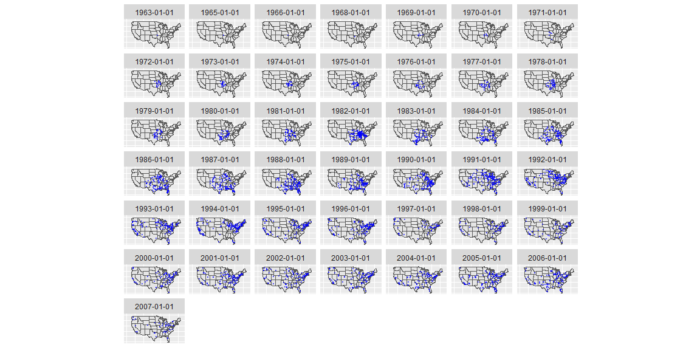
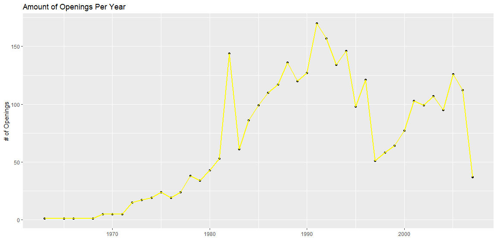

```r
dat <- read_csv("https://github.com/byuidatascience/walmart/raw/master/walmart_timeloc.csv") 
dat <- dat %>% 
  mutate(year = ceiling_date(dat$opendate, unit = "year"),
         month = ceiling_date(dat$opendate, unit = "month"))

cities <- maps::us.cities

state_info <- tibble(strstate = state.abb, 
                     region = factor(state.region, 
                                     levels = c("South", "North Central", "West", "Northeast"),
                                     labels = c("South", "Midwest", "West", "Northern")),
                     statename = state.name)
```

## Background

Walmart’s growth is astounding. It may be the last giant in the “brick and mortar” business1 story ever. Our friends at excelcharts.com have made some nice graphics showing the spatial and temporal patterns of Walmart’s growth. We can’t let Excel build such amazing graphics without a challenge from R!

I have created a Walmart data repositoryWe have a walmart_timeloc.csv file that we can use to build our visualizations. You could use  maps::us.cities to get populations for cities.

# Your Challenge

We have a few challenges before us today. Use the full hour to build the cleanest code and most lucid presentation of your results.

Recreate one of their graphics as close as you can using the skills you have developed this semester.
After recreating their graphic, add a new feature or element to make it “better.”
Examine the variables and create an original graphic of your own.

## Data Wrangling


```r
state <- us_states(resolution = "low") %>% 
  filter(statefp != "02", statefp != "15")


dat_sf <- dat %>%
  st_as_sf(coords = c("Longitude", "Latitude"), crs = 4326)
```

## Recreation 


```r
ggplot() +
  geom_sf(data = state) +
  geom_sf(data = dat_sf, color = "blue", size = .5, alpha = .5) + 
  facet_wrap(facets = "year") +
  coord_sf(xlim = c(-130, -65), ylim = c(50, 25)) + 
  theme(axis.title.x=element_blank(),
        axis.text.x=element_blank(),
        axis.ticks.x=element_blank(), 
        axis.title.y = element_blank(),
        axis.text.y = element_blank(),
        axis.ticks.y = element_blank())
```

<!-- -->

## My Plot


```r
dat %>% 
  mutate(count = 1) %>% 
  group_by(year) %>%  
  summarise(sum = sum(count)) %>% 
  ggplot(aes(x = year, y = sum)) +
  geom_point() +
  geom_line(color = "yellow", size = .8) +
  labs(title = "Amount of Openings Per Year", y = "# of Openings", x = "")
```

<!-- -->

