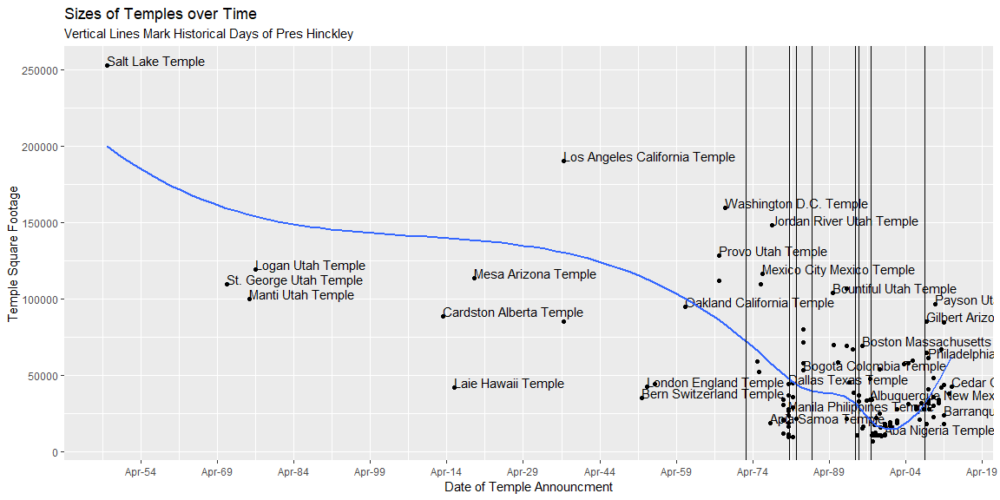
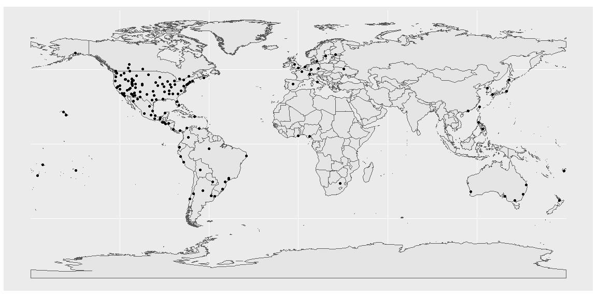

```r
# http://bradleyboehmke.github.io/2015/12/scraping-html-tables.html
# https://selectorgadget.com/
pacman::p_load(tidyverse, sf, ggrepel, rvest, lubridate)
temple_locs <- read_csv("https://churchofjesuschristtemples.org/maps/gps/", locale = locale(encoding = "latin1"))
temple_spatial <- st_read("https://churchofjesuschristtemples.org/maps/kml/timeline/", quiet = TRUE)
temple_size <- "https://churchofjesuschristtemples.org/statistics/dimensions/" %>% 
  read_html() %>% 
  html_nodes("table") %>% 
  html_table() %>% .[[1]]
temple_time <- "https://churchofjesuschristtemples.org/statistics/milestones/" %>% 
  read_html() %>% 
  html_nodes("table") %>% 
  html_table() %>% .[[1]]

dat_annot <- tibble(date = c("1973-01-01", "1981-07-23", "1982-12-2", "1985-11-10", "1994-06-05", "1995-03-12", "1997-6-6", "2008-02-03"), 
                    event_short = c("Chair of Temple Committee", "3rd Counselor: SW Kimball", "2nd Counselor: SW Kimball", "1st Counselor: ET Benson", "1st Counselor: HW Hunter", "President and Prophet", "Juarez Revelation on Small Temples", "Death") %>% factor(levels = c("Chair of Temple Committee", "3rd Counselor: SW Kimball", "2nd Counselor: SW Kimball", "1st Counselor: ET Benson", "1st Counselor: HW Hunter", "President and Prophet", "Juarez Revelation on Small Temples", "Death")), 
                    event_long = c('In 1973, while serving as chairman of the Church’s Temple Committee, he wrote in his journal: “The Church could build [many smaller] temples for the cost of the Washington Temple [then under construction]. It would take the temples to the people instead of having the people travel great distances to get to them.”', 
                                   'Called as an additional Counselor to President Spencer W. Kimball to assist the President and his two counselors.', 
                                   'Called as Second Counselor in the First Presidency.', 
                                   'Called as First Counselor to President Ezra Taft Benson.',
                                   'Called as First Counselor to President Howard W. Hunter.',
                                   'Ordained and Set Apart as President of the Church.',
                                   'There came to my mind an idea I’d never thought of before. It was inspired of the Lord to build a temple there, a small one, very small, six thousand square feet with facilities.',
                                   'Died in Salt Lake City, Utah.'), 
                    event_reference = c("https://www.lds.org/manual/teachings-of-presidents-of-the-church-gordon-b-hinckley/the-life-and-ministry-of-gordon-b-hinckley?lang=eng", rep("https://history.lds.org/timeline/gordon-b-hinckley?lang=eng", 5), "https://rsc.byu.edu/archived/colonia-ju-rez-temple-prophet-s-inspiration/president-hickleys-inspiration", "https://history.lds.org/timeline/gordon-b-hinckley?lang=eng"),
                    y_lab = c(250000, 235000, 220000, 205000, 190000, 165000, 150000, 135000 ))
names(temple_spatial)[1] <- "Temple"

map <- "http://thematicmapping.org/downloads/TM_WORLD_BORDERS_SIMPL-0.3.zip"
df <- tempfile(); uf <- tempfile()
download(map, df, mode = "wb")
unzip(df, exdir = uf)
worldmap <- read_sf(uf) 
```

## Background

I recently wrote a post about revelation that used temple construction as part of the story. You can find the post on my blog. In that post, I show a visualization about temple sizes over the last 180 years. The story incorporates President Hinckley’s key historical events as vertical lines. You can view the image here.


Recreate the first graphic shown in the post above.
Use some of the other variables to highlight the difference between US and foriegn temples.
Create another interesting graphic of your choice.

## Data Wrangling


```r
temple_size <-  temple_size %>% 
  mutate(sqft = as.numeric(gsub(",","",temple_size$SquareFootage)))

all_temple <- Reduce(function(x, y) merge(x = x, y = y, by = "Temple"), list(temple_locs, temple_size, temple_spatial, temple_time))

all_temple <- all_temple %>% 
  mutate(date = dmy(all_temple$Announcement))

dat_annot <- dat_annot %>% 
  mutate(dates = ymd(dat_annot$date))

options(scipen = 999)
```

## Recreate Graphic


```r
all_temple %>% 
  ggplot(aes(x = date, y = sqft)) +
  geom_point() +
  geom_text(aes(label=Temple),hjust=0, vjust=0, check_overlap = TRUE) +
  geom_smooth(se = FALSE) +
  scale_y_continuous(breaks = c(0,50000,100000,150000,200000,250000,275000),
                   labels = c(0,50000,100000,150000,200000,250000,275000)) +
  scale_x_date(breaks = function(x) seq.Date(from = min(x), 
                                             to = max(x), 
                                             by = "15 years"), date_labels = "%b-%y") +
  geom_vline(xintercept = dat_annot$dates) +
  labs(title = "Sizes of Temples over Time", subtitle = "Vertical Lines Mark Historical Days of Pres Hinckley",
       x = "Date of Temple Announcment", y = "Temple Square Footage")
```

<!-- -->

## My Own Graph

```r
ggplot() +
  geom_sf(data = worldmap) +
  geom_sf(data = all_temple$geometry)
```

<!-- -->
