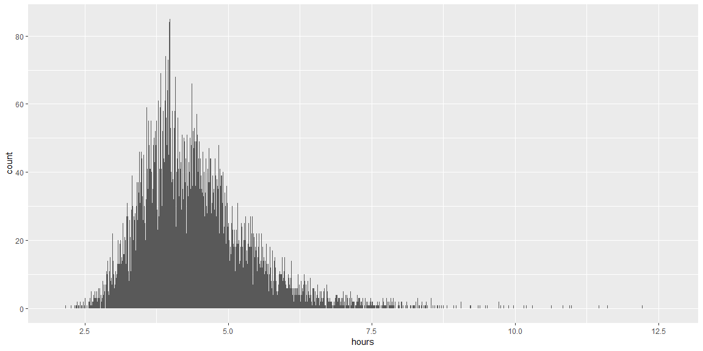
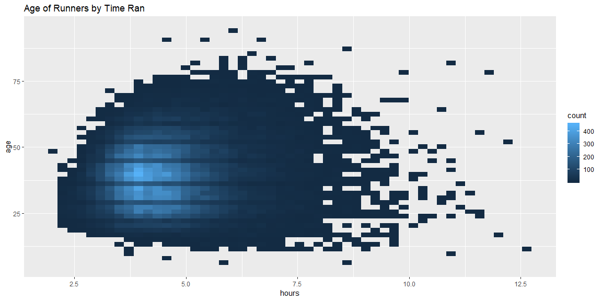
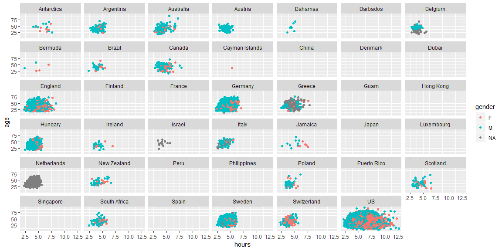

```r
dat <- read_csv("https://byuistats.github.io/M335/data/runners_100k.csv")
```

## Background

The New York Times published an article on some weird facts about issues that we have with setting goals. They built a great graphic showing interesting characteristics in the distribution of running times. The data can be found here. I have provided a direct download link to the full data as well. You might want to use the smaller randomly sampled data set of 1 million observations or 100k observations.

Your Challenge
We have a few challenges before us today. Use the full 1.5 hours to build the cleanest code and clearest presentation of your results.

Recreate their graphic as close as you can using the skills you have developed this semester.
Create a graphic that shows the relationship between times and the ages of the runners.
Examine the variables and create a novel graphic of your own.
## Data Wrangling


```r
mutate <- dat %>% 
  mutate(hours = chiptime/60)
```

## Challange 1


```r
mutate %>% 
  ggplot(aes(x = hours)) +
  geom_histogram(na.rm = TRUE, binwidth = .001)
```

<!-- -->

I am not sure at all how to make the y axis a proportion of my bins. I have not idea what to try.

## Challange 2

```r
mutate %>% 
  ggplot(aes(x = hours, y = age)) +
  geom_bin2d(na.rm = TRUE, bins = 50) +
  labs(title = "Age of Runners by Time Ran")
```

<!-- -->

I tried to show some other way of communicating data besides points. 

##Challange 3

```r
mutate %>% 
  ggplot(aes(x = hours, y = age))+
  geom_point(na.rm = TRUE, aes(color = gender)) +
  facet_wrap(facets = "country")
```

<!-- -->

I need more time on this one. I am not sure how to remove different graphs that do not have data. I wanted to show run time by country.


